# 6.3. 다이내믹 프록시와 팩토리 빈

----

## 6.3.1.  프록시와 프록시 패턴, 데코레이터 패턴
### 트랜잭션 경계설정 코드를 분리했을 때
- 단순 확장성을 고려해 한 가지 기능을 분리한다면 전형적인 전략 패턴을 이용하면 됨 
- 트랜잭션 기능에는 추상화 작업을 통해 이미 전략 패턴이 적용되어 있음 
  - 하지만 전략 패턴으로는 트랜잭션 기능의 구현 내용을 분리했을 뿐
  - 트랜잭션을 적용한다는 사실은 코드에 그대로 남아있음
- 부가 기능을 위임을 통해 외부로 분리했을 때의 결과
  - 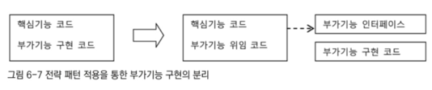
  - 구체적인 구현 코드는 제거했을지라도 위임을 통해 기능을 사용하는 코드는 핵심 코드와 함께 남아 있음
- 트랜잭션이라는 기능은 사용자 관리 비즈니스 로직과는 성격이 다르기 때문에 아예 그 적용 사실 자체를 밖으로 분리 가능
  - 부가기능 전부를 핵심 코드가 담긴 클래스에서 독립 가능
  - 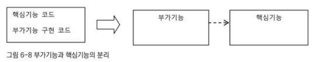
  - 부가기능을 담은 클래스는 해당 기능을 제외한 모든 기능을 핵심 기능을 가진 클래스로 위임해야 함
  - 핵심기능은 부가기능을 가진 클래스의 존재 자체를 모름 
  - 따라서 부가기능이 핵심기능을 사용하는 구조가 됨 
- 문제는 클라이언트가 핵심기능을 가진 클래스를 직접 사용해 버리면 부가기능이 적용될 기회가 없음 
  - 이를 해결하기 위해 부가기능은 자신이 핵심기능을 가진 클래스인 것처럼 꾸며 클라이언트가 자신을 거쳐 핵심기능을 사용하도록 함
  - 이를 위해 클라이언트는 인터페이스를 통해서만 핵심기능을 사용하게 함
  - 부가기능 자신도 같은 인터페이스를 구현한 뒤에 자신이 그 사이에 끼어들어야 함
  - 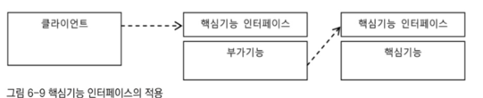
  - 클라이언트는 핵심기능만을 사용한다고 생각하지만 사실은 부가기능을 먼저 사용하는 것 
- 부가기능 코드는 핵심기능으로 요청을 위임해 주는 과정에서 자신의 부가기능 적용 가능 
  - 트랜잭션이 대표적
### 프록시
- 자신이 클라이언트가 사용하고자 하는 핵심기능인 것처럼 위장해 요청을 받는 것 
- 프록시를 통해 최종적으로 요청을 처리하는 실제 오브젝트를 타깃 또는 실체라 부름 
- 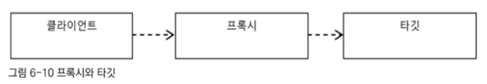
- 특징
  - 프록시는 타깃과 같은 인터페이스를 구현
  - 프록시가 타깃을 제어할 수 있는 위치에 있음
- 사용 목적에 따라 두가지로 구분
  1. 클라이언트가 타깃에 접근하는 방법을 제어
  2. 타깃에 부가적인 기능 부여
  - 목적에 따라 디자인 패턴에서는 다른 패턴으로 구분
### 데코레이터 패턴
- 부가적인 기능을 런타임 시 다이내믹하게 부여해주기 위해 프록시를 사용하는 패턴
- 컴파일 시점, 즉 코드상에서는 프록시와 타깃이 어떤 방법과 순서로 연결되어 있는지 정해져 있지 않기 때문에 다이내믹 하다고 함
- 해당 패턴에서 프록시가 꼭 한 개로 제한되지 않음
- 프록시가 직접 타깃을 사용하도록 고정시킬 필요 없음 
- 이를 위해 데코레이터 패턴에서 같은 인터페이스를 구현한 타겟과 여러개의 프록시 사용 가능
  - 프록시가 여러개이기 때문에 그 순서만 정하면 됨 
- 소스코드 출력이라는 핵심 기능이 있을 때
  - 라인 넘버링, 색상 변경, 페이징 등의 부가기능을 프록시로 만들어 적용
  - 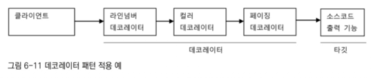
- 프록시로서 동작하는 각 데코레이터는 본인이 최종 타겟으로 위임하는지 다른 데코레이터로 위임하는지 모름
  - 따라서 데코레이터의 다음 위임 대상은 인터페이스로 선언하고 생성자나 수정자 메소드를 통해 위임 대상을 외부에서 런타임 시에 주입받을 수 있도록 만들어야 함
- InputStream과 OutputStream이 대표적인 데코레이터 패턴이 사용된 구현 클래스
  - `InputStream is = new BufferedInputStream(new FileInputStream("a.txt"));`
  - InputStream이라는 인터페이스를 구현한 타깃인 FileInputStream에 버퍼 읽기 기능을 제공해주는 BufferedInputStream이라는 데코레이터를 적용한 예
- UserService 인터페이스를 구현한 타깃인 UserServiceImpl에 트랜잭션 부가기능을 제공해주는 UserServiceTx를 추가한 것도 데코레이터 패턴을 적용한 것
  - 수정자 메소드를 이용해 데코레이터인 UserServiceTx에 위임할 타겟인 UserServiceImpl을 주입
- 인터페이스를 통한 데코레이터 정의와 런타임 시의 다이내믹한 구성 방법은 스프링의 DI를 이용하면 편리
  - 데코레이터 빈의 프로퍼티로 같은 인터페이스를 구현한 다른 데코레이터 또는 타깃 빈을 설정하면 됨 
  - 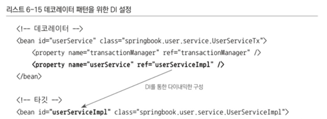
  - 
- 인터페이스를 통해 위임하는 방식이기 때문에 어느 데코레이터에서 타깃으로 연결될지 코드 레벨에서는 미리 알 수 없음
  - 구성하기에 따라 여러 개의 데코레이터 적용 가능
  - 타깃의 코드나 클라이언트가 호출하는 방법도 변경하지 않고 새로운 기능을 추가할 때 유용한 방법
### 프록시 패턴
- 일반적으로 사용하는 프록시
  - 클라이언트와 사용 대상 사이에 대리 역할을 맡은 오브젝트를 두는 방법의 총칭
- 디자인 패턴에서 말하는 프록시 패턴
  - 프록시를 사용하는 방법 중에서 타깃에 대한 접근 방법을 제어하려는 목적을 가진 경우를 지칭
- 프록시 패턴
  - 프록시는 타깃의 기능을 확장하거나 추가하지 않음 
  - 대신 클라이언트가 타깃에 접근하는 방식을 변경
  - 타깃 오브젝트를 생성하기가 복잡하거나 당장 필요하지 않은 경우에는 꼭 필요한 시점까지 오브젝트를 생성하지 않는 편이 좋음
  - 하지만 타깃 오브젝트에 대한 레퍼런스가 미리 필요할 때, 프록시 패턴을 적용 
  - 클라이언트에게 타깃에 대한 레퍼런스를 넘겨야 하는데 실제 타깃 오브젝트 대신 프록시를 넘겨주는 것
  - 프록시의 메소드를 통해 타깃을 사용하려 시도하면 그때 프록시가 타깃 오브젝트를 생성하고 요청 위임 
  - 레퍼런스는 갖지만 사용하지 않거나 많은 작업이 진행된 이후에 사용된다면 프록시를 통해 생성을 최대한 늦춤으로써 얻는 장점이 많음 
- 원격 오브젝트를 이용하는 경우에도 프록시 사용 시 이점을 가짐 
  - 다른 서버에 존재하는 오브젝트를 사용할 때
  - 원격 오브젝트에 대한 프록시를 만들어두고 클라이언트는 로컬에 존재하는 오브젝트를 쓰는 것처럼 프록시를 사용하게 할 수 있음 
  - 프록시는 클라이언트의 요청을 받으면 네트워크를 통해 원격의 오브젝트를 실행하고 결과를 받아 클라이언트에게 돌려줌 
  - 클라이언트에게 원격 오브젝트에 대한 접근 방식을 제공하는 프록시 패턴의 예시
- 특별한 상황에 타깃에 대한 접근권한을 제어하기 위해 프록시 패턴 사용
  - 수정 가능한 오브젝트가 특정 레이어로 넘어가서는 읽기 전용으로만 동작해야 할 때
  - 오브젝트 프록시를 만들어 사용 가능 
  - 프록시의 특정 메소드를 사용하려고 하면 접근이 불가능하다는 예외를 발생시키는 것 
- 프록시 패턴이란
  - 타깃의 기능 자체에는 관여하지 않음
  - 접근하는 방법을 제어해주는 프록시를 이용하는 방법 
  - 프록시와 데코레이터는 유사하지만 프록시는 코드에서 자신이 만들거나 접근할 타깃 클래스 정보를 알고 있는 경우가 많음 
  - 생성 지연 프록시라면 구체적인 생성 방법을 알아야 하기 때문에 타깃 클래스에 대한 직접적인 정보를 알아야 함
  - 프록시 패턴에서도 인터페이스를 통해 다음 호출 대상으로 접근하게 할 수 있음
    - 그 사이에 프록시나 데코레이터가 추가될 수 있기 때문
    - 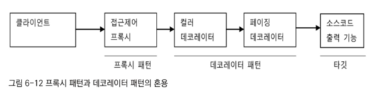

----

## 6.3.2. 다이내믹 프록시
- 프록시는 기존 코드에 영향을 주지 않으며 타깃의 기능을 확장하거나 접근 방법을 제어 가능한 유용한 방법
- 프록시는 만들기 귀찮음 
- 매번 새로운 클래스 정의, 인터페이스의 구현 메소드가 많으면 일일이 구현해 위임해줘야 하는 코드를 작성해야 하기 때문
- 목과 스텁을 일일이 클래스로 정의하고 인터페이스의 안 쓰는 메소드까지 구현해 줘야 하는 것과 비슷한 맥락 
  - 목과 스텁을 프레임워크를 사용했던 것처럼 바꿀 수 있을까? -> 가능!
- 몇 API를 이용해 프록시 클래스를 정의하지 않고도 프록시처럼 동작하는 오브젝트를 다이내믹하게 생성 가능
### 프록시의 구성과 프록시 작성의 문제점
- 프록시는 두 가지 기능으로 구성
  1. 타깃과 같은 메소드를 구현하고 있다가 메소드가 호출되면 타깃 오브젝트로 위임
  2. 지정된 요청에 대해서는 부가기능을 수행 
### UserServiceTx
- 기능 부가를 위한 프록시
- 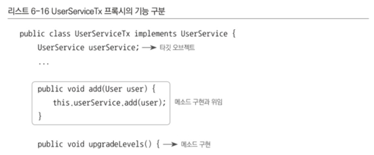
- 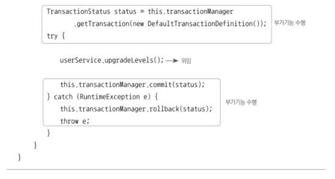
- UserService 인터페이스 구현과 타깃으로 요청 위임, 트랜잭션 부가기능을 수행하는 코드로 구분 
  - 즉, 프록시의 역할은 위임과 부가작업 
- 프록시 생성이 번거로운 이유 
  1. 타깃의 인터페이스를 구현하고 위임하는 코드를 작성하기 번거로움
    - 필요 없는 메소드도 구현해야 함 
    - 메소드가 많아지고 다양해지면 부담스러움 
    - 타깃 인터페이스의 메소드가 추가되거나 변경되면 함께 수정해 줘야 함
  2. 부가기능 코드가 중복될 가능성이 큼
    - 트랜잭션은 DB를 사용하는 대부분의 로직에 적용될 필요가 있음 
    - 여러 메소드에 트랜잭션 경계설정 부가기능이 적용되어야 함 
    - 메소드가 많아지고 해당 기능이 적용되어야 하면 유사 코드가 여러 메소드에 중복되어 나타날 것
- JDK의 다이내믹 프록시를 이용해 해결
### 리플렉션
- 다이내믹 프록시는 리플렉션 기능을 이용해 프록시를 만들어줌 
- 리플렉션은 자바의 코드 자체를 추상화해 접근하도록 만든 것 
- 모든 클래스는 해당 클래스의 구성정보를 담은 Class 타입의 오브젝트를 가짐 
  - 클래스이름.class 또는 getClass() 메소드를 호출해 가져올 수 있음
  - 여러 메타 데이터를 가짐 
- Method 인터페이스로 클래스의 메소드를 가져올 수 있음
  - `Method lengthMethod = String.class.getMethod("length");`
  - String의 메소드 중 length라는 이름이며 파라미터가 없는 메소드를 가져옴 
  - 해당 메소드에 대한 정보를 가짐
  - 메소드 실행도 가능
    - 메소드 실행 대상 오브젝트, 파라미터 목록을 받아 메소드를 호출한뒤 그 결과를 Object 타입으로 돌려줌
    - `public Object invoke(Object obj, Object... args)`
    - length() 메소드 실행
      - `int length = lengthMethod.invoke(name)`
### 프록시 클래스
- 구현할 인터페이스
  - 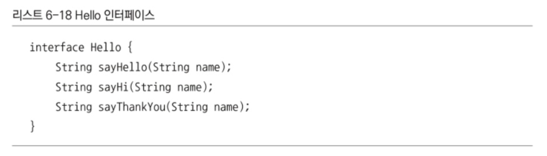
- 이를 구현한 타깃 클래스
  - 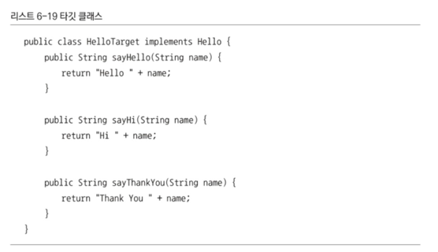
- 클라이언트 역할의 테스트 코드
  - 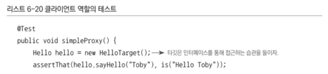
  - 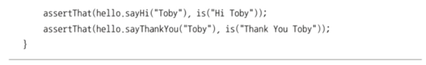
- Hello 인터페이스를 구현한 프록시를 만들 것
  - 데코레이터 패턴을 적용해 타깃인 HelloTarget에 부가기능 추가 
  - 프록시의 이름은 HelloUppercase
    - 추가 기능: 문자를 대문자로
  - HelloUppercase 프록시는 Hello 인터페이스를 구현하고 Hello 타입의 타깃 오브젝트를 받아 저장해둠
  - Hello 인터페이스 구현 메소드에서는 타깃 오브젝트의 메소드 호출 뒤 결과를 대문자로 바꿔주는 부가기능을 적용하고 리턴 
  - 위임과 기능 부가를 처리
  - 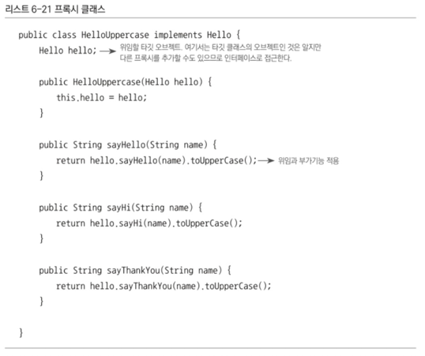
  - 문제점 두 가지
    1. 인터페이스의 모든 메소드를 구현해 위임하도록 코드를 만들어야 함
    2. 부가기능인 리턴 값을 대문자로 바꾸는 기능이 모든 메소드에 중복되어 나타남
### 다이내믹 프록시 적용 
- 다이내믹 프록시 동작 방식
  - 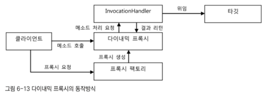
- 다이내믹 프록시는 프록시 팩토리에 의해 런타임 시 다이내믹하게 만들어지는 오브젝트
  - 타깃의 인터페이스와 같은 타입으로 만들어짐 
  - 클라이언트는 다이내믹 프록시 오브젝트를 타깃 인터페이스를 통해 사용 가능 
    - 따라서 프록시를 만들 때 인터페이스를 모두 구현해가면서 클래스를 정의하는 수고 줄임 
    - 프록시 팩토리에게 인터페이스 정보만 제공해주면 해당 인터페이스를 구현한 클래스의 오브젝트를 자동으로 만들어 주기 때문 
- 다애믹 프록시가 인터페이스 구현 클래스의 오브젝트는 만들어 줌
  - 하지만 프록시로서 필요한 부가기능 제공 코드는 직접 작성해야 함 
  - 부가기능은 프록시 오브젝트와 독립적으로 InvocationHandler를 구현한 오브젝트에 담음 
  - InvocationHandler 인터페이스는 한 메소드만 가짐
    - `public Object invoke(Object proxy, Method method, Object[] args)`
    - invoke() 메소드는 리플렉션의 Method 인터페이스를 파라미터로 받음
    - 메소드를 호출할 때 전달되는 파라미터도 args로 받음 
    - 다이내믹 프록시 오브젝트는 클라이언트의 모든 요청을 리플렉션 정보로 변환해 InvocationHandler 구현 오브젝트의 invoke() 메소드로 넘기는 것 
    - 타깃 인터페이스의 모든 메소드 요청이 하나의 메소드로 집주오디기 때문에 중복 기능을 효과적으로 제거 
- 메소드 요청은 어떻게 하는가
  - InvocationHandler 구현 오브젝트가 타깃 오브젝트의 레퍼런스만 갖고 있다면 리플렉션을 이용해 간단히 위임 코드를 만들어낼 수 있음
  - 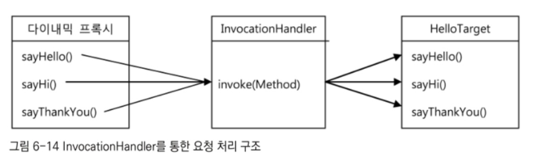
  - 프록시 팩토리가 Hello 인터페이스의 모든 메소드를 구현한 다이내믹 프록시 생성
  - InvocationHandler 인터페이스를 구현한 오브젝트를 제공하면 다이내믹 프록시가 받는 요청을 InvocationHandler의 invoke() 메소드로 보냄 
    - 메소드가 아무리 많아도 invoke() 메소드 하나로 처리 가능 
### 다이내믹 프록시 생성
- InvocationHandler 생성
  - 리턴 값을 대문자로 바꿔주는 부가기능을 적용 
  - 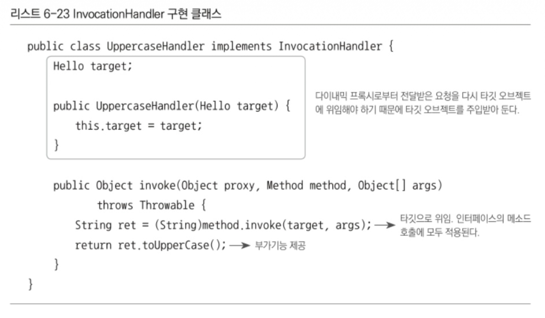
  - 다이내믹 프록시로부터 요청을 전달받으려면 InvocationHandler를 구현해야 함 
  - 다이내믹 프록시를 통해 요청이 전달되면 리플렉션 API를 이용해 타깃 오브젝트의 메소드 호출 
  - 타깃 오브젝트는 생성자를 통해 미리 전달받음 
  - 타깃 오브젝트의 메소드 호출이 끝나면 프록시가 제공하려는 부가기능인 리턴 값을 대문자로 바꾸는 작업 수행 후 결과 리턴
  - 리턴 값은 다이내믹 프록시가 받아 최종적으로 클라이언트에게 전달될 것 
- Hello 인터페이스를 구현하는 프록시 생성
  - 다이내믹 프록시 생성은 Proxy 클래스의 newProxyInstance() 스태틱 팩토리 메소드 이용
  - 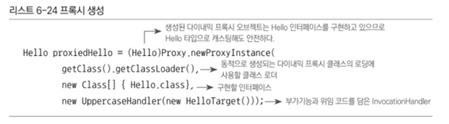
  - 첫 번째 파라미터는 클래스 로더 제공
    - 다이내믹 프록시가 정의되는 클래스 로더를 지정
  - 두 번째 파라미터는 다이내믹 프록시가 구현해야 할 인터페이스
    - 다이내믹 프록시는 한 번에 하나 이상의 인터페이스를 구현할 수도 있음
    - 따라서 인터페이스의 배열 사용 
  - 마지막 파라미터는 부가기능과 위임 관련 코드를 담고 있는 InvocationHandler 구현 오브젝트 제공
    - Hello 타입의 타깃 오브젝트를 생성자로 받고 모든 메소드 호출의 리턴 값을 대문자로 바꿔주는 UppercaseHandler 오브젝트 전달
- 다이내믹 프록시가 만들어졌으니 Hello 인터페이스를 통해 사용하면 됨 
### 다이내믹 프록시의 확장
- 다이내믹 프록시는 직접 정의한 프록시에 비해 확연한 장점 있음 
- Hello 인터페이스의 메소드의 개수가 늘어나거나 수정되어도 다이내믹 프록시는 변경할 필요가 없음
  - 추가된 메소드는 자동으로 포함되고 메소드는 어차피 invoke()가 책임지기 때문 
- 지금은 모든 메소드의 리턴 타입이 스트링이라 가정
  - 스트링 타입이 들어오지 않을 시 런타임 시에 오류 발생 
  - 따라서 타깃 오브젝트의 메소드 호출 후 리턴 타입을 확인해 스트링인 경우만 대문자로 바꿔주고 나머지는 그대로 넘겨주는 방식으로 수정해 주는 것이 좋음 
- InvocationHandler는 타깃의 종류에 상관없이 적용 가능하다는 것이 장점 
  - 어차피 리플렉션의 Method 인터페이스를 이용해 타깃의 메소드를 호출하는 것이니 Hello 타입의 타깃으로 제한할 필요도 없음 
  - 어떤 종류의 인터페이스를 구현한 타깃이든 상관 없이 재사용 가능 
  - 메소드의 리턴 타입이 스트링인 경우만 대문자로 결과를 바꿔주도록 UppercaseHandler를 만들 수 있음
  - 수정된 코드
  - 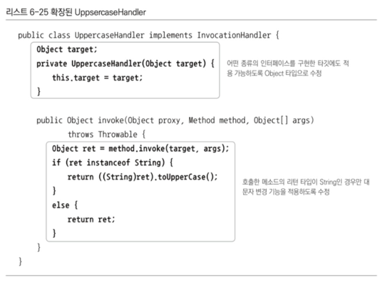
- InvocationHandler는 단일 메소드에서 모든 요청을 처리
  - 어떤 메소드에 어떤 기능을 적용할지를 선택하는 과정이 필요할 수도 있음 
  - 호출하는 메소드의 이름, 파라미터의 개수와 타입, 리턴 타입 등의 정보를 가지고 부가적인 기능을 적용할 메소드를 선택 가능 
- 리턴 타입 뿐 아니라 메소드의 이름도 조건으로 걸 수 있음
  - 메소드의 이름이 say로 시작하는 경우에만 대문자로 바꾸는 기능을 적용하고 싶다면
  - 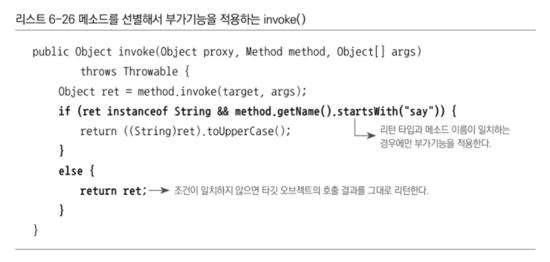

----

## 6.3.3. 다이내믹 프록시를 이용한 트랜잭션 부가기능
- UserServiceTx를 다이내믹 프록시 방식으로 변경 
  - 서비스 인터페이스의 메소드를 모두 구현해야 함
  - 트랜잭션이 필요한 메소드마다 트랜잭션 처리 코드가 중복되어 나타남
  - 비효율적
  - 트랜잭션이 필요한 클래스와 메소드가 증가하면 프록시 클래스를 일일이 구현하는 것은 큰 부담
- 트랜잭션 부가기능을 제공하는 다이내믹 프록시를 만들얼 적용하는 방법이 효율적 
  - 다이내믹 프록시와 연동해 트랜잭션 기능을 부가해주는 InvocationHandler는 한 개만 정의해도 충분하기 때문
### 트랜잭션 InvocationHandler
- 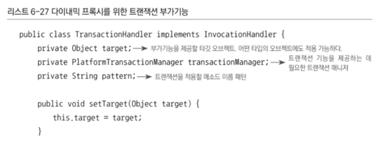
- 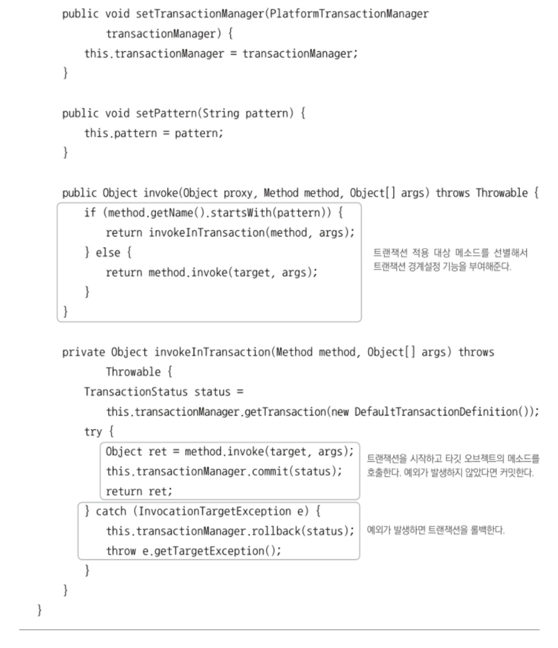
- 요청을 위임할 타깃을 DI로 제공받음 
- 타깃을 저장할 변수는 Object로 선언
  - 따라서 UserServiceImpl 말고도 트랜잭션이 필요한 어떤 타깃 오브젝트에도 적용 가능 
- 트랜잭션 추상화 인터페이스인 PlatformTransactionManager를 DI받음
- 타깃 오브젝트의 모든 메소드에 무조건 트랜잭션이 적용되지 않도록 트랜잭션을 적용할 메소드 이름의 패턴을 DI받음
  - 메소드 이름의 시작 부분을 비교
  - pattern을 "get"으로 주면 get으로 시작하는 모든 메소드에 트랜잭션 적용 
- InvocationHandler의 invoke() 메소드를 구현하는 방법은 UppercaseHandler에 적용했던 것과 동일
  - 모든 메소드에 트랜잭션을 적용하는 것이 아닌 선별적으로 적용할 것이기 때문에 적용 대상을 선별하는 작업을 선행
  - DI받은 이름 패턴으로 시작되는 이름을 가진 메소드인지 확인 
    - 패턴과 일치하는 이름을 가진 메소드면 트랜잭션 적용 메소드 호출
    - 아니면 부가기능 없이 타깃 오브젝트의 메소드를 호출해 결과 리턴 
- 트랜잭션을 적용하며 타깃 오브젝트의 메소드를 호출하는 것은 UserServiceTx에서와 동일
  - 롤백을 적용하기 위한 예외는 RuntimeException 대신 InvocationTargetException을 잡도록 해야 한다는 것이 차이점 
  - 리플렉션 메소드인 Method.invoke()를 이용해 타깃 오브젝트의 메소드를 호출할 때는 타깃 오브젝트에서 발생하는 예외가 InvocationTargetException으로 한 번 포장되어 전달
  - 일단 InvocationTargetException으로 받은 후 getTargetException() 메소드로 중첩되어 있는 예외를 가져와야 함 
### TransactionHandler와 다이내믹 프록시를 이용하는 테스트
- UserServiceTest에 핸들러 적용
- 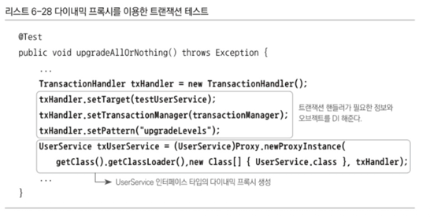
- 타깃 오브젝트와 트랜잭션 매니저, 메소드 패턴 주입 
- TransactionHandler 오브젝트를 이용해 UserService 타입의 다이내믹 프록시 생성 

----

## 6.3.4. 다이내믹 프록시를 위한 팩토리 빈 
- TransactionHandler와 다이내믹 프록시를 스프링의 DI를 통해 사용할 수 있도록 만들어야 함 
- 문제: DI의 대상이 되는 다이내믹 프록시 오브젝트는 일반적인 스프링의 빈으로는 등록할 방법이 없음
  - 스프링의 빈은 기본적으로 클래스 이름과 프로퍼티로 정의 
  - 스프링은 지정된 클래스 이름을 가지고 리플렉션을 이용해 해당 클래스의 오브젝트를 만듬 
  - 클래스의 이름을 갖고 있다면 새로운 오브젝트 생성 가능
    - Class의 newInstance() 메소드는 해당 클래스의 파라미터가 없는 생성자 호출, 그 결과 생성되는 오브젝트를 돌려주는 리플렉션 API
    - `Date now = (Date) Class.forName("java.util.Date").newInstance();`
  - 스프링은 내부적으로 리플렉션 API를 이용해 빈 정의에 나오는 클래스 이름으로 빈 오브젝트 생성
  - 문제: 다이내믹 프록시 오브젝트는 이런 식으로 프록시 오브젝트가 생성되지 않음 
    - 클래스 자체도 내부적으로 다이내믹하게 새로 정의해서 사용하기 때뭉네 다이내믹 프록시 오브젝트의 클래스가 어떤 것인지도 알 수 없음 
    - 따라서 미리 프록시 오브젝트의 클래스 정보를 알아내 스프링의 빈에 정의할 방법이 없음 
    - 다이내믹 프록시는 Proxy 클래스의 newProxyInstance()라는 스태틱 팩토리 메소드를 통해서만 만들 수 있음 
### 팩토리 빈 
- 클래스 정보와 디폴트 생성자를 통해 오브젝트를 만드는 방법 외에 팩토리 빈을 이용해서도 빈을 만들 수 있음 
- 팩토리 빈: 스프링을 대신해 오브젝트의 생성 로직을 담당하도록 만들어진 특별한 빈 
- FactoryBean이라는 인터페이스를 구현하는 것으로 팩토리 빈을 만들 수 있음
- 팩토리 빈이 갖는 세 개의 메소드
  - 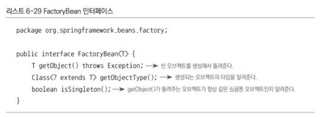
- FactoryBean 인터페이스를 구현한 클래스를 스프링의 빈으로 등록하면 팩토리 빈으로 동작 
- 스프링은 private 생성자를 가진 클래스도 빈으로 등록하면 리플렉션을 이용해 오브젝트를 만들어줌 
  - 리플렉션이 private 접근 규약을 위반할 수 있기 때문 
  - 하지만 private인 이유가 있기 때문에 이를 어기고 강제 생성하는 것은 위험 
- 팩토리 빈은 전형적인 팩토리 메소드를 가진 오브젝트
  - 스프링은 FactoryBean 인터페이스를 구현한 클래스가 빈의 클래스로 지정되면,
  - 팩토리 빈 클래스의 오브젝트의 getObject() 메소드를 이용해 오브젝트를 가져오고 이를 빈 오브젝트로 사용
  - 빈의 클래스로 등록된 팩토리 빈은 빈 오브젝트를 생성하는 과정에서만 사용 
### 다이내믹 프록시를 만들어주는 팩토리 빈 
- Proxy의 newProxyInstance() 메소드를 통해서만 생성이 가능한 다이내믹 프록시 오브젝트는 일반적인 방법으로는 스프링의 빈으로 등록 불가
  - 대신 팩토리 빈을 사용하면 다이내믹 프록시 오브젝트를 스프링의 빈으로 만들어줄 수 있음 
  - 팩토리 빈의 getObject() 메소드에 다이내믹 프록시 오브젝트를 만들어주는 코드를 넣으면 되기 때문 
- 팩토리 빈을 이용한 트랜잭션 다이내믹 프록시의 적용
  - 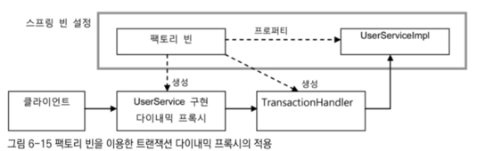
  - 스프링 빈에는 팩토리 빈과 UserServiceImpl만 빈으로 등록 
  - 팩토리 빈은 다이내믹 프록시가 위임할 타깃 오브젝트인 UserServiceImpl에 대한 레퍼런스를 프로퍼티를 통해 DI 받아둬야 함 
    - 다이내믹 프록시와 함께 생성할 TransactionHandler에게 타깃 오브젝트를 전달해줘야 하기 때문
    - 다이내믹 프록시나 TransactionHandler를 만들 때 필요한 정보는 패곹리 빈의 프로퍼티로 설정해 뒀다가 다이내믹 프록시를 만들며 전달해줘야 함 
### 트랜잭션 프록시 팩토리 빈 
- TransactionHandler를 이용하는 다이내믹 프록시를 생성하는 팩토리 빈 클래스
  - 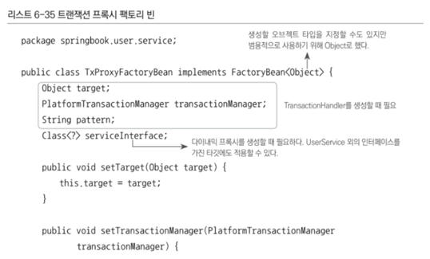
  - 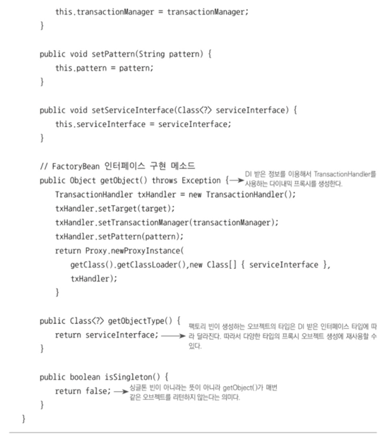
  - 팩토리 빈이 만드는 다이내믹 프록시는 구현 인터페이스나 타깃의 종류에 제한이 없음 
  - 따라서 UserService 외에도 트랜잭션 부가기능이 필요한 오브젝트를 위한 프록시를 만들 때 얼마든지 재사용 가능 
  - 설정이 다른 여러 개의 TxProxyFactoryBean 빈을 등록하면 됨 

----

## 6.3.5. 프록시 팩토리 빈 방식의 장점과 한계
### 프록시 팩토리 빈의 재사용 
- TransactionHandler를 이용하는 다이내믹 프록시를 생성해주는 TxProxyFactoryBean은 코드의 수정 없이도 다양한 클래스에 적용 가능
  - 타깃 오브젝트에 맞는 프로퍼티 정보를 설정해 빈으로 등록해 주기만 하면 됨 
  - 하나 이상의 TxProxyFactoryBean을 동시에 빈으로 등록해도 상관 없음 
  - 팩토리 빈이기 때문에 각 빈의 타입은 타깃 인터페이스와 일치
- 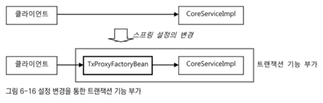
  - 설정 변경만으로 트랜잭션이라는 부가기능 사용 가능 
### 프록시 팩토리 빈 방식의 강점 
- 앞서 말한 데코레이터 패턴이 적용된 프록시의 문제점
  1. 프록시를 적용할 대상이 구현하고 있는 인터페이스를 구현하는 프록시 클래스를 일일이 만들어야 하는 번거로움
  2. 부가적인 기능이 여러 메소드에 반복적으로 나타나기 때문에 생기는 중복 코드 
- 프록시 팩토리 빈은 해당 문제들을 해결 
  - 다이내믹 프록시를 이용하면 타깃 인터페이스를 구현하는 클래스를 일일이 만드는 번거로움 제거
  - 하나의 핸들러 메소드를 구현하는 것만으로도 수많은 메소드에 부가기능 부여가 가능하니 중복 코드 문제도 해결 
  - 다이내믹 프록시에 팩토리 빈을 이용한 DI까지 더하면 번거로운 다이내믹 프록시 생성 코드도 제거 가능 
### 프록시 팩토리 빈의 한계
1. 프록시를 통해 타깃에 부가기능을 제공하는 것은 메소드 단위로 일어남 
  - 하나의 클래스 안에 존재하는 여러 개의 메소드에 부가기능을 한 번에 제공하는 것은 어렵지 않음 
  - 한 번에 여러 개의 클래스에 공통적인 부가기능을 제공하는 일은 지금까지의 방법으로 불가능 
  - 트랜잭션과 같이 비즈니스 로직을 담은 많은 클래스의 메소드에 적용할 필요가 있다면 거의 비슷한 프록시 팩토리 빈의 설정이 중복되는 것을 막을 수 없음 
2. 하나의 타깃에 여러 개의 부가기능을 적용하려고 할 때도 문제
  - 같은 타깃에 트랜잭션, 보안, 메소드 정보 저장 프록시를 전부 추가하고 싶다면?
  - 프록시 팩토리 빈 설정이 부가기능의 개수만큼 따라붙어야 함
  - 해당 설정 코드가 너무 많아짐 
3. TransactionHandler 오브젝트가 프록시 팩토리 빈 개수만큼 만들어짐
  - TransactionHandler는 타깃 오브젝트를 프로퍼티로 가짐 
    - 따라서 트랜잭션 부가기능을 제공하는 동일한 코드임에도 불구하고 타깃 오브젝트가 달라지면 새로운 TransactionHandler 오브젝트를 만들어내야 함 
    - 결국 중복 발생 
  - TransactionHandler는 다이내믹 프록시처럼 굳이 팩토리 빈에서 만드는게 아니라 스스로 빈으로 등록될 수 있음 
    - 하지만 타깃 오브젝트가 다르기 때문에 타깃 오브젝트 개수만큼 다른 빈으로 등록해야 하고 그만큼 많은 오브젝트가 생김 
    - 타깃 오브젝트 외의 설정이 필요하다면 같은 설정이 중복되어 많은 빈에 나타날 수 있음 
