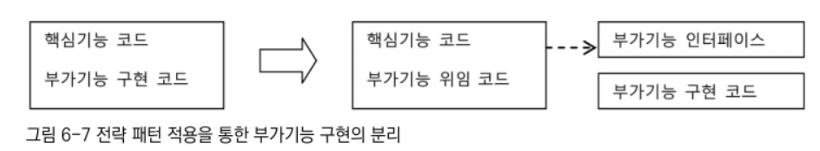

# 6.3 다이내믹 프록시와 팩토리 빈

# 6.3.1 프록시와 프록시 패턴, 데코레이터 패턴



트랜잭션 경계설정 코드를 비즈니스 로직에서 분리해낼 때 적용했던 기법을 다시 검토해보자.

단순히 확장성을 고려해서 한 가지 기능을 분리한다면 전략 패턴을 사용하면 됨.

하지만 전략패턴으로는 트랜잭션 기능의 구현 내용을 분리해냈을 뿐 트랜잭션을 적용한다는 사실은 코드에 그대로 남아 있다.

위 사진은 트랜잭션과 같은 부가적인 기능을 위임을 통해 외부로 분리했을 때의 결과를 보여준다. 구체적인 구현 코드는 제거했을지라도 위임을 통해 기능을 사용하는 코드는 핵심 코드와 함께 남아 있다.


트랜잭션이라는 기능은 사용자 관리 비즈니스 로직과는 성격이 다르기 때문에 아예 그 적용 사실 자체를 밖으로 분리할 수 있다. 위 그림과 같이 부가기능 전부를 핵심 코드가 담긴 클래스에서 독립시킬 수 있다. 이 방법을 이용해  UserServiceTx를 만들었고, UserServiceImpl에는 트랜잭션 관련 코드가 하나도 남지 않게 됐다.


이렇게 분리된 부가기능을 담은 클래스는 중요한 특징이 있음.

부가기능 외의 나머지 모든 기능은 원래 핵심기능을 가진 클래스로 위임해줘야 함.

핵심기능은 부가기능을 가진 클래스의 존재 자체를 모름

→ 부가기능이 핵심기능을 사용하는 구조가 된 것.

문제: 이렇게 구성했더라도 클라이언트가 핵심기능을 가진 클래스를 직접 사용해버리면 부가기능이 적용될 기회가 없다는 점.

그래서 부가기능은 마치 자신이 핵심기능을 가진 클래스인 것처럼 꾸며서, 클라이언트가 자신을 거쳐서 핵심기능을 사용하도록 만들어야 한다.

그러기 위해선 클라이언트는 인터페이스를 통해서만 핵심기능을 사용하게 하고, 부가기능 자신도 같은 인터페이스를 구현한 뒤에 자신이 그 사이에 끼어들어야 한다. 그러면 클라이언트는 인터페이스만 보고 사용을 하기 때문에 자신은 핵심기능을 가진 클래스를 사용할 것이라고 기대하지만, 사실은 위 그림처럼 부가기능을 통해 핵심기능을 이용하게 되는 것이다.


부가기능 코드에서는 핵심기능으로 요청을 위임해주는 과정에서 자신이 가진 부가적인 기능을 적용해줄 수 있다. 비즈니스 로직 코드에 트랜잭션 기능을 부여해준는 것이 바로 그런 대표적인 경우다.

이렇게 마치 자신이 클라이언트가 사용하려고 하는 실제 대상인 것처럼 위장해서 클라이언트의 요청을 받아주는 것을 대리자, 대리인과 같은 역할을 한다고 해서 프록시라고 부른다. 그리고 프록시를 통해 최종적으로 요청을 위임받아 처리하는 실제 오브젝트를 타깃또는 실체라고 부른다.

위 그림은 클라이언트가 프록시를 통해 타깃을 사용하는 구조를 보여주고 있다.

프록시의 특징 : 타깃과 같은 인터페이스를 구현했다는 것과 프록시가 타깃을 제어할 수 있는 위치에 있다는 것이다.

프록시의 사용 목적에 따른 구분:

- 첫째, 클라이언트가 타깃에 접근하는 방법을 제어하기 위해서다.
- 둘째, 타깃에 부가적인 기능을 부여해주기 위해서다.

두 가지 모두 대리 오브젝트라는 개념의 프록시를 두고 사용한다는 점은 동일하지만, 목적에 따라서 디자인 패턴에서는 다른 패턴으로 구분한다.

### 데코레이터 패턴

데코레이터 패턴은 타깃에 부가적인 기능을 런타임 시 다이내믹하게 부여해주기 위해 프록시를 사용하는 패턴을 말함.

다이내믹하게 기능을 부가한다는 의미 : 컴파일 시점, 즉 코드상에서는 어떤 방법과 순서로 프록시와 타깃이 연결되어 사용되는지 정해져 있지 않다는 뜻이다.

데코레이터라고 불리는 이유는 마치 제품이나 케익 등을 여러 겹 포장하고 그 위에 장식을 붙이는 것처럼 실제 내용물은 동일하지만 부가적인 효과를 부여해줄 수 있기 때문이다.

따라서 데코레이터 패턴에서는 프록시가 꼭 한개로 제한되지 않는다.

프록시가 직접 타깃을 사용하도록 고정시킬 필요도 없다.


예를 들어 소스코드를 출력하는 기능을 가진 핵심 기능이 있다고 가정.

이 클래스에 데코레이터 개념을 부여해서 타깃과 같은 인터페이스를 구현하는 프록시를 만들 수 있다. 예를 들어 소스코드에 라인넘버를 붙여준다거나, 문법에 따라 색을 변경해주거나, 특정 폭으로 소스를 잘러주거나, 페이지를 표시해주는 등의 부가적인 기능을 각각 프록시로 만들어두고, 순서를 정해서 단계적으로 위임하는 구조, 런타임 시에 이를 적절한 순서로 조합해서 사용하면 된다.

위는 그 예시.

프록시로서 동작하는 각 데코레이터는 위임하는 대상에도 인터페이스로 접근하기 때문에 자신이 최종 타깃으로 위임하는지, 아니면 다음 단계의 데코레이터 프록시로 위임하는지 알지 못함.

그래서 데코레이터의 다음 위임 대상은 인터페이스로 선언하고 생성자나 수정자 메소드를 통해 위임 대상을 외부에서 런타임 시에 주입받을 수 있도록 만들어야 함.

자바의 IO 패키지의 InputStream과 OutputStream 구현 클래스는 데코레이터 패턴이 사용된 대표적인 예

```java
InputStream is = new BufferedInputStream(new FileInputStream("a.txt"));
```

위 코드는 InputStream이라는 인터페이스를 구현한 타깃인 FileInputStream에 버퍼 읽기 기능을 제공해주는 BufferedInputStream이라는 데코레이터를 적용한 예다.

UserService 인터페이스를 구현한 타깃인 UserServiceImpl에 트랜잭션 부가기능을 제공해주는 UserServiceTx를 추가한 것도 데코레이터 패턴을 적용한 것이라고 볼 수 있 다.

인터페이스를 통한 데코레이터 정의와 런타임 시의 다이내믹한 구성 방법은 스프링의 DI를 이용하면 아주 편리하다. 데코레이터 빈의 프로퍼티로 같은 인터페이스를 구현ㄴ한 다른 데코레이터 또는 타깃 빈을 설정하면 된다.


이건 저번시간에 봤던 내용이다.

데코레이터 패턴은 인터페이스를 통해 위임하는 방식이기 때문에 어느 데코레이터에서 타깃으로 연결될지 코드 레벨에선 미리 알 수 없다. 구성하기에 따라서 여러 개의 데코레이터를 적용할 수도 있다.

UserServiceTx도 UserService라는 인터페이스를 통해 다음 오브젝트로 위임하도록 되어 있지 UserServiceImpl이라는 특정 클래스로 위임하도록 되어 있지 않다. 필요하다면 언제든지 트랜잭션 외에도 다른 기능을 부여해주는 데코레이터를 만들어서 UserServiceTx와 UserServiceImpl 사이에 추가해줄 수도 있다.

데코레이터 패턴은 타깃의 코드를 손대지 않고, 클라이언트가 호출하는 방법도 변경하지 않은 채로 새로운 기능을 추가할 때 유용한 방법이다.

### 프록시 패턴

일반적으로 사용하는 프록시라는 용어와 디자인 패턴에서 말하는 프록시 패턴은 구분할 필요가 있다. 전자는 클라이언트와 사용 대상 사이에 대리 역할을 맡은 오브젝트를 두는 방법을 총칭한다면, 후자는 프록시를 사용하는 방법 중에서 타깃에 대한 접근 방법을 제어하려는 목적을 가진 경우를 가리킨다.

프록시 패턴의 프록시는 타깃의 기능을 확장하거나 추가하지 않는다. 대신 클라이언트가 타깃에 접근하는 방식을 변경해준다.

타깃 오브젝트를 생성하기가 복잡하거나 당장 필요하지 않은 경우에는 꼭 필요한 시점까지 오브젝트를 생성하지 않는 편이 좋다.

그런데 타깃 오브젝트에 대한 레퍼런스가 미리 필요할 수 있음 → 이럴 때 프록시 패턴을 적용하면 됨.

클라이언트는 타깃에 대한 레퍼런스를 넘겨야 하는데, 실제 타깃 오브젝트는 만드는 대신 프록시를 넘겨주고, 프록시의 메소드를 통해 타깃을 사용하려고 시도하면, 그때 프록시가 타깃 오브젝트를 생성하고 요청을 위임해주는 식.

만약 레퍼런스는 갖고 있지만 끝까지 사용하지 않거나, 많은 작업이 진행된 후에 사용되는 경우라면, 이렇게 프록시를 통해 생성을 최대한 늦춤으로써 얻는 장점이 많음.

원격 오브젝트를 이용하는 경우에도 프록시를 사용하면 편리함.

특별한 상황에서 타깃에 대한 접근권한을 제어하기 위해 프록시 패턴을 사용할 수 있음

만약 수정 가능한 오브젝트가 있는데, 특정 레이어로 넘어가서는 읽기전용으로만 동작하게 강제한다고 하자.이럴 때는 오브젝트의 프록시를 만들어서 사용할 수 있다.

대표적인 예로는 Collections의 unmodifiableCollection()을 통해 만들어지는 오브젝트가 전형적인 접근권한 제어용 프록시라고 볼 수 있다. 파라미터로 전달된 Collection 오브젝트의 프록시를 만들어서, add()나 remove() 같이 정보를 수정하는 메소드를 호출할 경우 UnsupportedOperationException 예외가 발생하게 해줌.

이렇게 프록시 패턴은 타깃의 기능 자체에는 관여하지 않으면서 접근하는 방법을 제어해주는 프록시를 이용하는 것이다.

구조적으로는 데코레이터와 유사하지만, 다만 프록시는 코드에서 자신이 만들거나 접근할 타깃 클래스 정보를 알고 있는 경우가 많다. 물론 프록시 패턴이라고 하더라도 인터페이스를 통해 위임하도록 만들 수도 있다.


위 사진 과 같이 인터페이스를 통해 다음 호출 대상으로 접근하게 하면 그 사이에 다른 프록시나 데코레이터가 계속 추가될 수 있기 때문이다.

앞으로 이 책에서 타깃과 동일한 인터페이스를 구현하고 클라이언트와 타깃 사이에 존재하면서 기능의 부가 또는 접근 제어를 담당하는 오브젝트를 모두 프록시라고 정의함.

# 6.3.2 다이내믹 프록시

프록시는 기존 코드에 영향을 주지 않으면서 타깃의 기능을 확장하거나 접근 방법을 제어할 수 있는 유용한 방법

그럼에도 많은 개발자는 타깃 코드를 직접 고치고 말지 번거롭게 프록시는 만들지는 않겠다고 생각함.

그 이유는 프록시를 만드는 일이 상당히 번거롭게 느껴지기 때문.

매번 새로운 클래스를 정의 → 인터페이스의 구현해야할 메소드가 많으면 모든 메소드를 일일이 구현해서 위임하는 코드를 넣어야함 → 단위 테스트를 위해 목이나 스텁을  일일이 클래스로 정의하고 인터페이스의 모의 메소드를 구현하는 일이 불편했던 것.

그렇다면 목 오브젝트를 만드는 불편함 → 목 프레임워클 사용해 편리하게 바꿧던 것처럼

프록시 → 편하게 쓰는 방법이 존재하지 않을까?

물론 존재한다. 자바에는 java.lang.reflect 패키지 안에 프록시를 손쉽게 만들 수 있도록 지원해주는 클래스들이 있다.

기본적인 아이디어는 목 프레임워크와 동일.

일일이 프록시 클래스를 정의하지 않아도 몇가지 API를 이용해 프록시처럼 동작하는 오브젝트를 다이내믹하게 생성하는 것.

### 프록시의 구성과 프록시 작성의 문제점

프록시는 다음의 두 가지 기능으로 구성된다.

- 타깃과 같은 메소드를 구현하고 있다가 메소드가 호출되면 타깃 오브젝트로 위임한다.
- 지정된 요청에 대해서는 부가기능을 수행한다.

트랜잭션 부가기능을 위해 만든 UserTx는 기능 부가를 위한 프록시다.


위 코드는 UserService 인터페이스를 구현하고 타깃으로 요청을 위임하는 트랜잭션 부가기능을 수행하는 코드로 구분할 수 있다. 이렇게 프록시의 역할은 위임과 부가작업이라는 두 가지로 구분할 수 있다.

- 프록시를 만들기가 번거로운 이유
    - 첫째는 타깃의 인터페이스를 구현하고 위임하는 코드를 작성하기가 번거롭다는 점.
        - 부가기능이 필요 없는 메소드도 구현해서 타깃으로 위임하는 코드를 일일이 만들어줘야 함.
        - 복잡하진 앟지만 인터페이스의 메소드가 많아지고 다양힞면 상당히 부담스러운 작업이 됨.
        - 타깃 인터페이스의 메소드가 추가되거나 변경될 때마다 함께 수정해줘야 한다는 부담이 존재.
    - 두 번째 문제점은 부가기능 코드가 중복될 가능성이 많다는 점.
        - 트랜잭션은 DB를 사용하는 대부분의 로직에 적용될 필요가 있음.
        - 아직까진 add() 메소드에는 트랜잭션 부가기능을 적용하지 않았지만, 사용자를 추가하는 과정에서 다른 작업이 함께 진행돼야 한다면 add() 메소드에도 트랜잭션 경계설정 부가기능이 적용돼야 한다.
        - 메소드가 많아지고 트랜잭션 적용의 비율이 높아지면 트랜잭션 기능을 제공하는 유사한 코드가 여러 메소드에 중복돼서 나타날 것이다.
    

사용자 관리 로직 외에도 다양한 비즈니스 로직을 담은 클래스가 만들어짐.

그때마다 메소드에 트랜잭션 기능을 부여하는 코드가 중복돼야 할지 모른다.

트랜잭션 외의 프록시를 활용할 만한 부가기능, 접근 제어 기능은 일반적인 성격을 띤 것들이 많음.

따라서 다양한 타깃 클래스와 메소드에 중복돼서 나타날 가능성이 높음.

두 번째 문제인 부가기능의 중복 문제는 중복되는 코드를 분리해서 어떻게든 해결해보면 될 것 같지만, 첫 번째 문제인 인터페이스 메소드의 구현과 위임 기능 문제는 간단해 보이지 않는다. 바로 이런 문제를 해결하는 데 유용한 것이 바로 JDK의 다이내믹 프록시다.

### 리플렉션

다이내믹 프록시는 리플렉션 기능을 이용해서 프록시를 만들어 줌.

리플렉션은 자바의 코드 자체를 추상화해서 접근하도록 만든 것.

```java
String name = "Spring";
```

이 스트링의 길이를 알고 싶으면 String 클래스의 length() 메소드를 호출하면 됨.

일반적인 사용 방법은 name.length() 같이 직접 메소드를 호출하는 코드로 만드는 것.

자바의 모든 클래스는 그 클래스 자체의 구성정보를 담은 Class 타입의 오브젝트를 하나씩 갖고 있다.

‘클래스이름.class’라고 하거나 오브젝트의 getClass() 메소드를 호출하면 클래스 정보를 담은 Class 타입의 오브젝트를 가져올 수 있다.

클래스 오브젝트를 이용하면 클래스 코드에 대한 메타정보를 가져오거나 오브젝트를 조작할 수 있다.

예를 들어 클래스의 이름이 무엇이고, 어떤 클래스를 상속하고, 어떤 인터페이스를 구현했는지, 어떤 필드를 갖고 있고, 각각의 타입은 무엇인지, 메소드는 어떤 것을 정의했고, 메소드의 파라미터와 리턴 타입은 무엇인지 알아낼 수 있다.

더 나아가서 오브젝트 필드의 값을 읽고 수정할 수도 있고, 원하는 파라미터 값을 이용해 메소드를 호출할 수도 있다.

리플렉션 API 중에서 메소드에 대한 정의를 담은 Method라는 인터페이스를 이용해 메소드를 호출하는 방법을 살펴보자. String 클래스의 정보를 담은 Class 타입의 정보는 String.class라고 하면 가져올 수 있다. 또는 스트링 오브젝트가 있으면 name.getClass()라고 해도 된다. 그리고 이 클래스 정보에서 특정 이름을 가진 메소드 정보를 가져올 수 있다.

```java
Method lengthMethod = String.class.getMethod("length");
```

코드 그대로 스트링이 가진 메소드 중에서 “length”라는 이름을 갖고 있고, 파라미터는 없는 메소드의 정보를 가져오는 것이다.

java.lang.reflect.Method 인터페이스는 메소드에 대한 자세한 정보를 담고 있을 뿐만 아니라, 이를 이용해 특정 오브젝트의 메소드를 실행시킬수도 있다. Method 인터페이스에 정의된 invoke() 메소드를 사용하면 된ㄴ다.

invoke() 메소드는 메소드를 실행시킬 대상 오브젝트와 파라미터 목록을 받아서 메소드를 호출한 뒤에 그 결과를 Object 타입으로 돌려준다.

```java
public Object invoke(Object obj, Object... args)
```

이를 이용해 length() 메소드를 다음과 같이 실행할 수 있다.

```java
int length = lengthMethod.invoke(name)l // int length = name.length();
```


위 코드는 length() 메소드와 charAt() 메소드를 코드에서 직접 호출하는 방법과 Method를 이용해 리플렉션 방식으로 호출하는 방법을 비교한 것이다.

### 프록시 클래스


다이내믹 프록시를 이용한 프록시를 만들어 보자.


이를 구현한 타깃 클래스는 위와 같다.


클라이언트 역할을 하는 간단한 테스트를 만들었다.

이제 Hello 인터페이스를 구현한 프록시를 만들어보자.

프록시에는 데코레이터 패턴을 적용해서 타깃인 HelloTarget에 부가기능을 추가

프록시의 이름은 HelloUppercase.

이름에 유추할 수 있듯이 리턴하는 문자를 모두 대문자로 바꿔주는 것.

SimpleTarget이라는 원본 클래스는 그대로 두고, 경우에 따라 대문자로 출력이 필요한 경우를 위해서 HelloUppercase프록시를 통해 문자를 바꿔주는 것.


HelloUppercase프록시는 Hello 인터페이스를 구현하고, Hello 타입의 타깃 오브젝트를 받아서 저장해둠. Hello 인터페이스 구현 메소드에서는 타깃 오브젝트의 메소드를 호출한 뒤에 결과를 대문자로 바꿔주는 기능을 적용하고 리턴한다. 위임과 기능 부가라는 두 가지 프록시의 기능을 모두 처리하는 전형적인 프록시 클래스.


위는 테스트 코드

이 프록시는 프록시 적용의 일반적인 문제점 두 가지를 모두 갖고 있다.

인터페이스의 모든 메소드를 구현해 위임하도록 코드를 만들어야 하며, 부가기능인 리턴 값을 대문자로 바꾸는 기능이 모든 메소드에 중복돼서 나타난다.

### 다이내믹 프록시 적용

클래스로 만든 프록시인 HelloUppercase를 다이내믹 프록시를 이용해 만들어보자.


다이내믹 프록시는 프록시 팩토리에 의해 런타임 시 다이내믹하게 만들어지는 오브젝트다.

다이내믹 프록시 오브젝트는 타깃의 인터페이스와 같은 타입으로 만들어짐.

클라이언트는 다이내믹 프록시 오브젝트를 타깃 인터페이스를 통해 사용할 수 있다.

이 덕분에 프록시를 만들 때 인터페이스를 모두 구현해가면서 클래스를 정의하는 수고를 덜 수 있다.

프록시 팩토리에게 인터페이스 정보만 제공해주면 해당 인터페이스를 구현한 클래스의 오브젝트를 자동으로 만들어주기 때문이다.

다이내믹 프록시가 인터페이스 구현 클래스의 오브젝트는 만들어주지만, 프록시로서 필요한 부가기능 제공 코드는 직접 작성해야 함.

부가기능은 프록시 오브젝트와 독립적으로 InvocationHandler를 구현한 오브젝트에 담는다. InvocationHandler 인터페이스는 다음과 같은 메소드 한 개만 가진 간단한 인터페이스.

```java
public Object invoke(Object proxy, Method method, Object[] args)
```

invoke() 메소드는 리플렉션의 Method 인터페이스를 파라미터로 받음.

메소드를 호출할 때 전달되는 파라미터로도 args로 받음

다이내믹 프록시 오브젝트는 클라이언트의 모든 요청을 리플렉션 정보로 변환해서 InvocationHandler 구현 오브젝트의 invoke() 메소드로 넘기는 것.

타깃 인터페이스의 모든 메소드 요청이 하나의 메소드로 집중되기 때문에 중복되는 기능을 효과적으로 제공할 수 있음.

남은 것은 각 메소드 요청을 어떻게 처리할지 결정하는 일.

리플렉션으로 메소드와 파라미터 정보를 모두 갖고 있으므로 타깃 오브젝트의 메소드를 호출하게 할 수도 있다.

InvocationHandler 구현 오브젝트가 타깃 오브젝트 레퍼런스를 갖고 있다면 리플렉션을 이용해 간단한 위임 코드를 만들어낼 수 있다.


Hello 인터페이스를 제공하면서 프록시 팩토리에게 다이내믹 프록시를 만들어달라고 요청하면 Hello 인터페이스의 모든 메소드를 구현한 오브젝트를 생성 해줌.

InvocationHandler 인터페이스를 구현한 오브젝트를 제공해주면 다이내믹 프록시가 받는 모든 요청을 InvocationHandler의 invoke() 메소드 하나로 처리할 수 있다.

그럼 다이내믹 프록시를 만들어보자.

먼저 다이내믹 프록시로부터 메소드 호출 정보를 받아와서 처리하는 InvocationHandler를 만들어보자.


InvocationHaldler의 메소드는 invoke() 하나뿐이다.

다이내믹 프록시가 클라이언트로부터 받는 모든 요청은 invoke() 메소드로 전달된다.

다이내믹 프록시를 통해 요청이 전달되면 리플렉션 API를 이용해 타깃 오브젝트의 메소드를 호출한다.

타깃 오브젝트는 생성자를 통해 미리 전달 받아 둔다.

Hello 인터페이스의 모든 메소드는 결과가 String 타입이므로 메소드 호출의 결과를 String 타입으로 변환해도 안전하다.

타깃 오브젝트의 메소드 호출이 끝났으면 프록시가 제공하려는 부가기능인 리턴 값을 대문자로 바꾸는 작업을 수행하고 결과를 리턴한다.

리턴된 값은 다이내믹 프록시가 받아서 최종적으로 클라이언트에 전달될 것이다.


위 코드는 InvocationHandler를 사용하는 프록시이다.

다이내믹 프록시의 생성은 Proxy 클래스의 newProxyInstance() 스태틱 팩토리 메소드를 이용하면 된다.

사용 방법을 자세히 살펴보자.

- 첫 번째 파라미터는 클래스 로더를 제공해야 한다.
- 두 번째 파라미터는 다이내믹 프록시가 구현해야 할 인터페이스다.
    - 다이내믹 프록시는 한 번에 하나 이상의 인터페이스를 구현할 수도 있다. → 따라서 인터페이스의 배열을 사용함 ( 여기서는 Hello 인터페이스 한 가지만 구현하게 함)
- 마지막 파라미터로는 부가기능과 위임 관련 코드를 담고 있는 InvocationHandler 구현 오브젝트를 제공해야한다.

newProxyInstance()에 의해 만들어지는 다이내믹 프록시 오브젝트는 파라미터로 제공한 Hello 인터페이스를 구현한 클래스의 오브젝트이기 때문에 Hello 타입으로 캐스팅이 가능하다. 이제 UppercaseHandler를 사용하는 Hello 인터페이스를 구현한 다이내믹 프록시가 만들어졌으니 Hello 인터페이스를 통해서 사용하면 된다.

### 다이내믹 프록시의 확장

다이내믹 프록시 방식이 직접 정의해서 만든 프록시보다 훨씬 유연하고 많은 장점이 있음.

만약 Hello 인터페이스의 메소드가 3개가 아니라 30개로 늘어난다면 어떻게 해야할까?

→ 인터페이스가 바뀐다면 HelloUppercase처럼 클래스로 직접 구현한 프록시는 매번 코드를 추가해야 한다.

하지만 UppercaseHandler와 다이내믹 프록시를 생성해서 사용하는 코든느 전혀 손댈 게 없다. 다이내믹 프록시가 만들어질 때 추가된 메소드가 자동으로 포함될 것이고, 부가기능은 invoke() 메소드에서 처리되기 때문이다.

UppercaseHandler는 모든 메소드의 리턴 타입이 스트링이라고 가정한다.

만약 스트링 외의 리턴 타입을 갖는 메소드가 추가되면 어떨까? → 지금은 강제로 String으로 캐스팅을 해버리니 런타임 시에 캐스팅 오류가 발생할 것이다. 리플렉션은 매우 유연하고 막강한 기능을 가진 대신에 주의 깊게 사용할 필요가 있다.

그래서 Method를 이용한 타깃 오브젝트의 메소드 호출 후 리턴 타입을 확인해서 스트링인 경우만 대문자로 바궈주고 나머지는 그대로 넘겨주는 방식으로 수정하는것이 좋겠음.

InvocationHandler 방식의 또 한가지 장점은 타깃의 종류에 상관없이도 적용이 가능하다는 점.

어차피 리플렉션읜 Method 인터페이스를 이용해 타깃의 메소드를 호출하는 것이니 Hello 타입의 타깃으로 제한할 필요도 없음.


어떤 종류의 인터페이스를 구현한 타깃이든 상관없이 재사용할 수 있고, 메소드의 리턴 타입이 스트링인 경우만 대문자로 결과를 바꿔주도록 UppercaseHandler를 수정한 결과가 위 코드.


InvocationHandler는 단일 메소드에서 모든 요청을 처리하기 때문에 어떤 메소드에 어떤 기능을 적용할지를 선택하는 과정이 필요할수도 있음.

호출하는 메소드의 이름, 파라미터의 개수와 타입, 리턴 타입 등의 정보를 가지고 부가적인 기능을 적용할 메소드를 선택할 수 있음.

리턴 타입뿐 아니라 메소드의 이름도 조건으로 걸 수 있음. 위 코드가 그 예시.

## 6.3.3 다이내믹 프록시를 이용한 트랜잭션 부가 기능

UserServiceTx를 다이내믹 프록시 방식으로 변경.

UserServiceTx는 서비스 인터페이스의 메소드를 모두 구현해야 하고 트랜잭션이 필요한 메소드마다 트랜잭션 처리 코드가 중복돼서 나타나는 비효율적인 방법으로 만들어져 있다. 트랜잭션이 필요한 클래스와 메소드가 증가하면 UserServiceTx처럼 프록시 클래스를 일일이 구현하는 것은 큰 부담.

따라서 트랜잭션 부가기능을 제공하는 다이내믹 프록시를 만들어 적용하는 방법이 효율적. 다이내믹 프록시와 연동해서 트랜잭션 기능을 부가해주는 InvocationHandler는 한개만 정의해도 충분함.

### 트랜잭션 InvocationHandler


위 코드는 트랜잭션 부가기능을 가진 Invocation Handler

요청을 위임할 타깃을 DI로 제공받도록 함.

타깃을 저장할 변수는 Object로 선언.

따라서 UserServiceImpl 외의 트랜잭션 적용이 필요한 어떤 타깃 오브젝트에도 적용할 수 있다.

UserServiceTx와 마찬가지로 트랜잭션 추상화 인터페이스인 PlatformTransactionManager를 DI 받도록 함.

타깃 오브젝트의 모든 메소드에 무조건 트랜잭션이 적용되지 않도록 트랜잭션을 적용할 메소드 이름의 패턴을 DI 받는다.

여기선 간단히 메소드의 이름의 시작 부분을 비교할 수 있게 만듦. pattern을 “get”으로 주면 get으로 시작하는 모든 메소드에 트랜잭션이 적용됨.

InvocationHandler의 invoke() 메소드를 구현하는 방법은 UppercasseHandler에 적용했던 것과 동일함.

타깃 오브젝트의 모든 메소드에 트랜잭션을 적용하는 게 아니라 선별적으로 적용할 것이므로 적용할 대상을 선별하는 작업을 먼저 진행.

DI 받은 이름 패턴으로 시작되는 이름을 가진 메소드인지 확인.

패턴과 일치하는 이름을 가진 메소드라면 트랜잭션을 적용하는 메소드를 호출하고, 아니라면 부가기능 없이 타깃 오브젝트의 메소드를 호출해서 결과를 리턴하게 함.

트랜잭션을 적용하면서 타깃 오브젝트의 메소드를 호출하는 것은 UserServiceTx에서와 동일함.

한 가지 차이점은 롤백을 적용하기 위한 예외는 RuntimeException 대신에 InvocationTargetException을 잡도록 해야 한다는 점.

리플렉션 메소드인 Method.invoke()를 이용해 타깃 오브젝트의 메소드를 호출할 때는 타깃 오브젝트에서 발생하는 예외가 InvocationTargetException으로 한 번 포장돼서 전달됨. 따라서 일단 InvocationTargetException으로 받은 후 getTargetException() 메소드로 중첩되어 있는 예외를 가져와야 함.

### TransactionHandler와 다이내믹 프록시를 이용하는 테스트


앞에서 만든 다이내믹 프록시에 사용되는 TransactionHandler가 UserServiceTx를 대신할 수 있는지 확인하기 위해 UserServiceTest에 적용해보자.

전 시간에 정리했던 upgradeAllOrNothing()은 UserServceTx를 프록시로 사용했을 때 트랜잭션 기능이 동작하는지 확인하는 테스트였다.

그래서 이제는 UserServiceTx 대신 TransactionHandler를 이용하는 다이내믹 프록시를 사용하도록 수정했다.

UserServiceTx 오브젝트 대신 TransactionHandler를 만들고 타깃 오브젝트와 트랜잭션 매니저, 메소드 패턴을 주입해준다. 이렇게 준비된 TransactionHandler 오브젝트를 이용해 UserService 타입의 다이내믹 프록시를 생성하면 모든 필요한 작업은 끝.

## 6.3.4 다이내믹 프록시를 위한 팩토리 빈

앞 절에서는 어떤 타깃에도 적용 가능한 트랜잭션 부가기능을 담은 TransactionHandler를 만들었고, 이를 이용하는 다이내믹 프록시를 UserService에 적용하는 테스트를 만들었음.

이제는 TransactionHandler와 다이내믹 프록시를 스프링의 DI를 통해 사용할 수 있도록 만들어야 할 차례.

그런데 문제는 DI의 대상이 되는 다이내믹 프록시 오브젝트는 일반적인 스프링의 빈으로는 등록할 방법이 없다는 점. 스프링의 빈은 기본적으로 클래스 이름과 프로퍼티로 정의된다.  스프링은 지정된 클래스 이름을 가지고 리플렉션을 이용해서 해당 클래스의 오브젝트를 만든다. 클래스의 이름을 갖고 있다면 다음과 같은 방법으로 새로운 오브젝트를 생성할 수 있다. Class의 newInstance() 메소드는 해당 클래스의 파라미터가 없는 생성자를 호출하고, 그 결과 생성되는 오브젝트를 돌려주는 리플렉션 API다.

```java
Date now = (Date) Class.forName("java.util.Date").newInstance();
```

스프링은 내부적으로 리플렉션 API를 이용해서 빈 정의에 나오는 클래스 이름을 가지고 빈 오브젝트를 생성함.

문제는 다이내믹 프록시 오브젝트는 이런식으로 프록시 오브젝트가 생성되지 않는다는 점.

사실 다이내믹 프록시 오브젝트의 클래스가 어떤것인지 알 수도 없음.

클래스 자체도 내부적으로 다이내믹하게 새로 정의해서 사용하기 때문.

따라서 사전에 프록시 오브젝트의 클래스 정보를 미리 알아내서 스프링의 빈에 정의할 방법이 없음.

다이내믹 프록시는 Proxy 클래스의 newProxyInstance()라는 스태틱 팩토리 메소드를 통해서만 만들 수 있다.

### 팩토리 빈

사실 스프링은 클래스 정보를 가지고 디폴트 생성자를 통해 오브젝트를 만드는 방법 외에도 빈을 만들 수 있는 여러가지 방법을 제공함.

대표적으로 팩토리 빈을 이용한 빈 생성방법.


팩토리 빈이란 스프링을 대신해서 오브젝트의 생성로직을 담당하도록 만들어진 특별한 빈을 말함.

팩토리 빈을 만드는 방법에는 여러 가지가 있는데, 가장 간단한 방법은 위와 같이 FactoryBean이라는 인터페이스를 구현하는 것.

세 가지 메소드로 구성되어 있음.

FactoryBean 인터페이스를 구현한 클래스를 스프링의 빈으로 등록하면 팩토리 빈으로 동작함.


여기서 Message 클래스는 생성자를 통해 오브젝트를 만들 수 없음. 오브젝트를 만들려면 반드시 스태틱 메소드를 사용해야 함.

Message 클래스의 오브젝트를 만들려면 newMessage()라는 스태틱 메소드를 사용해야 한다.

따라서 이 클래스를 직접 스프링 빈으로 등록해서 사용할 수 없다.


이런식으로 사용 불가.

사실 스프링은 private 생성자를 가진 클래스도 빈으로 등록해주면 리플렉션을 이용해 오브젝트를 만들어준다. 리플렉션은 private으로 선언된 접근 규약을 위반할 수 있는 강력한 기능이 있기 때문.

하지만 생성자를 private으로 만들었다는 것은 스태틱 메소드를 통해 오브젝트가 만들어져야 하는 중요한 이유가 있기 때문이므로 이를 무시하고 오브젝트를 강제로 생성하면 위험.

Message 클래스는 간단한 예제니까 문제가 되지 않겠지만, 일반적으로 private 생성자를 가진 클래스를 빈으로 등록하는 일은 권장되지 않으며, 등록하더라도 빈 오브젝트가 바르게 동작하지 않을 가능성이 있으니 주의해야 함.


팩토리 빈은 전형적인 팩토리 메소드를 가진 오브젝트.

스프링은 FactoryBean 인터페이스를 구현한 클래스가 빈의 클래스로 지정되면, 팩토리 빈 클래스의 오브젝트의 getObject() 메소드를 이용해 오브젝트를 가져오고, 이를 빈 오브젝트로 사용한다.

빈의 클래스로 등록된 팩토리 빈은 빈 오브젝트를 생성하는 과정에서만 사용될 뿐이다.

### 팩토리 빈의 설정 방법


id와 class attribute를 사용해 빈의 아이디와 클래스를 지정한단는 면에서 차이가 없지만 여타 빈 설정과 다른 점은 message 빈 오브젝트의 타입이 class 애트리뷰트에 정의된 MessageFactoryBean이 아니라 Message 타입이라는 것.

Message 빈의 타입은 MessageFactoryBean의 getObjectType() 메소드가 돌려주는 타입으로 결정됨.

또, getObject() 메소드가 생성해주는 오브젝트가 message 빈의 오브젝트가 됨.


학습 테스트를 작성하고 있는 지금은 message 빈의 타입이 무엇인지 확실하지 않으므로 @Autowired의 타입 자동와이어링으로 message 빈을 가져오는 대신 ApplicationContext를 이용해 getBean() 메소드를 사용하게 함.

getBean() 메소드는 빈의 타입을 지정하지 않으면 Object타입으로 리턴함.

이제 message 빈의 타입을 확인해보면 Message타입이어야 한다.

근데 message 빈 설정의 class 애트리뷰트는 MessageFactoryBean이다.

MessageFactoryBean을 통해 text 프로퍼티의 값이 바르게 주입되었는지를 점검해보자.


드물지만 팩토리 빈이 만들어주는 빈 오브젝트가 아니라 팩토리 빈 자체를 가져오고 싶을 경우가 있다.

그럴때는 ‘&’를 빈 앞에 붙여주면 팩토리 빈 자체를 돌려줌.

### 다이내믹 프록시를 만들어주는 팩토리 빈

Proxy의 newProxyInstance() 메소드를 통해서만 생성이 가능한 다이내믹 프록시 오브젝트는 일반적인 방법으로는 스프링의 빈으로 등록할 수 없다. 대신 팩토리 빈을 사용하면 다이내믹 프록시 오브젝트를 스프링의 빈으로 만들어줄 수가 있다. 팩토리 빈의 getObject() 메소드에 다이내믹 프록시 오브젝트를 만들어주는 코드를 넣으면 되기 때문이다.


스프링 빈에는 팩토리 빈과 UserServiceImpl만 빈으로 등록한다. 팩토리 빈은 다이내믹 프록시가 위임할 타깃 오브젝트인 UserServiceImpl에 대한 레퍼런스를 프로퍼티를 통해 DI 받아둬야 한다. 다이내믹 프록시와 함께 생성할 TransactionHandler에게 타깃 오브젝트를 전달해줘야 하기 때문이다. 그 외에도 다이내믹 프록시나 TransactionHandler를 만들 때 필요한 정보는 팩토리 빈의 프로퍼티로 설정해뒀다가 다이내믹 프록시를 만들면서 전달해줘야 한다.

### 트랜잭션 프록시 팩토리 빈


코드는 이 앞에서 계속 설명했으니 Pass


UserServiceTx 빈 설정을 대신해서 userService라는 이름으로 TxProxyFactoryBean 팩토리 빈을 등록한다. UserServiceTx 클래스는 이제 더 이상 필요 없으니 제거.

target, transactionManager 프로퍼티는 다른 빈을 가리키는 것이니 ref 애트리뷰트로 설정했고, pattern은 스트링으로 된 문자열이니 value 애트리뷰트를 사용해 값을 지정.

근데 serviceInterface는 숫자, 문자와 같은 단순한 타입이 아니라 Class 타입이다.

어떻게 설정? → Class 타입은 value를 이용해 클래스 또는 인터페이스의 이름을 넣어주면 됨.

스프링은 수정자 메소드의 파라미터의 타입을 확인해서 프로퍼티의 타입이 Class인 경우는 value로 설정한 이름을 가진 Class 오브젝트로 자동 변환해준다.

### 트랜잭션 프록시 팩토리 빈 테스트

방금까지 했던 UserServiceTest 중에서 add()는 @Autowired로 가져온 userService 빈을 사용하기 때문에 TxProxyFactoryBean 팩토리 빈이 생성하는 다이내믹 프록시를 통해 UserService 기능을 사용하게 될 것임.

반면에 upgradeLevels()와 mockUpgradeLevels()는 목 오브젝트르 이용해 비즈니스 로직에 대한 단위 테스트로 만들었으니 트랜잭션과 무관하다. 가장 중요한 트랜잭션 적용 기능을 확인하는 upgradeAllOrNothing()의 경우는 수동 DI를 통해 직접 다이내믹 프록시를 만들어서 사용하니 팩토리 빈이 적용되지 않음.

add()의 경우는 트랜잭션이 트랜잭션이 적용되지 않는 메소드 → 다이내믹 프록시를 거쳐도 단순 위임으로 동작

문제는 기존의 upgradeAllOrNothing 테스트.

예외 발생 시 트랜잭션이 롤백됨을 확인하려면 비즈니스 로직 코드를 수정한 TestUserService 오브젝트를 타깃 오브젝트로 대신 사용해야 한다. 설정에는 정상적인 UserServiceImple 오브젝트로 지정되어 있지만 테스트 메소드에서 TestUserService 오브젝트가 동작하도록 해야 함.

TransactionHandler와 다이내믹 프록시 오브젝트를 직접 만들어서 테스트했을 때는 타깃 오브젝트를 바꾸기가 쉬웠는데, 이제는 스프링 빈에서 생성되는 프록시 오브젝트에 대해 테스트를 해야하기 때문에 간단하지 않다.

기장 문제는 타깃 오브젝트에 대한 레퍼런스는 TransactionHandler 오브젝트가 갖고 있는데, TransactionHandler는 TxProxyFactoryBean 내부에서 만들어져 다이내믹 프록시 생성에 사용될 뿐 별도로 참조할 방법이 없다는 점. 따라서 이미 스프링 빈으로 만들어진 트랜잭션 프록시 오브젝트의 타깃을 변경해주기는 어려움

→ 테스트용 설정을 별도로 만들거나 프록시 팩토리 빈 코드를 확장한다거나 하는 방법도 가능

→ 근데 일단 여기서는 단순한 방법을 사용

어차피 TxProxyFactoryBean의 트랜잭션을 지원하는 프록시를 바르게 만들어주는지를 확인하는 게 목적이므로 빈으로 등록된 TxProxyFactoryBean을 직접 가져와서 프록시로 만들어보면 됨.

스프링 빈으로 등록된 TxFactoryBean을 가져와서 target 프로퍼티를 재구성해준 뒤에 다시 프록시 오브젝트를 생성하도록 요청할 수도 있다.


UserServiceTx를 사용할 때와 비슷한 코드가 되었다. 단지 타깃 오브젝트르 변경해주기 위해 팩토리 빈을 활용해 프록시를 다시 생성한다는 점만 다를 뿐이다.

TxProxyFactoryBean은 계속 재사용할 수 있다. 트랜잭션 부가기능이 필요한 빈이 추가될 때마다 빈 설정만 추가해주면 된다. 매번 트랜잭션 기능을 담은 UserServiceTx와 같은 프록시 클래스를 작성하는 번거로움을 완벽하게 제거할 수 있게 됐다. 자바의 다이내믹 프록시와 스프링의 팩토리 빈을 함께 적용해서 얻을 수 있는 멋진 결과다.

## 6.3.5 프록시 팩토리 빈 방식의 장점과 한계

이쯤에서 지금까지 적용했던 방법의 장점을 정리해보고 그 한계점도 생각해보자.

다이내믹 프록시를 생성해주는 팩토리 빈을 사용한느 방법은 여러 가지 장점이 있다.

한번 부가기능을 가진 프록시를 생성하는 팩토리 빈을 만들어두면 타깃의 타입에 상관없이 재사용할 수 있기 때문이다.

### 프록시 팩토리 빈의 재사용

TransactionHandler를 이용하는 다이내믹 프록시를 생성해주는 TxProxyFactoryBean은 코드의 수정 없이도 다양한 클래스에 적용할 수 있다. 

타깃 오브젝트에 맞는 프로퍼티 정보를 설정해서 빈으로 등록해주기만 하면 된다. 

하나 이상의 TxProxyFactoryBean을 동시에 빈으로 등록해도 상관없다.

팩토리 빈이기 때문에 각 빈의 타입은 타깃 인터페이스와 일치.

UserService 외에 트랜잭션 경계설정 기능을 부여해줄 필요가 있는 필요한 클래스가 있다고 가정했을 때, 인터페이스는 CoreService라고 하고 인터페이스에 정의된 수십여 개의 메소드에 트랜잭션을 모두 적용해야 한다. CoreService의 인터페이스를 구현하면서 핵심 비즈니스 로직을 담은 클래스를 CoreServiceImpl이라고 한다면 트랜잭션을 적용하기 전에는


위와 같았을 것이다.

coreService 빈에 트랜잭션 기능이 필요해지면 UserService에 적용하느라 만들었던 TxProxyFactoryBean을 그대로 적용해주면 된다.


일단 기존의 coreService라는 이름으로 등록했던 빈의 아이디를 위와 같이 다르게 변경한다.


이제 coreSergvice라는 아이디를 가진 빈은 TxProxyFactoryBean을 이용해 위와 같이 등록해준다.

target프로퍼티를 coreServiceTarget 빈으로 설정해주고 serviceInterface에는 프록시가 구현할 인터페이스인 CoreService를 넣어주면 모든 준비가 끝난다.

CoreService 인터페이스에 정의된 모든 메소드에 트랜잭션 기능을 적용하려면 pattern 값을 빈 문자열로 설정해주면 된다. 이제 coreService라는 아이디를 가진 빈을 DI 받아 사용하는 클라이언트는 코드의 변겨 없이도 프록시가 제공해주는 트랜잭션 기능이 적용된 CoreService를 이용할 수 있다.


처음엔 트랜잭션이 적용되지 않은, 비즈니스 로직만 가진 CoreServiceImpl 클래스의 빈만 존재했지만, 간단히 프록시 팩토리 빈의 설정을 추가해주고 나서는 CoreServiceImpl의 모든 메소드에 트랜잭션 기능이 적용됐다.

프록시 팩토리 빈을 이용하면 프록시 기법을 아주 빠르고 효과적으로 적용할 수 있다.

코드 한 줄 만들지 않고 기존 코드에 부가적인 기능을 추가해줄 수 있다는 건 정말 매력적인 방법이 아닐 수 없다.

### 프록시 팩토리 빈 방식의 장점

앞에서 데코레이터 패턴이 적용된 프록시를 사용하면 많은 장점이 있음에도 적극적으로 활용되지 못하는 데는 두 가지 문제점이 있다고 설명했다.

- 첫째는 프록시를 적용할 대상이 구현하고 있는 인터페이스를 구현하는 프록시 클래스를 일일이 만들어야 한다는 번거로움이고
- 둘째는 부가적인 기능이 여러 메소드에 반복적으로 나타나게 돼서 코드 중복의 문제가 발생한다는 점이다.

지금까지 살펴본 프록시 팩토리 빈은 이 두 가지 문제를 해결해준다.

다이내믹 프록시를 이용하면 타깃 인터페이스를 구현하는 클래스를 일일이 만드는 번거로움을 제거할 수 있다. 하나의 핸들러 메소드를 구현하는 것만으로도 수많은 메소드에 부가기능을 부여해줄 수 있으니 부가기능 코드의 중복 문제도 사라진다. 다이내믹 프록시에 팩토리 빈을 이용한 DI까지 더해주면 번거로운 다이내믹 프록시 생성 코드도 제거할 수 있다. DI 설정만으로 다양한 타깃 오브젝트에 적용도 가능하다.

이 과정에서 스프링 DI는 매우 중요한 역할을 했다. 프록시를 사용하려면 DI가 필요한 것은 물론이고 효율적인 프록시 생성을 위한 다이내믹 프록시를 사용하려고 할 때도 팩토리 빈을 통한 DI는 필수다.

앞으로 살펴보겠지만 프록시 팩토리 빈을 좀 더 효과적으로 사용하고자 할 때도 DI가 중요한 역할을 한다.

### 프록시 팩토리 빈의 한계

앞에서 만들었던 프록시 팩토리 빈은 더 이상 아쉬울 게 없다고 느끼게 할 만큼 프록시 기법을 편리하게 적용할 수 있게 해준다. 하지만 더 욕심을 내서 중복없는 최적화된 코드와 설정만을 이용해 이런 기능을 적용하려고 한다면 지금까지 살펴봤던 방법으로는 한계에 부딪힐 것이다.

프록시를 통해 타깃에 부가기능을 제공하는 것은 메소드 단위로 일어나는 일이다. 하나의 클래스 안에 존재하는 여러 개의 메소드에 부가기능을 한 번에 제공하는 건 어렵지 않게 가능했다. 하지만 한 번에 여러 개의 메소드에 부가기능을 한 번에 제공하는 일은 지금까지 살펴본 방법으로는 불가능하다.

하나의 타깃 오브젝트에만 부여되는 부가기능이라면 상관없겠지만, 트랜잭션과 같이 비즈니스 로직을 담은 많은 클래스의 메소드에 적용할 필요가 있다면 거의 비슷한 프록시 팩토리 빈의 설정이 중복되는 것을 막을 수 없다.

하나의 타깃에 여러개의 부가기능을 적용하려고 할 때도 묹네다.

같은 타깃 오브젝트에 대해 트랜잭션 프록시뿐 아니라 보안 기능을 제공하는 프록시도 적용하고 싶고, 기능검사를 위해 주고받는 메소드 정보를 저장해두는 부가기능을 담은 프록시도 추가하고 싶다면 어떻게 될까?

→ 적용 대상의 프록시 팩토리 빈 설정이 부가기능의 개수만큼 따라 붙어야 함.

XML 설정을 통해서 관리되는데 휴먼 에러가 생길 수 있음. 그리고 비슷한 설정의 반복

또 한가지 문제점은 TransactionHandler 오브젝트가 프록시 팩토리 빈 개수만큼 만들어진다는 점.

TransactionHandler는 타깃 오브젝트를 프로퍼티로 갖고 있음. 따라서 트랜잭션 부가기능을 제공하는 동일한 코드임에도 불구하고 타깃 오브젝트가 달라지면 새로운 TransactionHandler 오브젝트를 만들어야 함.

과연 이런 중복은 허용할 수밖에 없는 것일까?

TransactionHandler는 다이내믹 프록시처럼 굳이 팩토리 빈에서 만들지 않아도 된다.

스스로 빈으로 등록될 수도 있다.

하지만 타깃 오브젝트가 다르기 때문에 타깃 오브젝트 개수만큼 다른 빈으로 등록해야 하고 그만큼 많은 오브젝트가 생겨날 것이다.

만약 타깃 오브젝트 외의 설정이 필요하다면 같은 설정이 중복돼서 많은 빈에 나타날 수 있다.

TransactionHandler의 중복을 없애고 모든 타깃에 적용 가능한 싱글톤 빈으로 만들어서 적용할 수는 없을까?

→ 스프링의 DI의 무한한 가능성을 생각해보면 이 한계에도 도전해볼수 있지 않을까?