# 6.4. 스프링의 프록시 팩토리 빈
- 스프링은 기존 코드 수정 없이 트랜잭션 부가기능을 어떻게 추가하는지 알아보자

----

# 6.4.1. ProxyFactoryBean
- 스프링은 트랜잭션 기술과 메일 발송에 적용했던 서비스 추상화를 프록시 기술에도 동일하게 적용
  - 일관된 방법으로 프록시를 만들 수 있도록 추상 레이어를 제공
  - 생성된 프록시는 스프링의 빈으로 등록되어야 함 
  - 스프링은 프록시 오브젝트를 생성해주는 기술을 추상화한 팩토리 빈을 제공 
- 스프링의 ProxyFactoryBean은 프록시를 생성해 빈 오브젝트로 등록하게 해주는 팩토리 빈
  - 기존 TxProxyFactoryBean과 달리 순수하게 프록시를 생성하는 작업만을 담당
  - 프록시를 통해 제공해줄 부가기능은 별도의 빈에 둘 수 있음
- ProxyFactoryBean이 생성하는 프록시에서 사용할 부가기능은 MethodInterceptor 인터페이스를 구현해 생성
  - MethodInterceptor는 InvocationHandler와 비슷하지만 차이점 존재
  - InvocationHandler()의 invoke() 메소드는 타깃 오브젝트에 대한 정보를 제공하지 않음 
    - 따라서 타깃은 InvocationHandler를 구현한 클래스가 직접 알고 있어야 함
  - MethodInterceptor의 invoke() 메소드는 ProxyFactoryBean으로부터 타깃 오브젝트에 대한 정보까지도 함께 제공받음 
    - 따라서 MethodInterceptor는 타깃 오브젝트에 상관 없이 독립적으로 만들어질 수 있음
      - 타깃 오브젝트를 DI받는 것과 비슷하다고 생각됨
      - MethodInterceptor 오브젝트는 타깃이 다른 여러 프록시에서 함께 사용할 수 있고 싱글톤 빈으로 등록 가능 
## 어드바이스: 타깃이 필요 없는 순수한 부가기능
- ProxyFactoryBean을 적용한 코드와 JDK 다이나믹 프록시를 적용했던 코드는 차이점이 존재
- InvocationHandler를 구현했을 때와 달리 MethodInterceptor를 구현한 UppercaseAdvice에는 타깃 오브젝트가 등장하지 않음
  - MethodInterceptor로 메소드 정보와 함께 타깃 오브젝트가 담긴 MethodInvocation 오브젝트가 전달됨 
  - MethodInvocation은 타깃 오브젝트의 메소드를 실행할 수 있는 기능이 존재
    - 따라서 MethodInterceptor는 부가기능을 제공하는데만 집중
- MethodInvocation은 일종의 콜백 오브젝트
  - proceed() 메소드를 실행하면 타깃 오브젝트의 메소드를 내부적으로 실행해주는 기능 존재
  - MethodInvocation 구현 클래스는 일종의 공유 가능한 템플릿처럼 동작하는 것 
    - 이것이 다이나믹 프록시의 직접 사용과 ProxyFactoryBean의 사용의 차이점이자 ProxyFactoryBean의 장점 
  - ProxyFactoryBean은 작은 단위의 탬플릿/콜백 구조를 응용해 적용
    - 템플릿 역할을 하는 MethodInvocation을 싱글톤으로 두고 공유 가능 
    - JdbcTemplate가 SQL 파라미터 정보에 종속되지 않기 때문에 하나만 존재해도 되는 것과 동일한 맥락 
- ProxyFactoryBean에 MethodInterceptor를 설정해줄 때는 일반적인 DI처럼 수정자 메소드를 사용하지 않음 
  - addAdvice() 메소드를 사용해 설정
  - addAdvice()로 ProxyFactoryBean에 여러 개의 MethodInterceptor 추가 가능 
    - ProxyFactoryBean 하나만으로 여러 개의 부가기능을 제공해주는 프록시를 만들 수 있음 
      - 다이나믹 프록시의 부가기능마다 하나의 프록시를 만들어 순차적으로 연결해 줘야 한다는 문제점 해결 
      - 아무리 부가기능이 많아도 ProxyFactoryBean 하나로 충분
- MethodInterceptor 오브젝트를 추가하는 메소드 이름은 addMethodInterceptor가 아닌 addAdvice
  - MethodInterceptor는 Advice 인터페이스를 상속하고 있는 서브인터페이스이기 때문 
  - **MethodInterceptor처럼 타깃 오브젝트에 적용하는 부가기능을 담은 오브젝트를 스프링에서는 어드바이스Advice라 부름**
- 다이나믹 프록시에서 프록시 오브젝트 생성 때는 필요했지만 ProxyFactoryBean에서는 필요하지 않은 것 
  - 프록시가 구현해야 하는 인터페이스를 제공해 주는 부분
    - 다이나믹 때는 다아나믹 프록시 오브젝트의 타입을 결정하기 위해 꼭 필요했었음
- ProxyFactoryBean이 인터페이스 타입을 제공받지 않고 특정 인터페이스를 구현한 프록시를 만들어낼 수 있는 이유
  - ProxyFactoryBean도 setInterfaces() 메소드를 통해 구현해야 할 인터페이스를 구현할 수도 있음 
  - 하지만 굳이 알려주지 않아도 ProxyFactoryBean의 인터페이스 자동 검출 기능으로 확인 가능 
  - 타깃 오브젝트가 구현하는 인터페이스 중에서 일부만 프록시에 적용하기를 원한다면 인터페이스 정보를 직접 제공해 줘도 됨 
## 포인트컷: 부가기능 적용 대상 메소드 선정 방법
- 기존 InvocationHandler를 직접 구현했을 때 해야했던 작업
  - 메소드의 이름으로 부가기능 적용 대상 메소드를 선정하는 것 
    - pattern이라는 메소드 이름 비교용 스트링 값을 DI받아 TransactionHandler 생성 시 넘겨주고 TransactionHandler는 요청이 들어오는 메소드의 이름과 패턴을 비교해 부가기능 적용 대상 판별 
- ProxyFactoryBean과 MethodInterceptor를 사용하는 방식에서는 메소드 선정 기능을 넣을 수 없음 
  - MethodInterceptor 오브젝트는 여러 프록시가 공유해 사용 가능
    - 이를 위해 MethodInterceptor 오브젝트는 타깃 정보를 갖고 있지 않도록 만들었음 
    - 따라서 싱글톤 빈으로 등록 가능 
  - 이런데 트랜잭션 적용 대상 메소드 이름 패턴을 넣는 것은 곤란 
    - 패턴은 프록시마다 다를 수 있기 때문에 여러 프록시가 공유하는 MethodInterceptor에 특정 프록시에만 적용되는 패턴을 넣으면 문제가 됨 
- MethodInterceptor는 InvocationHandler와는 다르게 프록시가 클라이언트로부터 받는 요청을 일일이 전달받을 필요 없음 
  - MethodInterceptor에는 재사용 가능한 순수한 부가기능 제공 코드만 남겨둠 
  - 대신 프록시에 부가기능 적용 메소드를 선택하는 기능을 넣음 
    - 프록시의 핵심 가치는 타깃을 대신해 클라이언트의 요청을 받아 처리하는 오브젝트로서의 존재 자체
    - 따라서 메소드 선별 기능은 프록시로부터 다시 분리하는 편이 나음 
      - 메소드 선정도 일종의 교환 가능한 알고리즘이므로 전략 패턴을 적용할 수 있기 때문 
- 기존 JDK 다이나믹 프록시를 이용한 방식
  - 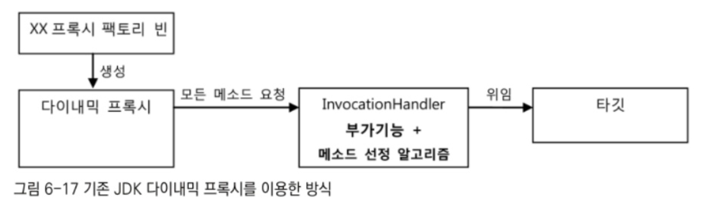
  - 기존 방식도 부가기능과 다이나믹 프록시를 분리 가능
  - 부가기능 적용 대상 메소드 선택도 가능 
  - 문제는 부가기능을 가진 InvocationHandler가 타깃과 메소드 선정 알고리즘 코드에 의존하고 있다는 것 
    - 타깃이 다르고 메소드 선정 방식이 다르면 InvocationHandler 오브젝트를 여러 프록시가 공유할 수 없음 
  - 타깃과 메소드 선정 알고리즘은 DI를 통해 분리할 수는 있음
    - 하지만 한 번 빈으로 구성된 InvocationHandler 오브젝트는 오브젝트 차원에서 특정 타깃을 위한 프록시에 제한되버림 
  - 이러한 문제 때문에 InvocationHandler는 굳이 빈으로 등록하기보다 TxProxyFactoryBean 내부에서 매번 생성했던 것 
  - 결국 타깃 변경과 메소드 선정 알고리즘 변경과 같은 확장이 필요하면 팩토리 빈 내의 프록시 생성 코드를 변경해야 함 
    - 확장에 유연하지 않고 관련 없는 코드 수정 -> OCP 원칙을 깔끔하게 지키지 못하는 구조
- ProxyFactoryBean의 방식
  - 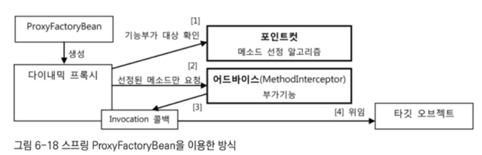
  - 부가기능Advice과 메소드 선정 알고리즘Pointcut을 활용하는 유연한 구조 제공
  - 어드바이스: 부가기능을 제공하는 오브젝트
  - 포인트컷: 메소드 선정 알고리즘을 담은 오브젝트
    - 포인트컷은 Pointcut 인터페이스를 구현해 생성
  - 어드바이스와 포인트컷은 모두 프록시에 DI로 주입되어 사용됨 
  - 두 가지 모두 여러 프록시에 공유가 가능하도록 만들어지기 때문에 싱글톤 빈으로 등록 가능 
- 프록시가 클라이언트로부터 요청을 받으면 포인트컷에게 부가기능 부여 메소드인지 확인해달라고 요청
  - 프록시가 포인트컷으로부터 적용 대상인지 확인받으면 MethodInterceptor 타입의 어드바이스 호출 
    - 어드바이스는 InvocationHandler와 달리 타깃을 직접 호출하지 않음 
    - 자신이 공유되어야 하기 때문에 타깃의 상태를 가질 수 없기 때문 
    - 따라서 타깃에 직접 의존하지 않도록 탬플릿 구조로 설계되어 있음 
  - 어드바이스가 부가기능을 부여하는 중에 타깃 메소드의 호출이 필요할 때
    - 프록시로부터 전달받은 MethodInvocation 타입 콜백 오브젝트의 proceed() 메소드를 호출해 주기만 하면 됨 
- 프록시가 메소드 호출에 따라 만드는 Invocation 콜백의 역할
  - 실제 위임 대상인 타깃 오브젝트의 레퍼런스 보유
  - 이를 이용해 타깃 메소드를 직접 호출 
  - 재사용 가능한 기능을 만들어 두고 바뀌는 부분(콜백 오브젝트와 메소드 호출 정보)만 외부에서 주입해 이를 작업 흐름(부가기능 부여) 중 사용하도록 하는 탬플릿/콜백 구조
  - 어드바이스가 일종의 탬플릿
  - 타깃을 호출하는 기능을 갖고 있는 MethodInvocation 오브젝트가 콜백이 되는 것 
  - 재사용 및 공유가 가능한 탬플릿과 비슷하게 어드바이스도 독립적인 싱글톤 빈으로 등록하고 DI를 주입해 여러 프록시가 사용하도록 만들 수 있음 
- 프록시로부터의 어드바이스와 포인트컷의 독립
  - 독립시켜 DI로 사용하는 것은 전형적인 전략 패턴 구조 
    - 여러 프록시가 공유해 사용 가능
    - 부가기능 방식이나 메소드 선정 방식이 바뀌면 구현 클래스만 바꿔서 설정에 넣어주면 됨
  - 프록시와 ProxyFactoryBean 등의 변경 없이도 기능을 자유롭게 확장할 수 있는 OCP를 충실히 지키는 구조 
- 포인트컷을 사용할 때의 코드 상의 차이점
  - 포인트컷을 사용하지 않을 때는 ProxyFactoryBean의 addAdvice() 메소드로 어드바이스만 등록
  - 하지만 포인트컷을 어드바이스와 함께 등록할 때는 둘을 Advisor 타입으로 묶어 addAdvisor() 메소드를 호출해야 함 
    - ProxyFactoryBean에는 여러 개의 어드바이스와 포인트컷이 추가될 수 있기 때문 
    - 포인트컷과 어드바이스를 따로 등록하면 어떤 어드바이스에 대해 어떤 포인트컷을 적용할지 애매해짐 
  - 여러 개의 어드바이스가 등록되더라도 각기 다른 포인트컷과 조합될 수 있기 때문에 각기 다른 메소드 선정 방식을 적용할 수 있음 
  - `어드바이저 = 포인트컷(메소드 선정 알고리즘) + 어드바이스(부가기능)`

----

# 6.4.2. ProxyFactoryBean 적용
## TransactionAdvice
- 부가기능을 담당하는 어드바이스는 테스트에서 만들어본 것처럼 MethodInterceptor라는 Advice 서브인터페이스를 구현해 생성
  - 다이나믹 프록시 방식으로 만든 TransactionHandler의 코드에서 타깃과 메소드 선정 부분을 제거해주면 됨 
  - 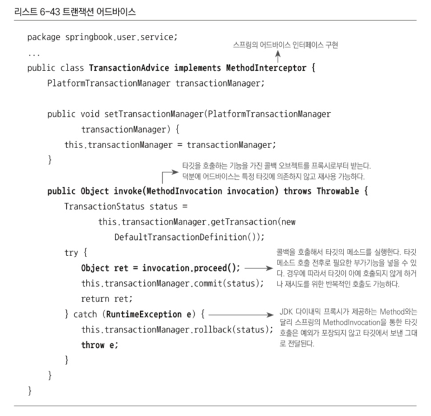
  - InvocationHandler를 이용해 만들었을 때보다 코드가 간결 
  - 리플렉션을 통한 타깃 메소드 호출 작업의 번거로움은 MethodInvocation 타입의 콜백을 이용해 제거
  - 타깃 메소드가 던지는 예외도 InvocationTargetException으로 포장되어 오는 것이 아니기 때문에 그대로 잡아서 처리 가능 
## 어드바이스와 포인트컷의 재사용
- ProxyFactoryBean은 스프링의 DI와 탬플릿/콜백 패턴, 서비스 추상과 등의 기법이 모두 적용된 것 
  - 독립적이며 여러 프록시가 공유할 수 있는 어드바이스와 포인트컷으로 확장 기능을 분리 가능 
  - 기존 클래스가 아닌 새로운 비즈니스 로직을 담은 서비스 클래스가 만들어져도 이미 만들어둔 TransactionAdvice를 그대로 재사용 가능 
  - 메소드 선정을 위한 포인트컷이 필요하면 이름 패턴만 지정해 ProxyFactoryBean에 등록하면 됨 
  - 트랜잭션을 적용할 메소드의 이름은 일관된 명명 규칙을 정해두면 하나의 포인트컷으로 충분할 수도 있음 
- ProxyFactoryBean을 이용해 많은 서비스 빈에게 트랜잭션 부가 기능을 적용할 때 
  - 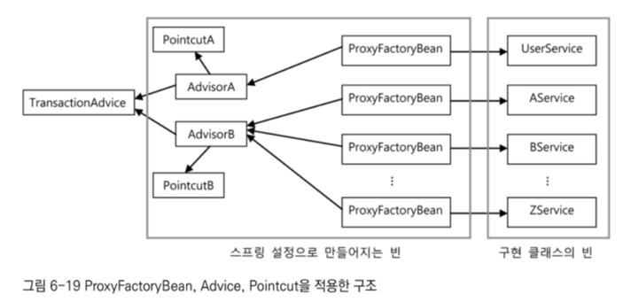
  - 트랜잭션 부가기능을 담은 TransactionAdvice를 하나만 만들어 싱글톤 빈으로 등록
    - DI 설정을 통해 모든 서비스에 적용 가능 
  - 메소드 선정 방식이 달라지는 경우만 포인트컷의 설정을 따로 등록하고 어드바이저로 조합해 적용해주면 됨 

----

# 6.5. 스프링 AOP
- 지금까지의 작업 목표는 비즈니스 로직에 반복적으로 등장하는 트랜잭션 코드를 깔끔하고 효과적으로 분리해내는 것 
- 분리한 트랜잭션 코드는 투명한 부가기능 형태로 제공되어야 함 
- 투명하다: 부가기능을 적용한 후에도 기존 설계와 코드에는 영향을 주지 않는다
- 다른 코드에서는 존재가 보이지 않아도 메소드 호출 과정에 다이나믹하게 참여해 부가기능을 제공해 주는 것 
- 투명하기 때문에 언제든지 자유롭게 추가하거나 제거 가능
- 기존 코드는 항상 원래의 상태 유지 

# 6.5.1. 자동 프록시 생성 
- 해결 과제
  - 프록시 팩토리 빈 방식의 접근 방법의 한계 두 가지가 문제
  1. 부가기능이 타깃 오브젝트마다 생성되는 문제
    - ProxyFactoryBean의 어드바이스로 해결
  2. 부가기능의 적용이 필요한 타깃 오브젝트마다 거의 비슷한 내용의 ProxyFactoryBean 설정정보를 추가해주는 부분
    - 새로운 타깃이 등장했다고 해서 코드를 수정할 필요는 없음
    - 하지만 설정을 매번 복사해 붙이고 target 프로퍼티 내용을 수정해 줘야 함 
    - 단순한 작업이지만 중복인 것은 맞음 
## 중복 문제의 접근 방법
- 지금까지의 반복적이며 기계적인 코드에 대한 해결책
### 1. JDBC API를 사용하는 DAO 코드
- 메소드마다 JDBC try/catch/finally 블록으로 구성된 비슷한 코드가 반복적으로 나타났음
- 바뀌는 부분과 그렇지 않은 부분의 분리, 탬플릿/콜백/클라이언트로 나누는 방법으로 해결
### 2. 반복적인 위임 코드가 필요한 프록시 클래스 코드 
- 타깃 오브젝트로의 위임 코드와 부가기능 적용을 위한 코드가 프록시가 구현해야 하는 모든 인터페이스 메소드마다 반복적으로 필요했음
- 다이나믹 프록시라는 런타임 코드 자동생성 기법으로 해결
  - 다이나믹 프록시는 특정 인터페이스를 구현한 오브젝트에 대해 프록시 역할을 해주는 클래스를 런타임 시 내부적으로 만들어줌 
  - 런타임 시에 생성되기 때문에 코드가 남지 않을 뿐, 타깃 인터페이스의 모든 메소드를 구현하는 클래스가 분명히 만들어짐 
  - 그로 인해 개발자가 일일이 인터페이스 메소드를 구현하는 프록시 클래스를 만들어 위임과 부가기능의 코드를 중복해 넣어주지 않아도 됨 
- 변하지 않는 타깃으로의 위임과 부가기능 적용 여부 판단이라는 부분은 코드 생성 기법을 이용하는 다이나믹 프록시 기술에 맡김 
- 변하는 부가기능 코드는 별도로 만들어 다이나믹 프록시 생성 팩토리에 DI로 제공 
  - 변하는 로직과 그렇지 않은 기계적인 코드를 분리한 것 
  - 의미있는 부가기능 로직인 트랜잭션 경계설정은 코드로 만들도록 함
  - 기계적인 코드인 타깃 인터페이스 구현과 위임, 부가기능 연동 부분은 자동생성하도록 함 
- 반복적인 ProxyFactoryBean 설정 문제도 자동으로 해결 가능할까?
  - 아직까지 방법은 없음
## 빈 후처리기를 이용한 자동 프록시 생성기
- 스프링은 OCP의 중요한 요소인 유연한 확장을 스프링 컨테이너 자신에게도 적용
  - 스프링은 컨테이너로서 제공하는 기능 중에서 변하지 않는 핵심적인 부분 외에는 대부분 확장할 수 있도록 확장 포인트를 제공 
- BeanPostprocessor 인터페이스를 구현해 만드는 빈 후처리기
  - 빈 후처리기는 스프링 빈 오브젝트로 만들어지고 난 후 빈 오브젝트를 다시 가공할 수 있게 해줌 
- 빈 후처리기 중 하나인 DefaultAdvisorAutoProxyCreator
  - 어드바이저를 이용한 자동 프록시 생성기 
  - 빈 후처리기의 스프링 적용
    - 빈 후처리기 자체를 빈으로 등록하면 됨 
  - 스프링은 빈 후처리기가 빈으로 등록되어 있으면 빈 오브젝트가 생성될 때마다 빈 후처리기에 보내 후처리 작업을 요청
  - 빈 후처리기는 빈 오브젝트의 프로퍼티를 강제로 수정할 수 있고 별도의 초기화 작업을 수행할 수도 있음
  - 만들어진 빈 오브젝트를 바꿔치기 할 수도 있음 
  - 따라서 스프링이 설정을 참고해 만든 오브젝트가 아닌 다른 오브젝트를 빈으로 등록시키는 것이 가능 
- 자동 프록시 생성 빈 후처리기
  - 스프링이 생성하는 빈 오브젝트의 일부를 프록시로 포장, 프록시를 빈으로 대신 등록도 가능 
- 빈 후처리기를 이용한 자동 프록시 생성 방법
  - 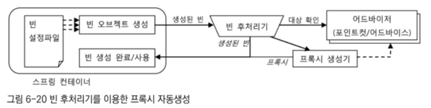
  - DefaultAdvisorAutoProxyCreator 빈 후처리기가 등록되어 있으면 스프링은 빈 오브젝트를 만들 때마다 후처리기에게 빈을 보냄
  - DefaultAdvisorAutoProxyCreator는 빈으로 등록된 모든 어드바이저 내의 포인트컷을 이용해 전달받은 빈이 프록시 적용 대상인지 확인 
  - 프록시 적용 대상이면 내장도니 프록시 생성기에게 현재 빈에 대한 프록시를 만들게 함 
  - 만들어진 프록시에 어드바이저를 연결
  - 빈 후처리기는 프록시가 생성되면 원래 컨테이너가 전달해준 빈 오브젝트 대신 프록시 오브젝트를 컨테이너에게 돌려줌 
  - 컨테이너는 최종적으로 빈 후처리기가 돌려준 오브젝트를 빈으로 등록하고 사용 
  - 적용할 빈을 선정하는 로직이 추가된 포인트컷이 담긴 어드바이저를 등록한 뒤 빈 후처리기 사용 시
    - 일일이 ProxyFactoryBean 빈을 등록하지 않아도 타깃 오브젝트에 자동으로 프록시가 적용되게 할 수 있음
## 확장된 포인트컷 
- 의문점
  - 지금까지의 포인트컷이란 타깃 오브젝트의 메소드 중 어떤 메소드에 부가기능을 적용할지를 선정해주는 역할
  - 그런데 앞에서 포인트컷이 등록된 빈 중 어떤 빈에 프록시를 적용할지를 선택한다고 함
  - 그럼 적용 메소드를 판별하는게 아니라 빈을 판별하는 것인가?
    - 그건 아니고 두 기능 전부를 가짐 
- 포인트컷의 두 가지 기능
  - 
  1. 오브젝트 내의 메소드 선택
  2. 빈 오브젝트 자체를 선택
- 지금까지 MethodMatcher라는 메소드 선별 기능만을 사용해 온 것
  - 기존에 사용하던 NameMatchMethodPointcut은 메소드 선별 기능만을 가진 특별한 포인트컷
    - 메소드만 선별한다 = 클래스 필터는 모든 클래스를 다 받아준다 
    - 따라서 클래스의 종류에 상관 없이 메소드만 판별 
  - ProxyFactoryBean에서 포인트컷을 사용할 때는 이미 타깃이 정해져 있었기 때문에 포인트컷은 메소드 선별만 해줬어도 됨 
- Pointcut 선정 기능을 모두 적용한다면
  - 먼저 프록시를 적용할 클래스인지 판단 후
  - 적용 대상 클래스인 경우에 어드바이스를 적용할 메소드인지 확인
  - 클래스 자체가 프록시 적용 대상이 아니라면 부가기능 부여는 시도도 안 됨 
- DefaultAdvisorAutoProxyCreator는 클래스와 메소드 선정 알고리즘을 모두 갖는 포인트컷이 필요
  - 정확히는 그런 포인트컷과 어드바이스가 결합되어 있는 어드바이저가 등록되어 있어야 함 

----

# 6.5.2. DefaultAdvisorAutoProxyCreator의 적용
## 클래스 필터를 적용한 포인트컷 작성
- 만들어야 할 클래스는 딱 하나
  - 메소드 이름만 비교하던 포인트컷인 NameMatchMethodPointcut을 상속
    - 주어진 이름 패턴으로 클래스 이름을 비교하는 ClassFilter를 추가하도록 만들 것
  - 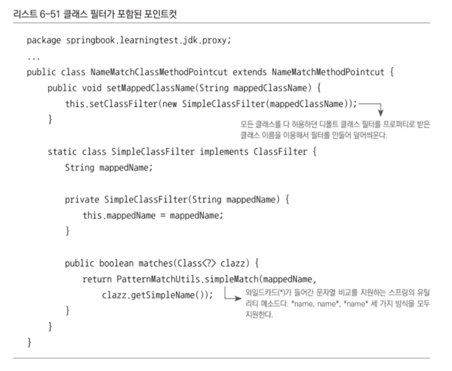
## 어드바이저를 이용하는 자동 프록시 생성기 등록
- 적용할 자동 프록시 생성기인 DefaultAdvisorAutoProxyCreator는 등록된 빈 중 Advisor 인터페이스를 구현한 것을 모두 찾음
  - 생성되는 모든 빈에 대해 어드바이저의 포인트컷을 적용해 보며 프록시 적용 대상을 선정 
  - 빈 클래스가 프록시 선정 대상이라면 프록시를 만들어 원래 빈 오브젝트와 바꿔치기 
    - 원래 빈 오브젝트는 프록시 뒤에 연결되어 프록시를 통해서만 접근 가능하도록 바뀌는 것
  - ㄸ라ㅏ서 타깃 빈에 의존한다고 정의한 다른 빈들은 프록시 오브젝트를 대신 DI받게될 것
- 등록
  - `<bean class = "org.springframework.aop.framework.autoproxy.DefaultAdvisorAutoProxyCreator />`
  - 빈 정의에 id 애트리뷰트가 없고 class만 존재
  - 다른 빈에서 참조되거나 코드에서 빈 이름으로 조회될 필요가 없는 빈이라면 아이디를 등록하지 않아도 무방 
## 포인트컷 등록
- 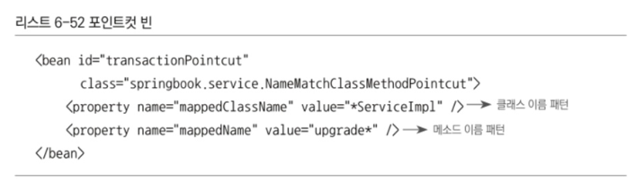
- 기존 포인트컷을 삭제하고 새로 만든 클래스 필터 지원 포인트컷을 빈으로 등록
- ServiceImpl로 이름이 끝나는 클래스와 upgrade로 시작하는 메소드를 선정해주는 포인트컷 
## 어드바이스와 어드바이저
- 어드바이스인 transactionAdvice의 빈 설정은 수정할 것이 없음
  - 어드바이저인 transactionAdvisor도 수정할 필요 없음
  - 하지만 어드바이저로서 사용되는 방법은 바뀌었다는 것을 유념
  - ProxyFactoryBean으로 등록한 빈에서처럼 transactionAdvisor를 명시적으로 DI하는 빈은 존재하지 않음 
  - 대신 어드바이저를 이용하는 자동 프록시 생성기인 DefaultAdvisorAutoProxyCreator에 의해 자동수집, 프록시 대상 선정 과정에 참여, 자동생성된 프록시에 다이나믹하게 DI되어 동작하는 어드바이저가 됨 
## 자동생성 프록시 확인
- 빈 등록과 포인트컷 작성만으로 프록시 자동 생성이 되는 것이 불안하다면 확인해 보며 ㄴ됨 
  - 기술 적용 후 확인하는 습관이 좋음 
- 확인할 사항
  1. 트랜잭션이 필요한 빈에 트랜잭션 부가기능이 적용되었는가
    - 트랜잭션이 정상적으로 커밋되는 경우에는 트랜잭션 적용 여부를 확인하기 힘듬 
    - 예외상황에서 트랜잭션이 롤백되게 함으로써 트랜잭션 적용 여부를 테스트해야 함 
    - 여기에서는 생략되었지만 교재의 upgradeAllOrNothing() 테스트로 검증
  2. 아무 빈에나 트랜잭션 부가기능이 적용된 것은 아닌지
    - 프록시 자동생성기가 어드바이저 빈에 연결해둔 포인트컷의 클래스 필터를 이용해 원하는 빈에만 프록시를 생성했는지 확인해야 함 
    - 정석은 모든 빈을 다 가져와 프록시로 변했는지 확인
    - 간단히는 클래스 필터가 제대로 동작하는지를 확인
      - 즉, 클래스 필터가 제대로 동작해 프록시 생성 대상을 선별하고 있는지 여부를 확인하는 것 
      - 포인트컷 빈의 클래스 이름 패턴을 변경해 특정 서비스 빈에 적용되고 있던 것을 적용되지 않게 한 뒤 확인하면 됨 

----

# 6.5.3. 포인트컷 표현식을 이용한 포인트컷
- 지금까지의 포인트컷 작성 방식
  - 메소드의 이름과 클래스의 이름 패턴을 각 클래스 필터와 메소드 매처 오브젝트로 비교해 선정
  - 일일이 클래스 필터와 메소드 매처를 구현하거나 스프링이 제공하는 필터 혹은 매처 클래스를 가져와 프로퍼티를 설정해야 했음
- 단순 이름 비교보다 복잡해진다면?
  - 필터나 매처에서 클래스와 메소드의 메타정보를 제공받으니 불가능할 것은 없음 
  - 리플렉션 API를 이용해 클래스 및 메소드 이름, 정의된 패키지, 파라미터, 리턴 값, 애노테이션, 구현한 클래스 등의 정보를 알아낼 수 있기 때문 
  - 하지만 리플렉션 API는 코드 작성이 번거로움
  - 리플렉션 API를 이용해 메타정보를 비교하는 방법은 조건이 달라질 때마다 포인트컷 구현 코드를 수정해야 하는 번거로움도 존재
- 스프링이 제공하는 간단한 방식 
  - 간단한 방식으로 포인트컷의 클래스와 메소드를 선정하는 알고리즘을 작성할 수 있도록 함 
  - 정규식이나 JSP의 EL과 비슷한 일종의 표현식 언어를 사용해 포인트컷을 작성
  - 이것을 포인트컷 표현식이라 부름 
## 포인트컷 표현식
- 포인트컷 표현식을 지원하는 포인트컷을 적용하기 위해
  - AspectJExpressionPointcut 클래스 사용
  - Pointcut 인터페이스를 구현해야 하는 스프링의 포인트컷은 클래스 선정을 위한 클래스 필터와 메소드 선정을 위한 메소드 매처 두 가지를 각각 제공해야 함 
  - NameMatchClassMethodPointcut은ㅇ 클래스와 메소드의 이름의 패턴을 독립적으로 비교 
  - 따라서 이를 위해 비교할 조건을 가진 두 가지 패턴을 프로퍼티로 넣어주었음 
- AspectJExpressionPointcut의 차이점 
  - 클래스와 메소드의 선정 알고리즘을 포인트컷 표현식을 이용해 한 번에 지정할 수 있게 해줌 
  - 포인트컷 표현식은 간단한 문자열로 복잡한 선정조건을 쉽게 만들어낼 수 있는 표현식 지원
  - AspectJ라는 프레임워크에서 제공하는 것을 가져와 일부 문법을 확장해 사용하는 것임 
    - 따라서 이를 AspectJ 포인트컷 표현식이라고도 함 
## 포인트컷 표현식 문법 
- AspectJ 포인트컷 표현식은 포인트컷 지시자를 이용해 작성 
  - 가장 대표적으로 execution()을 사용
  - 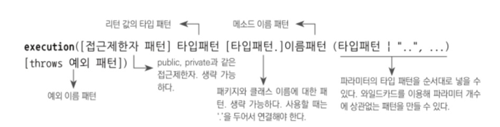
  - [] 괄호는 옵션 항목이기 때문에 생략이 가능하다는 의미
  - |는 OR 조건 
  - 메소드의 풀 시그니처를 문자열로 비교하는 개념
- Method 오브젝트가 제공하는 Target.minus() 메소드로 예시 확인 
  - 풀 시그니처
    - 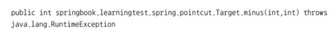
  - public
    - 접근제한자
    - public, protected, private 등이 올 수 있음 
    - 포인트컷 표현식에서 ㅅ애략 간으 
    - 생략하면 이 항목에 대해서 조건을 부여하지 않는다는 의미
  - int
    - 리턴 값의 타입을 나타내는 패턴 
    - 필수 항목이기 때문에 반드시 하나의 타입을 지정해야 함 
    - \* 를 사용해 모든 타입을 전부 선택하는 것도 가능
  - springboot.learningtest.spring.pointcut.Target
    - 여기까지가 패키지와 티입 이름을 포함한 클래스의 타입 패턴
    - 생략 가능 
    - 생략하면 모든 타입을 허용하겠다는 의미 
    - 뒤의 메소드 이름 패턴과 '.'으로 연결되기 때문에 작성할 때 잘 구분되어야 함 
    - 패키지 이름과 클래스 또는 인터페이스 이름에 \* 사용 가능
    - ".."를 사용하면 한 번에 여러 개의 패키지 선택 가능 
  - minus
    - 메소드 이름 패턴
    - 필수 항목
    - \* 사용 가능
  - (int, int)
    - 메소드 파라미터의 타입 패턴 
    - 필수 항목 
    - ','로 구분하며 순서대로 적으면 됨 
    - 파라미터가 없는 메소드를 지정하고 싶다면 ()로 적음 
    - 파라미터의 타입과 개수에 상관없이 허용하는 패턴으로 만들기 위해서는 '..'을 넣음 
    - '...'을 이용해 뒷부분의 파라미터 조건만 생략도 가능
  - throws java.lang.RuntimeException
    - 예외 이름에 대한 타입 패턴
    - 생략 가능 
- execution() 작성
  - 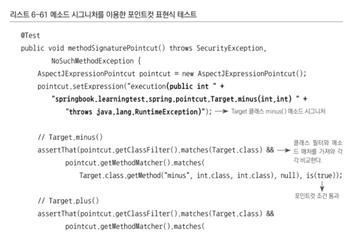
  - 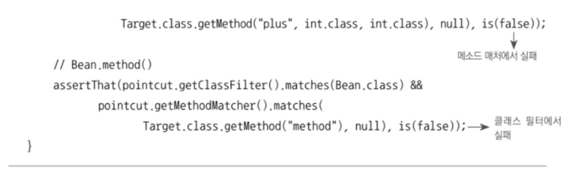
  - 포인트컷 표현식은 메소드 시그니처를 execution() 안에 넣어 작성
## 포인트컷 표현식 - 생략
- 옵션 항목 전부 생략
  - `execution(int minus(int, int))`
    - int 타입의 리턴 값
    - minus라는 메소드 이름
    - 두 개의 int 파라미터를 가진 모든 메소드를 선정하는 포인트컷 표현식 
  - 접근제한자, 정의된 클래스, 던지는 예외 상관 없이 정수 값 리턴하고 두 개의 정수형 파라미터를 갖는 minus라는 이름의 모든 메소드를 선정 
- 리턴 값 타입 제한 무시
  - `execution(* minu(int, int))`
- 파라미터 개수와 타입 무시
  - `execution(* minus(..))`
- 모든 메소드 허용
  - `execution(* *(..))`
  - 모든 오브젝트의 모든 메소드를 전부 선택하는 가장 느슨한 포인트컷 
## 포인트컷의 표현식을 이용하는 포인트컷 적용
- AspectJ 포인트컷 표현식은 메소드를 선정하는 데 편리하게 쓸 수 있는 강력한 표현식 언어 
  - 메소드 시그니처 비교 방식인ㅇ execution() 외에도 표현식 스타일 존재 
  - 스프링에 사용될 때 빈의 이름으로 비교하는 bean()
    - bean(*Service)라 작성하면 아이디가 Service로 끝나느 모든 빈을 선택
- 특정 어노테이션 선정
  - 특정 어노테이션이 타입, 메소드, 파라미터에 적용되어 있는 것을 보고 메소드를 선정하게 할 수 있음 
  - `@annotation(org.springframework.transaction.annotation.Transactional`
  - 까다로운 명명규칙 없이 어노테이션만 부여, 포인트컷을 통해 자동 선정, 부가기능 제공 
- 포인트컷 표현식을 사용한 빈 설정
  - 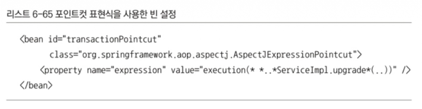
  - 로직이 짧은 문자열에 담기기 때문에 클래스나 코드를 추가할 필요 없음
    - 따라서 코드와 설정이 모두 단순해짐 
  - 반면 문자열로 된 표현식이므로 런타임 시점까지 문법의 검증이나 기능 확인이 되지는 않음 
## 타입 패턴과 클래스 이름 패턴
- 포인트컷 표현식 적용 전에는 클래스 이름의 패턴을 이용해 타깃 빈을 선정하는 포인트컷을 사용했었음 
  - ServiceImpl로 끝나는 클래스 이름을 가진 빈을 선정하도록 포인트컷을 구성 
- 단순 클래스 이름 패턴과 포인트컷 표현식에서의 타입 패턴의 차이점 
  - 포인트컷 표현식의 클래스 이름에 적용되는 패턴은 클래스 이름 패턴이 아니라 타입 패턴임
    - 즉, `execution(* *..*ServiceImpl.upgrade*(..))`로 해 두어도 TestUserService 클래스는 대상으로 선정됨 
    - TestUserService의 클래스 이름은 TestUserService지만 타입은 TestUserService, 슈퍼클래스인 UserServiceImpl, 구현 인터페이스인 UserService 세 가지가 모두 적용됨 
    - 따라서 ServiceImpl로 끝나는 타입 패턴의 조건 충족