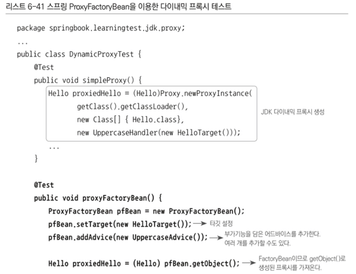

# 6.5.3까지

# 스프링의 프록시 팩토리 빈

## 6.4.1 ProxyFactoryBean

스프링은 트랜잭션 기술과 메일 발송 기술에 적용했던 서비스 추상화를 프록시 기술에도 동일하게 적용하고 있다.

자바에는 JDK에서 제공하는 다이내믹 프록시 외에도 편리하게 프록시를 만들 수 있도록 지원해주는 다양한 기술이 존재.

따라서 스프링은 일관된 방법으로 프록시를 만들 수 있게 도와주는 추상 레이어를 제공.

생성된 프록시는 스프링의 빈으로 등록. 스프링은 프록시 오브젝트를 생성해주는 기술을 추상화한 팩토리 빈을 제공해줌.

스프링의 ProxyFactoryBean은 프록시를 생성해서 빈 오브젝트로 등록하게 해주는 팩토리 빈이다.

기존에 만들었던 TxFactoryBean과 달리, ProxyFactoryBean은 순수하게 프록시를 생성하는 작업만을 담당하고 프록시를 통해 제공해줄 부가기능은 별도의 빈에 둘 수 있음.

ProxyFactoryBean이 생성하는 프록시에서 사용할 부가기능은 MethodInterceptor 인터페이스를 구현해서 만듦.

MethodInterceptor는 InvocationHandler와 비슷하지만 한 가지 다른 점이 있음

InvocationHandler의 invoke() 메소드는 타깃 오브젝트에 대한 정보를 제공하지 않음.

→ 따라서 타깃은 InvocationHandler를 구현한 클래스가 직접 알고 있어야 함.

반면에 MethodInterceptor의 invoke() 메소드는 ProxyFactoryBean 으로부터 타깃 오브젝트에 대한 정보까지도 함께 제공 받는다.

→ 따라서 타깃 오브젝트에 상관없이 독립적으로 만들어질 수 있음.

그래서 MethodInterceptor 오브젝트는 타깃이 다른 여러 프록시에서 함께 사용할 수 있고, 싱글톤 빈으로 등록 가능함

아래는 ProxyFactoryBean을 이요하도록 수정한 것.

### 어드바이스: 타깃이 필요 없는 순수한 부가기능

ProxyFactoryBean을 적용한 코드를 기존의 JDK 다이내믹 프록시를 사용했던 코드와 비교해보면 몇 가지 눈에 띄는 차이점이 존재.

InvocationHandler를 구현했을 때와 달리 MethodInterceptor를 구현한 UppercaseAdvice에는 타깃 오브젝트가 등장하지 않음

MethodInterceptor로는 메소드 정보와 함께 타깃 오브젝트가 담긴 MethodInvocation 오브젝트가 전달됨.

MethodInvocation은 타깃 오브젝트의 메소드를 실행할 수 있는 기능이 있기 때문에 MethodInterceptor는 부가 기능을 제공하는 데만 집중할 수 있음

MethodInvocation은 일종의 콜백 오브젝트로, proceed() 메소드를 실행하면 타깃 오브젝트의 메소드를 내부적으로 실행해주는 기능이 존재

→ MethodInvocation 구현 클래스는 일종의 공유 가능한 템플릿 처럼 동작

이 차이점이 JDK의 다이내믹 프록시를 직접 사용하는 코드와 스프링이 제공해주는 프록시 추상화 기능인 ProxyFactoryBean을 사용하는 코드의 가장 큰 차이점이자 ProxyFactoryBean의 장점.

ProxyFactoryBean은 작은 단위의 템플릿/콜백 구조를 응용해서 적용 → 템플릿 역할을 하는 MethodInvocation을 싱글톤으로 두고 공유할 수 있음.

ex) JdbcTemplate

ProxyFactoryBean에 이 MethodInterceptor를 설정해줄 때는 일반적인 DI 경우처럼 수정자 메소드를 사용하는 대신 addAdvice()라는 메소드를 사용한다는 점도 눈 여겨봐야함.

add라는 이름에서 알 수 있듯이 ProxyFactoryBean 하나만으로 여러 개의 부가기능을 제공해주는 프록시를 만들 수 있다는 뜻.

따라서 앞에서 살펴봤던 프록시 팩토리 빈의 단점 중의 하나였던, 새로운 부가기능을 추가할 때마다 프록시와 프록시 팩토리 빈의 단점 중의 하나였던, 새로운 부가기능을 추가할 때마다 프록시와 프록시 팩토리빈도 추가해줘야 한다는 문제를 해결할 수 있음.

그런데 MethodInterceptor 오브젝트를 추가하는 메소드 이름은 addMethodInterceptor가 아니라 addAdvice.

MethodInterceptor는 Advice 인터페이스를 상속하고 있는 서브인터페이스이기 때문이다.

스프링은 단순히 메소드 실행을 가로채는 방식 외에도 부가기능을 추가하는 여러 가지 다양한 방법을 제공하고 있다.

이름에서 알 수 있듯이 MethodInterceptor처럼 타깃 오브젝트에 적용하는 부가기능을 담은 오브젝트를 스프링에서는 어드바이스라고 부른다. 이 용어는 매우 중요하다.

- 참고자료
    
    
    
    
    

마지막으로 JDK 다이내믹 프록시에서 프록시 오브젝트를 만들 때는 필요했지만 ProxyFactoryBean을 적용한 후에는 없어진 것이 있는데 ProxyFactoryBean을 적용한 코드에는 프록시가 구현해야 하는 Hello라는 인터페이스를 제공해주는 부분이 없다.

프록시를 직접 만들 때나 JDK 다이내믹 프록시를 만들 때 반드시 제공해줘야 하는 정보가 Hello 인터페이스 → 그래야만 다이내믹 프록시 오브젝트의 타입을 결정할 수 있기 때문.

그런데 스프링의 ProxyFactoryBean은 어떻게 인터페이스 타입을 제공받지도 않고 Hello 인터페이스를 구현한 프록시를 만들어 낼 수 있을까?

- setInterfaces() 메소드를 통해서 구현해야할 인터페이스를 지정할 수 있다.
- 인터페이스를 알려주지 않아도 ProxyFactoryBean에 있는 인터페이스 자동검출 기능을 사용해 타깃 오브젝트가 구현하고 있는 인터페이스 정보를 알아내고, 그 인터페이스를 모두 구현하는 프록시를 만들어줌.

타깃 오브젝트가 구현하고 있는 모든 인터페이스를 만들어주는 기능이고, 타깃 오브젝트가 구현하는 인터페이스 중에서 일부만 프록시에 적용하기를 원한다면 인터페이스 정보를 직접 제공해줘도 됨.

중요한 어드바이스라는 이름은 타깃 오브젝트에 종속되지 않는 순수한 부가기능을 담은 오브젝트라는 사실을 기억할 것.

### 포인트컷: 부가기능 적용 대상 메소드 선정 방법

기존에 InvocationHandler를 직접 구현했을 때는 부가기능 적용 외에도 한 가지 작업이 더 존재했음.

메소드의 이름을 가지고 부가기능 적용 대상 메소드를 선정하는 것이었음.

TxProxyFactoryBean은 pattern이란느 메소드 이름 비교용 스트링 값을 DI 받아서 TransactionHandler를 생성할 때 이를 넘겨주고, TransactionHandler는 요청이 들어오는 메소드의 이름과 패턴을 비교해서 부가기능인 트랜잭션 적용 대상을 판별.

그럼 스프링의 ProxyFactoryBean과 MethodInterceptor를 사용하는 방식에서도 메소드 선정 기능을 넣을 수 있을까?

→ 불가능. MethodInterceptor에서 부가기능을 제공하고 있으니 그 안에서 판별하게 하면 될 것 같지만, MethodInterceptor 오브젝트는 여러 프록시가 공유해서 사용할 수 있다.

그래서 타깃 정보를 갖고 있지 않도록 만들었음(stateless, singleton)

그런데 다시 트랜잭션 적용 대상 메소드 이름 패턴을 넣어주는 것은 곤란함.

트랜잭션 적용 메소드 패턴은 프록시마다 다를 수 있기 때문에 여러 프록시가 공유하는 MethodInterceptor에 특정 프록시에만 적용되는 패턴을 넣으면 문제가 됨.

그럼 어떻게 해결할까? 어쩔 수 없이 MethodInterceptor를 프록시마다 따로 등록하고 독립적으로 만들어지게 해야할까?

→ 그렇게 타협할 필요는 없다. 그동안 했던 코드 개선 전략을 적용해보자.

함께 두기 곤란한 성격이 다르고 변경 이유와 시점이 다르고, 생성 방식과 의존관계가 다른 코드가 함께 있다면 분리해주면 된다.

MethodInterceptor는 InvocationHandler와는 다르게 프록시가 클라이언트로부터 받는 요청을 일일이 전달받을 필요는 없다. MethodInterceptor에는 재사용 가능한 순수한 부가기능 제공 코드만 남겨주는 것.

대신 프록시에 부가기능 적용 메소드를 선택하는 기능을 넣자.

프록시의 핵심 가치는 타깃을 대신해서 클라이언트의 요청을 받아 처리하는 오브젝트로서의 존재 자체이므로, 메소드를 선별하는 기능은 프록시로부터 다시 분리하는 편이 낫다. 메소드를 선별하는 기능은 일종의 교환 가능한 알고리즘이므로 전략 패턴을 적용할 수 있기 때문.

위 그림은 기존의 JDK를 활용한 다이내믹 프록시를 활용하는 구조이며, 다이내믹 프록시와 부가기능을 분리할 수 있고, 부가기능 적용 대상 메소드를 선정할 수 있게 되어 있다.

하지만 문제는 부가기능을 가진 InvocationHandler가 타깃과 메소드 선정 알고리즘 코드에 의존하고 있다는 점.

만약 타깃이 다르고 메소드 선정 방식이 다르다면 이 오브젝트를 여러 프록시가 공유할 수 없다.

타깃과 메소드 선정 알고리즘은 DI를 통해 분리할 수는 있지만 한번 빈으로 구성된 InvocationHandler 오브젝트는, 오브젝트 차원에서 특정 타깃을 위한 프록시에 제한된다는 뜻.

그래서 InvocationHandler는 굳이 따로 빈으로 등록하는 대신 TxProxyFactoryBean 내부에서 매번 생성하도록 만들었던 것.

따라서 타깃 변경과 메소드 선정 알고리즘 변경 같은 확장이 필요하면 팩토리 빈 내의 프록시 생성코드를 직접 변경해야 함.

→ 결국 확장에는 유연하게 열려 있지 못하고 관련 없는 코드의 변경이 필요할 수 있는, OCP 원칙을 깔끔하게 잘 지키지 못하는 어정쩡한 구조라고 볼 수 있다.

반면에 위의 그림과 같이 스프링의 ProxyFactoryBean 방식은 두 가지 확장 기능인 부가기능(Advice)과 메소드 선정 알고리즘(Pointcut)을 활용하는 유연한 구조를 제공.

스프링은 부가기능을 제공하는 오브젝트를 어드바이스라고 부르고, 메소드 선정 알고리즘을 담은 오브젝트를 포인트컷이라고 부름.

어드바이스와 포인트 컷은 모두 프록시에 DI로 주입돼서 사용됨. 두 가지 모두 여러 프록시에서 공유가 가능하도록 만들어지기 때문에 스프링의 싱글톤 빈으로 등록이 가능함.

프록시는 클라이언트로부터 요청을 받으면 먼저 포인트컷에게 부가기능을 부여할 메소드인지 확인해달라고 요청 → 프록시는 포인트 컷으로부터 부가기능을 적용할 대상 메소드인지 확인받으면 → MethodInterceptor 타입의 어드바이스를 호출.

포인트컷은 Pointcut 인터페이스를 구현해서 만들면 된다. 어드바이스는 JDK의 다이내믹 프록시의 InvocationHandler와 달리 직접 타깃을 호출하지 않음. 자신이 공유돼야 하므로 타깃 정보라는 상태를 가질 수 없다.

따라서 타깃에 직접 의존하지 않도록 일정의 템플릿 구조로 설계되어 있음.

어드바이스가 부가기능을 부여하는 중에 타깃 메소드의 호출이 필요하면 프록시로부터 전달받은 MethodInvocation 타입 콜백 오브젝트의 proceed()메소드를 호출해주기만 하면 됨.

실제 위임 대상인 타깃 오브젝트의 레퍼런스를 갖고 있고, 이를 이용해 타깃 메소드를 직접 호출하는 것은 프록시가 메소드 호출에 따라 만다는 Invocation 콜백의 역할.

재사용 가능한 기능을 만들어두고 바뀌는 부분(콜백 오브젝트와 메소드 호출정보)만 외부에서 주입해서 이를 작업 흐름(부가기능 부여)중에 사용하도록 하는 전형적인 템플릿/콜백 구조다.

어드바이스가 일종의 템플릿, 타깃을 호출하는 기능을 갖고 있는 MethodInvocation 오브젝트가 콜백이 되는 것.

템플릿은 한 번 만들면 재사용이 가능하고 여러 빈이 공유해서 사용할 수 있듯이, 어드바이스도 독립적인 싱글톤 빈으로 등록하고 DI를 주입해서 여러 프록시가 사용하도록 만들 수 있다.

프록시로부터 어드바이스와 포인트컷을 독립시키고 DI를 사용하게 한 것은 전형적인 전략 패턴 구조.

덕분에 여러 프록시가 공유해서 사용할 수도 있고, 또 구체적인 부가기능 방식이나 메소드 선정 알고리즘이 바뀌면 구현 클래스만 바꿔서 설정에 넣어주면 됨.

프록시와 ProxyFactoryBean등의 변경 없이도 기능을 자유롭게 확장할 수 있는 OCP를 충실히 지키는 구조가 되는 것.

포인트컷이 필요 없을 때는 ProxyFactoryBean의 addAdvice() 메소드를 호출해서 어드바이스만 등록하면 됐음.

그런데 포인트컷을 함께 등록할 때는 어드바이스와 포인트컷을 Advisor 타입으로 묶어서 addAdvisor() 메소드를 호출해야 함.

그렇다면 왜 어드바이스를 등록하듯이 포인트컷도 그냥 추가하면 될 것을 굳이 별개의 오브젝트로 묶어서 등록해야할까?

→ ProxyFactoryBean에는 여러 개의 어드바이스와 포인트컷이 추가될 수 있기 때문.

포인트컷과 어드바이스를 따로 등록하면 어떤 어드바이스(부가기능)에 대해 어떤 포인트컷(메소드 선정)을 적용할지 애매해지기 때문. 그래서 이 둘을 Advisor 타입의 오브젝트에 담아서 조합을 만들어 등록하는 것.

여러 개의 어드바이스가 등록되더라도 각각 다른 포인트컷과 조합될 수 있기 때문에 각기 다른 메소드 선정 방식을 적용할 수 있다

ex) 트랜잭션은 add로 시작, 보안 부가기능은 모든 메소드에 적용, 기능검사 부가기능은 get으로 시작하는 메소드에만 적용할 수 있음

**어드바이스와 포인트컷을 묶은 오브젝트를 인터페이스 이름을 따라서 어드바이저라고 부름**

어드바이저 = 포인트컷(메소드 선정 알고리즘) + 어드바이스(부가기능)

pointcutAdvisor()테스트에서 사용한 NameMatchPointcut은 mappedName 프로퍼티 값을 이용해 메소드의 이름을 비교하는 방식으로 대상을 선정함.

## 6.4.2 ProxyFactoryBean 적용

JDK 다이내믹 프록시의 구조를 그대로 이용해서 만들었던 TxProxyFactoryBean을 스프링이 제공하는 ProxyFactoryBean을 이용하도록 리팩토링.

### TransactionAdvice

부가기능을 담당하는 어드바이스는 테스트에서 만들어본 것처럼 MethodInterceptor라는 Advice 서브인터페이스를 구현해서 만듦.

일단 기존 코드에서 타깃과 메소드 선정 부분을 제거.

JDK 다이내믹 프록시의 InvocationHandler를 이용해서 만들었을 때보다 코드가 간결함.

리플렉션을 통한 타깃 메소드의 호출 작업의 번거로움은 MethodInvocation타입의 콜백을 이용한 덕분에 대부분 제거가 가능.

타깃 메소드가 던지는 예외도 InvocationTargetException으로 포장돼서 오는 것이 아니기 때문에 그대로 잡아서 처리하면 됨.

### 스프링의 XML 설정 파일

이렇게 어드바이스를 등록하고, 트랜잭션 기능 적용을 위해 transactionManager만 DI 해주면 됨.

포인트컷 빈의 경우 메소드 이름 패턴은 upgrade로 시작하는 모든 메소드를 선택하도록 만든다.

이를 위해 mappedName 프로퍼티에 upgrade*이라고 넣어주면 됨.

어드바이저를 빈으로 등록함.

어드바이저는 interceptorName라는 프로퍼티를 통해 넣음.

프로버티 이름이 advisor가 아닌 이유는 어드바이스와 어드바이저를 혼합해서 설정할 수 있도록 하기 위함.

그래서 property 태그의 ref 애트리뷰트를 통한 설정 대신 list와 value 태그를 통해 여러 개의 값을 넣을 수 있도록 함.

value태그에는 어드바이스 또는 어드바이저로 설정한 빈의 아이디를 넣으면 됨.

한개 이상 넣을 수 있고, 만약 타깃의 모든 메소드에 적용해도 좋기 때문에 포인트컷의 적용이 필요 없다면 transactionAdvice라고 넣을 수 있음.

### 테스트

스프링의 ProxyFactoryBean도 팩토리 빈이므로 직접 가져올때 캐스팅할 타입만 ProxyFactoryBean으로 간단히 변경해주면 된다.

### 어드바이스와 포인트 컷의 재사용

ProxyFactoryBean은 스프링의 DI와 템플릿/콜백 패턴, 서비스 추상화 등의 기법이 모두 적용된 것.

그 덕분에 독립적이며, 여러 프록시가 공유할 수 있는 어드바이스와 포인트컷으로 확장 기능을 분리할 수 있었음.

위 그림은 ProxyFactoryBean을 이용해서 많은 수의 서비스 빈에게 트랜잭션 부가기능을 적용했을 때의 구조.

트랜잭션 부가기능을 담은 TransactionAdvice는 하나만 만들어서 싱글톤 빈으로 등록해주면, DI 설정을 통해 모든 서비스에 적용이 가능함.

메소드 선정 방식이 달라지는 경우만 포인트컷의 설정을 따로 등록하고 어드바이저로 조합해서 적용해주면 됨.

# 6.5 스프링 AOP

지금까지 해왔던 작업의 목표는 비즈니스 로직에 반복적으로 등장해야만 했던 트랜잭션 코드를 깔끔하고 효과적으로 분리해내는 것.

이렇게 분리해낸 트랜잭션 코드는 투명한 부가기능 형태로 제공되어야 함.

투명하다는 건 부가기능을 적용한 후에도 기존 설계와 코드에는 영향을 주지 않는다는 뜻.

마치 투명한 유리를 사이에 둔 것처럼 다른 코드에서는 그존재가 보이지 않지만, 메소드가 호출되는 과정에 다이내믹하게 참여해서 부가적인 기능을 제공해주도록 만드는 것.

투명하기 때문에 언제든지 자유롭게 추가하거나 제거할 수도 있고, 기존 코드는 항상 원래의 상태를 유지할 수 있다.

DI의 멋진 응용 방식 중 하나.

## 6.5.1 자동 프록시 생성

투명한 부가기능을 적용하는 과정에서 발견됐던 거의 대부분의 문제는 제거함.

타깃 코드는 여전히 깔끔한 채로 남아 있고, 부가기능은 한 번만 만들어 모든 타깃과 메소드에 재사용이 가능하고, 타깃의 적용 메소드를 선정하는 방식도 독립적으로 작성할 수 있도록 분리되어 있음.

하지만 아직 한 가지 해결할 과제가 남아 있음.

프록시 팩토리 빈 방식의 접근 방법의 한계라고 생각했던 두 가지 문제가 존재.

그중에서 부가기능이 타깃 오브젝트마다 새로 만들어지는 문제는 스프링 ProxyFactoryBean의 어드바이스를 통해 해결됐다.

남은 것은 부가기능의 적용이 필요한 타깃 오브젝트마다 거의 비슷한 내용의 ProxyFactoryBean 빈 설정정보를 추가해주는 부분이다.

새로운 타깃이 등장했다고 해서 코드를 손댈 필요는 없어졌지만, 설정은 매번 복사해서 붙이고 target 프로퍼티의 내용을 수정해줘야 함.

그럼 중복을 제거할 방법은 없을까?

### 중복 문제의 접근 방법

지금까지 다뤄봤던 반복적이고 기계적인 코드에 대한 해결책을 생각.

JDBC API를 사용하는 DAO 코드가 있었음.

그땐 메소드마다 JDBC try/catch/finally 블록으로 구성된 비슷한 코드가 반복해서 나타났음.

이 부분은 템플릿과 콜백, 클라이언트로 나누는 방법을 통해 깔끔하게 해결함.

→ 전략 패턴과 DI를 적용한 덕분.

그런데 이와는 좀 다른 방법으로 반복되는 코드의 문제를 해결했던 것이 존재.

바로 반복적인 위임 코드가 필요한 프록시 클래스 코드.

타깃 오브젝트로의 위임 코드와 부가기능 적용을 위한 코드가 프록시가 구현해야 하는 모든 인터페이스 메소드마다 반복적으로 필요했음

→ 단순한 분리와 DI와는 다른 독특한 방법으로 해결함.

다이내믹 프록시라는 런타임 코드 자동생성 기법을 이요함.

JDK의 다이내믹 프록시는 특정 인터페이스를 구현한 오브젝트에 대해서 프록시 역할을 해주는 클래스를 런타임 시 내부적으로 만들어줌.

런타임 시에 만들어져 사용되기 때문에 클래스 소스가 따로 남지 않을 뿐이지 타깃 인터페이스의 모든 메소드를 구현하는 클래스가 분명히 만들어짐

→ 그 덕분에 개발자가 일일이 인터페이스 메소드를 구현하는 프록시 클래스를 만들어서 위임과 부가기능의 코드를 중복해서 넣어주지 않아도 되게 해줬음.

변하지 않는 타깃으로의 위임과 부가기능 적용 여부 판단이라는 부분은 코드 생성 기법을 이용하는 다이내믹 프록시 기술에 맡기고, 변하는 부가기능 코드는 별도로 만들어서 다이내믹 프록시 생성 팩토리에 DI로 제공하는 방법으로 사용한 것.

의미 있는 부가기능 로직인 트랜잭션 경계설정은 코드로 만들게 하고, 기계적인 코드인 타깃 인터페이스 구현과 위임, 부가기능 연동 부분은 자동생성하게 한 것.

그럼 반복적인 프록시의 메소드 구현을 코드 자동생성 기법을 이용해 해결했다면 반복적인 ProxyFactoryBean 설정 문제는 설정 자동등록 기법으로 해결할 수 없을까?

또는 실제 빈 오브젝트가 되는 것은 ProxyFactoryBean을 통해 생성되는 프록시 그 자체이므로 프록시가 자동으로 빈으로 생성되게 할 수는 없을까?

마치 다이내믹 프록시가 인터페이스만 제공하면 모든 메소드에 대한 구현 클래스를 자동으로 만들듯이, 일정한 타깃 빈의 목록을 제공하면 자동으로 각 타깃 빈에 대한 프록시를 만들어주는 방법이 있다면 ProxyFactoryBean 타입 빈 설정을 매번 추가해서 프록시를 만들어내는 수고를 덜 수 있을 것 같다.

### 빈 후처리기를 이용한 자동 프록시 생성기

스프링은 OCP의 가장 중요한 요소인 유연한 확장이라는 개념을 스프링 컨테이너 자신에게도 다양한 방법으로 적용하고 있음. 스프링의 DI를 이용해 만들어지는 애플리케이션의 코드가 OCP에 충실할 수 있다면 스프링 스스로도 그런 가치를 따르는 게 마땅함.

그래서 스프링은 컨테이너로서 제공하는 기능 중에서 변하지 않는 핵심적인 부분 외에는 대부분 확장할 수 있도록 확장 포인트를 제공해줌.

그중에서 관심을 가질 만한 확장 포인트는 바로 BeanPostProcessor 인터페이스를 구현해서 만드는 빈 후처리기.

빈 후처리기는 이름 그대로 스프링 빈 오브젝트로 만들어지고 난 후에, 빈 오브젝트를 다시 가공할 수 있게 해준다.

여기서는 스프링이 제공하는 빈 후처리기 중의 하나인 DefaultAdvisorAutoProxyCreator는 어드바이저를 이용한 자동 프록시 생성기.

스프링은 빈 후처리기가 빈으로 등록되어 있으면 빈 오브젝트가 생성될 때마다 빈 후처리기에 보내서 후처리 작업을 요청함.

빈 후처리기는 빈 오브젝트의 프로퍼티를 강제로 수정할 수도 있고 별도의 초기화 작업을 수행할 수도 있음.

만들어진 빈 오브젝트 자체를 바꿔치기할 수도 있음.

따라서 스프링이 설정을 참고해서 만든 오브젝트가 아닌 다른 오브젝트를 빈으로 등록시키는 것이 가능함.

이를 잘 이용하면 스프링이 생성하는 빈 오브젝트의 일부를 프록시로 포장하고, 프록시를 빈으로 대신 등록할 수도 있음.

→ 이것이 자동 프록시 생성 빈 후처리기다.

DefaultAdvisorAutoProxyCreator 빈 후처리기가 등록되어 있으면 스프링은 빈 오브젝트를 만들 때마다 후처리기에 빈을 보낸다.

DefaultAdvisorAutoProxyCreator는 빈으로 등록된 모든 어드바이저 내의 포인트컷을 이용해 전달받은 빈이 프록시 적용 대상인지 확인 함.

프록시 적용 대상이면 그때는 내장된 프록시 생성기에게 현재 빈에 대한 프록시를 만들게 하고, 만들어진 프록시에 어드바이저를 연결해줌.

빈 후처리기는 프록시가 생성되면 원래 컨테이너가 전달해준 빈 오브젝트 대신 프록시 오브젝트를 컨테이너에게 돌려줌.

컨테이너는 최종적으로 빈 후처리기가 돌려준 오브젝트를 빈으로 등록하고 사용함.

### 확장된 포인트 컷

그런데 한 가지 이상한 점이 있음.

지금까지 포인트컷은 타깃 오브젝트의 메소드 중에서 어떤 메소드에 부가기능을 적용할지를 선정해주는 역할을 했다고 함. 그런데 여기서는 갑자기 포인트컷이 등록된 빈 중에서 어떤 빈에 프록시를 적용할지를 선택한다는 식으로 설명하고 있음.

포인트컷은 오브젝트내의 메소들르 선택하는 것과 빈 오브젝트 자체를 선택하는 기능 두 가지를 모두 갖고 있다.

지금까지는 포인트컷이 제공하는 두 가지 기능 중에서 MethodMatcher라는 메소드를 선별하는 기능만 사용해온 것.

기존에 사용한 NameMatchMethodPointcut은 메소드 선별 기능만 가진 특별한 포인트컷.

메소드만 선별한다는 건 클래스 필터는 모든 클래슬르 다 받아주도록 만들어져 있다는 뜻.

클래스의 종류는 상관없이 메소드만 판별함. ProxyFactoryBean에서 포인트컷을 사용할 때는 이미 타깃이 정해져 있기 때문에 포인트컷은 메소드 선별만 해주면 되었음.

만약 Pointcut 선정 기능을 모두 적용한다면 먼저 프록시를 적용할 클래스인지 판단하고 나서, 적용 대상 클래스인 경우에는 어드바이스를 적용할 메소드인지 확인하는 식으로 동작.

클래스 자체가 프록시 적용 대상이 아니라면 어드바이스를 통한 부가기능 부여는 물 건너간 셈.

결국 이 두 가지 조건이 모두 충족되는 타깃의 메소드에 어드바이스가 적용되는 것.

ProxyFactoryBean에서는 굳이 클래스 레벨의 필터는 필요 없었지만, 모든 빈에 대해 프록시 자동 적용 대상을 선별해야 하는 빈 후처리기인 DefaultAdvisorAutoProxyCreator는 클래스와 메소드 선정 알고리즘을 모두 갖고 있는 포인트컷이 필요함.

정확히는 그런 포인트컷과 어드바이스가 결합되어 있는 어드바이저가 등록되어 있어야 함.

### 포인트컷 테스트

NameMatchMethodPointcut은 클래스 필터 기능이 아예 없음.

사실 모든 클래스에 대해 무조건 OK 해버리는, 있으나 마나 한 필터가 들어 있음.

이번엔 이 클래스를 확장해서 클래스도 고를 수 있도록 함.

그리고 프록시 적용 후보 클래스를 여러 개 만들어두고 이 포인트컷을 적용한 ProxyFactoryBean으로 프록시를 만들도록 해서 과연 어드바이스가 적용되는지 아닌지를 확인.

포인트컷은 NameMatchMethodPointcut을 내부 익명 클래스 방식으로 확장해서 만들었음.

원래 모든 클래스를 다 받아주는 클래스 필터를 리턴하던 getClassFilter()를 오버라이드해서 이름이 HelloT로 시작하는 클래스만을 선정해주는 필터로 만듦.

테스트는 세 가지 클래스에 대해 진행.

이 세 개의 클래스에 모두 동일한 포인트컷을 적용.

메소드 선정기준으로만 보자면 두 개의 메소드에는 어드바이스를 적요하고 마지막 것은 적용되지 않으면 됨.

하지만 두 번째 HelloWolrd라는 클래스는 클래스 필터에서 이미 탈락해버릭 때문에 메소드 이름과 무관하게 모든 메소드가 어드바이스 적용 대상에서 제외 됨.

포인트컷이 클래스 필터까지 동작해서 클래스를 걸러버리면 아무리 프록시를 적용했다고 해도 부가기능은 전혀 제공되지 않는다는 점에 주의해야 함.

## 6.5.2 DefaultAdvisorAutoProxyCreator의 적용

### 클래스 필터를 적용한 포인트컷 작성

메소드 이름만 비교하던 포인트컷인 NameMatchMethodPointcut을 상속해서 프로퍼티로 주어진 이름 패턴을 가지고 클래스 이름을 비교하는 ClassFilter를 추가하도록 만듦.

### 어드바이저를 이용하는 자동 프록시 생성기 등록

적용할 자동 프록시 생성기인 DefaultAdvisorAutoProxyCreator는 등록된 빈 중에서 Advisor 인터페이스를 구현한 것을 모두 찾음. 그리고 생성되는 모든 빈에 어드바이저의 포인트컷을 적용해보면서 프록시 적용 대상을 선정.

빈 클래스가 프록시 선정 대상이라면 프록시를 통해서만 접근 가능하게 바뀌는 것. 따라서 타깃 빈에 의존한다고 정의한 다른 빈들은 프록시 오브젝트를 대신 DI 받게 됨.

위 설정은 DefaultAdvisorAutoProxyCreator를 등록하는 것이다.

이 빈 정의에는 특이하게도 id 애트리뷰트가 없고 class뿐.

다른 빈에서 참조되거나 코드에서 빈 이름으로 조회될 필요가 없는 빈이라면 아이디를 등록하지 않아도 무방.

### 포인트컷 등록

기존의 포인트컷 설정을 삭제하고 새로 만든 클래스 필터 지원 포인트컷을 빈으로 등록.

ServiceImpl로 이름이 끝나는 클래스와 upgrade로 시작하는 메소드를 선정해주는 포인트컷.

### 어드바이스와 어드바이저

어드바이스인 transactionAdvice 빈의 설정은 수정할 게 없음.

어드바이저인 transactionAdvisor 빈도 수정할 필요는 없음. 하지만 어드바이저로서 사용되는 방법이 바뀌었다는 사실은 기억.

이젠 ProxyFactoryBean으로 등록한 빈에서처럼 transactionAdvisor를 명시적으로 DI하는 빈은 존재하지 않음.

대신 어드바이저를 이용하는 자동 프록시 생성기인 DefaultAdvisorAutoProxyCreator에 의해 자동수집되고, 프록시 대상 선정 과정에 참여하며, 자동생성된 프록시에 다이내믹하게 DI돼서 동작하는 어드바이저가 됨.

### ProxyFatoryBean 제거와 서비스 빈의 원상복구

프록시를 도입했던 때부터 아이디를 바꾸고 프록시에 DI돼서 간접적으로 사용돼야 했던 userServiceImpl 빈의 아이디를 이제는 당당하게 userService로 되돌려놓을 수 있다.

→ 더 이상 명시적인 프록시 팩토리 빈을 등록하지 않기 때문.

ProxyFactoryBean 타입의 빈도 삭제해버려도 좋음.

## 6.5.3 포인트컷 표현식을 이용한 포인트컷

지금까지 사용했던 포인트컷은 메소드의 이름과 클래스의 이름 패턴을 각각 클래스 필터와 메소드 매처 오브젝트로 비교해서 선정하는 방식.

일일이 클래스 필터와 메소드 매처를 구현하거나, 스프링이 제공하는 필터나 매처 클래스를 가져와 프로퍼티를 설정하는 방식을 사용했어야 했음

그럼 이보다 더 복잡하고 세밀한 기준을 이용해 클래스나 메소드를 선정하게 하려면 어떻게 해야 할까?

필터나 매처에서 클래스와 메소드의 메타정보를 제공받음 → 리플렉션 .API를 통해서 클래스와 메소드의 이름, 정의된 패키지, 파라미터, 리턴 값은 물론이고 부여된 애노테이션이나 구현한 인터페이스, 상속한 클래스 등의 정보까지도 알아낼 수 있기 때문.

하지만 리플렉션 API는 코드를 작성하기가 제법 번거롭다는 단점이 존재.

또한 리플렉션 PAI를 이용해 메타정보를 비교하는 방법은 조건이 달라질 때마다 포인트컷 구현 코드를 수정해야 하는 번거로움이 있음 → 강한 결합.

스프링은 아주 간단하고 효과적인 방법으로 포인트컷의 클래스와 메소드를 선정하는 알고리즘을 작성할 수 있는 방법을 제공.

표현식 언어를 사용해서 포인트컷을 작성할 수 있도록 하는 포인트컷 표현식이라고 함.

### 포인트컷 표현식

포인트컷 표현식을 지원하는 포인트컷을 적용하려면 AspectJExpressionPointcut 클래스를 사용하면 됨.

Pointcut 인터페이스를 구현해야 하는 스프링의 포인트컷은 클래스 선정을 위한 클래스 필터와 메소드 선정을 위한 메소드 매처 두 가지를 각각 제공해야 함.

앞에서 만들었던 NameMatchClassPointcut은 클래스의 메소드의 이름의 패턴을 독립적으로 비교하도록 만들어져 있다. 이를 비교할 조건을 가진 두 가지 패턴을 프로퍼티로 넣어줬음.

하지만 AspectJExpressionPointcut은 클래스와 메소드의 선정 알고리즘을 포인트컷 표현식을 이용해 한 번에 지정할 수 있게 해줌. 포인트컷 표현식은 자바의 RegEx 클래스가 지원하는 정규식처럼 간단한 문자열로 복잡한 선정조건을 쉽게 만들어낼 수 있는 강력한 표현식을 지원.

사실 스프링이 사용하는 포인트컷 표현식은 AspectJ라는 유명한 프레임워크에서 제공하는 것을 가져와 일부 문법을 확장해서 사용하는 것.

그래서 이를 AspectJ 포인트컷 표현식이라고 함.

위 메소드는 포인트컷의 선정 후보가 될 여러 개의 메소드를 가진 클래스.

Target 클래스는 5개의 메소드를 갖고있고, 이 중 처음 4개는 TargetInterface 인터페이스에 정의된 메소드를 구현한 것이고 마지막 메소드는 Target클래스에서 정의한 것.

### 포인트컷 표현식 문법

AspectJ 포인트컷 표현식은 포인트컷 지시자를 이용해 작성함.

포인트컷 지시자 중에서 가장 대표적으로 사용되는 것은 execution().

[]괄호는 옵션항목이기 때문에 생략이 가능하다는 의미, |는 OR조건.

메소드의 풀 시그니처를 문자열로 비교하는 개념이라고 생각하면 간단함.

리플렉션으로 Target 클래스의 minus()라는 메소드의 풀 시그니처를 가져와 비교해보면 이해하기 쉬움.

위 문장일 실행하면 리플렉션의 Method 오브젝트가 제공하는 Target.minus() 메소드의 풀 시그니처를 볼 수 있음.

출력된 결과는 위와 같다.

- public
    - 접근 제한자. 생략이 가능하고, 생략하면 이 항목에 대해서는 조건을 부여하지 않는다는 의미
- int
    - 리턴 값의 타입을 나타내는 패턴. 포인트컷의 표현식에서 리턴 값의 타입 패턴은 필수항목.
    - 반드시 하나의 타입을 지정해야함.
    - *를 써서 모든 타입을 다 선택하겠다고 해도 됨.
    - 생략 불가능.
- springbook.learningtest.spring.pointcut.Target
    - 패키지와 타입 이름을 포함한 클래스의 타입 패턴.
    - 생략 가능 (생략하면 모든 타입을 다 허용하겠다는 뜻)
    - 패키지 이름과 클래스 또는 인터페이스 이름에 *를 사용할 수 있음
    - ‘..’를 사용하면 한 번에 여러 개의 패키지를 선택할 수 있음
- minus
    - 메소드 이름 패턴.
    - 필수항목. 생략 불가능.
    - 모든 메소드를 다 선택하겠다면 *를 넣으면 됨.
- (int, int)
    - 메소드 파라미터의 타입 패턴.
    - 메소드 파라미터 타입을 ,로 구분하면서 순서대로 적으면 됨.
    - 파라미터가 없는 메소드를 지정하고 싶다면 ( )로 적음.
    - 파라미터의 타입과 개수에 상관없이 모두 다 허용하는 패턴으로 만들려면 ..을 넣으면 됨.
    - ‘…’을 이용해서 뒷부분의 파라미터 조건만 생략할 수도 있음.
    - 필수 항목 생략 불가능.
- throws java.lang.RuntimeException
    - 예외 이름에 대한 타입 패턴. 생략 가능.
    

위는 테스트코드고, AspectJExpressionPointcut 클래스의 오브젝트를 만들고 포인트컷 표현식을 expression 프로퍼티에 넣어주면 포인트컷을 사용할 준비가 됨.

포인트컷 표현식은 메소드 시그니처를 execution()안에 넣어서 작성함.

execution()은 메소드 실행에 대한 포인트컷이라는 의미.

### 포인트컷 표현식 테스트

옵션항목을 제외한 포인트컷 표현식

어떤 접근제한자, 클래스, 예외에 상관없이 두 개의 정수형 파라미터를 갖는 minus라는 이름의 모든 메소드를 선정하는 좀 더 느슨한 포인트 컷이 됨.

리턴 값의 타입에 대한 제한을 없앨려면 * 와일드 카드를 사용하면 됨.

모든 선정조건을 없애고 모든 메소드를 다 허용하는 포인트컷. 가장 느슨한 포인트컷이 됨.

테스트코드.

pointcutMatches() 메소드를 활용해서 타깃으로 만든 두 클래스의 모든 메소드에 대해 포인트컷 선정 여부를 확인하는 메소드.

- 1번은 hello라는 이름을 가진 메소드를 선정하는 것.
- 2번은 파라미터 패턴이 ()로 되어있어 hello메소드에서 파라미터가 없는 것만 선택
- 3번은 파라미터의 개수가 한 개이며 String 타입인 것을 찾음.
- 4번은 메소드 이름에 와일드카드를 사용하는 경우
    
    이름의 시작과 끝에 모두 *를 적용할 수 있음. meth로 시작하는 모든 클래스의 메소드가 다 허용
    
- 5번은 파라미터 타입으로만으로 선정하는 방법 메소드 이름에는 상관없이 두 개의 정수 파라미터를 가진
    
    메소드가 선정됨
    
- 6번은 파라미터가 없는 모든 메소드를 선택하는 것.
- 7,8,9는 모두 패키지와 클래스 타입 패턴을 사용하는 방법
    - 7번은 클래스를 직접 지정
    - 8번은 클래스 이름에 와일드카드를 사용한 것
    - 9번은 ‘..’를 사용해서 서브패키지의 모든 클래스까지 포함시키는 식
- 10번은 ‘..’를 이용하여 특정 패키지의 모든 서브패키지를 다 지정하는 방법을 사용.
    
    springbook으로 시작하는 모든 패키지의 모든 클래스를 다 선정함.
    
- 11번은 com으로 시작하는 패키지를 선정
- 12번은 패키지에는 상관없이 Target이라는 이름의 모든 클래스에 적용하는 식.
- 13,14,15는 클래스 이름에 와일드카드를 부여한 것.
- 16번은 Target 클래스가 아니라, Target 클래스가 구현한 TargetInterface 인터페이스를 선정조건으로 한 것.
- 17번은 메소드와 클래스와는 상관없이 예외 선언만 확인해서 메소드를 선정하는 것.
- 18,19번은 리턴 타입을 이용해 메소드를 선정하는 예.

### 포인트컷 표현식을 이용하는 포인트 컷 적용

AspectJ 포인트컷 표현식은 메소드를 선정하는 데 편리하게 쓸 수 있는 강력한 표현식 언어.

포인트컷 표현식은 메소드의 시그니처를 비교하는 방식인 execution()외에도 몇 가지 표현식 스타일을 갖고 있음.

대표적으로 스프링에서 사용될 때 빈의 이름으로 비교하는 bean().

bean(*Service)라고 쓰면 아이디가 Service로 끝나는 모든 빈을 선택함.

또 특정 애노테이션이 타입, 메소드, 파라미터에 적용되어 있는 것을 보고 메소드를 선정하게 하는 포인트컷도 만들 수 있음.

위와 같이 쓰면 @Transactional이라는 어노테이션이 적용된 메소드를 선정하게 해줌.

까다로운 명명 규칙을 사용하지 않아도 어노테이션만 부여해놓고, 포인트컷을 통해 자동으로 선정해서, 부가기능을 제공하게 해주는 방식은 스프링 내에서도 애용되는 편리한 방법.

mappedClassName 프로퍼티는 클래스 이름에 대한 패턴이고, mappedName 프로퍼티는 메소드 이름에 대한 패턴.

그걸 위와 같이 만들어도 똑같음.

포인트컷 표현식을 사용하면 로직이 짧은 문자열에 담기기 때문에 클래스나 코드를 추가할 필요가 없어서 코드와 설정이 모두 단순해짐.

반면에 문자열로 된 표현식이므로 런타임 시점까지 문법의 검증이나 기능 확인이 되지 않는다는 단점도 존재.

### 타입 패턴과 클래스 이름 패턴

포인트컷 표현식을 적용하기 전에는 클래스 이름의 패턴을 이용해 타깃 빈을 선정하는 포인트컷을 사용했음.

UserService를 구현한 UserServiceImpl 클래스와 테스트를 위한 강제로 예외를 발생시키는 TestUserServiceImpl 클래스 두 개를 모두 빈으로 등록하고 이 두 개의 빈에 모두 트랜잭션을 적용하기 위해 ServiceImpl로 끝나는 클래스 이름을 가지도록 포인트컷을 구성.

클래스 이름에 일정한 패턴이 있으니 포인트컷 표현식을 적용할 때도 타입 패턴을 

로 해서 클래스 이름이 ServiceImpl로 끝나는 것을 선택하도록 만들었음.

그런데 앞에서 사용했던 단순한 클래스 이름 패턴과 포인트컷 표현식에서 사용하는 타입 패턴은 중요한 차이점이 있음.

이렇게 되어있는데 TestUserService 클래스의 빈은 선정되지 않을것 같지만 선정된다.

이유는?

포인트컷 표현식의 클래스 이름에 적용되는 패턴은 클래스 이름 패턴이 아니라 타입 패턴이기 때문.

TestUserService의 클래스 이름은 TestUserService일 뿐이지만, 타입을 따져보면 TestUserService 클래스이자, 슈퍼클래스인 UserServiceImpl, 구현 인터페이스인 UserService 세 가지가 모두 적용.

즉 TestUserService 클래스로 정의된 빈은 UserServiceImpl 타입이기도 하고, 그 때문에 ServiceImpl로 끝나는 타입 패턴의 조건을 충족하는 것.

아까 봤던 표의 16번과 같은 기능.

포인트컷 표현식에서 타입 패턴이라고 명시된 부분은 모두 동일한 원리가 적용된다는 점.