# 6.5.4. AOP란 무엇인가?
- 지금까지의 트랜잭션 적용 과정
## 트랜잭션 선비스 추상화
- 문제점: 특정 트랜잭션 기술에 종속되는 코드가 되어버림
  - JDBC의 로컬 트랜잭션 방식을 적용한 코드를 JTA를 이용한 글로벌/분산 트랜잭션 방식으로 바꾸려면 모든 트랜잭션 적용 코드의 수정 필요
  - 트랜잭션을 처리한다는 기본적인 목적은 바뀌지 않아도 구체적인 방법이 변하면 일일이 수정해야 함
- 추상 작업 내용은 그대로 유지하고 구체적인 구현 방법을 바꿀 수 있도록 서비스 추상화 기법 적용
  - 비즈니스 코드는 트랜잭션 처리의 구체적인 방법과 서버 환경에서 종속되지 않음 
  - DI를 활용한 전형적인 접근 방법
- 트랜잭션 추상화란 인터페이스와 DI를 통해 무엇을 하는지는 남기고 어떻게 하는지는 분리하는 것 
  - 어떻게 할지는 비즈니스 로직에 영향 x
  - 독립적인 변경 가능 
## 프록시와 데코레이터 패턴
- 트랜잭션을 어떻게 다룰 것인지는 추상화를 통해 코드에서 제거 
  - 비즈니스 로직 코드에서는 트랜잭션 적용한다는 것은 드러나 있음 
  - 트랜잭션을 어디에 적용시킬 것인지는 코드에 노출되어 있음 
  - 트랜잭션의 경계설정을 담당하는 코드의 특성 때문에 단순 추상화와 메소드 추출 방법으로는 제거 불가
- DI를 이용한 데코레이터 패턴 적용으로 해결
  - 투명한 부가기능 부여를 사용하게 하는 데코레이터 패턴의 적용으로 비즈니스 로직을 담당하는 클래스도 자신이 사용하는 클라이언트와 DI 관계를 맺을 이유를 찾음
  - 클라이언트가 인터페이스와 DI를 통해 접근하도록 설계 
  - 데코레이터 패턴 적용
  - 비즈니스 로직을 담은 클래스 코드에는 영향 x
  - 트랜잭션이라는 부가기능을 자유롭게 부여 가능한 구조
- 트랜잭션 처리 코드는 일종의 데코레이터에 담김
  - 클라이언트와 비즈니스 로직을 담은 타깃 클래스 사이에 존재
  - 클라이언트가 일종의 대리자인 프록시 역할을 하는 트랜잭션 데코레이터를 거쳐 타깃에 접근
- 비즈니스 로직 코드는 트랜잭션과 같은 성격이 다른 코드로부터 자유로워짐
  - 독립적으로 로직을 검증하는 고립된 단위 테스트를 만들 수 있게 됨 
## 다이나믹 프록시와 프록시 팩토리 빈 
- 비즈니스 로직 인터페이스의 모든 메소드마다 트랜잭션 기능을 부여하는 코드를 넣어 프록시 클래스 만드는 작업이 번거로움
  - 트랜잭션 기능이 필요 없는 메소드도 프록시로서 위임 기능이 필요하기 때문에 일일이 구현해야 했음
- 프록시 클래스 없이 프록시 오브젝트를 런타임 시에 만드는 JDK 다이나믹 프록시 기술 적용
  - 프록시 클래스 코드의 작성 부담 저하
  - 부가기능 부여 코드 중복도 일부 해결
  - 이룹 메소드에만 트랜잭션을 적용해야 하는 경우에는 메소드 선정 패턴 등을 이용
  - 동일 기능 프록시를 여러 오브젝트에 적용할 경우 오브젝트 단위로 중복이 일어나는 문제는 여전
- 스프링의 프록시 팩토리 빈을 이용해 다이나믹 프록시 생성 방법에 DI 도입
  - 스프링 프록시 팩토리 빈은 내부적으로 탬플릿/콜백 패턴을 활용 
  - 부가기능을 담은 어드바이스와 부가기능 선정 알고리즘을 담은 포인트컷은 프록시에서 분리 가능
  - 여러 프록시에서 공유해 사용 가능
## 자동 프록시 생성 방법고 포인트컷
- 트랜잭션 적용 대상 빈마다 일일이 팩토리 빈 설정해줘야 하는 것이 부담 
- 스플이 컨테이너의 빈 생성 후처리 기법으로 해결
  - 컨테이너 초기화 시점에서 자동으로 프록시 생성
  - 확장된 포인트컷으로 프록시 적용 대상 자동 판별 
  - 포인트컷이라는 독립된 정보로 트랜잭션 부가기능을 어디에 적용하는지 분리 
## 부가기능의 모듈화
- 트랜잭션 적용 코드는 기존 방법으로 분리해 독립된 모듈로 만들 수 없음
  - 트랜잭션 경계 설정 기능은 다른 모듈의 코드에 부가적으로 부여되는 기능이라는 특징이 있기 때문 
  - 따라서 트랜잭션 코드는 한데 모을 수 없고 애플리케이션 전반에 여기저기 흩어져 있음 
  - 트랜잭션 경계설정 기능을 독립된 모듈로 만드려면 특별한 기법 필요 
  - 다이나믹 프록시나 빈 후처리 기술 같은 기법
- 부 가 기능은 핵심 기능과 같은 방식으로 모듈화하기 힘듬
  - 부가기능이기 때문에 스스로 독립적인 방식으로 존재하면 적용되기 어렵기 때문 
    - 트랜잭션 부가기능은 적용할 타깃이 있어야 의미가 있음
  - 각 기능을 부가할 대상인 각 타깃의 코드 안에 침투하거나 연결되어 있어야 함 
  - 기능이 부여되는 타깃은 애플리케이션의 핵심 기능 
- DI, 데코레이터 패턴, 다이나믹 프록시, 오브젝트 생성 후처리, 자동 프록시 생성, 포인트컷과 같은 기법으로 이런 문제 해결
  - 덕분에 트랜잭션 경계설정 기능은 TransactionAdvice라는 이름으로 모듈화
  - 독립적으로 모듈화되어 있기 때문에 중복되지 않음 
  - 변경이 필요하면 한 곳만 수정하면 됨 
  - 포인트컷이라는 방법을 통해 부가기능을 부여할 대상을 선정 가능 
  - 핵심 기능을 담은 코드와 설정에는 전혀 영향 x
## AOP: 애스팩트 지향 프로그래밍
- 부가기능 모듈을 객체지향 기술에서 주로 사용하는 오브젝트와는 다르게 부름: 애스팩트Aspect
  - 애스팩트: 그 자체로 애플리케이션의 핵심 기능을 담고 있지는 않지만 애플리케이션을 구성하는 중요한 한 가지 요소이며 핵심 기능에 부가되어 의미를 갖는 특별한 모듈
- 애스팩트 = 부가될 기능을 정의한 어드바이스 + 어드바이스를 어디에 적용할지를 결정하는 포인트컷
  - 현재 사용하던 어드바이저는 아주 단순한 형태의 애스팩트
- 애스팩트는 애플리케이션을 구성하는 한 가지 측면 
  - 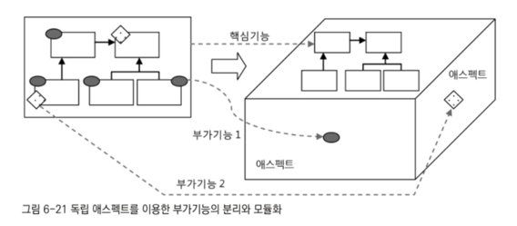
  - 왼쪽은 부가기능을 분리하기 전
    - 핵심 기능은 깔끔한 설계를 통해 모듈화
    - 객체지향적인 장점 살릴 수 있음 
    - 부가기능이 핵심 기능의 모듈에 침투하며 지저분해짐 
    - 로직 파악, 수정, 테스트하기 불편함 
    - 부가기능 코드는 여기저기에 흩어져 나타나고 중복됨 
  - 오른쪽은 부가기능을 독립적인 모듈인 애스팩트로 구분한 것
    - 2차원 평면 구조에서는 어떤 설계 기법으로도 해결 불가
    - 3차원 다면체 구조로 성격이 다른 부가기능은 다른 면에 존재
    - 핵심 기능은 순수하게 기능을 담은 코드로만 존재하고 독립적으로 살펴볼 수 있음
- 부가기능은 핵심 기능과 같이 동작하지만 설계와 개발은 다른 특성을 띤 애스팩트들을 독립적인 관점으로 작성 가능 
- 애스팩트 지향 프로그래밍
  - Aspect Oriented Programming/AOP
  - 애플리케이션의 핵심적인 기능에서 부가적인 기능을 분리해 애스팩트라는 모듈로 만들어 설계하고 개발하는 방법
  - AOP는 OOP를 돕는 보조 기술이지 OOP를 완전 대체하는 새로운 개념은 아님 
  - 애스팩트를 분리함으로써 핵심 기능을 설계하고 구현할 때 객체지향적인 가치를 지킬 수 있도록 도와주는 것
- AOP는 애플리케이션을 다양한 측면에서 독립적으로 모델링, 설계, 개발할 수 있도록 만들어줌
  - 애플리케이션을 다양한 관점에서 바라보며 개발할 수 있게 도와줌 
  - 애플리케이션을 사용자 관리라는 핵심 로직 대신 트랜잭션 경계설정이라는 관점에서 바라보고 그 부분에 집중해 설계하고 개발할 수 있게 되는 것 
  - 트랜잭션 기술의 적용에만 주목하고 싶다? -> TransactionAdvice에 집중

----

# 6.5.5. AOP 적용 기술 
## 프록시를 이용한 AOP
- 스프링은 여러 기술을 조합해 AOP를 지원하는데 그중 핵심은 프록시
  - 프록시로 만들어 DI로 연결된 빈 사이에 적용해 타깃의 메소드 호출 과정에 참여해 부가기능을 제공
  - 스프링 AOP는 자바의 기본 JDK나 스프링 컨테이너 외에는 특별한 기술이나 환경 요구하지 않음 
  - 스프링 컨테이너인 애플리케이션 컨텍스트는 특별한 환경이나 JVM 설정 등을 요구하지 않음 
  - AOP도 마찬가지
- 스프링 AOP의 부가기능을 담은 어드바이스가 적용되는 대상은 오브젝트의 메소드 
  - 프록시 방식을 사용했기 때문에 메소드 호출 과정에 참여해 부가기능을 제공
  - 어드바이스가 구현하는 MethodInterceptor 인터페이스는 다이나믹 프록시의 InvocationHandler와 마찬가지로 프록시로부터 메소드 요청 정보를 전달받아 타깃 오브젝트의 메소드 호출
  - 타깃의 메소드를 호출하는 전후에 다양한 부가기능 제공 가능 
## 바이트 코드 생성과 조작을 통한 AOP
- AspectJ는 프록시를 사용하지 않는 대표적인 AOP
- AspectJ는 프록시처럼 간접적인 방법이 아니라 타깃 오브젝트를 고쳐 부가기능을 직접 넣어주는 방식을 사용
  - 컴파일된 타깃의 클래스 파일 자체를 수정하거나 클래스가 JVM에 로딩되는 시점을 가로채 바이트 코드를 조작하는 복잡한 방법 사용
  - 소스코드를 수정하지 않기 때문에 개발자는 비즈니스 로직에 충실한 코드를 만들어낼 수 있음
### 굳이 왜 이 방법을 사용하나?
1. 타깃 오브젝트를 직접 수정하면 스프링과 같은 DI 컨테이너의 도움을 받아 자동 프록시 생성 방식을 사용하지 않아도 AOP 적용 가능
  - 스프링과 같은 컨테이너가 사용되지 않는 환경에서도 쉽게 AOP의 적용 가능
2. 프록시 방식보다 훨씬 강력하고 유연하게 AOP 가능
  - 프록시를 사용하면 부가기능을 부여할 대상은 클라이언트가 호출할 때 사용하는 메소드로 제한
  - 바이트 코드를 조작하면 오브젝트 생성, 필드 값의 조회와 조작, 스태틱 초기화 등 다양한 작업에 부가기능 부여 가능 
### 대부분은 프록시 방식으로 메소두 호출 시점에 부여하는 것으로 충분
- AspectJ는 번거로운 작업 필요
- 일반적인 AOP 적용에는 프록시 방식으로 충분
- 특별한 요구사항이 생겨 스프링의 프록시 AOP 수준을 넘어서는 기능이 필요하면 그 때 사용 

----

# 6.5.6. AOP의 용어
- 타깃
  - 부가기능을 부여할 대상
  - 핵심 기능을 담은 클래스일 수도 있지만 경우에 따라 다른 부가기능을 제공하는 프록시 오브젝트 일 수도 있음
- 어드바이스
  - 타깃에게 제공할 부가기능을 담은 모듈 
  - 오브젝트로 정의하기도 하지만 메소드 레벨에서 정의할 수도 있음 
  - 메소드 호출 과정에 전반적으로 참여하는 것도 있지만 예외가 발생했을 때만 동작하는 어드바이스처럼 메소드 호출 과정의 일부에서만 동작하는 어드바이스도 있음
- 조인 포인트
  - 어드바이스가 적용될 수 있는 위치
  - 스프링의 프록시 AOP에서 조인 포인트는 메소드의 실행 단계 뿐
  - 타깃 오브젝트가 구현한 인터페이스의 모든 메소드는 조인 포인트가 됨 
- 포인트컷
  - 어드바이스를 적용할 조인 포인트를 선별하는 작업 또는 그 기능을 정의한 모듈 
  - 스프링 AOP의 조인 포인트는 메소드의 실행이므로 스프링의 포인트컷은 메소드를 선정하는 기능을 가짐 
  - 포인트컷 표현식은 메소드의 실행이라는 의미인 execution으로 시작
  - 메소드의 시그니처를 비교하는 방법을 주로 이용
  - 메소드는 클래스 안에 존재하기 때문에 메소드 선정이란 결국 클래스 선정 -> 메소드 선정 과정
- 프록시
  - 클라이언트와 타깃 사이에 투명하게 존재하며 부가기능을 제공하는 오브젝트
  - DI를 통해 타깃 대신 클라이언트에게 주입
  - 클라이언트의 메소드 호출을 대신 받아 타깃에 위임
  - 그 과정에서 부가기능을 부여
  - 스프링은 프록시를 이용해 AOP를 지원
- 어드바이저
  - 포인트컷과 어드바이스를 하니씩 갖는 오브젝트
  - 어떤 부가기능을 어디에 전달할 것인가를 알고 있는 AOP의 가장 기본 모듈 
  - 스프링은 자동 프록시 생성기가 어드바이저를 AOP 작업의 정보로 활용
  - 일반적인 AOP에서는 사용하지 않고 스프링 AOP에서만 사용
- 애스팩트
  - AOP의 기본 모듈 
  - 한 개 또는 그 이상의 포인트컷과 어드바이스의 조합으로 만들어짐
  - 보통 싱글톤 형태의 오브젝트로 존재
  - 클래스와 같은 모듈 정의와 오브젝트와 같은 실체의 구분이 특별히 없음 

----

# 6.5.7. AOP 네임스페이스
- 어드바이저, 포인트컷, 자동 프록시 생성기 같은 빈들은 애플리케이션의 로직을 담는 UserDao나 UserService 빈과는 성격이 다름 
  - 애플리케이션의 일부 기능을 담고 있는 것도 아니고 DI를 통해 애플리케이션 빈에서 사용되는 것도 아님 
  - 스프링 컨테이너에 의해 자동으로 인식되어 특별한 작업을 위해 사용됨
- 스프링의 프록시 방식 AOP 적용을 위해 등록해야 하는 네 가지 빈
  - 자동 프록시 생성기
    - 스프링의 DefaultAdvisorAutoProxyCreator 클래스를 빈으로 등록 
    - 다른 빈을 DI 하지도 않고 자신도 DI되지 않으며 독립적으로 존재
    - 애플리케이션 컨텍스트가 빈 오브젝트를 생성하는 과정에 빈 후처리기로 참여
    - 빈으로 등록된 어드바이저를 이용해 프록시를 자동으로 생성하는 기능을 담당 
  - 어드바이스
    - 부가기능을 구현할 클래스를 빈으로 등록
    - TransactionAdvice는 AOP 관련 빈 중 유일하게 직접 구현한 클래스를 사용
  - 포인트컷
    - 스프링의 AspectJExpressionPointcut을 빈으로 등록
    - expression 프로퍼티에 포인트컷 표현식 넣어줌
    - 코드 작성 필요 x
  - 어드바이저
    - 스프링의 DefaultPointcutAdvisor 클래스를 빈으로 등록해 사용 
    - 어드바이스와 포인트컷을 프로퍼티로 참조
    - 자동 프록시 생성기에 의해 자동 검색되어 사용됨
  - 부가기능을 담은 코드로 만든 어드바이스를 제외한 나머지 세 가지는 모두 스프링이 직접 제공하는 클래스를 빈으로 등록하고 프로퍼티 설정만 해준 것
  - 세 가지 클래스를 이용해 선언하는 빈은 AOP를 적용하면 반복적으로 등장하게 도미 
## AOP 네임스페이스
- 스프링 AOP에서 기계적으로 반복해 적용하는 빈들을 간편하게 등록 가능
  - 스프링은 AOP와 관련된 태그를 정의해둔 aop 스키마 제공
  - aop 스키마에 정의된 태그는 별도의 네임 스페이스를 지정해 디폴트 네임 스페이스의 <bean> 태그와 구분해 사용 가능
- aop 스키마에 정의된 태그를 사용하려면 설정 파일에 aop 네임 스페이스 선언을 설정 파일에 추가해줘야 함 
  - 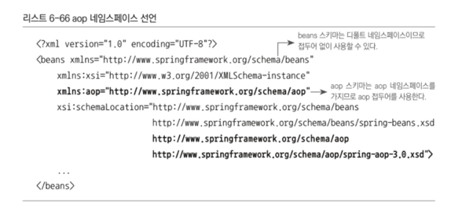
  - aop 네임 스페이스를 이용해 기존 AOP 관련 빈 설정 변경
    - 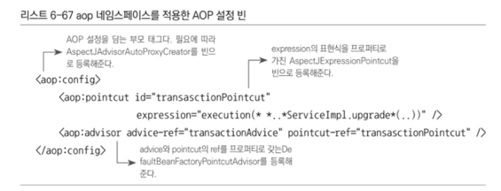
    - <aop:config>, <aop:pointcut>, <aop:advisor> 세 가지 태그를 정의해두면 그에 따라 세 개의 빈이 자동 등록
    - 특별한 기능을 가진 빈들은 별도의 스키마에 저으이된 전용 태그를 사용해 정의해주면 편리 
    - 애플리케이션을 구성하는 컴포넌트 빈과 컨테이너에 의해 사용되는 기반 기능을 지원하는 빈은 구분이 되는 것이 좋음 
## 어드바이저 내장 포인트컷
- AspectJ 포인트컷 표현식을 활용하는 포인트컷은 스트링으로 된 표현식을 담은 expression 프로퍼티 하나만 설정해 주면 사용 가능 
  - 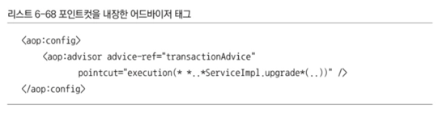

----

# 6.6. 트랜잭션 속성
- 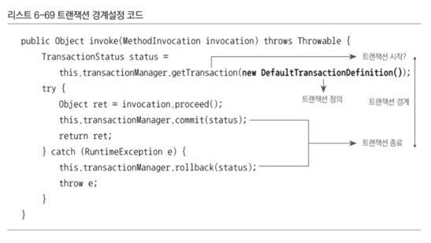
  - 트랜잭션의 경계는 트랜잭션 매니저에게 트랜잭션을 가져오는 것과 commit(), rollback() 중 하나를 호출하는 것으로 설정됨

----

# 6.6.1. 트랜잭션 정의
- 트랜잭션이라고 항상 같은 방식으로 동작하는 것은 아님 
  - 트랜잭션의 기본 개념인 더 이상 쪼갤 수 없는 최소 단위의 작업이라는 개념은 항상 유효
  - 따라서 트랜잭션 경계 안에서 진행된 작업은 commit()을 통해 모두 성공하던지 rollback()을 통해 모두 취소되어야 함 
  - 하지만 이 방식 외에도 트랜잭션 동작 방식을 제어할 수 있는 조건이 있음
## 트랜잭션 전파
- Transaction Propagation
- 트랜잭션 경계에서 이미 진행 중인 트랜잭션이 있을 때 또는 없을 때 어떻게 동작할 것인가를 결정하는 방식
- 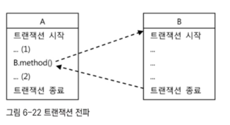
  - 두 코드는 각 도립적인 트랜잭션 경계를 가짐
  - A 트랜잭션이 시작되고 끝나지 않은 상태에서 B를 호출했다면 B의 코드는 어떤 트랜잭션 안에서 동작해야 할까
  - A에서 트랜잭션이 시작되어 진행 중이라면 B의 코드는 새로운 트랜잭션을 만들지 않고 A에서 시작한 트랜잭션에 참여 가능
    - B를 호출한 작업까지 마치고 (2)의 코드를 진행하던 중 예외가 발생한다면
    - A와 B의 코드에서 진행했던 모든 DB 작업 전부 취소 
    - A와 B가 하나의 트랜잭션으로 묶여있기 때문 
  - A의 트랜잭션과 무관하게 B의 트랜잭션을 따로 만들 수도 있음 
    - 이 경우 B의 트랜잭션 경게를 빠져나오는 순간 B의 트랜잭션은 독자적으로 커밋 또는 롤백
    - A 트랜잭션은 그에 영향을 받지 않고 진행될 것
    - A의 (2)에서 예외가 발생해도 B에서 이미 종료된 트랜잭션 결과에는 영향을 주지 않음
- 이렇듯 트랜잭션의 전파 속성에는 여러가지 존재
### 1. PROPAGATION_REQUIRED
- 가장 많이 사용되는 트랜잭션 전파 속성
  - 진행 중인 트랜잭션이 없으면 새로 시작, 있으면 참여
  - 다양한 방식으로 결합해 하나의 트랜잭션으로 구성하기 쉬움 
  - A와 B 모두 해당 속성으로 선언되어 있다면 A, B, A->B, B->A와 같은 네 가지 조합된 트랜잭션이 모두 가능
- DefaultTransactionDefinition의 트랜잭션 전파 속성은 PROPAGATION_REQUIRED
### 2. PROPAGATION_REQUIRES_NEW
- 항상 새로운 트랜잭션을 시작 
- 독립적인 트랜잭션이 보장되어야 하는 코드에 적용 가능 
### 3. PROPAGATION_NOT_SUPPORTED
- 트랜잭션 없이 동작 가능하도록 함 
  - 진행중인 트랜잭션이 있어도 무시
  - 무시할거면 왜 트랜잭션 경계를 설정함?
- 트랜잭션 경계설정은 보통 AOP를 이용해 한 번에 많은 메소드에 동시에 적용하는 방법을 사용
  - 그 중 특별한 메소드만 트랜잭션 적용에서 제외하려면?
  - 포인트컷으로 해도 되지만 복잡해질 수 있음
  - 차라리 모든 메소드에 트랜잭션 AOP가 적용되게 하고 특정 메소드의 트랜잭션 전파 속성만 PROPAGATION_NOT_SUPPORTED로 설정해 트랜잭션 없이 동작하게 하는 것
### 이 외에도 다양한 트랜잭션 전파 속성 사용 가능
- 트랜잭션 매니저를 통해 트랜잭션을 시작하려 할 때 getTransaction() 메소드를 사용하는 이유는 트랜잭션 전파 속성이 있기 때문
- getTransaction() 메소드는 항상 트랜잭션을 새로 시작하는 것이 아님
- 트랜잭션 전파 속성과 현재 진행 중인 트랜잭션이 존재하는지 여부에 따라 새로운 트랜잭션을 시작할 수도, 그냥 참여만 할 수도 있음 
- 진행 중인 트랜잭션에 참여하는 경우는 트랜잭션 경계의 끝에서 트랜잭션을 커밋시키지도 않음 
- 최초로 트랜잭션을 시작한 경계까지 정상적으로 진행되어야 비로소 커밋 가능
## 격리수준 
- 모든 DB 트랜잭션은 격리수준Isolation Level을 갖고 있어야 함 
- 서버 환경에서는 여러 개의 트랜잭션이 동시에 진행될 수 있음
- 모든 트랜잭션이 순차적으로 진행되어 독립적이면 좋겠지만 그러면 성능이 크게 떨어짐 
- 적절하게 격리수준을 조정해 가능한 많은 트랜잭션을 동시에 진행시키며 문제가 발생하지 않도록 제어해야 함 
- 격리수준은 기본적으로 DB에 설정
- JDBC 드라이버나 DataSource 등에서 재설정 가능
- 필요하다면 트랜잭션 단위로 격리수준 조정 가능 
- DefaultTransactionDefinition에 설정된 격리수준은 ISOLATION_DEFAULT
  - DataSource에 설정되어 있는 디폴트 격리수준을 그대로 따른다는 뜼 
- 기본적으로는 디폴트 격리수준을 따르는게 좋지만 특별한 작업을 수행하는 메소드의 경우 독자적인 격리수준을 지정할 필요가 있음 
## 제한시간
- 트랜잭션을 수행하는 제한시간 설정 가능
- DefaultTransactionDefinition의 기본 설정은 제한시간이 없는 것
- 제한시간은 트랜잭션을 직접 시작할 수 있는 PROPAGATION_REQUIRED나 PROPAGATION_REQUIRES_NEW와 함께 사용해야 의미가 있음
## 읽기전용
- 트랜잭션 내에서 데이터를 조작하는 시도를 막아줄 수 있음
- 데이터 엑세스 기술에 따라 성능 향상 가능 
- TransactionDefinition 타입 오브젝트를 사용하면 네 가지 속성을 이용해 트랜잭션의 동작 방식 제어 가능 
- 트랜잭션 정의를 수정하려면
  - TransactionDefinition 오브젝트를 생성하고 사용하는 코드는 트랜잭션 경계설정 기능을 가진 TransactionAdvice
  - 디폴트 속성을 갖고 있는 DefaultTransactionDefinition을 사용하는 대신 외부에서 정의된 TransactionDefinition 오브젝트를 DI받아 사용하도록 만들면 됨 
  - TransactionDefinition 타입의 빈을 정의해두면 프로퍼티를 통해 원하는 속성 지정 가능 
  - 하지만 이 방법으로는 트랜잭션 속성을 변경하면 TransactionAdvice를 사용하는 모든 트랜잭션의 속성이 한꺼번에 바뀜 

----

# 6.6.2. 트랜잭션 인터셉터와 트랜잭션 속성 
- 메소드별로 다른 트랜잭션 정의를 적용하려면 어드바이스의 기능을 확장해야 함 
- 초기에 TransactionHandler에서 메소드 이름을 이용해 트랜잭션 적용 여부를 판단했던 것과 비슷한 방식을 사용
- 메소드 이름 패턴에 따라 다른 트랜잭션 정의가 적용되도록 만드는 것
## TransactionInterceptor
- 기존 TransactionAdvice를 다시 설계할 필요는 없음
- 이미 스프링에 트랜잭션 경계설정 어드바이스로 사용할 수 있도록 만들어진 TransactionInterceptor가 존재하기 때문
- TransactionInterceptor 어드바이스의 동작 방식은 기존 TransactionAdvice와 다르지 않음 
  - 트랜잭션 정의를 메소드 이름 패턴을 이용해 다르게 지정할 수 있는 방법을 추가로 제공할 뿐 
- PlatformTransactionManager와 Properties 타입의 두 가지 프로퍼티 가짐
- Properties 타입의 두 번째 프로퍼티 이름은 transactionAttribue
  - 트랜잭션 속성을 정의한 프로퍼티
  - 트랜잭션 속성은 TransactionDefinition의 네 가지 기본 항목에 rollbackOn()이라는 메소드를 하나 더 갖는 TransactionAttribute 인터페이스로 정의됨 
  - rollbackOn() 메소드는 어떤 예외가 발생하면 롤백을 할 것인가를 결정하는 메소드
  - TransactionAttribute를 이용해 트랜잭션 부가기능의 동작방식을 모두 제어 가능 
- 
  - 트랜잭션 부가기능의 동작 방식을 변경할 수 있는 곳이 두 군데 존재
- TransactionAdvice는 RuntimeException이 발생할 경우에만 트랜잭션을 롤백
  - 런타임 예외가 아닌 경우 트랜잭션이 제대로 처리되지 않고 메소드를 빠져나가게 되어 있음 
  - 체크 예외를 던지는 타깃에 적용된다면 문제가 될 수 있음 
  - 그렇다고 모든 종류의 예외에 대해 트랜잭션을 롤백시키도록 하면 안 됨 
    - 비즈니스 로직상의 예외 경우를 나타내기 위해 타깃 오브젝트가 체크 예외를 던지는 경우에 DB 트랜잭션은 커밋시켜야 하기 때문 
    - 일부 체크 예외는 정상적인 작업 흐름 안에서 사용될 수도 있음
- TransactionInterceptor에는 기본적으로 두 가지 종류의 예외 처리 방식이 있음
  - 런타임 예외가 발생하면 트랜잭션은 롤백
  - 타깃 메소드가 런타임 예외가 아닌 체크 예외를 던지면 예외 상황으로 해석하지 않고 의미가 있는 리턴 방식의 한 가지로 인식해 트랜잭션을 커밋
- TransactionInterceptor의 예외 처리 기본 원칙을 따르지 않는 경우가 존재할 수 있음
  - TransactionAttribute는 rollbackOn()이라는 속성을 두어 기본 원칙고 다른 예외 처리가 가능하게 해줌 
  - 특정 체크 예외의 경우는 트랜잭션을 롤백시키고 특정 런타임 예외에 대해서는 트랜잭션을 커밋시킬 수도 있음 
- TransactionInterceptor는 TransactionAttribute를 Properties라는 일종의 맵 타입 오브젝트로 전달받음
  - 메소드 패턴에 따라 각기 다른 트랜잭션 속성을 부여할 수 있게 하기 위해 컬렉션을 사용
### 메소드 이름 패턴을 이용한 트랜잭션 속성 지정
- Properties 타입의 transactionAttributes 프로퍼티는 메소드 패턴과 트랜잭션 속성을 키와 값으로 갖는 컬렉션
  - 트랜잭션 속성은 문자열로 정의
  - 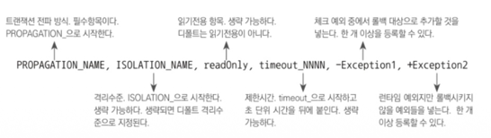
  - 트랜잭션 전파 항목만 필수, 나머지는 생략 가능 
  - 생략하면 모두 DefaultTransactionDefinition에 설정된 디폴트 속성이 부여됨 
  - 모든 항목이 구분 가능하기 때문에 순서 상관 x
  - + 또는 -로 시작하는 것은 기본 원칙을 따르지 않는 예외를 정해주는 것
  - 모든 런타임 예외는 롤백되어야 하지만 +XXXRuntimeException이라고 해주면 런타임 예외라도 커밋하게 만들 수 있음 
  - 반대로 체크 예외는 모두 커밋하는 것이 기본이지만 -를 붙여서 넣어주면 트랜잭션은 롤백 대상
- 속성을 하나의 문자열로 표현하게 만든 이유
  - 트랜잭션 속성을 메소드 패턴에 따라 여러 개를 지정해줘야 함 
  - 일일이 중첩된 태그와 프로퍼티로 설정하게 만들면 번거로움
  - 대부분은 디폴트를 사용해도 충분하므로 생략 가능함 
- 
  - 트랜잭션 속성을 이용해 정의한 TransactionInterceptor 타입 빈의 예
  - 세 가지 메소드 이름 패턴에 대한 트랜잭션 속성이 정의되어 있음
    1. get으로 시작하는 모든 메소드
      - PROPAGATION_REQUIRED
      - 읽기 전용
      - 제한시간은 30초
      - 보통 읽기전용 메소드는 get 또는 find같은 일정한 이름으로 시작 
        - 명명규칙을 잘 정해두면 조회용 메소드의 트랜잭션은 읽기 전용으로 설정해 성능 향상 가능 
      - 읽기전용이 아닌 트랜잭션 속성을 가진 메소드에서 get으로 시작하는 메소드를 호출한다면?
        - PROPAGATION_REQUIRED 속성이기 때문에 다른 트랜잭션이 시작되어 있으면 참여
        - 이미 DB 수정 작업이 진행되는데 읽기전용이 적용된 작업이 이루어져도 괜찮을까? -> 괜찮음
        - 트랜잭션 속성 중 readOnly나 timeout 등은 트랜잭션이 처음 시작될 때 아니면 적용 x
    2. upgrade로 시작하는 메소드
      - PROPAGATION_REQUIRED_NEW
      - 격리수준은 최고 수준인 ISOLATION_SERIALIZABLE
    3. +만 사용해 두 가지 조건에 해당하지 않는 나머지 모든 메소드에 사용될 소것ㅇ
      - 필수 항목인 PROPAGATION_REQUIRED만 지정
      - 나머지는 디폴트 설정을 따름
- 메소드 이름이 하나 이상의 패턴과 일치하는 경우
  - 가장 정확히 일치하는 것이 적용
## tx 네임스페이스를 이용한 설정 방법
- TransactionInterceptor 타입의 어드바이스 빈과 TransactionAttribute 타입의 속성 정보도 tx 스키마의 전용 태그를 이용해 정의 가능 
  - 트랜잭션 어드바이스도 포인트컷이나 어드바이저만큼 자주 사용
  - 애플리케이션의 컴포넌트가 아닌 컨테이너가 사용하는 기반기술 설정의 한 가지이기 때문 
- 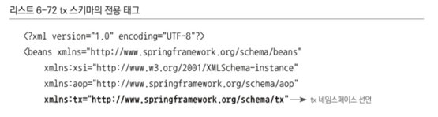
- 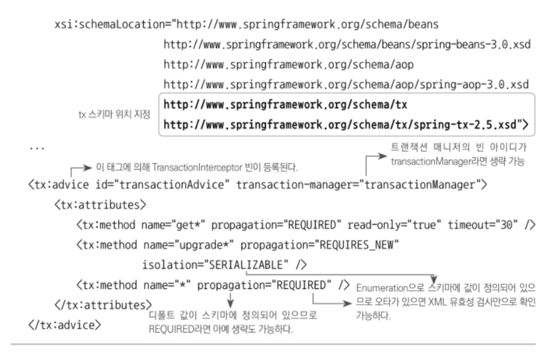

----

# 6.6.3. 포인트컷과 트랜잭션 속성의 적용 전략
- 포인트컷 표현식과 트랜잭션 속성을 정의할 때 따르면 좋은 몇가지 전략
## 트랜잭션 포인트컷 표현식은 타입 패턴이나 빈 이름을 이용
- 일반적으로 트랜잭션을 적용할 타깃 클래스의 메소드는 모두 트랜잭션 적용 후보가 되는 것이 바람직
  - 하지만 비즈니스 로직을 담고 있는 클래스라면 메소드 단위까지 세밀하게 포인트컷을 정의해줄 필요는 없음
- UserService의 add() 메소드도 트랜잭션 적용 대상이어야 함 
  - 트랜잭션 전파 방식을 생각해보면 add()는 다른 트랜잭션에 참여할 가능성이 높음
  - UserDao.add()를 호출해 사용자 정보를 DB에 추가하는 것 외에도 DB의 정보를 다루는 작업이 추가될 가능성 높음
  - 따라서 add() 메소드는 트랜잭션 안에서 동작하도록 정의하는게 바람직
- 쓰기 작업이 없는 단순한 조회 작업만 하는 메소드에도 모두 트랜잭션을 적용하는게 좋음 
  - 조회의 경우 읽기전용으로 트랜잭션 속성을 설정해두면 금나큼 성능의 향상을 가져올 수 있음 
  - 복잡한 조회의 경우에는 제한시간을 지정해줄 수 있음
  - 격리수준에 따라 반드시 트랜잭션 안에서 진행해야 할 필요가 발생하기도 함 
- 트랜잭션용 포인트컷 표현식에는 메소드나 파라미터, 예외에 대한 패턴을 정의하지 않는 것이 바람직
  - 트랜잭션의 경계로 삼을 클래스들이 선정됐다면 클래스들이 모여 있는 패키지를 통째로 선택하거나 클래스 이름에서 일정한 패턴을 찾아 표현식으로 만들면 됨 
  - 관례적으로 비즈니스 로직을 담당하는 클래스 이름은 Service 또는 ServiceImpl로 끝남
    - execution(**..*ServiceImpl.*(..))과 같이 포인트컷을 정의하면 됨
  - 가능하다면 클래스보다는 인터페이스 타입을 기준으로 타입 패턴을 적용하는 것이 좋음 
  - 인터페이스는 클래스에 비해 변경 빈도가 적고 일정한 패턴을 유지하기 쉽기 때문 
- 메소드의 시그니처를 이용한 execution() 방식의 포인트컷 표현식 대신 스프링의 빈 이름을 이용하는 bean() 표현식 사용 방법도 고려해 볼 만 함 
  - bean() 표현식은 빈 이름을 기준으로 선정
  - 클래스나 인터페이스 이름에 일정한 규칙을 만들기가 어려운 경우에 유용
  - 포인트컷 표현식 자체가 간단해 읽기 편하다는 장점도 있음 
  - 빈의 아이디가 Service로 끝나는 모든 빈에 대해 트랜잭션을 정의하고 싶다면 포인트컷 표현식을 bean(*Service)라 하면 됨 
  - 이름이 비슷한 다른 빈이 있는 경우 주의
## 공통된 메소드 이름 규칙을 통해 최소한의 트랜잭션 어드바이스와 속성을 정의
- 하나의 애플리케이션에서 사용할 트랜잭션 속성의 종류는 그다지 다양하지 않음 
  - 너무 다양하게 속성을 부여하면 관리만 힘들어짐
  - 기준이 되는 몇 가지 트랜잭션 속성을 정의하고 그에 따라 적절한 메소드 명명 규칙을 만들어두면 하나의 어드바이스마으로 애플리케이션의 모든 서비스 빈에 트랜잭션 속성 지정 가능
- 트랜잭션 속성의 적용 패턴이 일반적인 경우와 크게 다른 경우 트랜잭션 어드바이스와 포인트컷을 새롭게 추가해야 함 
- 가장 간단한 트랜잭션 속성 부여 방법은 다음과 같이 모든 메소드에 대해 디폴트 속성을 지정하는 것 
  - 일단 트랜잭션 속성의 종류와 메시지 패턴이 결정되지 않았으면 가장 단순한 디폴트 속성으로부터 출발
  - 개발이 진행됨에 따라 단계적으로 속성 추가
  - 
- 디폴트 속성 일괄 부여에서 더 나아가면 간단한 메소드 이름의 패턴 적용 가능 
  - 조회용 메소드에 대해 읽기전용 속성을 주는 것 
  - get 또는 find와 같이 조회전용 메소드의 접두어를 정해두는 것이 좋음 
  - 두 가지를 동시에 사용도 가능 
  - 읽기전용 속성을 주고 나면 get으로 시작하는 메소드에 얼마나 많은 데이터 조작 기능을 넣었는지 쉽게 확인 가능 
  - 트랜잭션의 읽기전용 속성이 부여되었는데 데이터 조작이 일어나면 예외가 발생하기 때문 
  - 이런 경우 의미를 좀 더 잘 드러내는 이름으로 변경하도록 유도할 필요가 있음
  - 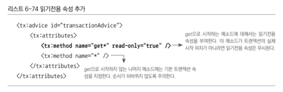
- 트랜잭션 적용 대상 클래스의 메소드는 일정한 명명 규칙을 따르게 해야함
- 일반화하기에는 적당하지 않은 특별한 트랜잭션 속성이 필요한 타깃 오브젝트에 대해서는 별도의 어드바이스와 포인트컷 표현식을 사용하는 편이 좋음 
- 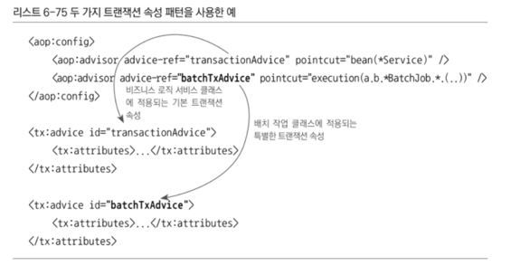
  - 두 개의 포인트컷과 어드바이스를 적용한 예
  - 비즈니스 로직을 정의한 서비스 빈에는 기본적인 메소드 이름 패턴을 따르는 트랜잭션 속성을 지정해 둠 
  - 반면 트랜잭션의 성격이 많이 다른 배치 작업용 클래스를 위해서는 트랜잭션 어드바이스를 별도로 정의해 독자적인 트랜잭션 속성을 지정
## 프록시 방식 AOP는 같은 타깃 오브젝트 내의 메소드를 호출할 때는 적용되지 않음 
- 이건 주의사항
- 프록시 방식의 AOP에서는 프록시를 통한 부가기능의 적용은 클라이언트로부터 호출이 일어날 때만 가능 
  - 클라이언트란 이넡페이스를 통해 타깃 오브젝트를 사용하는 다른 모든 오브젝트
  - 반대로 타깃 오브젝트가 자기 자신의 메소드를 호출할 대는 프록시를 통한 부가기능의 적용이 일어나지 않음
- 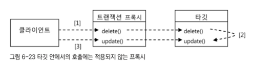
  - 트랜잭션 프록시가 타깃에 적용되어 있는 경우의 메소드 호출 과정
  - delete()와 update()는 모두 트랜잭션 적용 대상인 메소드
  - 1,3처럼 클라이언트로부터 메소드가 호출되면 트랜잭션 프록시를 통해 타깃 메소드로 호출이 전달되기 때문에 트랜잭션 경계설정 부가기능 부여
  - 2의 경우는 다름
    - 타깃 오브젝트 내로 들어와 타깃 오브젝트의 다른 메소드를 호출하는 경우에는 프록시를 거치지 않고 직접 타깃의 메소드가 호출됨
    - 1 클라이언트를 통해 호출된 delete() 메소드에는 트랜잭션 속성이 적용
    - 2를 통해 update() 메소드가 호출될 때는 update() 메소드에 지정된 트랜잭션 속성이 반영되지 않음 
  - update() 메소드에 대해 트랜잭션 전파 속성을 REQUIRES_NEW로 해 두어도
    - 같은 타깃 오브젝트에 있는 delete() 메소드를 통해 update()가 호출되면 트랜잭션 전파 속성이 적용되지 않음 
    - REQUIRES_NEW는 무시되고 프록시의 delete() 메소드에서 시작한 트랜잭션에 단순 참여
    - 트랜잭션이 아예 적용되지 않는 타깃의 다른 메소드에서 update()가 호출된다면 트랜잭션이 없는 채로 update() 메소드가 실행됨
- 같은 타깃 오브젝트 안에서 메소드 호출이 일어나는 경우에는 프록시 AOP를 통해 부여해준 부가기능이 적용되지 않는다는 점을 주의해야 함
  - 같은 오브젝트 안에서의 호출은 새로운 트랜잭션 속성을 부여하지 못한다는 사실을 의식하고 개발해야 함
  - 복잡한 트랜잭션 전파 속성을 적용하는 경우라면 기대와 다르게 트랜잭션 속성이 무시될 수 있음
- 타깃 안에서의 호출 시 프록시 미적용 문제 해결 방법
  1. 스프링 API를 이용해 프록시 오브젝트에 대한 레퍼런스를 가져온 뒤 같은 오브젝트의 메소드 호출도 프록시를 이용하도록 강제
    - 하지만 순수 비즈니스 로직만 남겨두었는데 스프링 API와 프록시 호출 코드가 등장하는 것은 바람직하지 않음
  2. AspectJ와 같은 타깃의 바이트 코드를 직접 조작하는 방식의 AOP 기술을 적용하는 것
    - 스프링은 프록시 기반의 AOP를 기본적으로 사용하지만 필요에 따라 AspectJ 방식으로 변경 가능 
    - 대부분의 설정은 그대로 두고 간단한 옵션을 바꿔 AspectJ 방식으로 트랜잭션 AOP가 적용되게 할 수 있음
    - 하지만 불편하니 꼭 필요한 때에만 사용

----

# 6.6.4. 트랜잭션 속성 적용 
- 트랜잭션 속성과 그에 따른 트랜잭션 전략을 UserService에 적용
## 트랜잭션 경계설정의 일원화
- 트랜잭션 경계설정의 부가기능을 여러 계층에 각기 다르게 적용하는 것은 좋지 않음 
  - 일반적으로 특정 계층의 경계를 트랜잭션 경계와 일치시키는 것이 바람직 
  - 비즈니스 로직을 담는 서비스 계층 오브젝트의 메소드가 트랜잭션 경계를 부여하기에 가장 적절한 대상
- 서비스 계층을 트랜잭션이 시작되고 종료되는 경계로 정했다면
  - 테스트 같은 특별한 이유가 아니고서는 타 계층이나 모듈에서 DAO에 직접 접근하는 것은 차단해야 함
  - 트랜잭션은 보통 서비스 계층의 메소드 조합을 통해 만들얼지기 때문에 DAO가 제공하는 주요 기능은 서비스 계층에 위임 메소드를 만들어둘 필요가 있음
  - 가능하면 다른 모듈의 DAO에 접근할 때는 서비스 게층을 거치도록 하는게 바람직
  - 그래야 부가 로직을 적용할 수 있고 트랜잭션 속성도 제어할 수 있기 때문 
- 아키텍처를 단순하게 가져가면 서비스 계층과 DAO가 통합될 수도 있음
  - 비즈니스 로직이 거의 없고 단순 DB 입출력과 검색 수준의 조회가 전부라면 서비스 게층을 없애고 DAO를 트랜잭션 경계로 만드는 것
  - 하지만 비즈니스 로직을 독자적으로 두고 테스트하려면 서비스 계층을 만들어 사용해야 함 
- UserDao 인터페이스에 정의된 6개의 메소드 중 이미 서비스 계층에 부가적인 로직을 담아 추가한 add()를 제외한 나머지 5개가 UserService에 새로 추가할 후보 메소드
  - 이 중 단순히 레코드 개수만을 리턴하는 getCount()를 제외하면 나머지는 독자적인 트랜잭션을 가지고 사용될 가능성이 높음 
  - 4개의 메소드를 UserService에 추가
    - 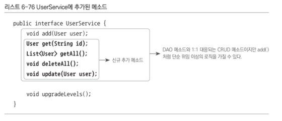
  - UserServiceImpl 클래스에 추가된 메소드 구현 코드를 넣어줌
    - 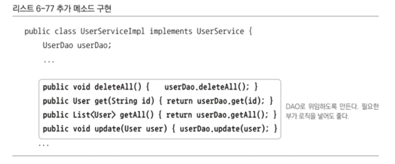
  - 이제 모든 User 관련 데이터 조작은 UserService라는 트랜잭션 경계를 통해 진행할 경우 모두 트랜잭션 적용 가능
## 서비스 빈에 적용되는 포인트컷 표현식 등록
- upgradeLevels()에만 트랜잭션이 적용되게 했던 기존 포인트컷 표현식을 모든 비즈니스 로직의 서비스 빈에 적용되도록 수정
  - 표현식은 가장 단순한 빈 이름 패턴을 이용
  - aop 스키마의 태그를 이용해 포인트컷, 어드바이저 등의 설정을 만들어줌
  - 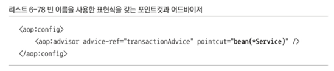
  - 아이디가 Service로 끝나는 모든 빈에 transactionAdvice 빈의 부가기능이 적용될 것
## 트랜잭션 속성을 가진 트랜잭션 어드바이스 등록
- TransactionAdvice 클래스로 정의했던 어드바이스 빈을 스프링의 TransactionInterceptor를 이용하도록 변경
  - 메소드 패턴과 트랜잭션 속성은 가장 보편적인 방법인 get으로 시작하는 메소드는 읽기전용 속성
  - 나머지는 디폴트 트랜잭션 속성을 따르도록 설정
  - 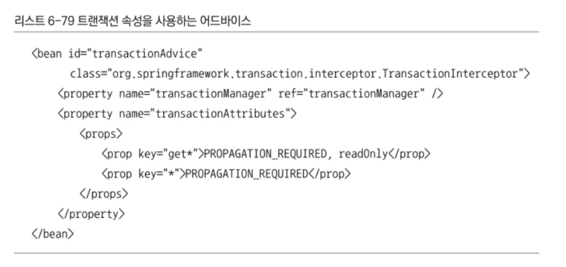
- aop 스키마의 태그를 적용했으니 어드바이스도 tx 스키마에 정의된 태그를 이용하도록 수정
  - 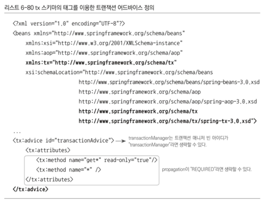
## 트랜잭션 속성 테스트
- 학습 테스트 만들기
- <tx:attributes>로 지정한 트랜잭션 속성을 보면 get으로 시작하는 메소드에는 읽기전용 속성이 true
  - 이 메소드를 경계로 시작되는 트랜잭션에는 쓰기 작업이 허용되지 않음 
- 예외 상황을 만들어야 하기 때문에 트랜잭션 롤백 테스트를 위해 만든 TestUserService 활용 
  - 새로 추가한 getAll() 메소드를 오버라이드해 강제로 DB에 쓰기 작업을 추가
  - getAll() 메소드는 get으로 시작되는 메소드이므로 읽기전용 트랜잭션 속성이 적용된 채로 동작해야 함 
  - 트랜잭션 안에서 쓰기 시도를 하면 그에 따른 예외가 발생할 것
- 정확히 어떤 예외가 발생하는지 모른다면 일단 실행시켜서 예외를 발생시켜 어떤 종류인지 학인하고 테스트 조건에 넣어주면 됨 
  - 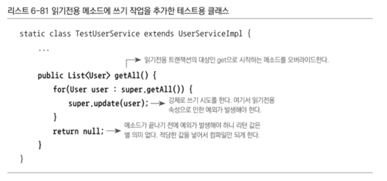
- UserServiceTest에 조작된 getAll()을 호출하는 테스트를 만들기
  - TestUserService를 testUserService 빈으로 등록해뒀으니 DI 받은 testUserService 변수를 사용해 getAll() 메소드 호출
  - 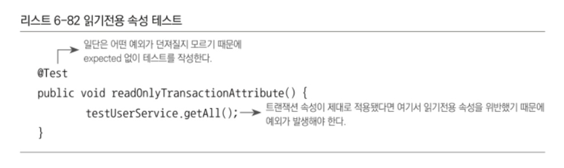
- 
  - 읽기전용으로 되어있기 때문에 DB를 조작한 것이 원인으로 예외가 발생했다는 것을 확인
- 예외 타입은 TransientDataAccessResourceException
  - 스프링의 DataAccessException의 한 종류
  - 일시적인 예외상황을 만났을 때 발생하는 예외
  - 일시적이라는 것은 재시도를 하면 성공할 가능성이 있다는 것
  - getAll()의 userDao.update()에 의해 일어나는 DB 쓰기 작업은 원래 정상적으로 처리되어야 함에도 일시적인 제약조건 때문에 예외를 발생시켰다는 뜻
  - 읽기전용 트랜잭션이 걸려있지 않다면 성공할 것이기 때문
- 예외의 종류를 테스트에 반영
  - 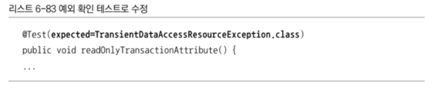