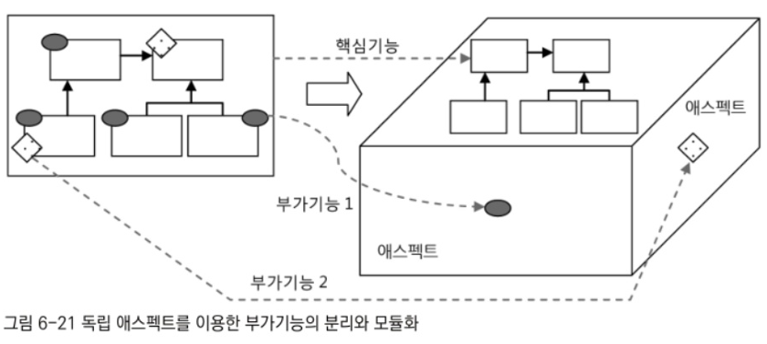

# 6.6.4까지

## 6.5.4 AOP란 무엇인가?

### 트랜잭션 서비스 추상화

트랜잭션 경계설정 코드를 비즈니스 로직을 담은 코드에 넣으면서 맞닥뜨린 첫 번째 문제는 특정 트랜잭션 기술에 종속되는 코드가 돼버린다는 것.

JDBC의 로컬 트랜잭션 방식을 적용한 코드를, JTA를 이용한 글로벌/분산 트랜잭션 방식으로 바꾸려면 모든 트랜잭션 적용 코드를 수정해야 한다는 심각한 문제점이 발견된 것.

→ 트랜잭션을 처리한다는 기본적인 목적은 변하지 않더라도 그것을 어떻게 해야한다는 구체적인 방법이 변한다면, 트랜잭션과는 직접 관련이 없는 코드가 담긴 많은 클래스를 일일이 수정해야한다는 것.

해서 적용했던것은 서비스 추상화 기법.

비즈니스 로직 코드는 트랜잭션을 어떻게 처리해야 한다는 구체적인 방법과 서버환경에서 종속되지 않음.

구체적인 구현 내용을 담은 의존 오브젝트는 런타임 시에 다이내믹하게 연결해준다는 DI를 활용한 전형적인 접근 방법.

트랜잭션 추상화란 결국 인터페이스와 DI를 통해 무엇을 남기고, 그것을 어떻게 하는지를 분리한 것.

### 프록시와 데코레이터 패턴

트랜잭션을 어떻게 다룰 것인가는 추상화를 통해 코드에서 제거했지만, 여전히 비즈니스 로직코드에는 트랜잭션을 적용하고 있다는 사실은 드러나있음.

트랜잭션이라는 부가적인 기능을 어디에 적용할 것인가는 여전히 코드에 노출시켜야 했음.

문제는 트랜잭션은 거의 대부분의 브지느스 로직을 담은 메소드에 필요하다는 점.

게다가 트랜잭션의 경계설정을 담당하는 코드의 특성 때문에 단순한 추상화와 메소드 추출 방법으로는 더이상 제거할 방법이 없었음.

→ DI를 이용해 데코레이터 패턴을 적용하는걸로 해결.

투명한 부가기능 부여를 가능하게 하는 데코레이터 패턴의 적용 덕에 비즈니스 로직을 담당하는 클래스도 자신을 사용하는 클라이언트와 DI 관계를 맺을 이유를 찾게 됨.

클라이언트가 인터페이스와 DI를 통해 접근하도록 설계, 데코레이터 패턴을 적용, 비즈니스 로직을 담은 클래스의 코드에는 전혀 영향을 주지 않으면서 트랜잭션이라는 부가기능을 자유롭게 부여할 수 있는 구조를 만듦.

트랜잭션을 처리하는 코드는 일종의 데코레이터에 담겨서, 클라이언트와 비즈니스 로직을 담은 타깃 클래스 사이에 존재하도록 만듦. 그래서 클라이언트가 일종의 대리자인 프록시 역할을 하는 트랜잭션 데코레이터를 거쳐서 타깃에 접근할 수 있게 됨.

→ 따라서 독립적으로 로직이 존재하게 되며 고립된 단위 테스트를 가능하게 함.

### 다이내믹 프록시와 프록시 팩토리 빈

프록시를 이용해서 비즈니스 로직 코드에서 트랜잭션 코드는 모두 제거할 수 있었지만,

비즈니스 로직 인터페이스의 모든 메소드마다 트랜잭션 기능을 부여하는 코드를 넣어 프록시 클래스를 만드는 작업이 오히려 큰 짐이 됨.

트랜잭션 기능을 부여하지 않아도 되는 메소드조차 프록시로서 위임 기능이 필요하기 때문에 일일이 다 구현을 해줘야 했음.

→ 프록시 클래스 없이도 프록시 오브젝트를 런타임 시에 만들어주는 JDK 다이내믹 프록시 기술을 적용함.

그 덕분에 프록시 클래스 코드 작성의 부담도 덜고, 부가기능 부여 코드가 여기저기 중복돼서 나타나는 문제도 일부 해결할 수 있었음.

하지만 동일한 기능의 프록시를 여러 오브젝트에 적용할 경우 오브젝트 단위로는 중복이 일어나는 문제를 해결하지는 못함.

JDK 다이내믹 프로깃와 같은 프록시 기술을 추상화한 스프링의 프록시 팩토리 빈을 이용해서 다이내믹 프록시 생성 방법에 DI를 도입.

내부적으로 템플릿/콜백 패턴을 활용하는 스프링의 프록시 팩토리 빈 덕분에 부가기능을 담은 어드바이스와 부가기능 선정 알고리즘을 담은 포인트컷은 프록시에서 분리될 수 있었고 여러 프록시에서 공유해서 사용할 수 있게 됨.

### 자동 프록시 생성 방법과 포인트 컷

트랜잭션 적용 대상이 되는 빈마다 일일이 프록시 팩토리 빈을 설정해줘야 한다는 부담이 남아 있었음.

이를 해결하기 위해서 스프링 컨테이너의 빈 생성 후처리 기법을 활용해 컨테이너 초기화 시점에서 자동으로 프록시를 만들어주는 방법을 도입.

프록시를 적용할 대상을 일일이 지정하지 않고 패턴을 이용해 자동으로 선정할 수 있도록, 클래스를 선정하는 기능을 담은 확장된 포인트컷을 사용.

트랜잭션 부가기능을 어디에 적용하는지에 대한 정보를 포인트컷이라는 독립적인 정보로 완전히 분리할 수 있었음.

처음에는 클래스와 메소드 선정 로직을 담은 코드를 직접 만들어서 포인트컷으로 사용했지만, 최정적으로는 포인트컷 표현식이라는 좀 더 편리하고 깔끔한 방법을 활용해서 간단한 설정만으로 적용 대상을 손쉽게 선택할 수 있게됨.

### 부가기능의 모듈화

관심사가 같은 코드를 분리해 한데 모으는 것은 소프트웨어 개발의 가장 기본이 되는 원칙.

관심사가 같은 코드를 객체지향 설계 원칙에 따라 분리하고, 서로 낮은 결합도를 가진 채로 독립적이고 유연하게 확장할 수 있는 모듈로 만드는 것이 지금까지 해온 작업.

코드를 분리하고, 한데 모으고, 인터페이스를 도입하고, DI를 통해 런타임 시에 의존 관계를 만들어줌으로써 대부분의 문제를 해결할 수 있었음.

하지만 이 트랜잭션 적용 코드는 기존에 써왔던 방법으로는 간단하게 분리해서 독룁된 모듈로 만들 수가 없었음.

why? 트랜잭션 경계설정 기능은 다른 모듈의 코드에 부가적으로 부여되는 기능이라는 특징이 존재.

그래서 트랜잭션 코드는 한데 모을 수 없고, 애플리케이션 전반에 여기저기 흩어져 있음.

따라서 트랜잭션 경계설정 기능을 독립된 모듈로 만들려면 특별한 기법이 필요

→ 클래스를 만들지 않고도 새로운 구현 기능을 가진 오브젝트를 다이내믹하게 만들어내는 다이내믹 프록시라든가 IoC/DI 컨테이너의 빈 생성 작업을 가로채서 빈 오브젝트를 프록시로 대체하는 빈 후처리 기술과 같은 복잡한 기술이 요구됨.

따라서 트랜잭션 같은 부가기능은 핵심기능과 같은 방식으로 모듈화하기가 매우 힘듦.

이름 그대로 부가기능이기 때문에 스스로는 독립적인 방식으로 존재해서는 작용되기 어렵기 때문.

그래서 많은 개발자는 핵심기능을 담당하는 코드 여기저기에 흩어져 나타나야 했던 이런 부가기능을 어떻게 독립적인 모듈로 만들 수 있을까를 고민해왔음.

지금까지 살펴본 DI, 데코레이터 패턴, 다이내믹 프록시, 오브젝트 생성 후처리, 자동 프록시 생성, 포인트컷과 같은 기법은 이런 문제를 해결하기 위해 적용한 대표적인 방법.

덕분에 부가기능인 트랜잭션 경계설정 기능은 TransactionAdvice라는 이름으로 모듈화될 수 있었음.

독립적으로 모듈화되어 있기 때문에 이 코드는 중복되지 않으며, 변경이 필요하면 한곳만 수정하면 됨.

또한 포인트컷이라는 방법을 통해 부가기능을 부여할 대상을 선정할 수 있엇음.

결국 지금까지 해온 모든 작업은 핵심기능에 부여되는 부가기능을 효과적으로 모듈화 하는 방법을 찾는 것이었고, 어드바이스와 포인트 컷을 결합한 어드바이저가 단순하지만 이런 특성을 가진 모듈의 원시적인 형태로 만들어지게 됨.

### AOP: 애스펙트 지향 프로그래밍

전통적인 객체지향 기술의 설계 방법으로는 독립적인 모듈화가 불가능한 트랜잭션 경계설정과 같은 부가기능을 어떻게 모듈화할 것인가를 연구해온 사람들은, 이 부가기능 모듈화 작업은 기존의 객체지향 설계 패러다임과는 구분되는 새로운 특성이 있다고 생각함.

그래서 이런 부가기능 모듈을 객체지향 기술에서 주로 사용하는 오브젝으톼는 다르게 특별한 이름으로 부르기 시작함. 그것이 애스팩트(Aspect).

애스팩트란 그 자체로 애플리케이션의 핵심기능을 담고 있지는 않지만, 애플리케이션을 구성하는 중요한 한 가지 요소이고, 핵심기능에 부가되어 의미를 갖는 특별한 모듈을 가리킴.

애스펙트는 그 단어 의미대로 애플리케이션을 구성하는 한 가지 측면이라고 생각할 수 있음.

왼쪽은 에스팩트로 부가기능을 분리하기 전의 상태.

핵심기능은 깔끔한 설계를 통해서 모듈화되어 있고, 객체지향적인 장점을 잘 살릴 수 있도록 만들었지만, 부가기능이 핵심기능의 모듈에 침투해 들어가면서 설계와 코드가 모두 지저분해짐.

오른쪽 그림은 이렇게 핵심기능 코드 사이에 침투한 부가기능을 독립적인 모듈인 애스펙트로 구분해낸 것.

2차원적인 평면 구조에서는 어떤 설계 기법을 동원해도 해결할 수 없었던 것을, 3차원의 다면체 구조로 가져가면서 각각 성격이 다른 부가기능은 다른 면에 존재하도록 만들었음.

이렇게 독립된 측면에 존재하는 애스펙트로 분리한 덕에 핵심기능은 순수하게 기능을 담은 코들만 존재하고 

독립적으로 살펴볼 수 있도록 구분된 면에 존재하게 된 것.

물론 애플리케이션의 여러 다른 측면에 존재하는 부가기능은 결국 핵심기능과 함께 어우러져서 동작하게 되어있음. 하나 이상의 부가기능이 핵심기능과 함께 동시에 동작할 수도 있음.

결국 런타임시에는 왼쪽의 그림처럼 각 부가기능 애스펙트는 자기가 필요한 위치에 다이내믹하게 참여하게 될 것.

하지만 설계와 개발은 오른쪽 그림처럼 다른 특성을 띤 애스펙트들을 독립적인 관점으로 작성하게 할 수 있음.

이렇게 애플리케이션의 핵심적인 기능에서 부가적인 기능을 분리해서 애스펙트라는 독특한 모듈로 만들어서 설계하고 개발하는 방법을 애스펙트 지향 프로그래밍 또는 AOP라고 부름.

AOP는 OOP를 돕는 보조적인 기술.

OOP를 완전히 대체하는 새로운 개념은 아님.

왼쪽과 같이 부가기능이 핵심기능 안으로 침투해서 들어가 버리면, 핵심기능 설계에 객체지향 기술의 가치를 온전히 부여하기가 힘들어짐.

부가된 코드로 인해 객체지향 설계가 주는 장점을 잃어버리기 십상.

AOP는 애스펙트를 분리함으로써 핵심기능을 설계하고 구현할 때 객체지향적인 가치를 지킬 수 있도록 도와주는 것이라고 보면 됨.

AOP는 결국 애플리케이션을 다양한 측면에서 독립적으로 모델링하고, 설계하고, 개발할 수 있도록 만들어주는 것.

그래서 애플리케이션을 다양한 관점에서 바라보며 개발할 수 있게 도와줌.

애플ㄹ리케이션을 사용자 관리라는 핵심 로직 대신 트랜잭션 경계설정이라는 관점에서 바라보고 그 부분에서 집중해서 설계하고 개발할 수 있게 된다는 뜻.

애프리케이션을 특정한 관점을 기준으로 바라볼 수 있게 해준다는 의미에서 AOP를 관점 지향 프로그래밍이라고 함.

## 6.5.5 AOP 적용기술

### 프록시를 이용한 AOP

스프링은 IoC/DI 컨테이너와 다이내믹 프록시, 데코레이터 패턴, 프록시 패턴, 자동 프록시 생성 기법, 빈 오브젝트의 후처리 조작 기법 등의 다양한 기술을 조합해 AOP를 지원하고 있음.

그중 가장 핵심은 프록시를 이용했다는 것.

프록시로 만들어서 DI로 연결된 빈 사이에 적용해 타깃의 메소드 호출 과정에 참여해서 부가기능을 제공해주도록 만들었음.

따라서 스프링 AOP는 자바의 기본 JDK와 스프링 컨테이너 외에는 특별한 기술이나 환경을 요구하지 않음.

스프링 컨테이너인 애플리케이션 컨텍스트는 특별한 환경이나 환경을 요구하지 않음.

서버환경이라면 가장 기초적인 서블릿 컨테이너만으로도 충분하며, 원한다면 독립형 애플리케이션에서도 사용 가능하다.

스프링 AOP도 마찬가지.

스프링 AOP의 부가기능을 담은 어드바이스가 적용되는 대상은 오브젝트의 메소드.

프록시 방식을 사용했기 때문에 메소드 호출 과정에 참여해서 부가기능을 제공해주게 되어 있음.

어드바이스가 구현하는 MethodInterceptor 인터페이스는 다이내믹 프록시의 InvocationHandler와 마찬가지로 프록시로부터 메소드 요청정보를 전달받아서 타깃 오브젝트의 메소드를 호출함.

타깃의 메소드를 호출하는 전후에 다양한 부가기능을 제공할 수 있음.

독립적으로 개발한 부가기능 모듈을 다양한 타깃 오브젝트의 메소드에 다이내믹하게 적용해주기 위해 가장 중요한 역할을 맡고 있는 게 바로 프록시.

그래서 스프링 AOP는 프록시 방식의 AOP라고 할 수 있음.

### 바이트코드 생성과 조작을 통한 AOP

그렇다면 프록시 방식이 아닌 AOP도 존재하는가?

→ 맞다. AOP 기술의 원조이자, 가장 강력한 AOP 프레임워크로 꼽히는 AspectJ는 프록시를 사용하지 않은 대표적인 AOP 기술.

스프링도 AspectJ의 뛰어난 포인트컷 표현식을 차용해서 사용할 만큼 매우 성숙하고 발전한 AOP 기술.

AspectJ는 어떻게 다이내믹프록시를 사용하지 않고 독립적으로 만든 부가기능을 다양한 타깃오브젝트에 다이내믹하게 적용해줄 수 있을까?

AspectJ는 프록시처럼 간접적인 방법이 아니라, 타깃 오브젝트를 뜯어고쳐서 부가기능을 직접 넣어주는 직접적인 방법을 사용함.

부가기능을 넣는다고 타깃 오브젝틩 소스코드를 수정할 수는 없으니, 컴파일된 타깃의 클래스 파일 자체를 수정하거나 클래스가 JVM에 로딩되는 시점을 가초래서 바이트코드를 조작하는 복잡한 방법을 사용함.

트랜잭션 코드가 UserService 클래스에 비즈니스 로직과 함께 있었을 때처럼 만들어버리는 것.

물론 소스코드를 수정하지는 않으므로 개발자는 계속해서 비즈니스 로직에 충실한 코드를 만들 수 있음.

그럼 AspectJ는 프록시 같은 방법이 있음에도 왜 컴파일된 클래스 파일 수정이나 바이트코드 조작과 같은 복잡한 방법을 사용할까? 두 가지 이유를 생각해볼 수 있다.

- 첫째는 바이트코드를 조작해서 타깃 오브젝트를 직접 수정해버리면 스프링과 같은 DI 컨테이너의 도움을 받아서 자동 프록시 생성 방식을 사용하지 않아도 AOP를 적용할 수 있기 때문이다.
    - 스프링과 같은 컨테이너가 사용되지 않는 환경에서도 손쉽게 AOP의 적용이 가능해진다.
- 둘째는 프록시 방식보다 훨씬 강력하고 유연한 AOP가 가능하기 때문.
    - 프록시를 AOP의 핵심 매커니즘으로 사용하면 부가기능을 부여할 대상은 클라이언트가 호출할 때 사용하는 메소드로 제한됨.
    - 하지만 바이트코드를 직접 조작해서 AOP를 적용하면 오브젝트의 생성, 필드 값의 조회와 조작, 스태틱 초기화 등의 다양한 작업에 부가기능을 부여해줄 수 있음.
    - 타깃 오브젝트가 생성되는 순간 부가기능을 부여해주고 싶을때 프록시 방식에서는 이런 작업이 불가능함.
    - 타깃 오브젝트의 생성은 프록시 패턴을 적용할 수 있는 대상이 아니기 때문
    - 프록시 적용이 불가능한 private 메소드의 호출, 스태틱 메소드 호출이나 초기화, 심지어 필드 입출력 등에 부가기능을 부여하려고 하면 클래스 바이트코드를 직접 조작해서 타깃 오브젝트나 호출 클라이언트의 내용을 수정하는 것밖에는 방법이 없음.

물론 대부분의 부가기능은 프록시 방식을 사용해 메소드의 호출 시점에 부여하는 것으로도 충분.

게다가 AspectJ 같은 고급 AOP 기술은 바이트코드 조작을 위해 JVM의 실행 옵션을 변경하거나, 별도의 바이트코드 컴파일러를 사용하거나, 특별한 클래스로더를 사용하게 하는 등의 번거로운 작업이 필요.

따라서 일반적인 AOP를 적용하는 데는 프록시 방식의 스프링 AOP로도 충분함.

간혹 특별한 AOP 요구사항이 생겨서 스프링의 프록시 AOP 수준을 넘어서는 기능이 필요하다면, 그때는 AspectJ를 사용하면 됨.

스프링 AOP를 기본적으로 상요하면서 동시에 AspectJ를 이용할 수도 있음.

## 6.5.6 AOP의 용어

- 타깃
    - 타깃은 부가기능을 부여할 대상
    - 핵심기능을 담은 클래스일 수도 있지만 경우에 따라서는 다른 부가기능을 제공하는 프록시 오브젝트일 수도 있음.
- 어드바이스
    - 어드바이스는 타깃에게 제공할 부가기능을 담은 모듈.
    - 어드바이스는 오브젝트로 정의하기도 하지만 메소드레벨에서 정의할 수도 있음.
    - 어드바이스에는 여러가지 종류가 존재.
        - MethodInterceptor처럼 메소드 호출과정에 전반적으로 참여하는 것.
        - 예외가 발생했을 때만 동작하는 어드바이스(ex. ControllerAdvice)처럼 메소드 호출 과정의 일부에서만 동작하는 어드바이스도 있음.
- 조인 포인트
    - 조인 포인트란 어드바이스가 적용될 수 있는 위치를 말함.
    - 스프링의 프록시 AOP에서 조인 포인트는 메소드의 실행 단계뿐.
    - 타깃 오브젝트가 구현한 인터페이스의 모든 메소드는 조인 포인트가 됨.
- 포인트컷
    - 포인트컷이란 어드바이스를 적용할 조인 포인트를 선별하는 작업 또는 그 기능을 정의한 모듈을 말함.
    - 스프링 AOP의 조인 포인트는 메소드의 실행이므로 스프링의 포인트컷은 메소드를 선정하는 기능을 갖고 있음.
    - 포인트컷 표현식은 메소드의 실행이라는 의미인 execution으로 시작하고, 메소드의 시그니처를 비교하는 방법을 주로 이용.
    - 메소드 선정이란 결국 클래스를 선정하고 그 안의 메소드를 선정하는 과정을 거치게 됨.
- 프록시
    - 프록시는 클라이언트와 타깃 사이에 투명하게 존재하면서 부가기능을 제공하는 오브젝트.
    - DI를 통해 타깃 대신 클라이언트에게 주입되며, 클라이언트의 메소드 호출을 대신 받아서 타깃에 위임해주면서, 그 과정에서 부가기능을 부여함.
    - 스프링은 프록시를 이용해 AOP를 지원함.
- 어드바이저
    - 어드바이저는 포인트컷과 어드바이스를 하나씩 갖고 있는 오브젝트.
    - 어드바이저는 어떤 부가기능(어드바이스)을 어디에(포인트컷) 전달할 것인가를 알고 있는 AOP의 가장 기본이 되는 모듈
    - 스프링은 자동 프록시 생성기가 어드바이저를 AOP 작업의 정보로 활용.
    - 어드바이저는 스프링AOP 에서만 사용되는 특별한 용어이고, 일반적인 AOP에서는 사용되지 않음.
- 애스펙트
    - OOP의 클래스와 마찬가지로 애스펙트는 AOP의 기본 모듈.
    - 한 개 또는 그 이상의 포인트컷과 어드바이스의 조합으로 만들어지며 보통 싱글톤 형태의 오브젝트로 존재함.
    - 클래스와 같은 모듈 정의와 오브젝트와 같은 실체(인스턴스)의 구분이 특별히 없음.
    - 두 가지 모두 애스펙트라고 불림.
    - 스프링의 어드바이저는 아주 단순한 애스펙트라고 볼 수도 있음.

## 6.5.7 AOP 네임스페이스

스프링 AOP를 적용하기 위해 추가했던 어드바이저, 포인트컷, 자동 프록시 생성기 같은 빈들은 애플리케이션의 로직을 담은 UserDao나 UserService 빈과는 성격이 다르다.

비즈니스 로직이나 DAO처럼 애플리케이션의 일부 기능을 담고 있는 것도 아니고, dataSource 빈처럼 DI를 통해 애플리케이션 빈에서 사용되는 것도 아님.

스프링의 프록시 방식 AOP를 적용하려면 최소한 네 가지 빈을 등록해야 함.

- 자동 프록시 생성기
    - 스프링의 DefaultAdvisorAutoProxyCreator 클래스를 빈으로 등록.
    - 다른 빈을 DI하지도 않고 자신도 DI 되지 않으며 독립적으로 존재.
    - 따라서 id도 굳이 필요하지 않음.
    - 애플리케이션 컨텍스트가 빈 오브젝트를 생성하는 과정에 빈후처리기로 참여함.
    - 빈으로 등록된 어드바이저를 이용해서 프록시를 자동으로 생성하는 기능을 담당함.
- 어드바이스
    - 부가기능을 구현한 클래스를 빈으로 등록함.
    - TransactionAdivce는 AOP 관련 빈중에서 유일하게 직접 구현한 클래스를 사용함.
- 포인트컷
    - 스프링의 AspectJExperssionPointcut을 빈으로 등록하고 experssion 프로퍼티에 포인트컷 표현식을 넣어주면 됨.
- 어드바이저
    - 스프링의 DefaultPointcutAdvisor 클래스를 빈으로 등록해서 사용함.
    - 어드바이스와 포인트컷을 프로퍼티로 참조하는 것 외에는 기능은 없음.
    - 자동 프록시 생성기에 의해 자동 검색되어 사용됨.

이 중에서 부가기능을 담은 코드로 만든 어드바이스를 제외한 나머지 세 가지는 모두 스프링이 직접 제공하는 클래스를 빈으로 등록하고 프로퍼티 설장만 해준 것.

이 세 가지 클래스를 이용해 선언하는 빈은 AOP를 적용하면 반복적으로 등장하게 됨.

### AOP 네임스페이스

스프링에서는 이렇게 AOP를 위해 기계적으로 적용하는 빈들을 간편한 방법으로 등록할 수 있음.

스프링은 AOP와 관련된 태그를 정의해둔 aop 스키마를 제공.

aop 스키마에 정의된 태그는 별도의 네임스페이스를 지정해서 디폴트 네임스페이스의 <bean> 태그와 구분해서 사용할 수 있음.

aop 스키마에 정의된 태그를 사용하려면 설정파일에

위 사진과 같이 aop 네임스페이스 선언을 설정파일에 추가해줘야 함.

aop 네임 스페이스를 이용해 기존의 AOP 관련 빈 설정을 변경한 것.

<aop:config>, <aop:pointcut>, <aop:advisor> 세 가지 태그를 정의해두면 그에 따라 세 개의 빈이 자동으로 등록됨.

이 세 개의 태그에 의해 등록되는 빈들은 지금까지 사용해온 것들과 동일하거나, 기능이 좀 더 확장된 것들.

포인트것이나 어드바이저, 자동포인트컷 생성기 같은 특별한 기능을 가진 빈들은 별도의 스키마에 정의된 전용 태그를 사용해 정의해주면 편리함. 애플리케이션을 구성하는 컴포넌트 빈과 컨테이너에 의해 사용되는 기반 기능을 지원하는 빈은 구분이 되는 것이 좋음.

직접 구현한 클래스로 등록한 빈인 transactionAdivce를 제외한 AOP 관련 빈들은 의미를 잘 드러내는 독립된 전용 태그를 사용해 정의해주면 편리함.

<bean> 태그를 사용했을 때와 비교해보면 이해하기도 쉬울뿐더러 코드의 양도 대폭 줄었음을 알 수 있음.

### 어드바이저 내장 포인트컷

AsepctJ 포인트컷 표현식을 활용하는 포인트컷은 스트링으로 된 표현식을 담은 experssion 프로퍼티 하나만 설정해주면 사용할 수 있음.

또, 포인트컷은 어드바이저에 참조돼야만 사용됨.

그래서 aop 스키마의 전용태그를 사용하는 경우에는 굳이 포인트컷을 독립적인 태그로 두고 어드바이저 태그에서 참조하는 대신 어드바이저 태그와 결합하는 방법도 가능함.

태그가 하나 줄었으니 포인트것을 독립적으로 정의하는 것 보다 간결해서 보기 좋음.

하지만 하나의 포인트컷을 여러 개의 더으바이저에서 공유하려고 하는 경우에는 포인트컷을 독립적인 <aop:pointcut>태그로 등록해야 함.

포인트컷을 내장하는 경우에는 <aop:advisor> 태그 하나로 두 개의 빈이 등록됨.

전용 스키마를 갖는 태그는 한 번에 하나 이상의 빈을 등록할 수 있음.

<aop:advisor>처럼 애트리뷰트 설정에 따라 등록되는 빈의 개수와 종류가 달라질 수도 있음.

또한 서버 환경이나 클래스패스에 존재하는 라이브러리에 따라서 등록되는 빈이 달라지는 경우도 있음.

# 6.6 트랜잭션 속성

PlatformTransactionManager로 대표되는 스프링의 트랜잭션 추상화를 설명하면서 넘어간게 한 가지 있음.

트랜잭션 매니저에서 트랜잭션을 가져올 때 사용한 DefaultTransactionDefinition 오브젝트.

트랜잭션의 경계는 트랜잭션 매니저에게 트랜잭션을 가져오는 것과 commit(), rollback() 중의 하나를 호출하는 것으로 설정되고 있음.

트랜잭션을 시작(beginTransaction)한다고 하지 않고 트랜잭션을 가져온다(getTransaction)고 하는 이유는 후술할 것이고, 일단 트랜잭션을 가져올 때 파라미터로 트랜잭션 매니저에게 전달하는 DefaultTransactionDefinition의 용도가 무엇인지 알아보자.

## 6.6.1 트랜잭션 정의

트랜잭션이라고 모두 같은 방식으로 동작하는 것은 아님.

물론 트랜잭션의 기본 개념인 더 이상 쪼갤 수 없는 최소 단위의 작업이라는 개념은 항상 유효하다( Quiz 이게 뭘까요? ).
따라서 트랜잭션 경계 안에서 진행된 작업은 commit()을 통해 모두 성공하든지 아니면 rollback()을 통해 모두 취소돼야 함.

그런데 이 밖에도 트랜잭션의 동작방식을 제어할 수 있는 몇 가지 조건이 있음.

DefaultTransactionDefinition이 구현하고 있는 TransactionDefinition 인터페이스는 트랜잭션의 동작방식에 영향을 줄 수 있는 네가지 속성을 정의하고 있음.

### 트랜잭션 전파

트랜잭션 전파(transaction propagation)란 트랜잭션의 경계에서 이미 진행 중인 트랜잭션이 있을 때 또는 없을 때 어떻게 동작할 것인가를 결정하는 방식을 말함.

위와 같이 독립적인 트랜잭션 경계를 가진 두 개의 코드가 있다고 가정.

A의 트랜잭션이 시작되고 아직 끝나지 않은 시점에서 B를 호출했다면 B의 코드는 어떤 트랜잭션 안에서 동작해야 할까?

A에서 트랜잭션이 시작돼서 진행 중이라면 B의 코드는 새로운 트랜잭션을 만들지 않고 A에서 이미 시작한 트랜잭션에 참여할 수 있음.

이 경우 B를 호출한 작업까지 마치고 (2)의 코드를 진행하던 중에 예외가 발생했다고 침.

이 경우에는 A와 B의 코드에서 진행했던 모든 DB작업이 다 취소됨.

A와 B가 하나의 트랜잭션으로 묶여 있기 때문.

반대로 B의 트랜잭션은 이미 앞에서 시작한 A의 트랜잭션과 무관하게 독립적인 트랜잭션으로 만들 수 있음.

이 경우 B의 트랜잭션 경계를 빠져나오는 순간 B의 트랜잭션은 독자적으로 커밋 또는 롤백.

A 트랜잭션은 그에 영항을 받지 않고 진행될 것.

만약 이후에 A의 (2)에서 예외가 발생해서 A의 트랜잭션은 롤백되는 경우에라도 B에서 이미 종료된 트랜잭션의 결과에는 영향을 주지 않음.

이렇게 B와 같이 독자적인 트랜잭션 경계를 가진 코드에 대해 이미 진행중인 트랜잭션이 어떻게 영향을 미칠 수 있는가를 정의하는 것이 트랜잭션 전파 속성.

- PROPAGATION_REQUIRED
    - 가장 맣이 사용되는 트랜잭션 전파 속성.
    - 진행 중인 트랜잭션이 없으면 새로 시작하고, 이미 시작된 트랜잭션이 있으면 참여.
    - PROPAGATION_REQUIRED 트랜잭션 전파 속성을 갖는 코드는 다양한 방식으로 결합해서 하나의 트랜잭션으로 구성하기 쉬움.
    - A와 B 모두 PROPAGATION_REQUIRED로 선언되어 있다면, A, B, A→B, B→A와 같은 네 가지의 조합된 트랜잭션이 모두 가능함.
- PROPAGATION_REQUIRES_NEW
    - 항상 새로운 트랜잭션을 시작함.
    - 즉 앞에서 시작된 트랜잭션이 있든 없든 상관없이 새로운 트랜잭션을 만들어서 독자적으로 동작하게 함.
    - 독립적인 트랜잭션이 보장돼야 하는 코드에 적용할 수 있음.
- PROPAGATION_NOT_SUPPORTED
    - 이 속성을 사용하면 트랜잭션 없이 동작하도록 만들 수도 있음.
    - 진행 중인 트랜잭션이 있어도 무시
    - 그럼 왜 사용하는 걸까? 그냥 경계설정을 안하면 되는거 아닐까?
    - → 트랜잭션을 무시하는 속성을 두는 데는 이유가 존재.
        - 트랜잭션 경계설정은 보통 AOP를 이용해 한 번에 많은 메소드에 동시에 적용하는 방법을 사용함.
        - 그런데 그 중에서 특별한 메소드만 트랜잭션 적용에서 제외하려면 어떻게 해야 할까?
        - 물론 포인트컷을 잘 만들어서 특정 메소드가 AOP 적용 대상이 되지 않게 하는 방법도 있지만 포인트컷이 상당히 복잡해질 수 있음.
        - 그래서 차라리 모든 메소드에 트랜잭션 AOP가 적용되게 하고, 특정 메소드의 트랜잭션 전파 속성만 PROPAGATION_NOT_SUPPORTED로 설정해서 트랜잭션 없이 동작하게 만드는 편이 나음.

이 외에도 다양한 트랜잭션 전파 속성을 사용할 수 있음.

트랜잭션 매니저를 통해 트랜잭션을 시작하려고 할 때 getTransaction()이라는 메소드를 사용하는 이유는 바로 이 트랜잭션 전파 속성이 있기 때문.

트랜잭션 매니저의 getTransaction() 메소드는 항상 트랜잭션을 새로 시작하는 것이 아님.

트랜잭션 전파 속성과 현재 진행 중인 트랜잭션이 존재하는지 여부에 따라서 새로운 트랜잭션을 시작할 수도 있고, 이미 진행 중인 트랜잭션에 참여하기만 할 수도 있음.

진행 중인 트랜잭션에 참여하는 경우는 트랜잭션 경계의 끝에서 트랜잭션을 커밋시키지도 않음.

최초로 트랜잭션을 시작한 경계까지 정상적으로 진행돼야 비로소 커밋될 수 있음.

### 격리 수준

모든 DB 트랜잭션은 격리수준(Isolation level)을 갖고 있어야 함.

서버환경에서는 여러 개의 트랜잭션이 동시에 진행될 수 있음.

모든 트랜잭션이 순차적으로 진행돼서 다른 트랜잭션의 작업에 독립적인 것이 좋겠지만, 그러자면 성능이 크게 떨어질 수 밖에 없음.

따라서 적절하게 격리수준을 조정해서 가능한 한 많은 트랜잭션을 동시에 진행시키면서도 문제가 발생하지 않게 하는 제어가 필요.

격리수준은 기본적으로 DB에 설정되어 있지만 JDBC 드라이버나 DataSource 등에서 재설정할 수 있고, 필요하다면 트랜잭션 단위로 격리수준을 조정할 수 있음.

DefaultTransactionDefinition에 설정된 격리수준은 ISOLATION_DEFAULT다.

이는 DataSource에 설정된 디폴트 격리수준을 그대로 따른다는 것.

기본적으로 DB나 DataSource에 설정된 디폴트 격리수준을 따르는 편이 좋지만, 특별한 작업을 수행하는 메소드의 경우는 독자적인 격리수준을 지정할 필요가 존재.

- 참고자료
    
    
    

### 제한시간

트랜잭션을 수행하는 제한시간을 설정할 수 있음

DefaultTransactionDefinition의 기본 설정은 제한시간이 없다는 것.

제한시간은 트랜잭션을 직접 시작할 수 있는 PROPAGATION_REQUIRED나 PROPAGATION_REQUIRES_NEW와 함께 사용해야만 의미가 있음.

### 읽기 전용

읽기전용으로 설정해두면 트랜잭션 내에서 데이터를 조작하는 시도를 막아줄 수 있음.

또한 데이터 액세스 기술에 따라서 성능이 향상될 수도 있음.

TransactionDefinition 타입 오브젝트를 사용하면 네 가지 속성을 이용해 트랜잭션의 동작방식을 제어할 수 있음.

트랜잭션 정의를 수정하려면?

→ TransactionDefinition 오브젝트를 생성하고 사용하는 코드는 트랜잭션 경계설정 기능을 가진 TransactionAdvice다.

트랜잭션 정의를 바꾸고 싶다면 디폴트 속성을 갖고 있는 DefaultTransactionDefinition을 사용하는 대신 외부에서 정의된 TransactionDefinition 오브젝트를 DI 받아서 사용하도록 만들면 됨.

TransactionDefinition 타입의 빈을 정의해두면 프로퍼티를 통해 원하는 속성을 지정해줄 수 있음.

하지만 이 방법으로 트랜잭션 속성을 변경하면 TransactionAdvice를 사용하는 모든 트랜잭션의 속성이 한꺼번에 바뀐다는 문제가 있음.

그럼 원하는 메소드만 선택해서 독자적인 트랜잭션 정의를 적용할 수 있는 방법은 없을까?

## 6.6.2 트랜잭션 인터셉터와 트랜잭션 속성

메소드별로 다른 트랜잭션 정의를 적용하려면 어드바이스의 기능을 확장해야 함.

마치 초기에 TransactionHandler에서 메소드 이름을 이용해 트랜잭션 적용 여부를 판단했던 것과 비슷한 방식을 사용하면 된다.

메소드 이름 패턴에 따라 다른 트랜잭션 정의가 적용되도록 만드는 것.

### TransactionInterceptor

스프링에는 편리하게 트랜잭션 경계설정 어드바이스로 사용할 수 있도록 만들어진 TransactionInterceptor가 존재함.

TransactionAdvice는 어드바이스의 동작원리를 알아보려고 만들었던 것이므로 그만 사용.

이제부터 스프링의 TransactionInterceptor를 이용.

TransactionInterceptor 어드바이스 동작방식은 기존에 만들었던 TransactionAdvice와 다르지 않음.

트랜잭션 정의를 메소드 이름 패턴을 이용해서 다르게 지정할 수 있는 방법을 추가로 제공해줄 뿐.

TransactionInterceptor는 PlatformTransactionManager와 Properties 타입의 두 가지 프로퍼티를 갖고 있음.

트랜잭션 매니저 프로퍼티는 잘 알고 있지만 Properties 타입의 프로퍼티는 처음 보는 것.

Properties타입인 두 번째 프로퍼티 이름은 transactionAttributes로, 트랜잭션 속성을 정의한 프로퍼티.

트랜잭션 속성은 TransactionDefinition의 네 가지 기본 항목에 rollbackOn() 이라는 메소드를 하나 더 갖고 있는 TransactionAttribute 인터페이스로 정의됨. rollbackOn() 이 메소드는 어떤 예외가 발생하면 롤백을 할 것인가를 결정하는 메소드.

이 TransactionAttribute를 이용하면 트랜잭션 부가기능의 동작방식을 모두 제어할 수 있음.

위 코드의 트랜잭션 결계설정 코드를 다시 살펴보면 트랜잭션 부가기능의 동작방식을 변경할 수 있는 곳이 두 군데나 있다는 사실을 알 수 있음.

TransactionAdivce는 RuntimeException이 발생하는 경우에만 트랜잭션을 롤백시킨다.

하지만 런타임 예외가 아닌 경우에는 트랜잭션이 제대로 처리되지 않고 메소드를 빠져나가게 되어 있음.

UserService는 런타임 예외만 던진다는 사실을 알기 때문에 일단은 이렇게 정의해도 상관없지만, 체크 예외를 던지는 타깃에 사용한다면 문제가 될 수 있음.

그렇다면 런타임 예외만이 아니라 모든 종류의 예외에 대해 트랜잭션을 롤백시키도록 해야할까?

→ 그래서는 안됨. 비즈니스 로직상의 예외 경우를 나타내기 위해 타깃 오브젝트가 체크 예외를 던지는 경우에는 DB 트랜잭션은 커밋시켜야 하기 때문.

일부 체크 예외는 정상적인 작업 흐름 안에서 사용될 수 있음.

스프링이 제공하는 TransactionInterceptor에는 기본적으로 두 가지 종류의 예외 처리 방식이 있음.

런타임 예외가 발생하면 트랜잭션은 롤백됨.

반면에 타깃 메소드가 런타임 예외가 아닌 체크 예외를 던지는 경우에는 이것을 예외상황으로 해석하지 않고 일종의 비즈니스 로직에 따른, 의미가 있는 리턴 방식의 한 가지로 인식해서 트랜잭션을 커밋해버림.

스프링의 기본적인 예외처리 원칙에 따라 비즈니스적인 의미가 있는 예외상황에만 체크 예외를 사용하고, 그 외의 모든 복구 불가능한 순수한 예외의 경우는 런타임 예외로 포장돼서 전달하는 방식을 따른다고 가정.

그런데 Transactioninterceptor의 이러한 예외처리 기본 원칙을 따르지 않는 경우가 있을 수 있음.

그래서 TransactionAttribute는 rollbackOn()이라는 속성을 둬서 기본 원칙과 다른 예외처리가 가능하게 해줌.

이를 활용하면 특정 체크 예외의 경우는 트랜잭션을 롤백시키고, 특정 런타임 예외에 대해서는 트랜잭션을 커밋시킬 수도 있음.

TransactionInterceptor는 이런 TransactionAttribute를 Properties라는 일종의 맵 타입 오브젝트로 전달받음. 컬렉션을 사용하는 이유는 메소드 패턴에 따라서 각기 다른 트랜잭션 속성을 부여할 수 있게 하기 위해서.

### 메소드 이름 패턴을 이용한 트랜잭션 속성 지정

Properties 타입의 transactionAttribuites 프로퍼티는 메소드 패턴과 트랜잭션 속성을 키와 값으로 갖는 컬렉션.

트랜잭션 속성은 다음과 같은 문자열로 정의할 수 있음.

이 중에서 트랜잭션 전파 항목만 필수이고 나머지는 다 생략이 가능함.

생략하면 모두 DefaultTransactionDefinition에 설정된 디폴트 속성이 부여됨.

모든 항목이 구분 가능하기 때문에 순서는 바꿔도 상관없음.

이 중에서 + 또는 -로 시작하는 건 기본 원칙을 따르지 않는 예외를 정의해주는 것.

모든 런타임 예외는 롤백돼야 하지만 +XXXRuntimeException일가ㅗ 해주면 런타임 예외라도 커밋하게 만들 수 있음.

반대로 체크 예외는 모두 커밋하는 것이 기본 처리 방식이지만 -를 붙여서 넣어주면 트랜잭션은 롤백 대상이 됨.

이렇게 속성을 하나의 문자열로 표현하게 만든 이유는 트랜잭션 속성을 메소드 패턴에 따라 여러 개를 지정해줘야 하는데, 일일이 중첩된 태그와 프로퍼티로 설정하게 만들면 번거롭기 때문.

또, 대부분은 디폴트를 사용해도 충분하므로 생략 가능하다는 점도 한 이유.

이건 TransactionInterceptor 타입 빈의 예.

세 가지 메소드 이름 패턴에 대한 트랜잭션 속성이 정의되어 있음.

첫 번째는 이름이 get으로 시작하는 모든 메소드에 대한 속성.

PROPAGATION_REQUIRED이면서 읽기전용이고 시간제한은 30초.

보통 읽기전용 메소드는 get 또는 find같은 일정한 이름으로 시작.

명명 규칙을 잘 정해두면 조회용 메소드의 트랜잭션은 읽기전용으로 설정해서 성능을 향상시킬 수 있음.

그런데 읽기전용이 아닌 트랜잭션 속성을 가진 메소드에서 읽기전용 속성을 가진, get으로 시작하는 메소드를 호출한다면?

get 메소드는 PROPAGATION_REQUIRED이기 때문에 다른 트랜잭션이 시작되어 있으면 그 트랜잭션에 참여함.

그렇다면 이미 DB에 쓰기 작업이 진행된 채로 읽기전용 트랜잭션 속성을 가진 작업이 뒤따르게 돼서 충돌이 일어나진 않을까?

→ 그렇지는 앟음.

다행히도 트랜잭션 속성 중 readOnly나 timeout 등은 트랜잭션이 처음 시작될 때가 아니라면 적용되지 않음.

따라서 get으로 시작하는 메소드에서 트랜잭션을 시작하는 경우라면 읽기전용에 제한시간이 적용도지만 그 외의 경우에는 진행 중인 트랜잭션의 속성을 따르게 되어 있음.

두 번째는 upgrade로 시작하는 메소드는 항상 독립적인 트랜잭션으로 동작하도록 트랜잭션 전파 항목을 PROPAGATION_REQUIRES_NEW로 설정함.

또, 다른 동시 작업에 영항을 받지 않도록 완벽하게 고립된 상태에서 트랜잭션이 동작하도록 격리수준을 최고 수준인 ISOLATION_SERIALIZABLE로 설정.

세 번째는 *만 사용해서 위의 두 가지 조건에 해당하지 않는 나머지 모든 메소드에 사용될 속성을 지정함.

필수 항목인 PROPAGATION_REQUIRED만 지정하고 나머지는 디폴트 설정을 따르게 함.

때로는 메소드 이름이 하나 이상의 패턴과 일치하는 경우가 있음.

이때는 메소드 이름 패턴 중에서 가장 정확히 일치하는 것이 적용됨.

이렇게 메소드 일므 패턴을 사용하는 트랜잭션 속성을 활용하면 하나의 트랜잭션 어드바이스를 정의하는 것만으로도 다양한 트랜잭션 설정이 가능해짐.

### tx네임스페이스를 이용한 설정 방법

TransactionInterceptor 타입의 어드바이스 빈과 TransactionAttribute 타입의 속성 정보도 tx 스키마의 전용 태그를 이용해 정의할 수 있다.

트랜잭션 어드바이스도 포인트컷이나 어드바이저만큼 자주 사용되고, 애플리케이션의 컴포넌트가 아닌 컨테이너가 사용하는 기반기술 설정의 한 가지이기 때문.

## 6.6.3 포인트컷과 트랜잭션 속성의 적용 전략

트랜잭션 부가기능을 적용할 후보 메소드를 선정하는 작업은 포인트컷에 의해 진행됨.

그리고 어드바이스의 트랜잭션 전파 속성에 따라서 메소드별로 트랜잭션의 적용방식이 결정됨.

aop와 tx 스키마의 전용 태그를 사용한다면 애플리케이션의 어드바이저, 어드바이스, 포인트컷 기본 설정 방법은 바뀌지 않을 것임.

후술한 것은 포인트컷 표현식과 트랜잭션 속성을 정의할 때 따르면 좋은 몇 가지 전략이다.

### 트랜잭션 포인트컷 표현식은 타입 패턴이나 빈 이름을 이용한다.

일반적으로 트랜잭션을 적용할 타깃 클래스의 메소드는 모두 트랜잭션 적용 후보가 되는 것이 바람직함.

쓰기 작업이 없는 단순한 조회 작업만 하는 메소드에도 모두 트랜잭션을 적용하는 게 좋음.

조회의 경우에는 읽기전용으로 트랜잭션 속성을 설정해두면 그만큼 성능의 향상을 가져올 수 있음.

또, 복잡한 조회의 경우는 제한시간을 지정해줄 수도 있고, 격리수준에 따라 조회도 반드시 트랜잭션 안에서 진행해야 할 필요가 발생하기도 함.

따라서 트랜잭션용 포인트컷 표현식에는 메소드나 파라미터, 예외에 대한 패턴을 정의하지 않는게 바람직함.

가능하면 인터페이스 타입을 기준으로 타입패턴을 적용하는 것이 좋음.

인터페이스는 클래스에 비해 변경 빈도가 적고 일정한 패턴을 유지하기 쉬움.

### 공통된 메소드 이름 규칙을 통해 최소한의 트랜잭션 어드바이스와 속성을 정의한다.

실제로 하나의 애플리케이션에서 사용할 트랜잭션 속성의 종류는 그다지 다양하지 않음.

너무 다양하게 트랜잭션 속성을 부여하면 관리만 힘들어질 뿐.

따라서 기준이 되는 몇 가지 트랜잭션 속성을 정의하고 그에 따라 적절한 메소드 명명규칙을 만들어두면 하나의 어드바이스만으로 애플리케이션의 모든 서비스 빈에 트랜잭션 속성을 지정할 수 있음.

그런데 가끔 트랜잭션 속성의 적용 패턴이 일반적인 경우와 크게 다른 오브젝트가 존재하기도 함.

이런 예외적인 경우는 틀내잭션 어드바이스와 포인트컷을 새롭게 추가해줄 필요가 있음.

가장 간단한 트랜잭션 속성 부여방법은 모든 메소드에 대해 디폴트 속성을 지정하는 것.

위와 같이 하면 됨.

단계적으로 읽기전용 속성을 추가하고 싶으면 이렇게 하면됨.

트랜잭션 적용 대상 클래스의 메소드는 일정한 명명규칙을 따르게 해야함.

### 프록시 방식 AOP는 같은 타깃 오브젝트 내의 메소드를 호출할 때는 적용되지 않는다.

이건 전략이라기보다는 주의사항.

프록시 방식의 AOP에서는 프록시를 통한 부가기능의 적용은 클라이언트로부터 호출이 일어날 때만 가능.

여기서 클라이언트는 인터페이스를 통해 타깃 오브젝트를 사용하는 다른 모든 오브젝트를 말함.

반대로 타깃 오브젝트가 자기 자신의 메소드를 호출할 때는 프록시를 통한 부가기능의 적용이 일어나지 않음.

delete()와 update()는 모두 트랜잭션 적용 대상인 메소드.

따라서 [1]과 [3]처럼 클라이언트로부터 메소드가 호출되면 트랜잭션 프록시를 통해 타깃 메소드로 호출이 전달되므로 트랜잭션 경계설정 부가기능이 부여될 것.

하지만 [2]의 경우는 다름.

일단 타깃 오브젝트 내로 들어와서 타깃 오브젝트의 다른 메소드를 호출하는 경우에는 프록시를 거치지 않고 직접 타깃의 메소드가 호출됨.

따라서 [1] 클라이언트를 통해 호출된 delete() 메소드에는 트랜잭션 속성이 적용되지만, [2]를 통해 update()메소드가 호출될 때는 update() 메소드에 지정된 트랜잭션 속싱이 전혀 반영되지 않음.

만약 update() 메소드에 대해 트랜잭션 전파 속성을 REQUIRES_NEW라고 해놨더라도 같은 타깃 오브젝트에 있는 delete()메소드를 통해 update()가 호출되면 트랜잭션 전파 속성이 적용되지 않으므로 REQUIRES_NEW는 무시되고 프록시의 delte() 메소드에서 시작한 트랜잭션에 단순하게 참여하게 될 뿐.

또는 트랜잭션이 아예 적용되지 않는 타깃의 다른 메소드에서 update()가 호출된다면 그때는 트랜잭션이 없는 채로 update() 메소드가 실행될 것.

이렇게 같은 타깃오브젝트 안에서 메소드 호출이 일어나는 경우에는 프록시 AOP를 통해 부여해준 부가기능이 적용되지 않는 점을 주의해야 함.

타깃안에서의 호출엔는 프록시가 적용되지 않는 문제를 해결할  수 있는 방법은 두 가지가 있음.

- 스프링 API를 이용해 프록시 오브젝트에 대한 레퍼런스를 가져온 뒤에 같은 오브젝트의 메소드 호출도 프록시를 이용하도록 강제하는 방법
    - 하지만 그다지 바람직한 방법은 아님. 스프링 API와 프록시 호출 코드가 다시 등작하기 때문 비추하는 방법.
- AspectJ와 같은 타깃의 바이트코드를 직접 조작하는 방식의 AOP 기술을 적용하는 것.
    - 스프링은 프록시 기반의 AOP를 기본적으로 사용하고 있지만 필요하면 언제든지 AspectJ 방식으로 변경할 수 있음. 하지만 불편도 뒤따르기 때문에 꼭 필요한 경우에만 사용해야 함.

## 6.6.4 트랜잭션 속성 적용

### 트랜잭션 경계설정의 일원화

트랜잭션 경계설정의 부가기능을 여러 계층에서 중구난방으로 적용하는 건 좋지 않음.

일반적으로 특정 계층의 경계를 트랜잭션 경계와 일치시키는 것이 바람직함.

비즈니스 로직을 담고 있는 서비스 계층 오브젝트의 메소드가 트랜잭션 경계를 부여하기에 가장 적절한 대상.

서비스 계층을 트랜잭션이 시작되고 종료되는 경계로 정했다면, 테스트와 같은 특별한 이유가 이나고는 다른 계층이나 모듈에서 DAO에 직접 접근하는 것은 차단해야 함.

→ 트랜잭션은 보통 서비스 계층의 메소드 조합을 통해 만들어지기 때문에 DAO가 제공하는 주요 기능은 서비스 계층에 위임 메소드를 만들어 둘 필요가 있음.

안전하게 사용하려면 다른 모듈의 서비스 계층을 통해 접근하는 방법이 좋음.

위 코드는 UserDao 인터페이스에 정의된 6개의 메소드 중에서 이미 서비스 계층에 부가적인 로직을 담아서 추가한 add()와 getCount()를 제외한 4개를 추가 메소드로 작성

UserServiceImpl에도 추가 메소드 를 넣음

### 서비스 빈에 적용되는 포인트켓 표현식 등록

아이디가 Service로 끝나는 모든 빈에 transactionAdvice 빈의 부가기능이 적용되게 설정.

### 트랜잭션 속성을 가진 트랜잭션 어드바이스 등록

get으로 시작하는 메소드는 읽기 전용 속성으로 두고 나머지는 디폴트 트랜잭션 속성을 따르는 것으로 정의.

aop 스키마의 태그를 적용했으니 어드바이스도 이왕이면 tx 스키마에 정의된 태그를 이용하도록 만듦.

### 트랜잭션 속성 테스트

getAll이 읽기전용 트랜잭션 속성이 적용한채로 동작하는지에 관한 테스트.

testUserSerivce를 DI받아서 getAll()을 호출

그럼 위와 같은 에러메세지가 발생하는데

읽기전용으로 설정된 DB 커넥션에 대해 데이터를 조작하는 작업을 시도했기 때문에 발생했음을 알 수 있음.

이제 테스트에 대한 예외를 TransientDataAccessResourceException 이라는 처음보는 생소한 예외로 잡으면 테스트를 성공할 수 있다.

이 예외는 스프링의 DataAccessException의 한 종류로 일시적인 예외상황을 만났을 때 발생하는 예외.

일시적이라는 건 재시도를 하면 성공할 가능성이 있다는 의미.

→ getAll()의 userDao.update()에 의해 일어나는ㄴ DB 쓰기 작업은 원래 정상적으로 처리돼야 함에도 일시적인 제약조건 때문에 예외를 발생시켰다는 뜻.

읽기전용 트랜잭션이 걸려 있지 않다면 성공할 것이기 때문.

위의 코드로 변경하면 테스트가 원활히 된다는 것을 알 수 있다.