# 6.7. 애노테이션 트랜잭션 속성과 포인트컷
- 클래스나 메소드에 따라 속성이 다른 트랜잭션 속성을 적용하기 위해서는 이름 패턴으로 적용하는 것이 적절하지 않음 
  - 기본 속성과 다른 경우가 있을 때마다 일일이 포인트컷고 어드바이스를 새로 추가해 줘야 하기 때문 
  - 포인트컷 자체가 지저분해지고 설정 파일도 복잡해지기 쉬움 
- 이 때는 직접 타깃에 트랜잭션 속성정보를 가진 애노테이션을 지정하는 방법을 사용하면 됨 

----

# 6.7.1. 트랜잭션 애노테이션 
- 타깃에 부여할 수 있는 트랜잭션 애노테이션은 다음과 같음
## @Transactional
- 애노태이션 정의 코드
  - 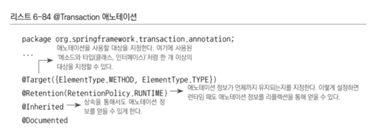
  - 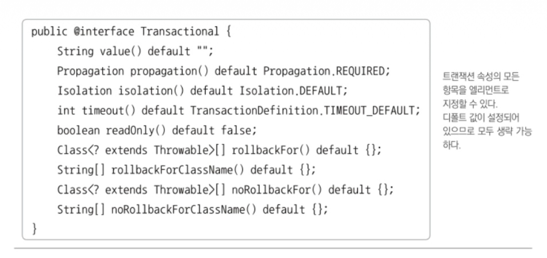
### 타깃은 메소드와 타입
- 메소드, 클래스, 인터페이스에 사용 가능 
- 해당 애노테이션을 트랜잭션 속성 정보로 사용하도록 지정하면 스프링은 @Transactional이 부여된 모든 오브젝트를 자동으로 타깃 오브젝트로 인식 
- 이 때 사용되는 포인트컷은 TransactionAttributeSourcePointcut
  - 스스로 표현식고 같은 선정 기준을 갖지는 않음 
  - 대신 @Transactional이 타입 레벨이든 메소드 레벨이든 상관 없이 부여된 빈 오브젝트를 모두 찾아 포인트컷의 선정 결과로 돌려줌
- 기본적으로 트랜잭션 속성을 정의
- 포인트컷의 자동등록에도 사용
## 트랜잭션 속성을 이용하는 포인트컷
- @Transactional 애노테이션을 사용했을 때 어드바이저의 동작 방식
  - 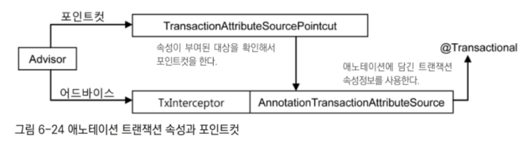
- TransactionInterceptor는 메소드 이름 패턴을 통해 부여되는 일괄적인 트랜잭션 속성 정보를 사용하지 않음
  - @Transactional 애노테이션의 엘리먼트에서 트랜잭션 속성을 가져오는 AnnotationTransactionAttributeSource 사용
  - @Transactional은 메소드마다 다르게 설정할 수 있기 때문에 유연한 트랜잭션 속성 설정이 가능 
- 포인트컷도 @Transactional을 통한 트랜잭션 속성정보를 참조하도록 만듬 
  - @Transactional로 트랜잭션 속성이 부여된 오브젝트라면 포인트컷의 선정 대상이기도 하기 때문 
- 해당 방식으로 포인트컷과 트랜잭션 속성을 애노테이션 하나로 지정 가능 
  - 트랜잭션 속성은 타입 레벨에 일괄적으로 부여 가능
  - 또는 메소드 단위로 세분화해 속성을 다르게 지정도 가능
  - 따라서 매우 세밀한 트랜잭션 속성 제어 가능 
- 트랜잭션 부가기능 적용 단위는 메소드 
  - 메소드마다 @Transactional을 부여하고 속성 지정 가능 
  - 유연한 속성 제어는 가능 
  - 코드는 지저분
  - 동일한 속성 정보를 가진 애노테이션을 반복적으로 메소드마다 부여해주는 결과를 가져올 수 있음
## 대체 정책
### 스프링은 @Transactional을 적용 시 4단계의 대체 정책 이용
- 메소드의 속성을 확인할 때 타깃 메소드, 타깃 클래스, 선언 메소드, 선언 타입 순서에 따라 @Transactional이 적용됐는지 차례로 확인
- 가장 먼저 발견되는 속성 정보를 사용
- 메소드가 선언된 타입까지 단계적으로 확인해 @Transactional이 발견되면 적용, 아니면 해당 메소드는 트랜잭션 적용 대상이 아니라 판단 
### 예시
- 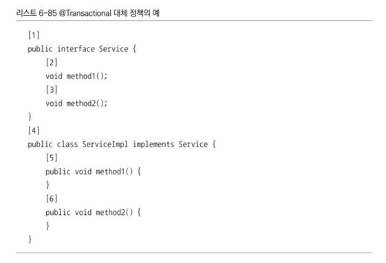
  - @Transactional이 붙을 수 있는 곳은 총 6곳
- 타깃 오브젝트의 메소드부터 시작
  - 5, 6번이 첫 번째 후보
- 타깃 클래스인 4가 다음
  - 메소드가 여러개면 클래스 레벨에 @Transactional을 붙이는게 효율적
  - 특정 메소드만 공통 속성을 따르지 않는다면 해당 메소드에만 추가로 @Transactional을 부여 
- 메소드가 선언된 인터페이스 중 메소드인 2,3번이 다음 
- 인터페이스 타입인 1번이 마지막 
### 애노테이션의 최소 사용과 최대 제어
- 대체 정책을 잘 사용하면 @Transactional 애노테이션을 최소로 사용해도 세밀한 제어가 가능 
- 먼저 타입 레벨에 정의
  - 공통 속성을 따르지 않는 메소드의 경우 해당 메소드에만 애노테이션 적용 
- 보통은 인터페이스에 @Transactional을 두는게 기본
  - 하지만 인터페이스를 사용하는 프록시 방식이 아니라면 애노테이션이 무시될 수 있기 때문에 타깃 클래스에 붙이는 것이 권장됨 

----

# 6.7.2. 트랜잭션 애노테이션 적용
- UserService에 적용
- 꼭 세밀한 설정 때문이 아니라 직관적이고 간단하기 때문에 @Transactional을 사용하는 경우도 많음 
  - 패턴을 만들고 포인트컷과 트랜잭션 속성을 지정하는 것보다 단순하고 편리하며 코드 이해도 쉬움 
## 단점
  - 트랜잭션 적용 대상의 파악 간단하지 않음 
  - 사용 정책을 잘 만들어 두지 않으면 무분별하게 사용되거나 자칫 빼먹을 위험도 있음 
  - 트랜잭션이 적용되지 않았다는 사실은 파악하기 쉽지 않음 
  - 예외가 발생해 롤백이 필요한 시점이 되어야 깨달을 수 있음 
  - 일부 데이터 액세스 기술은 트랜잭션이 시작되지 않으면 아예 DAO에서 예외가 발생하기도 함 
    - 하지만 JDBC를 직접 사용하는 경우에는 트랜잭션 없이 DAO가 동작 가능하기 때문에 주의
## 속성 부여
- 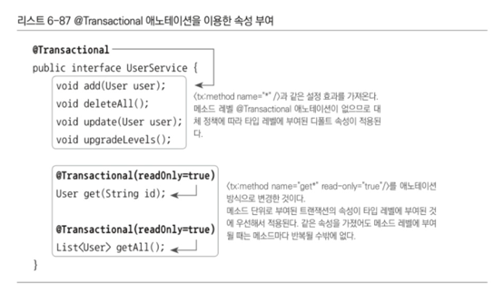
  - 인터페이스에 적용 

----

# 6.8. 트랜잭션 지원 테스트
# 6.8.1. 선언적 트랜잭션과 트랜잭션 전파 속성
## 트랜잭션 전파 속성은 유용한 개념
- REQUIRED의 경우 진행 중인 트랜잭션이 있으면 참여, 없으면 만듬
- REQUIRED 속성을 가진 메소드를 결합해 다양한 크기의 트랜잭션 만들 수 있음 
- 트랜잭션 적용으로 불필요한 코드 중복 필요 x
- 애플리케이션을 작은 단위로 쪼개서 개발 가능 
- 다른 메소드를 호출해 사용할 때 REQUIRED라는 속성이 없으면 전부 별개의 트랜잭션으로 만들어져서 의도한 기능이 이루어지지 않을 수 있음 
## 선언적 트랜잭션
- AOP를 이용해 코드 외부에서 트랜잭션의 기능을 부여해주고 속성을 지정할 수 있게 하는 방법 
- 특별한 게 아니라면 이 방법을 주로 사용하는 것이 바람직
## 프로그램에 의한 트랜잭션
- 선언적 트랜잭션의 반대 개념 
- TransactionTemplate이나 개별 데이터 기술의 트랜잭션 API를 사용해 직접 코드 안에서 사용하는 방법
## EJB에서의 선언적인 트랜잭션 개념 
- 컴포넌트 기반의 서비스를 지향하던 EJB의 특성상 트랜잭션 전파가 가능한 선언적인 트랜잭션은 중요한 기능 
- 스프링은 평범한 자바 클래스로 만든 오브젝트에도 선언적 트랜잭션 적용 가능 
- 트랜잭션 추상화를 함께 제공하기 때문에 EJB처럼 특정 트랜잭션 기술과 환경에 종속되지도 않음 

----

# 6.8.2. 트랜잭션 동기화와 테스트
- AOP 덕분에 프록시를 이용한 트랜잭션 부가기능을 간단하게 애플리케이션 전반에 적용 가능한 것 
- 또한 데이터 엑세스 기술, 트랜잭션 기술에 독립적으로 추상 레벨에서 트랜잭션을 관리하게 해주는 트랜잭션 추상화 덕분에 AOP를 통한 선언적 트랜잭션이나 트랜잭션 전파 등이 가능
## 트랜잭션 매니저와 트랜잭션 동기화
- 트랜잭션 추상화 기술의 핵심은 트랜잭션 매니저와 트랜잭션 동기화
  - PlatformTransactionManager 인터페이스를 구현한 트랜잭션 매니저를 통해 트랜잭션 기술 종류에 상관없이 일관된 트랜잭션 제어 가능 
  - 트랜잭션 동기화 기술로 시작된 트랜잭션 정보를 저장소에 보관해 두었다가 DAO에서 공유 가능 
- 트랜잭션 동기화 기술은 트랜잭션 전파를 위해서도 중요한 역할
  - 진행 중인 트랜잭션이 있는지 확인
  - 트랜잭션 전파 속성에 따라 이에 참여할 수 있도록 함 
- 전파 속성이 REQUIRED일 경우 시작된 트랜잭션에 참여
  - 즉, 동기화 되는 것 
  - 지금은 AOP로 선언전 트랜잭션이 적용됨 
  - 필요하다면 프로그램에 의한 트랜잭션 방식을 사용 가능 
    - 어차피 트랜잭션 어드바이스에서도 트랜잭션 매니저를 통해 트랜잭션을 제어
    - 코드에서 직접 트랜잭션 매니저를 이용해 트랜잭션에 참여하는 것이 가능
    - 특별한 이유 없다면 굳이이긴 함
    - 특별한 이유는 테스트
- @Autowired로 트랜잭션 매니저 빈을 가져올 수 있음 
  - 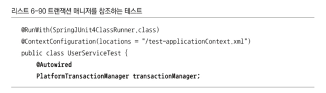
- 테스트 메소드 추가
  - 
- transactionSynce() 테스트 메소드 실행 중 3개의 트랜잭션이 만들어짐 
  - 각 메소드가 모두 독립적인 트랜잭션 안에서 실행
  - 테스트에서 각 메소드 실행 시 기존 트랜잭션이 없고 기본 속성은 REQUIRED이니 모두 새로운 트랜잭션 시작 
  - 메소드 정상 종료 시 커밋되며 종료
## 트랜잭션 매니저를 이용한 테스트용 트랜잭션 제어
- 세 개의 트랜잭션을 하나로 통합할 수는 없나?
  - 즉, 하나의 트랜잭션 안에서 deleteAll()과 두 개의 add() 메소드가 동작할 수는 없나?
- 세 메소드 전부 전파 속성이 REQUIRED이기 때문에 메소드 호출 전 트랜잭션이 시작되면 가능함 
  - UserService의 새 메소드 만들고 그 안에서 deleteAll()과 add() 호출하면 됨 
- 그런데 메소드 추가 없이 테스트 코드만으로 세 메소드의 트랜잭션 통합 가능 
  - 테스트 켐소드에서 UserService의 메소드 호출 전 트랜잭션을 미리 시작하면 됨 
  - 트랜잭션 매니저를 이용해 트랜잭션 시작하고 동기화해주면 되는 것
  - 테스트도 트랜잭션 동기화에 참여하는 것
- 트랜잭션 매니저로 트랜잭션 제어
  - 트랜잭션 정의를 담은 오브젝트를 만들고 트랜잭션 매니저에 제공하며 새로운 트랜잭션을 요청하면 됨 
  - 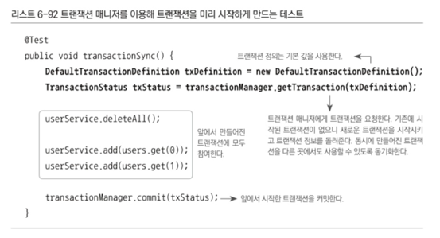
  - 세 개의 메소드는 새 트랜잭션을 만드는게 아니라 기존 트랜잭션에 참여하게 됨 
## 트랜잭션 동기화 검증 
- 태스트는 성공이지만 정말 세 개의 메소드가 테스트 내부에서 시작된 트랜잭션에 참여하고 있을까?
- 트랜잭션에서 읽기 전용과 제한시간 등은 처음 트랜잭션이 시작될 때만 적용
  - 그 이후 참여하는 메소드의 속성은 무시됨 
  - deleteAll()의 트랜잭션 속성은 쓰기 가능으로 되어 있지만 앞에서 시작된 트랜잭션이 읽기 전용이라 하면 deleteAll()의 모든 작업도 읽기 전용 트랜잭션이 적용된 상태에서 진행됨
- 트랜잭션 속성을 읽기 전용으로 만들고 테스트를 돌려볼 때
  - 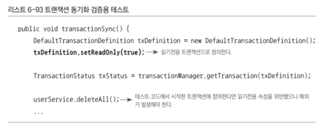
  - 예외 발생으로 테스트 실패
  - TransientDataAccessResourceException 예외
  - 메시지는 Connection is read-only
  - 읽기 전용 트랜잭션에 대해 쓰기 작업을 했을 때 발생하는 예외
  - deleteAll() 메소드 호출 시에 발생
  - 이로 인해 세 메소드는 기존 트랜잭션에 참여하고 있다는 것을 알 수 있음 
- 트랜잭션 동기화 기술과 트랜잭션 전파 속성 덕분에 테스트도 트랜잭션으로 묶을 수 있음
  - 잘 이용하면 DB 작업이 포함되는 테스트를 원하는 대로 제어하며 효과적인 테스트 만들 수 있음 
- DAO를 직접 호출해도 가능 
- 롤백도 가능 
- 테스트에서 트랜잭션을 시작하거나 조작할 수 있는 기능은 유용
  - 미리 테스트 코드에서 트랜잭션을 시작해 놓으면 
    - 직접 호출하는 DAO 메소드도 하나의 트랜잭션으로 묶을 수 있음
    - 트랜잭션 결과나 상태를 조작하며 테스트 가능 
  - 하이버네이트 같은 ORM에서 세션에서 분리된 엔티티의 동작을 확인할 때도 유용
  - 테스트 메소드 안에서 트랜잭션을 여러 번 만들 수도 있음 
  - 트랜잭션 속성에 따라 여러 메소드를 조합해 사용할 때 어떤 결과가 나오는지도 미리 검증 가능
## 롤백 테스트
- 테스트 코드로 트랜잭션을 제어해 적용할 수 있는 테스트 기법
- 테스트 내의 모든 DB 작업을 하나의 트랜잭션 안에서 동작하게 하고 테스트가 끝나면 무조건 롤백해버리는 테스트
  - 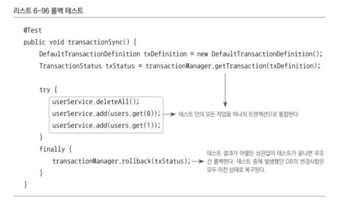
### DB 작업이 포함된 테스트가 어려운 이유 
- DB 사용 코드를 테스트하는 것은 여러 이유로 작성하기 힘듬 
  - 복잡한 데이터를 바탕으로 동작하는 기능을 테스트하려면 테스트가 실행될 때의 DB 데이터와 상태가 매우 중요
  - 문제는 테스트에서 DB에 쓰기 작업을 하는 기능을 실행하며 테스트를 수행하고 나면 DB의 데이터가 바뀐다는 것 
    - 테스트를 실행하기 전 적절한 DB 상태를 만들어 놓더라도 테스트가 끝나고 나면 데이터와 상태가 바뀜 
  - 테스트는 어떤 순서로 어떻게 진행될 지 보장 x
  - 성공했을 때와 실패했을 때 DB에 다른 방식으로 영향
  - 테스트용 데이터를 DB에 잘 준비해 두어도 실행된 테스트에서 DB 값을 바꿔버리면 이후 실행 테스트에 영향을 끼침
- DB 엑세스 테스트를 위해서는 테스트를 할 때마다 테스트 데이터를 초기화하는 번거로운 작업 필요
  - 필요한 데이터들을 미리 준비해 둠 
  - 하지만 테스트를 진행함에 따라 준비된 데이터가 바뀌면 쓸모가 없어짐 
- 이러한 이유 때문에 롤백 테스트가 유용
### 롤백 테스트의 유용성
- 테스트를 진행하는 동안 조작한 데이터를 모두 롤백하고 테스트를 시작 전 상태로 만들어 줌 
- 테스트 수행 전과 후가 동일한 상태
- 테스트의 성공과 실패, 예외 발생해도 상관 x
- 테스트에 따라 고유한 테스트 데이터가 필요할 때
  - 테스트 앞부분에서 그에 맞게 DB를 초기화하고 테스트 진행 
  - 초기화한 상태까지 롤백되므로 상관 x
- 여러 개발자가 하나의 공용 테스트용 DB를 사용할 수 있게 함
  - 적절한 격리수준만 보장해 주면 동시에 여러 개의 테스트가 진행되어도 상관 x
- 테스트의 트랜잭션 제어가 주는 가장 큰 이점이 바로 롤백 테스트인 것 

----

# 6.8.3. 테스트를 위한 트랜잭션 어노테이션
- 테스트 클래스와 메소드에 @Transactional을 적용
- 스프링의 컨텍스트 테스트 프레임워크를 사용 
  - 애노테이션을 이용해 테스트를 편리하게 만들 수 있는 여러 가지 기능을 추가하게 해줌 
- @ContextConfiguration을 클래스에 부여하면 테스트를 실행하기 전에 스프링 컨테이너 초기화
  - @Autowired 애노테이션이 붙은 필드를 통해 필요한 빈에 자유롭게 접근 
## @Transactional
- 테스트 클래스 또는 메소드에 부여하면 타깃 클래스나 인터페이스에 적용된 것처럼 테스트 메소드에 트랜잭션 경계가 자동 설정
  - 이를 이용해 테스트 내에서 진행하는 모든 트랜잭션 관련 작업을 하나로 묶을 수 있음
  - 모든 종류의 트랜잭션 속성을 지정할 수도 있음
- 테스트 메소드의 코드를 이용해 트랜잭션을 만들어 적용했던 것과 동일한 결과를 가져옴 
  - 트랜잭션 매니저와 번거로운 코드 대신인 것
- 하지만 AOP는 아님 
  - 컨텍스트 테스트 프레임워크에 의해 트랜잭션을 부여해 주는 용도로 쓰일 뿐 
## @Rollback
- 테스트용 트랜잭션은 테스트가 끝나면 자동으로 롤백
  - 테스트에 적용된 @Transactional은 테스트가 끝나면 기본적으로 강제 롤백
  - @Transactional을 지정해 주면 롤백 테스트가 되는 것 
- @Rollback 애노테이션을 이용해 테스트의 결과를 DB에 반영 
  - 기본 값은 true
  - 트랜잭션은 적용되지만 롤백을 적용하고 싶지 않을 때는 @Rollback(false)로 해 주어야 함 
- 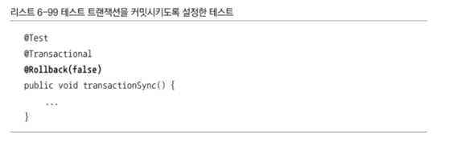
  - 테스트 전체에 걸쳐 하나의 트랜잭션
  - 예외가 발생하지 않는 한 트랜잭션은 커밋됨 
## @TransactionConfiguration
- @Transactional은 테스트 클래스에 넣어 모든 테스트 메소드에 일괄 적용 가능
- @Rollback은 메소드 레벨에만 적용 가능
- 테스트 클래스의 모든 메소드에 트랜잭션을 적용하며 모든 트랜잭션이 롤백되지 않고 커밋되게 하려면?
  - 모든 메소드에 @Rollback(false) -> 무식하지만 되긴 함 
  - 클래스 레벨에 부여할 수 있는 @TransactionConfiguration 사용하면 편리
- 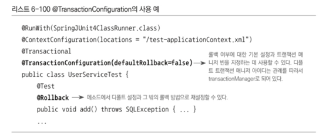
  - 롤백에 대한 공통 속성 지정 가능
  - 디폴트 롤백 속성은 false
  - 테스트 메소드 중 일부만 롤백 적용하고 싶으면 메소드에 @Rollback 부여
  - 기본 값은 true이니 해당 메소드는 롤백할 것
## NotTransactional과 Propagation.NEVER
- 테스트 클래스 안에서 일부 메소드에만 트랜잭션이 필요하다면 메소드 레벨의 @Transactional 적용 
- 대부분의 메소드에서 트랜잭션이 필요하면 테스트 클래스에 @Transactional 지정
- 이 경우 굳이 트랜잭션이 필요 없는 메소드라면?
- 냅둬도 되지만 막을 수도 있음 
- @NotTransactional
  - 테스트 메소드에 부여하면 클래스 레벨의 @Transactional 설정을 무시하고 트랜잭션 시작 x
  - 근데 이건 스프링 3.0에서 제거 대상 
  - 트랜잭션 사용과 비사용 메소드를 분리하는 것을 권장함 
- @Transactional(propagation=Propagation.NEVER)을 사용해도 됨
## 효과적인 DB 테스트
- 의존, 협력 오브젝트를 사용하지 않고 고립된 상태에서 테스트를 진행하는 단위 테스트
- DB 같은 외부의 리소스나 여러 계층의 클래스가 참여하는 통합 테스트
- 둘의 클래스를 구분하는 것이 좋음 