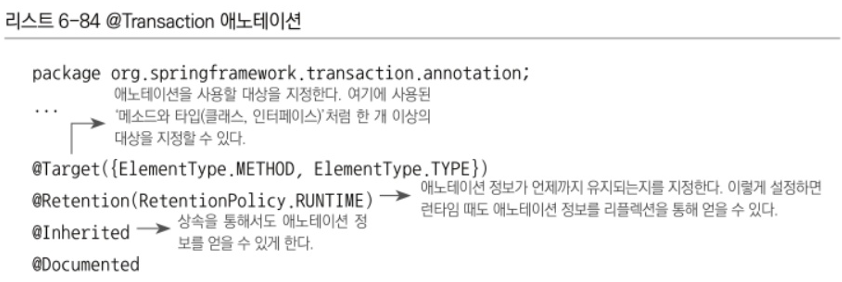

# 마지막

# 6.7 애노테이션 트랜잭션 속성과 포인트컷

포인트컷 표현식과 트랜잭션 속성을 이용해 트랜잭션을 일괄적으로 적용하는 방식은 복잡한 트랜잭션 속성이 요구되지 않는 한 대부분의 상황에 잘 들어맞음.

그런데 가끔은 클래스나 메소드에 따라 제각각 속성이 다른, 세밀하게 튜닝된 트랜잭션 속성을 적용해야 하는 경우도 있음.

이 경우엔 메소드 이름패턴을 적용해서 일괄적으로 트랜잭션 속성을 부여하는 방식은 적합하지 않음

기본 속성과 다른 경우가 있을 때마다 일일이 포인트컷과 어드바이스를 새로 추가해줘야 하기 때문.

→ 포인트컷 자체가 지저분해지고 설정파일도 복잡해지기 쉬움.

이러한 세밀한 트랜잭션 속성의 제어가 필요한 경우 스프링이 제공하는 다른 방법이 존재. 달

설정파일에서 패턴으로 분류 가능한 그룹을 만들어서 일괄적으로 속성을 부여하는 대신에 직접 타깃에 트랜잭션 속성정보를 가진 애노테이션을 지정한는 방법

## 6.7.1 트랜잭션 애노테이션.

스프링 3.0에선 자바 5에서 등장한 애노테이션을 많이 사용함.

### @Transactional




@Transactional 애노테이션의 타깃은 메소드와 타입.

따라서 메소드, 클래스, 인터페이스에 사용 가능.

@Transactional 앤노테이션을 트랜잭션 속성정보로 사용하도록 지정하면 스프링은 @Transactional이 부여된 모든 오브젝트를 자동으로 타깃 오브젝트로 인식.

이때 사용되는 포인트컷은 TransactionAttributeSourcePointcut.

TransactionAttributeSourcePointcut은 스스로 표현식과 같은 선정 기준을 갖고있진 않음.

대신 @Transactional이 타입 레벨이든 메소드 레벨이든 상관없이 부여된 빈 오브젝트를 모두 찾아서 포인트컷의 선정 결과로 돌려줌.

@Transactional은 기본적으로 트랜잭션 속성을 정의하는 것이지만, 동시에 포인트컷의 자동등록에도 사용됨.

### 트랜잭션 속성을 이용하는 포인트컷


위 그림은 @Transactional 애노테이션을 사용했을 때 어드바이저의 동작방식을 보여줌.

TransationInterceptor는 메소드 이름 패턴을 통해 부여되는 일괄적인 트랜잭션 속성정보 대신 @Transactional 애노테이션의 엘리먼트에서 트랜잭션 속성을 가져오는

AnnotationTransactionAttributeSource를 사용함.

@Transactional은 메소드마다 다르게 설정할 수도 있으므로 매우 유연한 트랜잭션 속성 설정이 가능해짐.

동시에 포인트컷도 @Transactional을 통한 트랜잭션 속성정보를 참조하도록 만듦.

@Transactional로 트랜잭션 속성이 부여된 오브젝트라면 포인트컷의 선정 대상이기도 함.

이 방식을 이용하면 포인트컷과 트랜잭션 속성을 애노테이션 하나로 지정할 수 있음.

트랜잭션 속성은 타입 레벨에 일괄적으로 부여할 수도 있지만, 메소드 단위로 세분화해서 트랜잭션 속성을 다르게 지정할 수도 있기 때문에 매우 세밀한 트랜잭션 속성 제어가 가능해짐.

트랜잭션 부가기능 적용 단위는 메소드.

따라서 메소드마다 @Transactional을 부여하고 속성을 지정할 수 있음.

→ 유연한 속성 제어는 가능하지만 코드는 지저분해지고, 동일한 속성 정보를 가진 애노테이션을 반복적으로 메소드마다 부여해주는 바람직하지 못한 결과를 가져올 수 있음.

### 대체 정책

그래서 스프링은 @Transactional을 적용할때 4단계의 대체(FallBack) 정책을 이용하게 해중

메소드 속성을 확인할 때 타깃 메소드, 타깃 클래스, 선언 메소드, 선언타입 (클래스, 인터페이스)의 순서에 따라서 @Transactional이 적용됐는지 차례로 확인하고, 가장 먼저 발견되는 속성정보를 사용하게 하는 방법.

1. 가장 먼저 타깃의 @Transactional이 있는지 확인.
2. @Transactional이 부여되어 있다면 이를 속성으로 사용.
3. 만약 없으면 다음 대체 후보인 타깃 클래스에 부여된 @Transactional 애노테이션을 찾음
4. 타깃클래스의 메소드 레벨에는 없었지만 클래스 레벨에 @Transactional이 존재한다면 이를 메소드의 트랜잭션 속성으로 사용

이런 식으로 메소드가 선언된 타입까지 단계적으로 확인해서 @Transactional이 발견되면 적용하고, 끝까지 발견되지 않으면 해당 메소드는 트랜잭션 적용 대상이 아니라고 판단.


위와 같이 정의된 인터페이스와 구현 클래스가 있다고 하자.

인터페이스는 두 개의 메소드가 있고, 구현 클래스 역시 인터페이스의 정의된 두 개의 메소드를 갖고 있음.

구현 클래스인 ServiceImpl이 빈으로 등록. 그 두 개의 메소드가 트랜잭션의 적용 대상이 되어야 한다면,

@Transactional을 부여할 수 있는 위치는 총 6개

스프링은 트랜잭션 기능이 부여될 위치인 타깃 오브젝트의 메소드부터 시작해서 @Transactional 애노테이션이 존재하는지 확인.

따라서 [5]와 [6]이 @Transactional이 위치할 수 있는 첫 번째 후보.

여기서 애노테이션이 발견되면 바로 애노테이션의 속성을 가져다가 해당 메소드의 트랜잭션 속성으로 사용.

메소드에서 @Transactional을 발견하지 못하면, 다음은 타깃 클래스인 [4]에 @Transactional이 존재하는지 확인.

이를 통해서 @Transactional이 타입 레벨, 즉 클래스에 부여되면 해당 클래스의 모든 메소드의 공통적으로 적용되는 속성이 될 수 있음.

메소드 레벨에 @Transactional이 없다면 모두 클래스 레벨의 속성을 사용할 것이기 때문.

메소드가 여러 개라면 클래스 레벨에 @Transactional을 부여하는 것이 편리함.

특정 메소드만 공통 속성을 따르지 않는다면 해당 메소드에만 추가로 @Transactional을 부여해주면 됨.

대체 정책에서 지정한 순서에 따라서 항상 메소드에 부여된 @Transactional이 가장 우선이기 때문에 @Transactional이 붙은 메소드는 클래스 레벨의 속성을 무시하고 메소드 레벨의 속성을 사용할 것임.

반면에 @Transactional을 붙이지 않은 여타 메소드는 클래스 레벨에 부여된 공통 @Transactional을 따르게 됨.

타깃 클래스에소도 @Transactional을 발견하지 못하면, 스프링은 메소드가 선언된 인터페이스로 넘어감.

인터페이스에서도 먼저 메소드를 확인 따라서 [2]와[3]에 @Transactional이 부여됐는지 확인하고 존재하면 이 속성을 적용함.

인터페이스 메소드에도 없다면 마지막 단계인 인터페이스 타입 [1]의 위치에 애노테이션이 있는지 확인함.

@Transactional을 사용하면 대체 정책을 잘 활용해서 애노테이션 자체는 최소한으로 사용하면서도 세밀한 제어가 가능.

@Transactional은 먼저 타입 레벨에 정의되고 공통 속성을 따르지 않는 메소드에 대해서만 메소드 레벨에 다시 @Transactional을 부여해주는 식으로 사용해야 함.

기본적으로 @Transactional 적용 대상은 클라이언트가 사용하는 인터페이스가 정의한 메소드이므로 @Transactional도 타깃 클래스보다는 인터페이스에 두는 게 바람직함.

하지만 인터페이스를 사용하는 프록시 방식의 AOP가 아닌 방식으로 트랜잭션을 적용하면 인터페이스에 정의한 @Transactional은 무시되기 때문에 안전하게 타깃 클래스에 @Transactional을 두는 방법을 권장함.

프록시 방식 AOP의 종류와 특징, 또는 비 프록시 방식 AOP의 동작원리를 잘 이해하고 있고 그에 따라 @Transactional의 적용 대상을 적절하게 변경해줄 확신이 있거나, 반드시 인터페이스를 사용하는 타깃에만 트랜잭션을 적용하겠다는 확신이 있다면 인터페이스에 @Transactional을 적용하고, 아니라면 마음 편하게 타깃 클래스와 타깃 메소드에 적용하는 편이 나음.

인터페이스에 @Transactional을 두면 구현 클래스가 바뀌더라도 트랜잭션 속성을 유지할 수 있다는 장점이 있음.

### 트랜잭션 애노테이션 사용을 위한 설정

@Transactional을 이용한 트랜잭션 속성을 사용하는 데 필요한 설정은 매우 간단.

스프링이 이 방법을 위한 모든 설정을 다음 태그 하나에 담아뒀기 때문.

이 태그 하나로 트랜잭션 애노테이션을 이용하는 데 필요한 어드바이저, 어드바이스, 포인트컷, 애노테이션을 이용하는 트랜잭션 속성정보가 등록됨.

지금까지 사용했던 트랜잭션 기능 적용을 위한 설정 중에서 가장 간단함.

```java
<tx:annotation-driven />
```

## 6.7.2 트랜잭션 애노테이션 적용

@Transactional을 UserService에 적용해보자.

@Transactional을 꼭 세밀한 트랜잭션 설정이 필요할때마다 사용하는 것은 아니고, 트랜잭션 설정이 직관적이고 간단하다고 생각해서 사용하는 경우도 많음.

클래스, 빈, 메소드의 이름에 일괄된 패턴을 만들어 적용하고 이를 활용해 포인트컷과 트랜잭션 속성을 지정하는 것보다는 단순하게 트랜잭션이 필요한 타입 또는 메소드에 직접 애노테이션을 부여하는 것이 훨씬 코드를 이해하기도 좋음.

다만 트랜잭션 적용 대상을 손쉽게 파악할 수 없고, 사용 정책을 잘 만들어두지 않으면 무분별하게 사용되거나 자칫 빼먹을 위험도 있음.

트랜잭션이 적용되지 않았다는 사실은 파악하기 쉽지 않음.

일반적으로는 트랜잭션이 적용되지 않았다고 기능이 동작하지 않는 것도 아니므로 예외적인 상황이 발생해서 롤백이 필요한 시점이 돼야 비로소 이상하다는 걸 느끼고 트랜잭션 적용 여부를 확인하게 됨.

따라서 @Transactional을 사용할 때는 실수하지 않도록 주의하고, @Transactional 적용에 대한 별도의 코드 리뷰를 거칠 필요가 있음.

다행히 일부 데이터 액세스 기술은 트랜잭션이 시작되지 않으면 아예 DAO에서 예외가 발생하기도 함.

하지만 JDBC를 직접 사용하는 기술의 경우는 트랜잭션이 없어도 DAO가 동작할 수 있기 때문에 주의해야 함.


위 xml은 tx 스키마의 <tx:attributes> 태그를 이용해 설정했던 트랜잭션 속성을 그대로 애노테이션을 바꿔보기 위한 일종의 예 이다.  위는 메소드 이름 패턴을 이용해 두 가지 종류의 속성을 지정함.

애노테이션을 이용할 때는 이 두 가지 속성 중에서 많이 사용되는 한 가지를 타입 레벨에 공통 속성으로 지정해주고, 나머지 속성은 개별 메소드에 적용해야 함.

메소드 레벨의 속성은 메소드마다 반복돼야 하므로 속성의 종류가 두 가지 이상이고 적용 대상 메소드의 비율이 비슷하다면 메소드에 많은 @Transactional 애노테이션이 반복될 수 있음.

@Transactional 애노테이션은 UserServiceImpl 클래스 대신 UserService 인터페이스에 적용.

그래야 UserServiceImpl과 TestUserService 양쪽에 트랜잭션이 적용될 수 있기 때문.

인터페이스 방식의 프록시를 사용하는 경우에는 인터페이스에 @Transactional을 적용해도 상관 없음.


UserService에는 get으로 시작하지 않는 메소드가 더 많으므로 위 코드와 같이 인터페이스 레벨에 디폴트 속성을 부여해주고, 읽기 전용 속성을 지정할 get으로 시작하는 메소드에는 읽기전용 트랜잭션 속성을 반복해서 지정해야 함.

애노테이션을 이용한 트랜잭션 속성 지정은 tx 스키마를 사용할 때와 마찬가지로 IDE의 자동완성 기능을 활용할 수 있고 속성을 잘못 지정한 경우 컴파일 에러가 발생해서 손쉽게 확인할 수 있다는 장점이 있음.

@Transactional 적용을 마친 후 테스트를 돌림

그렇다면 @Transactional 설정을 UserService와 UserServiceImpl에 넣고 빼면서 어떤 애노테이션이 우선시되는지 등을 확인해보면 됨.


만약 이렇게 해두고 타깃클래스에 @Transactional을 넣으면 어떻게 될까?

애노테이션에 대한 정책의 순서는 타깃 클래스가 인터페이스보다 우선하므로 모든 메소드의 트랜잭션은 디폴트 속성을 갖게 됨. 따라서 UserService 인터페이스의 getAll() 메소드에 부여한 읽기전용 속성은 무시되고, 읽기전용 속성을 검증하는 readOnlyTransactionAttribute 테스트는 실패할 것.

# 6.8 트랜잭션 지원 테스트

## 6.8.1 선언적 트랜잭션과 트랜잭션 전파 속성

트랜잭션을 정의할 때 지정할 수 있는 트랜잭션 전파 속성은 매우 유용한 개념.

예를 들어 REQUIRED로 전파 속성을 지정해줄 경우, 앞에서 진행 중인 트랜잭션이 있으면 참여하고 없으면 자동으로 새로운 트랜잭션을 시작.

REQUIRED 전파 속성을 가진 메소드를 결합해서 다양한 크기의 트랜잭션 작업을 만들 수 있음.

트랜잭션 적용 때문에 불필요하게 코드를 중복하는 것도 피할 수 있으며, 애플리케이션을 작은 기능 단위로 쪼개서 개발할 수 있음.

예를 들어 사용자 등록 로직을 담당하는 UserService의 add를 생각해볼 때, add() 메소드는 트랜잭션 속성이 디폴트로 지정되어 있으므로 트랜잭션 전파 방식은 REQUIRED.

만약 add() 메소드가 처음 호출되는 서비스 계층의 메소드라면 한 명의 사용자를 등록하는 것이 하나의 비즈니스 작업 단위가 됨.

이때는 add() 메소드가 실행되기 전에 트랜잭션이 시작되고 add () 메소드를 빠져나오면 트랜잭션이 종료되는 것이 맞음.

DB 트랜잭션은 단위 업무와 일치해야 하기 때문.

그런데 작업 단위가 다른 비즈니스 로직이 있을 수 있음.

예를 들어 그날의 이벤트의 신청 내역을 모아서 한 번에 처리하는 기능이 있다고 가정.

처리되지 않은 이벤트 신청정보를 모두 가져와 DB에 등록하고 그에 따른 정보를 조작해주는 기능.

그런데 신청정보의 회원가입 항목이 체크되어 있는 경우에는 이벤트 참가자를 자동으로 사용자로 등록해줘야 함.

하루치 이벤트 신청 내역을 처리하는 기능은 반드시 하나의 작업 단위로 처리돼야 함.

이 기능을 EventService 클래스의 processDailyEventRegistaration() 메소드로 구현했다고 한다면, 이 메소드가 비즈니스 트랜잭션의 경계가 됨.

그런데 processDailyEventRegistaration() 메소드는 중간에 사용자 등록을 할 피요가 있음.

직접 UserDao의 add() 메소드를 사용할 수도 있지만, 그보다는 UserService의 add() 메소드를 이용해서 사용자 등록 중 처리해야 할, 디폴트 레벨 설정과 같은 로직을 적용하는 것이 바람직함.

이때 UserService의 add() 메소드는 독자적인 트랜잭션을 시작하는 대신 processDailyEventRegistaration() 메소드에서 시작된 트랜잭션의 일부로 참여하게 됨.

만약 add() 메소드 호출 뒤에 processDailyEventRegistaration() 메소드를 종료하지 못하고 예외가 발생한 경우에는 트랜잭션이 롤백되면서 UserService의 add() 메소드에서 등록한 사용자 정보도 취소됨.

트랜잭션 전파라는 기법을 사용했기 때문에 UserService의 add()는 독자적인 트랜잭션 단위가 될 수도 있고, 다른 트랜잭션의 일부로 참여할 수도 있음.

그렇다면 UserService의 add() 메소드는 매번 트랜잭션을 시작하도록 만들어졌을 것이고, 이 때문에 processDailyEventRegistaration() 등의 메소드에서 호출해서 사용할 수 없었을 것이다.

processDailyEventRegistaration()에서 사용자 등록 기능이 필요하긴 하지만 사용자 등록 작업도 같은 트랜잭션에 넣어야 하는데 add () 메소드는 독자적인 트랜잭션을 만들어버러기 때문.

그래서 어쩔 수 없이 processDailyEventRegistaration() 안에 add() 메소드의 코드를 그대로 복사해서 사용하게 됨.

이런 식의 중복이 일어나기 시작하면서 중복된 코드를 함께 관리하는 불편이 뒤따르게 됨.

사용자 등록 중에 처리해야 할 작업이 추가될 때마다 add() 메소드의 코드를 복사해간 다른 메소드를 모두 찾아서 일일이 수정해줘야 함.

한 군데라도 실수해서 빠뜨리면 사용자 데이터에 문제가 발생할 수도 있음.

그렇다면 어떻게 해야할까?

→ 다행히 스프링은 트랜잭션 전파 속성을 선언적으로 적용할 수 있는 기능을 제공하기 때문에 이런 고민을 할 필요는 없음.

그렇다고 트랜잭션 전파 속성이 개발자의 부주의나 게으름으로 인해 발생하는 불필요한 코드 중복을 막아주지는 못함.


위 그림은 add() 메소드에 REQUIRED 방식의 트랜잭션 전파 속성을 지정했을 때 트랜잭션이 시작되고 종료되는 경계를 보여줌.

add() 메소드도 스스로 트랜잭션 경계를 설정할 수 있지만, 때로는 다른 메소드에서 만들어진 트랜잭션의 경계 안에 포함됨.

이 덕분에 사용자 등록 기능이 다양한 비즈니스 트랜잭션에서 사용되더라도 add() 메소드는 하나만 존재하면 되고 불필요한 코드 중복이 일어나지 않음

AOP를 이용해 코드 외부에서 트랜잭션의 기능을 부여해주고 속성을 지정할 수 있게 하는 방법을 선언적 트랜잭션이라고 함.

반대로 TransactionTemplate이나 개별 데이터 기술의 트랜잭션 API를 사용해 직접 코드 안에서 사용하는 방법은 프로그램에 의한 트랜잭션이라고 함.

스프링은 이 두 가지 방법을 모두 지원하고 있음. 물론 특별한 경우가 아니라면 선언적 방식의 트랜잭션을 사용하는 것이 바람직함.

이런 선언적인 트랜잭션 개념은 EJB에도 있었음.

컴포넌트 기반의 서비스를 지향하던 EJB의 특성상 트랜잭션 전파가 가능한 선언적인 트랜잭션은 중요한 기능이었음.

스프링은 복잡한 EJB 컴포넌트가 아닌 평범한 자바 클래스로 만든 오브젝트에도 선언적 트랜잭션을 적용할 수 있음.

트랜잭션 추상화를 함께 제공하기 때문에 EJB처럼 특정 트랜잭션 기술과 환경에 종속되지도 않음.

## 6.8.2 트랜잭션 동기화와 테스트

이렇게 트랜잭션의 자유로운 전파와 그로 인한 유연한 개발이 가능할 수 있었던 기술적인 배경에는 AOP가 있음.

AOP 덕분에 프록시를 이용한 트랜잭션 부가기능을 간단하게 애플리케이션 전반에 적용할 수 있었음.

또 한 가지 주용한 기술적인 기반은 스프링의 트랜잭션 추상화.

데이터 액세스 기술에 상관없이, 또 트랜잭션 기술에 상관없이 DAO에서 일어나는 작업들을 하나의 트랜잭션으로 묶어서 추상 레벨에서 관리하게 해주는 트랜잭션 추상화가 없었다면 AOP를 통한 선언적 트랜잭션이나 트랜잭션 전파 등은 불가능했을 것.

### 트랜잭션 매니저와 트랜잭션 동기화

트랜잭션 추상화 기술의 핵심은 트랜잭션 매니저와 트랜잭션 동기화.

PlatformTransactionManager 인터페이스를 구현한 트랜잭션 매니저를 통해 구체적인 트랜잭션 기술의 종류에 상관없이 일관된 트랜잭션 제어가 가능해짐.

또한 트랜잭션 동기화 기술이 있었기에 시작된 트랜잭션 정보를 저장소에 보관해뒀다가 DAO에서 공유할 수 있었음.

트랜잭션 동기화 기술은 트랜잭션 전파를 위해서도 중요한 역할을 함.

진행중인 트랜잭션이 있는지 확인하고, 트랜잭션 전파 속성에 따라서 이에 참여할 수 있도록 만들어 주는 것도 트랜잭션 동기화 기술 덕분임.

그렇다면 이렇게도 생각 해볼 수도 있음

트랜잭션 전파 속성중 REQUIRED는 이미 시작된 트랜잭션이 있으면 그 트랜잭션에 참여하게 해줌.

진행 중인 트랜잭션에 동기화되는 것.

지금은 모든 트랜잭션을 선언적으로 AOP를 적용하고 있지만, 필요하다면 프로그램에 의한 트랜잭션 방식을 함께 사용할 수도 있음.

어차피 트랜잭션 어드바이스에서도 트랜잭션 매니저를 통해 트랜잭션을 제어하는 것이니 코드에서 직접 트랜잭션 매니저를 이용해 참여하는 것이 안 될 이유는 없음.

물론 특별한 이유가 없다면 트랜잭션 매니저를 직접 이용하는 코드를 작성할 필요는 없음. 선언적 트랜잭션이 훨씬 편리함.

그런데 특별한 이유가 있다면 트랜잭션 매니저를 이용해 트랜잭션에 참여하거나 트랜잭션을 제어하는 방법을 사용할 수도 있음.

바로 테스트.

스프링의 테스트 컨텍스트를 이용한 테스트에서는 @Autowired를 이용해 애플리케이션 컨텍스트에 등록된 빈을 가져와 테스트 목적으로 활용할 수 있었음.

그렇다면 당연히 트랜잭션 매니저 빈도 가져올 수 있음.


그렇다면 위 코드처럼 테스트 환경에서도 사용 가능함.


위는 간단한 테스트 코드

- transationSync() 테스트 메소드가 실행되는 동안에 몇 개의 트랜잭션이 만들어 졌을까?
    
    3개
    

각 메소드는 모두 독립적인 트랜잭션 안에서 실행됨. 테스트에서 각 메소드를 실행시킬 때는 기존에 진행 중인 트랜잭션이 없고 트랜잭션 전파 속성은 REQUIRED이니 새로운 트랜잭션이 시작됨.

그리고 그 메소드를 정상적으로 종료하는 순간 트랜잭션은 커밋되면서 종료될 것.

deleteAll() 메소드가 실행되는 시점에서 트랜잭션이 시작됐으니 당연히 그 메소드가 끝나면 트랜잭션도 같이 종료됨.

그 후에 다시 add() 메소드가 호추로디면 현재 진행중인 트랜잭션은 없으니 마찬가지로 새로운 트랜잭션이 만들어질 것.

마지막 add() 메소도 마찬가지.

### 트랜잭션 매니저를 이용한 테스트용 트랜잭션 제어

그렇다면 이 테스트 메소드에서 만들어지는 세 개의 트랜잭션을 하나로 통합할 수는 없을까?

즉 하나의 트랜잭션 안에서 deleteAll()과 두 개의 add() 메소드가 동작하게 할 방법은 없을까?

세 개의 메소드 모두 트랜잭션 전파 속성이 REQUIRED이니 이 메소드들이 호출되기 전에 트랜잭션이 시작되게만 한다면 가능함. UserService에 새로운 메소드를 만들고 그 안에서 deleteAll()과 add()를 호출한다면 물론 가능.

UserService의 모든 메소드는 트랜잭션 경계가 되니 새로 만든 메소드에서 시작한 트랜잭션이 deleteAll()과 add() 메소드를 묶어서 하나의 트랜잭션 안에서 동작하게 할 것.

그런데 메소드를 추가하지 않고도 테스트 코드만으로 새 메소드의 트랜잭션을 통합하는 방법이 있음.

테스트 메소드에서 UserService의 메소드를 호출하기 전에 트랜잭션을 미리 시작해주면 됨.

트랜잭션의 전파는 트랜잭션 매니저를 통해 트랜잭션 동기화 방식이 적용되기 때문에 가능함.

위 테스트에서도 마찬가지. 트랜잭션을 시작시키고 이를 동기화 해줌.


트랜잭션을 시작하기 위해서는 먼저 트랜잭션 정의를 담은 오브젝트를 만들고 이를 트랜잭션 매니저에 제공하면서 새로운 트랜잭션을 요청하면 됨.

트랜잭션 매니저는 @Autowired를 테스트 코드로 주입하게 해놓음.

위 코드는 예외처리나 롤백 등은 없는 좀 무책임한 트랜잭션 코드.

세 개의 메소드 모두 속성이 REQUIRED이므로 이미 시작된 트랜잭션이 있으면 참여하고 새로운 트랜잭션을 만들지는 않음.

### 트랜잭션 동기화 검증

위 테스트를 돌려보면 성공이라고 나옴.

이게 정말 테스트 코드 내에서 시작된 트랜잭션에 참여하고 있는지는 알 수 없기 때문에 트랜잭션 속성을 변경해서 증명하자.

트랜잭션 속성 중에서 읽기전용과 제한시간 등은 처음 트랜잭션이 시작할 때만 적용되고 그 이후에 참여하는 메소드의 속성은 무시됨.


그래서 위와 같이 강제로 읽기전용으로 만들고 다시 테스트.

이렇게 테스트를 돌리면 예외 방생으로 인해 실패할 것.

예외는 TransientDataAccessResourceException이고, 메시지는 Connection is read-only라고 나옴.

예외는 deleteAll()메소드에서 발생.

테스트를 통해 확인한 바는 스프링의 트랜잭션 추상화가 제공하는 트랜잭션 동기화 기술과 트랜잭션 전파 속성 덕분에 테스트도 트랜잭션으로 묶을 수 있음.

이를 잘 활용하면 DB 작업이 포함되는 테스트를 원하는 대로 제어하면서 효과적인 테스트를 만들 수 있음.

이런 방법은 선언적 트랜잭션이 적용된 서비스 메소드에만 적용되는 것은 아님.

JdbcTemplate과 같이 스프링이 제공하는 데이터 액세스 추상화를 적용한 DAO에도 동일한 영향을 미침.

JdbcTemplte은 트랜잭션이 시작된 것이 있으면 그 트랜잭션에 자동으로 참여하고, 없으면 트랜잭션 없이 자동커밋 모드로 JDBC 작업을 수행.

개념은 조금 다르지만 JdbcTemplate의 메소드 단위로 트랜잭션 전파 속성이 REQUIRED인 것처럼 동작한다고 볼 수 있음.


위 코드는 롤백에 관한 테스트.

UserService의 add() 작업이 테스트에서 시작한 트랜잭션에 참여하고 있으므로 테스트에서 만든 트랜잭션을 롤백하면 당연히 add() 작업도 롤백돼야 한다.

테스트를 돌려보면 성공하겠지만 rollback() 대신 commit()을 하면 결과가 어떻게 달라지는지도 확인해보자.

정리하자면 테스트에서 트랜잭션을 시작하거나 조작할 수 잇는 기능은 매우 유용.

테스트 코드에서 미리 트랜잭션을 시작해놓으면 직접 호출하는 DAO 메소드도 하나의 트랜잭션으로 묶을 수 있다.

트랜잭션 결과나 상태를 조작하면서 테스트하는 것도 가능.

예를 들어 하이버네이트 같은 ORM에서 세션에서 분리된(detached) 엔티티 동작을 확인할 때도 유용.

테스트 메소드 안에서 트랜잭션을 여러 번 만들수도 있고 트랜잭션 속성에 따라서 여러 메소드를 조합해 사용할 때 어떤 겨롸가 나오는지도 미리 검증이 가능.

### 롤백 테스트

테스트 코드로 트랜잭션을 제어해서 적용할 수 있는 테스트 기법이 있음.

바로 롤백 테스트.

롤백 테스트는 테스트 내의 모든 DB 작업을 하나의 트랜잭션 안에서 동작하게 하고 테스트가 끝나면 무조건 롤백해버리는 테스트를 말함.


위 코드는 전형적인 롤백 테스트.

롤백 테스트는 DB 작업이 포함된 테스트가 수행돼도 DB에 영향을 주지 않기 때문에 장점이 많음.

DB를 사용하는 코드를 테스트하는 건 여러 가지 이유로 작성하기 힘듦.

간단한 CRUD 테스트야 별문제가 안 되겠지만 복잡한 데이터를 바탕으로 동작하는 기능을 테스트하려면 테스트가 실행될 때의 DB 데이터와 상태가 매우 중요함.

문제는 테스트에서 DB에 쓰기 작업을 하는 기능을 실행하면서 테스트를 수행하고 나면 DB의 데이터가 바뀐다는 점.

따라서 테스트를 실행하기 전에 적절한 DB 상태를 만들어 놓더라도 테스트가 끝나고 나면 데이터와 상태가 바뀜.

테스트는 어떤 순서로 진행될지 보장할 수 없고, 성공했을 때와 실패했을 때 DB에 다른 방식으로 영향을 줄 수 있음.

그래서 테스트용 데이터를 DB에 잘 준비해놓더라도 앞에서 실행된 테스트에서 DB의 데이터를 바꿔버리면 이후에 실행되는 테스트에 영향을 미칠 수 있음.

결국 DB를 액세스하는 테스트를 위해서는 테스트를 할 때마다 테스트 데이터를 초기화하는 번거로운 작업이 필요해짐.

테스트의 목적에 따라서 테스트용 DB 데이터는 제각각이겠지만, 그중에서 레퍼런스 데이터처럼 읽기전용인 것도 있고, 다른 테스트에 의해 데이터가 변경되지만 않는다면 많은 테스트에서 공유 가능한 마스터 데이터도 있음.

이렇게 테스트를 위해 어느 정도 미리 준비해둘 수 있는 공통 테스트 데이터가 있는데, DB 데이터를 수정하고 삭제하는 등의 작업을 진행하는 테스트 때문에 준비된 데이터가 바뀌면 기껏 준비한 테스트 데이터는 무용지물이 됨.

바로 이런 이유 때문에 롤백 테스트는 매우 유용.

롤백 테스트를 진행하는 동안에 조작한 데이터를 모두 롤백하고 테스트를 시작하기 전 상태로 만들어주기 때문.

add() 테스트를 롤백 테스트로 수행하면 테스트가 진행되는 동안 User 테이블에 가해진 변경사항이 모두 취소되고 add() 테스트 수행 전과 동일한 상태로 복구됨.

어떤 경우에도 트랜잭션을 커밋하지 않기 때문에 테스트가 성공하든 실패하든 상관없음.

예외가 발생해도 ok.

전체 테스트를 수행하기 전에 여러 테스트에서 공통적으로 필요한 사용자 정보를 테스트 데이터로 DB에 넣어뒀다면, 롤백 테스트 덕분에 매 테스트마다 처음과 동일한 User 테이블의 테스트 데이터로 테스트를 수행할 수 있음.

롤백 테스트는 심지어 여러 개발자가 하나의 공용 테스트용 DB를 사용할 수 있게도 해줌.

적절한 격리수준만 보장해주면 동시에 여러 개의 테스트가 진행돼도 상관없음.

이처럼 테스트에서 트랜잭션을 제어할 수 있기 때문에 얻을 수 있는 가장 큰 유익이 있다면 바로 이 롤백 테스트.

DB에 따라서 성공적인 작업이라도 트랜잭션을 롤백하면 커밋할 때보다 성능이 더 향상되기도 함.

예를 들어 MySQL에서는 동일한 작업을 수행한 뒤에 롤백하는 게 커밋하는 것보다 더 빠름.

하지만 DB의 트랜잭션 처리 방법에 따라 롤백이 커밋보다 더 많은 부하를 주는 경우도 있으니 단지 성능 때문에 롤백 테스트가 낫다고는 볼 수 없음.

## 6.8.3 테스트를 위한 트랜잭션 애노테이션

@Transactional 애노테이션을 타깃 클래스 또는 인터페이스에 부여하는 것만으로 트랜잭션을 적용해주는 건 매우 편리한 기술.

그런데 이 편리한 방법을 테스트 클래0스와 메소드에도 적용할 수 있음.

스프링의 테스트 프레임워크는 애노테이션을 이용해 테스트를 편리하게 만들 수 있는 여러 가지 기능을 추가하게 해줌.

@ContextConfiguration을 클래스에 부여하면 테스트를 실행하기 전에 스프링 컨테이너를 초기화하고, @Autowired 애노테이션이 붙은 필드를 통해 테스트에 필요한 빈에 자유롭게 접근할 수 있음.

그 외에도 스프링 컨텍스트 테스트에서 쓸 수 있는 유용한 애노테이션이 여러 개 존재.

### @Transactional

테스트에도 @Transactional을 적용할 수 있음.

테스트 클래스 또는 메소드에 @Transactional 애노테이션을 부여해주면 마치 타깃 클래스나 인터페이스에 적용된 것처럼 테스트 메소드에 트랜잭션 경계가 자동으로 설정됨. 이를 이용하면 테스트 내에서 진행하는 모든 트랜잭션 관련 작업을 하나로 묶어줄 수 있음.

@Transactional에는 모든 종류의 트랜잭션 속성을 지정할 수 있기도 함.

테스트의 @Transactional은 앞에서 테스트 메소드의 코드를 이용해 트랜잭션을 만들어 적용했던 것과 동일한 결과를 가져옴.

트랜잭션 매니저와 번거로운 코드를 사용하는 대신 간단한 애노테이션만으로 트랜잭션이 적용된 테스트를 손쉽게 만들 수 있는 것.

물론 테스트에서 사용하는 @Transactional은 AOP를 위한 것은 아님.

단지 컨텍스트 테스트 프레임워크에 의해 트랜잭션을 부여해주는 용도로 쓰일 뿐.

하지만 기본적인 동작방식과 속성은 UserSerivce 등에 적용한 @Transactional과 동일하므로 이해하기 쉽고 사용하기 편리함.


위 코드는 테스트의 트랜잭션 속성을 메소드 단위에 부여한 것.

기본적으로 REQUIRED이기 때문에 테스트 메소드의 트랜잭션에 참여해서 하나의 트랜잭션으로 실행됨.


이건 아까처럼 제대로 적용되었는지 읽기전용으로 변경하여 테스트

@Transactional은 테스트 클래스 레벨에 부여할 수도 있음.

그러면 테스트 클래스 내의 모든 메소드에 트랜잭션이 적용됨.

각 메소드에 @Transactional을 지정해서 클래스의 공통 트랜잭션과는 다른 속성을 지정할 수도 있음.

메소드의 트랜잭션 속성이 클래스의 속성보다 우선함.

### @Rollback

테스트 메소드나 클래스에서 사용하는 @Transactional은 애플리케이션의 클래스에 적용할 때와 디폴트 속성은 동일함.

하지만 중요한 차이점이 있는데, 테스트용 트랜잭션은 테스트가 끝나면 자동으로 롤백된다는 것.

테스트에 적용된 @Transactional은 기본적으로 트랜잭션을 강제로 롤백시키도록 설정되어 있음.

스프링의 컨텍스트 테스트는 @Transactional을 테스트에서도 편리하게 쓸 수 있도록 해줌.

그런데 테스트 메소드 안에서 진행되는 작업을 하나의 트랜잭션으로 묶고 싶기는 하지만 강제 롤백을 원하지 않을 수도 있다.

트랜잭션을 커밋시켜서 테스트에서 진행한 작업을 그대로 DB에 반영하고 싶다면 어떻게 해야 할까?

이때는 @Rollback이라는 애노테이션을 이용하면 된다. @Transactional은 기본적으로 테스트에서 사용할 용도로 만든 게 아니기 때문에 롤백 테스트에 관한 설정을 담을 수 없다.

따라서 롤백 기능을 제어하려면 별도의 애노테이션을 사용해야 함.

@Rollback은 롤백 여부를 지정하는 값을 갖고 있음.

@Rollback의 기본 값은 true.

따라서 트랜잭션은 적용되지만 롤백을 원치 않는다면 @Rollback(false)라고 해줘야 함.


### @TransactionConfiguration

@Transactional은 테스트 클래스에 넣어서 모든 테스트 메소드에 일괄 적용할 수 있지만 @Rollback 애노테이션은 메소드 레벨에만 적용할 수 있음.

테스트 클래스의 모든 메소드에 트랜잭션을 적용하면서 모든 트랜잭션이 롤백되지 않고 커밋되게 하려면 어떻게 해야 할까?

→ 무식하게 @Rollback(false)를 적용할 수 있지만 @TransactionConfiguration 애노테이션을 이용하면 편리하다.


다음과 같이 @TransactionConfiguration을 사용하면 롤백에 대한 공통 속성을 지정할 수 있음.

디폴트 롤백 속성은 false로 해두고, 테스트 메소드 중에서 일부만 롤백을 적용하고 싶으면 메소드에 @Rollback을 부여해주면 됨.

@Rollback의 기본 값은 ture이므로 이때는 트랜잭션을 롤백해줌.

### NotTransactional과 Propagation.NEVER

테스트 클래스 안에서 일부 메소드에만 트랜잭션이 필요하다면 메소드 레벨의 @Transactional을 적용하면 됨.

반면에 대부분의 메소드에서 트랜잭션이 필요하다면 테스트 클래스에 @Transactional을 지정하는 것이 편리하다

만약 트랜잭션이 필요 없는 메소드는 어떻게 해야할까?

@NotTransactional을 테스트 메소드에 부여하면 클래스 레벨의 @Transactional설정을 무시하고 트랜잭션을 시작하지 않은 채로 테스트를 진행.

물론 테스트 안에서 호출하는 메소드에서 트랜잭션을 사용하는 데는 영향을 주지 않음.

그런데 @NotTransactional은 스프링 3.0에서 deprecated가 되었기 때문에 스프링의 개발자들은 트랜잭션 테스트와 비 트랜잭션 테스트를 아예 클래스를 구분해서 만들도록 권장.

@NotTransactional 대신 @Transactional의 트랜잭션 전파 속성을 사용하는 방법도 있음.

```java
@Transactional(propagation=Propagation.NEVER)
```

### 효과적인 DB 테스트

테스트 내에서 트랜잭션을 제어할 수 있는 네 가지 애노테이션을 잘 활용하면 DB가 사용되는 통합 테스트를 만들 때 매우 편리함.

일반적으로 의존, 협력 오브젝트를 사용하지 않고 고립된 상태에서 테스트를 진행하는 단위 테스트와, DB 같은 외부의 리소스나 여러 계층의 클래스가 참여하는 통합 테스트는 아예 클래스를 구분해서 따로 만드는게 좋음.

실전에서는 깔끔하게 테스트 클래스를 분리하는 것이 바람직함.

DB가 사용되는 통합 테스트를 별도의 클래스로 만들어둔다면 기본적으로 클래스 레벨에 @Transactional을 부여해줌.

그리고 가능한 한 롤백 테스트로 만드는 게 좋음.

테스트가 기본적으로 롤백 테스트로 되어 있다면 테스트 사이에 서로 영향을 주지 않으므로 독립적이고 자동화된 테스트로 만들기가 매우 편함.

테스트는 어떤 경우에도 서로 의존하면 안 됨.

테스트가 진행되는 순서나 앞의 테스트의 성공 여부에 따라서 다음 테스트의 결과가 달라지는 테스트를 만들면 안 됨.

코드가 바뀌지 않는 한 어떤 순서로 진행되더라도 테스트는 일정한 결과를 내야 함.

트랜잭션을 지원하는 롤백 테스트는 매우 유용한 도구가 되어줄 것임.

# 고생하셨습니다!!

(2025.10.21 ~ 2026.1.19) 完.