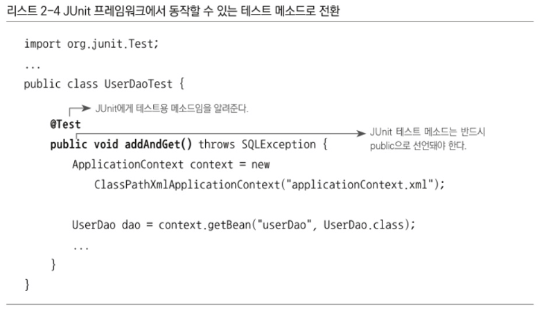

# 2장. 테스트

# 스프링이 개발자에게 제공하는 가장 중요한 가치 = 객체 지향, 테스트

스프링은 IoC와 DI를 이용해 객체지향 프로그래밍의 언어의 근본과 가치를 개발자가 손쉽게 적용하고 사용할 수 있게 도와주는 기술이다. 그리고 다른 하나의 도구로 스프링이 강조하고 가치를 두고 있는 것이 바로 테스트다.

애플리케이션은 계속 변하고 복잡해져 가고 그 변화에 대응하는 첫 번째 전략이 확장과 변화를 고려한 객체지향적 설계와 그것을 효과적으로 담아낼 수 있는 IoC/DI 같은 기술이라면, 두 번째 전략은 만들어진 코드를 확신할 수 있는 자신감을 주는 테스트 기술이다.

테스트의 작성은 스프링의 다양한 기술을 활용하는 방법을 이해하고, 검증하고, 실전에 적용하는 방법을 활용해서 스프링을 설명하고 있다.

## 2.1 UserDaoTest 다시보기

### 2.1.1 테스트의 유용성

보통 코드를 짤때는 머릿속으로 시뮬레이션 하는 방법이 있지만, 하지만 그것만으로는 이 코드가 정상 동작하는지 확신할 수 있을까?

그래서 저자가 정의한 테스트란 결국 내가 예상하고 의도했던 대로 코드가 정확히 동작하는지를 확인해서, 만든 코드를 확신할 수 있게 해주는 작업이다. 또한 테스트의 결과가 원하는 대로 나오지 않는 경우에는 코드나 설계에 결함이 있음을 알 수 있다. 이를 통해 코드의 결함을 제거하는 작업, 디버깅을 거치게 되고, 결국 최종적으로 테스트가 성공하면 모든 결함이 제거됐다는 확신을 얻을 수 있다.

### 2.1.2 UserDaoTest의 특징

```java
public class UserDaoTest {
    public static void main(String[] args) throws ClassNotFoundException, SQLException {
        ApplicationContext context = new GenericXmlApplicationContext("applicationContext.xml");
        UserDao dao = context.getBean("userDao", UserDao.class);

        User user = new User();
        user.setId("user");
        user.setName("백기선");
        user.setPassword("married");

        dao.add(user);

        System.out.println(user.getId() + "등록 성공");

        User user2 = dao.get(user.getId());
        System.out.println(user2.getName());
        System.out.println(user2.getPassword());

        System.out.println(user2.getId() + "조회 성공");
    }
}
```

이 테스트 코드의 내용을 정리해보면 다음과 같다.

- 자바에서 가장 손쉽게 실행 가능한 main() 메소드를 이용한다.
- 테스트할 대상인 userDao의 오브젝트를 가져와 메소드를 호출한다.
- 테스트에 사용할 입력 값(User 오브젝트)을 직접 코드에서 만들어 넣어준다.
- 테스트의 결과를 콘솔에 출력해준다.
- 각 단계의 작업이 에러 없이 끝나면 콘솔에 성공 메시지로 출력해준다.

이 테스트에서 가장 돋보이는건 main()메소드를 이용해 쉽게 테스트를 수행 가능하게 했다는 점, 테스트할 대상인 UserDao를 직접 호출해서 사용한다는 점이다.

### 웹을 통한 DAO 테스트 방법의 문제점

보통 웹 프로그램에서 사용하는 DAO를 테스트하는 방법은

DAO를 만든 뒤 바로 테스트하지 않고, 서비스 계층, MVC 계층까지 포함한 모든 입출력 기능을 대충이라도 코드로 다 만든 뒤 테스트용 웹 애플리케이션을 서버에 배치한 뒤, 웹 화면을 띄워 폼을 열고, 값을 입력한 뒤 검증한다.

이를 위해서는 폼의 값을 받아서 파싱한 뒤에 User 오브젝트로 만들고 UserDao를 호출해주는 기능이 이미 만들어져 있어야 한다.

이렇게 웹 하면을 통해 값을 입력하고, 기능을 수행하고, 결과를 확인하는 방법은 가장 흔히 쓰이는 방법이지만, DAO에 대한 테스트로서는 단점이 너무 많다.

→ DAO뿐만 아니라 서비스 클래스, 컨트롤러, JSP 뷰 등 모든 레이어의 기능을 다 만들고 나서야 테스트가 가능하다는 점이 가장 큰 문제이다.

하나의 테스트를 수행하는데 참여하는 클래스와 코드가 너무 많다. → 만약 에러가 뜬다면 간단히 원인을 찾아 낼 수 있을까?

정답은 쉽지 않다 이다. DB 연결 방법에 문제가 있을수도 있고, DAO 코드가 잘못되어 JDBC API를 잘못 호출해서일수도 있고 등등 사실 테스트의 대상은 UserDao였는데 다른 계층의 코드와 컴포넌트, 심지어 서버의 설정 상태까지 모두 테스트에 영향을 줄 수 있기 때문에 이런 방식으로 테스트하는 것은 번거롭고, 오류가 있을 때 빠르고 정확하게 대응하기가 힘들다는 문제가 있다.

그럼 이걸 어떻게 개선을 해볼까?

### 작은 단위의 테스트

테스트하고자 하는 대상이 명확하다면 그 대상에만 집중해서 테스트 하는 것이 바람직 하다.

너무 많은 것을 몰아서 테스트를 한다면 테스트 수행 과정도 복잡해지고, 오류가 발생했을 때 정확한 원인을 찾기가 힘들어진다.

→ 따라서 테스트는 가능하면 작은 단위로 쪼개서 집중해서 할 수 있어야 한다.

관심사의 분리라는 원리가 여기에도 적용된다. 테스트의 관심이 다르다면 테스트할 대상을 분리하고 집중해서 접근해야한다.

UserDaoTest는 한 가지 관심에 집중할 수 있게 작은 단위로 만들어진 테스트다.

테스트 수행에 웹 인터페이스, 웹을 만들기 위한 MVC 클랫, 서비스 오브젝트 등이 필요 없다.

만약 에러가 발생한다면 UserDao코드나 아니면 DB 연결 방법 정도에서 문제가 잇는 것이니 원인을 빠르게 찾아 낼 수 있다.

이렇게 작은 단위의 코드에 대해 테스트를 수행한 것을 **단위 테스트** 한다.

여기서 말하는 단위란 무엇인지, 그 크기와 범위가 어느 정도인지 딱 정해진 건 아니다.

크게는 사용자 관리 기능을 모두 통틀어서 하나의 단위로 볼 수도 있고, 작게 보자면 UserDao의 add()메소드 하나만 가지고 하나의 단위라고 생각할 수도 있다. 충분히 하나의 관심에 집중해서 효율적으로 테스트할 만한 범위의 단위라고 보면 된다.

**일반적으로 단위는 작을수록 좋다**. 단위를 넘어서는 다른 코드들은 신경 쓰지 않고, 참여하지도 않고 테스트가 동작할 수 있으면 좋다.

DAO라는 기능과 DB까지로 단위로 잡고 집중해서 테스트한 UserDaoTest는 단위 테스트일까?

정답은 맞다 이다. 지금까지 UserDaoTest를 수행할 때 매번 USER 테이블의 내용을 비우고 테스트를 진행했다. 사용할 DB의 상태를 테스트가 관장하고 있다면 이는 단위 테스트라고 해도 된다. 다만, DB의 상태가 매번 달라지고, 테스트를 위해 DB를 특정 상태로 만들어줄 수 없다면 그때는 UserDaoTest가 단위 테스트로서 가치가 없어진다.

때로는 웹 사용자 인터페이스부터 시작해서 DB에 이르기까지의 애플리케이션 전 계층이 참여하고, 또 단순 사용자 등록 작업 하나가 아니라, 초기 등록에서부터 시작해서 등록이 성공하면 로그인하고, 각종 기능을 모두 사용한 다음에 로그아웃까지 하는 전 과정을 하나로 묶어서 테스트할 필요가 있다.

각 단위 기능은 잘 동작하는데 묶어놓으면 안되는 경우가 종종 발생하기 때문이다.

이러한 테스트도 언젠가는 필요하다.

만약 이런 긴 테스트를 하다가 수많은 에러를 만나거나, 에러는 안 나지만 제데로 기능이 동작하지 않는 경험을 하게 될 것이다. 이때의 문제의 원인을 찾기가 매우 힘들다. 예외가 발생해도 그 이유를 찾는데 많은 시간이 걸릴 수 있다. 또 예외가 발생하지 않고 정상적으로 동작했는데 막상 결과가 원하는 대로 나오지 않을 수도 있다.

만약 각 단위별로 테스트를 먼저 모두가 진행하고 이런 긴 테스트를 시작했다면 어떨까?

→ 역시 예외가 발생하거나 테스트가 실패 할 수는 있겠지만, 이미 각 단위별로 충분한 검증을 마치고 오류를 잡았으므로 훨씬 나을것이다.

단위테스트를 하는 이유는 개발자가 설계하고 만든 코드가 원래 의도한 대로 동작하는지를 개발자 스스로 빨리 확인받기 위해서다.

이때 확인의 대상과 조건이 간단하고 명확할수록 좋다. 그래서 작은 단위로 제한해서 테스트하는 것ㅇ ㅣ편리하다.

### 자동수행 테스트 코드

UserDaoTest의 한 가지 특징은 테스트할 데이터가 코드를 통해 제공되고, 테스트 작업 역시 코드를 통해 자동으로 실행한다는 점이다.

```java
public class UserDaoTest {
    public static void main(String[] args) throws ClassNotFoundException, SQLException {
        ApplicationContext context = new GenericXmlApplicationContext("applicationContext.xml");
        UserDao dao = context.getBean("userDao", UserDao.class);

        User user = new User();
        user.setId("user");
        user.setName("백기선");
        user.setPassword("married");

        dao.add(user);

        System.out.println(user.getId() + "등록 성공");

        User user2 = dao.get(user.getId());
        System.out.println(user2.getName());
        System.out.println(user2.getPassword());

        System.out.println(user2.getId() + "조회 성공");
    }
}
```

UserDaoTest는 자바클래스의 main()메소드를 실행하는 가장 간단한 방법만으로 테스트의 전 과정이 자동으로 진행된다.

번거롭게 매번 입력할 필요도 없고, 테스트를 시작하기 위해 서버를 띄우고, 브라우저를 열어야하는 불편함도 없다. DB에 넣고 읽는 것까지 포함해서 1초 미만이면 충분한 코드이며, 하루에 100번 돌려도 2분도 안 걸린다.

그러니 테스트를 자주 수행해도 부담이 없다.

이렇게 테스트는 자동으로 수행되도록 코드로 만들어지는 것이 중요하다. 

자동으로 수행되는 테스트의 장점은 자주 반복할 수 있다는 것이다. 번거로운 작업이 없고 테스트를 빠르게 실행할 수 있기 때문에 언제든 코드를 수정하고 나서 테스트를 해ㅂ 볼 수 있다.

### 지속적인 개선과 점진적인 개발을 위한 테스트

테스트를 이용하면 새로운 기능도 기대한 대로 동작하는지 확인할 수 있을 뿐 아니라, 기존에 만들어뒀던 기능들이 새로운 기능을 추가하느라 수정한 코드에 영항을 받지 않고 여전히 잘 동작하는지를 확인할 수도 있다.

### 2.1.3 UserDaoTest의 문제점

- 수동 확인 작업의 번거로움

UserDaoTest는 테스트를 수행하는 과정과 입력 데이터의 준비를 모두 자동으로 진행하도록 만들어졌다.

하지만 여전히 사람의 눈으로 확인하는 과정이 필요한 한계점도 존재한다.

- 실행 작업의 번거로움

아무리 간단힌 실행 가능한 main() 메소드라고 하더라도 매번 그것을 실행하는 것은 제법 번거롭다.

만약 DAO가 수백개라면?

그래서 main() 메소드를 이용하는 방법보다 좀 더 편리하고 체계적으로 테스트를 실행하고 그 결과를 확인하는 방법이 필요하다.

## 2.2 UserDaoTest 개선

테스트의 결과에 대해서

모든 테스트는 성공과 실패의 두 가지 결과를 가질 수 있다.

또, 테스트의 실패는 테스트가 진행되는 동안에 에러가 발생해서 실패하는 경우와, 테스트 작업 중에 에러가 발생하진 않았지만 그 결과가 기대한 것과 다르게 나오는 경우로 구분해볼 수 있다.

```java
System.out.println(user2.getName());
System.out.println(user2.getPassword());

System.out.println(user2.getId() + "조회 성공");
```

이 코드는 단순히 콘솔에 출력만 했는데 조회 테스트가 모두 성공했다는 뜻은 아니였다.

이 코드를

```java
if (!user.getName().equals(user2.getName())){
	System.out.println("테스트 실패 (name)");
}

else if (!user.getPassword().equals(user2.getPassword())){
	System.out.println("테스트 실패 (password)");
}
else{
	System.out.println("조회 테스트 성공");
}
```

이렇게 개선한다면, name과 password 둘 중 어떤 것 때문에 실패 했는지 알 수 있다.

### 2.2.2 테스트의 효율적인 수행과 결과 관리

Junit은 이름 그대로 자바로 단위 테스트를 만들때 유용하게 쓸 수 있다.

JUnit은 프레임워크다. 프레임워크의 기본 동작원리가 바로 제어의 역전 IoC다.

프레임 워크는 개발자가 만든 클래스에 대한 제어 권한을 넘겨받아서 애플리케이션의 흐름을 제어한다. 개발자가 만든 클래스의 오브젝트를 생성하고 실행하는 일은 프레임워크에 의해 진행된다.

따라서 main 메소드도 필요 없고 오브젝트를 만들어서 실행시키는 코드를 만들 필요도 없다.

Junit에서는 기존에 만들었던 main() 메소드 테스튼느 적합하지 않다.

테스트 메소드는 JUnit 프레임워크가 요구하는 조건 두가지를 따라야 한다.

첫번째는 메소드가 public으로 선언돼야 하는것이고, 다른 하나는 메소드에 @Test라는 애노테이션을 붙여주는 것이다.



```java
if (!user.getName().equals(user2.getName())) {...};
```

이 코드를 JUnit이 제공하는 방법을 이용해 전환해보자면

```java
assertThat(user2.getName(), is(user.getName()));
```

if 문장의 기능을 assertThat이라는 스태틱 메소드를 이용해 위와 같이 변경 할 수 잇다.

assertThat() 메소드는 첫 번째 파라미터의 값을 뒤에 다오는 매처(matcher)라고 불리는 조건으로 비교해서 일치하면 다음으로 넘어가고 아니면 테스트가 실패하도록 만들어준다.

JUnit은 assertThat()에서 실패하지 않고 테스트 메소드의 실행이 완료되면 테스트가 성공했다고 인식한다.


JUnit은 aseertThat()을 이용해 검증을 했을 때 기대한 결과가 아니면 이 AssertionError를 던진다. 따라서 assertThat()의 조건을 만족하지 못하면 테스트는 더 이상 진행되지 않는다.

지금까지 UserDaoTest를 하면서 불편했던 일은 매번 UserDaoTest 테스트를 실행하기 전에 DB의 USER 테이블 데이터를 모두 삭제해줘야 할 때였다. 여기서 생각해볼 문제는 테스트가 외부 상태에 따라 성공하기도 하고 실패하기도 한다는 점이다.

테스트는 항상 동일한 결과를 내야한다.

테스트가 실패하기도 하고 성공하기도 한다면 좋은 테스트라고 할 수 없다.

UserDaoTest의 문제는 이전 테스트 때문에 DB에 등록된 중복 데이터가 있을 수 있다는 점이다. 가장 좋은 해결책은 addAndGet() 테스트를 마치고 나면 테스트가 등록한 사용자 정보를 삭제해서, 테스트를 수행하기 이전 상태로 만들어 주는 것이다.


여기서 한가지 생각해볼 문제가 있다. get() 메소드에 전달된 id값에 해당하는 사용자 정보가 없다면 어떻게 될까?

일단 두가지 방법이 존재한다. null과 같은 특별한 값을 리턴하는 것과 id에 해당하는 정보를 찾을 수 없다고 예외를 던지는것

아래 코드는 스프링의 EmptyResultDataAccessException예외를 이용한 예외처리 코드이다.


이번에는 테스트 진행 중에 특정 예외가 던져지면 테스트가 성공한 것이고, 예외가 던져지지 않고 정상적으로 작업을 마치면 테스트가 실패했다고 판단해야 한다.

@Test 어노테이션에 expected를 추가해놓으면 보통의 테스트와는 반대로, 정상적으로 메소드를 마치면 테스트가 실패하고, expected에서 지정한 예외가 던져지면 테스트가 성공한다.


### 항상 네거티브 테스트를 먼저 만들라

개발자가 테스트를 직접 만들 때 자주 하는 실수가 하나 있다. 바로 성공하는 테스트만 골라서 만드는 것이다. 개발자는 머릿속으로 이 코드가 잘 돌아가는 케이스를 상상하면서 코드를 만드는 경우가 일반적이다. 그래서 테스트를 작성할 때도 문제가 될 만한 상황이나, 입력 값 등은 교묘히도 잘 피해서 만드는 습성이 있다.

그래서 테스트를 작성할 때 부정적인 케이스를 먼저 만드는 습관을 들이는게 좋다.


getUserFailure()테스트에는 만들고 싶은 기능에 대한 조건과 행위, 결과에 대한 내용이 잘 표현되어 있다. 테스트 코드의 내용을 정리해보면 위와 같다.

### TDD

만들고자 하는 기능의 내용을 담고 있으면서 만들어진 코드를 검증도 해줄 수 있도록 테스트 코드를 먼저 만들고, 테스트를 성공하게 해주는 코드를 작성하는 방식의 개발 방법이 있다. 이를 테스트 주도 개발(TDD)라고 한다. 또는 텟스트를 코드보다 먼저 작성한다고 해서 테스트 우선 개발이라고도 한다. TDD는 개발자가 테스트를 만들어가며 개발하는 방법이 주는 장점을 극대화한 방법이라고 볼 수 있다.

TDD의 기본 원칙은 **실패한 테스트를 성공시키기 위한 목적이 아닌 코드는 만들지 않는다**. 이다.

이 원칙을 따랐다면 만들어진 모든 코드는 빠짐없이 테스트로 검증된 것이라고 볼 수 있다.

TDD는 아예  테스트를 먼저 만들고 그 테스트가 성공하도록 하는 코드만 만드는 식으로 진행하기 때문에 테스트를 빼먹지 않고 꼼꼼하게 만들어낼 수 있다. 또한 테스트를 작성하는 시간과 애플리케이션 코드를 작성하는 시간의 간격이 짧아진다. 사실 코드를 만들고 테스트를 수행할 때까지 걸리는 시간은 0에 가깝다.

TDD에서는 테스트 작성하고 이를 성공시키는 코드를 만드는 작업의 주기를 가능한 짧게 가져가도록 권장한다.

모든 개발자는 TDD는 몰라도 이미 테스트가 개발을 이끌어가는 방식으로 개발을 하고 있다고 생각한다.

상상해보자. 새로운 기능을 가진 코드를 만들려고 하는 순간, 개발자의 머릿속에서는 ‘이런 조건하에서 이런 작업을 하면 이런 결과가 나올 것이다’ 라는 식으로 기능을 먼저 정리하게 될 것이다. 그리고 코드를 작성하는 동안에도 코드를 눈으로 훑어보면서, ‘이런 조건의 값이 들어오면 코드의 흐름과 조건을 따라 이렇게 진행돼서 이런 결과 값이 나오겠다’라는 식으로 시뮬레이션을 계속 하게 된다. 그렇다면 개발자의 머릿속에서는 테스트가 미리 만들어지고 개발 중에 계속 실행된다고 볼 수 있지 않을까? 코드를 살펴보다가 이런 경우에는 문제가 발생하겠다는 생각이 들면 코드를 수정할 것이다. 문제는 일허게 머릿속에서 진행되는 테스트는 제약이 심하고, 오류가 많고, 나중에 다시 반복하기가 힘들다는 점이다. 그래서 차라리 머릿속에서 복잡하게 진행하던 작업을 실제 코드로 끄집어 내놓으면 이게 바로 TDD가 된다.

TDD를 하면 자연스럽게 단위 테스트를 만들 수 있다.

TDD의 장점 중 하나는 코드를 만들어 테스트를 실행하는 그 사이의 간격이 매우 짧다는 점이다.

UserDaoTest 코드를 잘 살펴보면 기계적으로 반복되는 부분이 눈에 띈다.

```java
 ApplicationContext context = new GenericXmlApplicationContext("applicationContext.xml");
        UserDao dao = context.getBean("userDao", UserDao.class);
```

스프링의 애플리케이션 컨텍스트를 만드는 부분과 컨텍스트에서 UserDao를 가져오는 부분이 중복된다.

중복된 코드는 별도의 메소드로 뽑아내는 것이 가장 손쉬운 방법이다.

이런 고민을 해결해주기 위해 JUnit에는 @Before 어노테이션이 있다.


JUnit.이 하나의 테스트 클래스를 가져와 테스트를 수행하는 방식은 다음과 같다.

1. 테스트 클래스에서 @Test가 붙은 public이고 void형이며 파라미터가 없는 테스트 메소드를 모두 찾는다.
2. 테스트 클래스의 오브젝트를 하나 만든다.
3. @Before가 붙은 메소드가 있으면 실행한다.
4. @Test가 붙은 메소드를 하나 호출하고 테스트 결과를 저장해둔다.
5. @After가 붙은 메소드가 있으면 실행한다.
6. 나머지 테스트 메소드에 대해 2~5번을 반복한다.
7. 모든 테스트의 결과를 종합해서 돌려준다.

@Before나 @After 메소드를 테스트 메소드에서 직접 호출하지 않기 때문에 서로 주고받을 정보나 오브젝트가 있다면 인스턴스 변수를 이용해야 한다.

각 테스트 메소드를 실행할 때마다 테스트 클래스의 오브젝트를 새로 만든다는 점은 꼭 기억해야 한다.

한번 만들어진 테스트 클래스의 오브젝트는 하나의 테스트 메소드를 사용하고 남녀 버려진다. 테스트 클래스가 @Test 테스트 메소드를 두 개 갖고 있다면, 테스트가 실행되는 중에 JUnit은 이 클래스의 오브젝트를 두 번 만들것이다.


왜? 테스트 메소드를 실행할 때마다 새로운 오브젝트를 만드는 것일까?

그냥 클래스당 하나의 오브젝트만 만들어놓고 사용하는 편이 성능도 낫고 더 효율적이지 않을까?

정답은 JUnit은 각 테스트가 서로 영향을 주지 않고 독립적으로 실행됨을 확실히 보장해주기 위해 매번 새로운 오브젝트를 만들게 했다. 덕분에 인스턴수 변수도 부담 없이 사용할 수 있다. 어차피 다음 테스트 메소드가 실행될 때는 새로운 오브젝트가 만들어져서 다 초기화될 것이다.

만약 테스트 메소드의 일부에서만 공통적으로 사용되는 코드가 있다면?

이때는 @Before를 써야할까? 그러지 말고 일반적인 메소드 추출 방법을 써서 메소드를 분리하고 테스트 멧소드에서 직접 호출해 사용하도록 만드는 편이 낫다. 아니면 공통적인 특징을 지닌 테스트 메소드를 모아서 별도의 테스트 클래스로 만드는 방법도 생각해볼 수 있다.

### 픽스처

테스트를 수행하는데 필요한 정보나 오브젝트를 픽스처라고 한다. 일반적으로 픽스처는 여러 테스트에서 반복적으로 사용되기 때문에 @Before 메소드를 이용해 생성해두면 편리하다. UserDaoTest에서는 dao가 대표적인 픽스처이다.


## 2.4 스프링 테스트 적용

@Before메소드가 테스트 메소드 개수만큼 반복되기 때문에 애플리케이션 컨텍스트도 메소드 개수만큼 만들어진다.

지금은 설정도 간단하고 빈도 몇 개 없어서 별문제 아닌 듯하지만, 빈이 많아지고 복잡해지면 애플리케이션 컨텍스트 생성에 적지 않은 시간이 걸릴 수 있다.

Application Context가 만들어질 때는 모든 싱글톤 빈 오브젝트를 초기화한다.

단순히 빈 오브젝트를 만드는 정도라면 상관없지만, 어떤 빈은 오브젝트가 생성될 때 자체적인 초기화 작업을 진행해서 제법 많은 시간을 필요로 하기 때문이다. 또 한 가지 문제는 Application Context가 초기화될 때 어떤 빈은 독자적으로 많은 리소스를 할당하거나 독립적인 스레드를 띄우기도 한다는 점이다.

Application Context는 초기화되고 나면 내부의 상태가 바뀌는 일은 거의 없다. 빈은 싱글톤으로 만들었기 때문에 상태를 갖지 않는다(stateless). DB의 상태는 각 테스트에서 알아서 관리할 것이므로 문제가 되지 않는다.

따라서 Application Context는 한번만 만들고 여러 테스트가 공유해서 사용해도 된다.

문제는 JUnit은 매번 테스트 클래스의 오브젝트를 새로 만든다는 점이다. 따라서 여러 테스트가 함께 참조할 애플리케이션 컨텍스트를 오브젝트 레벨에 저장해두면 곤란하다.

```java
public class test{

private ApplicationContext context;

}
```

만약 이런식으로 되어있다면

매번 테스트 클래스의 오브젝트를 새로 만들기 때문에 context가 서로 다른 객체의 인스턴스 필드 공간에 존재하기 때문이다.

정답은 static필드에 저장한다. JUnit은 테스트 클래스 전체에 걸쳐 딱 한 번만 실행되는 @BeforeClass 스태틱 메소드를 지원한다. 이 메소드에서 Application Context를 만들어 스태틱 변수에 저장해두고 테스트 메소드에서 사용하게 할 수 있다.

하지만 이보다 스프링이 직접 제공하는 애플리케이션 컨텍스트 테스트 지원 기능을 사용하는 것이 더 편리하다.


인스턴스 변수인 context는 어디에서도 초기화 해주는 코드가 없는데 해당 코드를 동작하면 정상적으로 된다.

이유는 @RunWith과 @ContextConfiguration에 있다.

@RunWith은 JUnit 프레임워크의 테스트 실행 방법을 확장할 때 사용하는 어노테이션이다. SpringJUnit4ClassRunner라는 JUnit이 테스트를 진행하는 중에 테스트가 사용할 Application Context를 만들고 관리하는 작업을 진행해준다.

@ContextConfiguration은 자동으로 만들어줄 Application Context의 설정파일 위치를 지정한 것이다.


정말 똑같은 context인지 테스트하는 코드를 실행시켰고 결과를 보면 각기 다른 클래스에 Application Context만 같이 나와있다.

스프링의 JUnit 확장기능은 테스트가 실행되기 전에 딱 한번만 Application Context를 만들어두고, 테스트 오브젝트가 만들어 질 때마다 특별한 방법을 이용해 Application Context 자신을 테스트 오브젝트의 특정 필드에 주입해주는 것이다. 일종의 DI라고 볼 수 있는데, 어플리케이션 오브젝트 사이의 관계를 관리하기 위한 DI와는 조금 성격이 다르다.

실행될때 최초로 Application Context가 처음 만들어지면서 가장 오랜 시간이 소모되고, 그 다음부터는 이미 만들어진 Application Context를 재사용할 수 있기 때문에 테스트 실행 시간이 매우 짧아지는 것이다.


스프링 테스트 컨텍스트 프레임워크의 기능은 하나의 테스트 클래스 안에서 애플리케이션 컨텍스트를 공유해주는 것이 전부는 아니다. 여러 개의 테스트 클래스가 있는데 모두 같은 설정파일을 가진 Application Context를 사용한다면, 스프링은 테스트 클래스 사이에서도 Application Context를 공유하게 해준다.

### @Autowired

@Autowired는 스프링의 DI에 사용되는 특별한 어노테이션이다.

@Autowired가 붙은 인스턴스 변수가 있으면, 테스트 컨텍스트 프레임워크는 변수 타입과 일치하는 컨텍스트 내의 빈을 찾는다. 타입이 일치하는 빈이 있으면 인스턴수 변수에 주입해준다. 일반적으로 주입을 위해서는 생성자나 수정자 메소드 같은 메소드가 필요하지만, 이 경우에는 메소드가 없어도 주입이 가능하다. 또 별도의 DI 설정 없이 타입정보를 이용해 빈을 자동으로 가져올 수 있는데, 이런 방법을 자동와이어링이라고 한다.

근데 여기서 의문점? 아까 만든 테스트 코드에서는 applicationContext.xml 파일에 정의된 빈이 아니라, ApplicationContext라는 타입의 변수에 @Autowired를 붙였는데 Application Context가 DI됐다.

왜 일까?

Spring Application Context는 초기화할 때 자기 자신도 빈으로 등록한다. 따라서 Application Context에는 ApplicationContext타입의 빈이 존재하는 셈이고 DI도 가능한 것이다.


@Autowired를 이용해 ApplicationContext가 갖고 있는 빈을 DI 받을 수 있다면 굳이 컨텍스트를 가져와 getBean()을 사용하는 것이 아니라, 아예 UserDao 빈을 직접 DI 받을 수도 있을 것이다.

Application Context를 DI 받아서 다시 DL 방식으로 userDao를 가져올때보다 코드가 더 깔끔 해졌다.

### 2.4.2 DI와 테스트


@DirtiesContext 어노테이션은 스프링의 테스트 컨텍스트 프레임 워크에게 해당 클래스의 테스트에서 애플리케이션 컨텍스트의 상태를 변경한다는 것을 알려준다. 태스트 켄특스트는 이 어노테이션이 붙은 테스트 클래스에는 Application Context 공유를 허용하지 않는다. 테스트 메소드를 수행하고 나면 매번 새로운 Application Context를 만들어서 다음 테스트가 사용하게 해준다. 테스트 중에 변경한 컨텍스트가 뒤의 테스트에 영향을 주지 않게 하기 위해서다.


위 코드는 직접 @Before단계에서 직접 DI를 하는 코드이다.

IoC컨테이너 없이 수동 DI만을 이용한 테스트이다.

UserDao는 스프링의 API에 의존하지 않고 자신의 관심에만 집중해서 깔끔하게 만들어진 코드이기 때문에 가능했다. 이런 가볍고 깔끔한 테스트를 만들 수 있는 이유도 DI를 적용했기 때문이다.

DI는 객체지향 프로그래밍 스타일이다. 따라서 DI를 위해 컨테이너가 반드시 필요한 것은 아니다. DI 컨테이너나 프레임 워크는 DI를 편하게 적용하도록 도움을 줄 뿐, 컨테이너가 DI를 가능하게 해주는 것은 아니다.

침투적 기술 : 기술을 적용했을 때 애플리케이션 코드에 기술 관련 API가 등장하거나, 특정 인터페이스나 클래스를 사용하도록 강제하는 기술을 말한다. 침투적 기술을 사용하면 애플리케이션 코드가 해당 기술에 종속되는 결과를 가져온다.

비침투적 기술 : 애필리케이션 로직을 담은 코드에 아무런 영향을 주지않고 적용이 가능하다. 따라서 기술에 종속적이지 않은 순수한 코드를 유지할 수 있게 해준다. 스프링은 이런 비침투적인 기술의 대표적인 예다.

스프링 컨테이너 없는 DI 테스트도 가능한 이유이다.

## 2.5 학습 테스트로 배우는 스프링

자신이 만들지 않은 프레임워크나 다른 개발팀에서 만들어서 제공한 라이브러리 등에 대해서도 테스트를 작성해야 한다.

이런 테스트를 학습 테스트라고 한다.

목적 : 자신이 사용할 API나 프레임워크의 기능을 테스트로 보면서 사용 방법을 익히려는 것이다.

### 2.5.1 학습 테스트의 장점

- 다양한 조건에 따른 기능을 손쉽게 확인해볼 수 있다.
- 학습 테스트 코드를 개발중에 참고할 수 있다.
- 프레임워크나 제품을 업그레이드할 때 호환성 검증을 도와준다.
- 테스트 작성에 대한 좋은 훈련이 된다.
- 새로운 기술을 공부하는 과정이 즐거워진다.

### 2.5.3 버그 테스트

버그 테스트란 코드에 오류가 있을 때 그 오류를 가장 잘 드러내줄 수 있는 테스트를 말한다.

버그 테스트는 일단 실패하도록 만들어야 한다. 버그가 원인이 되서 테스트가 실패하는 코드를 만드는 것이다.

필요성과 장점은 다음과 같다.

- 테스트의 완성도를 높여준다.
- 버그의 내용을 명확하게 분석하게 해준다.
- 기술적인 문제를 해결하는 데 도움이 된다.

동등분할 : 같은 결과를 내는 값의 범위를 구분해서 각 대표 값으로 테스트를 하는 방법을 말한다. 어떤 작업의 결과의 종류가 true, false 또는 예외발생 세 가지라면 각 결과를 내는 입력 값이나 상황의 조합을 만들어 모든 경우데 대한 테스트를 해보는 것이 좋다.

경계값 분석: 에러는 동등분할 범위의 경계에서 주로 많이 발생한다는 특징을 이용해서 경계의 근처에 있는 값을 이용해 테스트하는 방법이다. 보통 숫자의 입력 값인 경우 0이나 그 주변 값 또는 정수의 최대값, 최소값 등으로 테스트해보면 도움이 될 때가 많다.