# 탬플릿이란?
- 성질이 다른 코드 중 변경이 거의 일어나지 않으며 일정한 패턴으로 유지되는 특성을 가진 부분을 자유롭게 변경되는 성질을 가진 부분으로부터 독립시켜 효과적으로 활용할 수 있도록 하는 방법

----

# 리소스 반환과 close()
## close() 메소드
- Connection이나 PreparedStatement에 있는 메소드
- 리소스를 반환한다는 의미
- Connection과 PreparedStatement는 보통 풀 방식으로 운영
  - 이 때 미리 정해진 풀 안에 제한된 수의 리소스 생성을 해 놓고 이용
  - 필요할 때 할당, 반환하면 다시 풀에 넣음
## 요청이 많을 경우
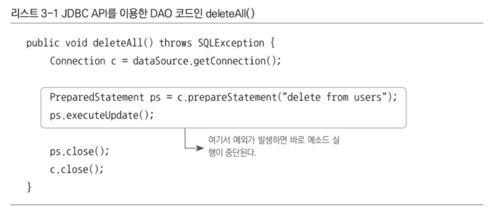
- 요청이 많은 서버 환경의 경우 매번 새로운 리소스를 생성하는 대신 풀에 미리 만들어둔 리소스를 돌려가며 사용하는 것이 유리
- 단, 사용한 리소스는 빠르게 반환해야 함
- 제대로 반환되지 않으면 미리 만들어둔 풀에 있는 리소스들이 고갈, 문제 발생
## DB 커넥션을 사용하는 코드에서 에러가 발생할 경우
- 에러가 발생해 해당 코드가 정상적으로 끝마쳐지지 못 할 경우 close() 메소드가 실행되지 않을 수 있음
- 해당 코드를 다시 실행하고 에러가 다시 발생하는 경우가 반복될 경우 리소스가 반환되지는 않고 풀에서 계속 가져가기만 함
- 리소스 고갈로 문제 발생
- 장기간의 작동이 요구되는 서버 환경에서는 치명적인 문제
## 따라서 try-catch-finally 구문 사용을 권장
- 예외가 발생할 부분을 try 구문에 넣고 finally 구문을 사용해 어떤 상황에도 close() 메소드를 실행해 메소드 반환

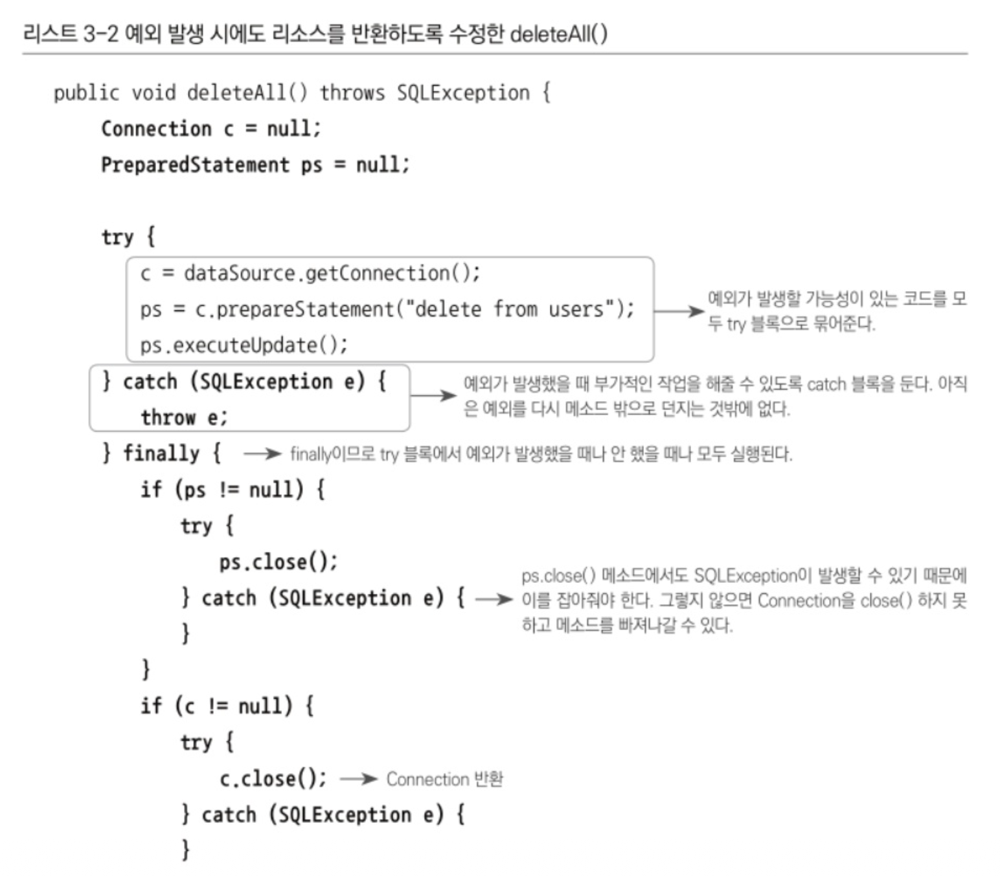
- 하지만 시점에 따라 Connection과 PreparedStatement 둘 중 값이 null인 경우도 있을 것이기 때문에 null 체크가 필수
- close() 메소드도 예외가 발생할 수 있기 때문에 try-catch 구문으로 감싸야 함 

----

# 분리와 재사용을 위한 디자인 패턴 적용
- 앞서 본 try-catch 구문은 다른 부분에서도 반복적으로 사용될 수 있음
- 매번 복사 붙여넣기를 하는 것 보다는 다른 방식을 사용하는게 현명

## 메소드 추출
- 변하지 않는 부분을 메소드로 빼는 것

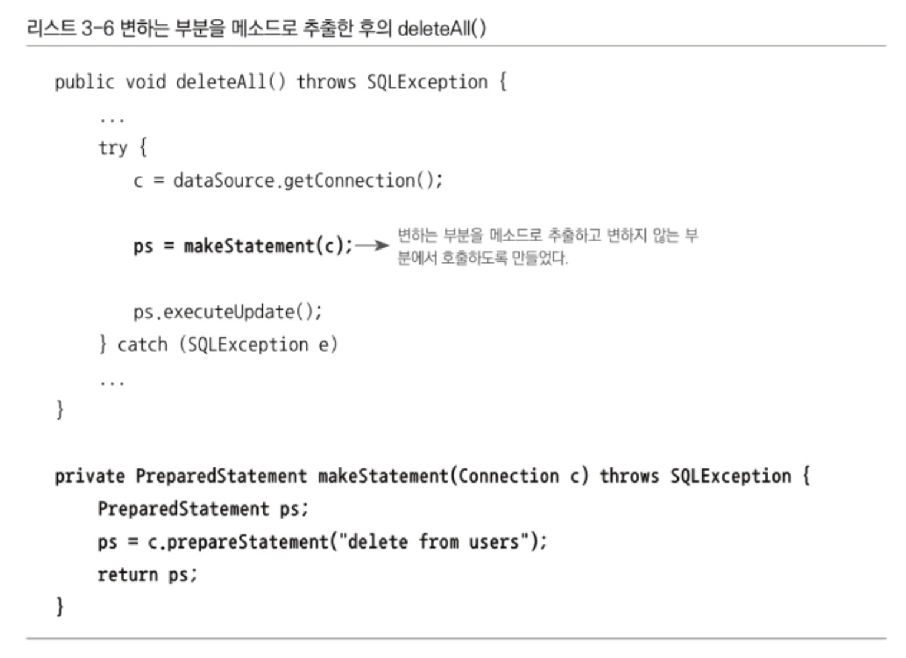
- 추출한 메소드를 다른 곳으로 뽑아 사용하지 못 하기 때문에 의미 없음

## 템플릿 메소드 패턴 적용
- 상속을 통해 기능을 확장해 사용하는 부분
- 변하지 않는 부분은 슈퍼클래스에 두고 변하는 부분은 추상 메소드로 정의해 서브클래스에서 오버라이딩해 사용

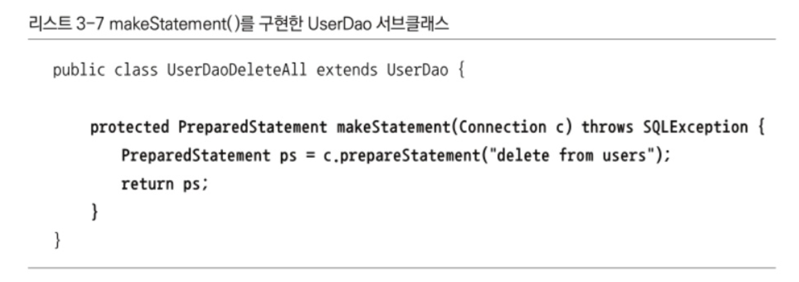
- `makeStatement()` 메소드를 추상 메소드로 선언
- UserDao에서 오버라이딩해 사용
### 단점
- DAO 로직마다 상속을 통해 새로운 클래스를 만들어줘야 함
  - 메소드 개수마다 서브클래스를 하나씩 만들어줘야 하는 번거로움 존재
- 확장 구조가 클래스 설계 시점에서 고정
  - 상속을 이용하기 때문에 관계에 대한 유연성이 떨어짐
  
## 전략 패턴 적용
- 오브젝트를 아예 둘로 분리하고 클래스 레벨에서는 인터페이스를 통해서만 의존하도록 만드는 전략 패턴
- OCP(개방폐쇄원칙) 관점에서 보면 확장에 해당하는 변하는 부분을 별도의 클래스로 만들어 추상화된 인터페이스를 통해 위임하는 방식

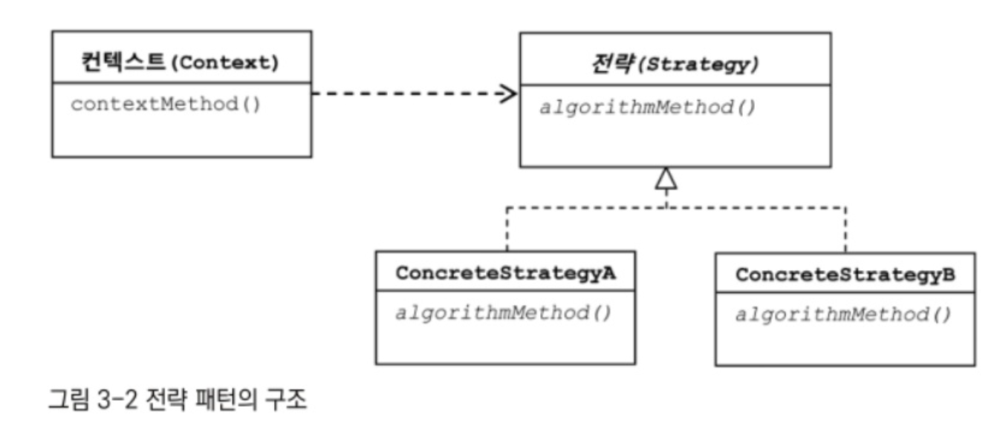
- 특정 기능은 Strategy 인터페이스의 외부의 독립된 전략 클래스에 위임
### 현재 deleteAll()의 컨텍스트
1. DB 커넥션 가져오기
2. PreparedStatement를 만들어줄 외부 기능 호출
3. 전달받은 PreparedStatement 실행
4. 예외 발생 시 메소드 밖으로 던짐
5. 모든 경우에 만들어진 PreparedStatement와 Connection을 닫기
- 2번의 PreparedStatement를 만드는 외부 기능이 전략 패턴에서의 전략
  - 즉, 해당 기능을 인터페이스로 만듬
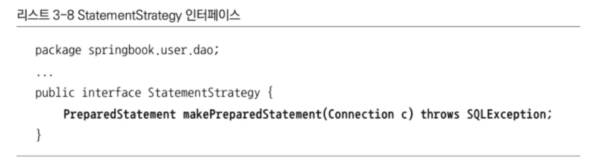
- 외주를 맡기는 것인데 이 때 호출할 때 컨텍스트 내에서 만들어준 DB 커넥션을 전달해야 함

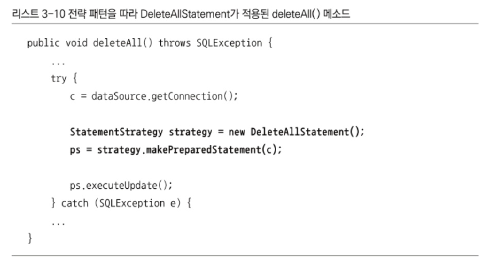
- 단, 컨텍스트 안에서 구체적인 전략 클래스인 `DeleteAllStatement`를 사용하도록 고정되어 있는 것은 좋지 않음
  - 전략을 바꿔쓸 수 없는 것

## DI 적용을 위한 클라이언트/컨텍스트 분리
### 전략 패턴의 실제적인 사용 방법
- Context가 어떤 전략을 사용하게 할 것인가는 Context를 사용하는 앞단의 Client가 결정하는 것이 일반적
- Client가 구체적인 전략을 하나 선택해 오브젝트로 만들고 Context에 전달하는 것
- Context는 전달받은 Strategy 구현 클래스의 오브젝트 사용

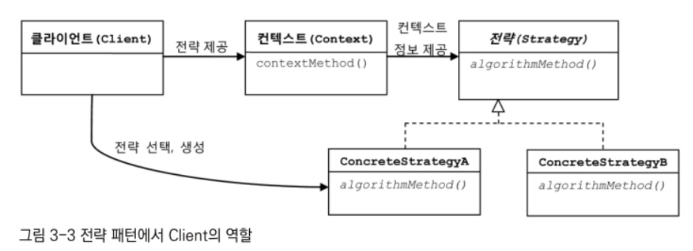
- 이전에 DI를 이용해 관심사를 분리했던 것과 유사
### deleteAll() 메소드 구성
- 클라이언트에 들어가야 할 코드: `StatementStrategy strategy = new DeleteAllStatement();`
- 컨텍스트에 해당하는 부분은 메소드로 독립시켜야 함
- 클라이언트는 전략 클래스의 오브젝트를 컨텍스트의 메소드를 호출하며 전달해야 함
  - 따라서 전략 인터페이스인 StatementStrategy를 컨텍스트 메소드 파라미터로 지정
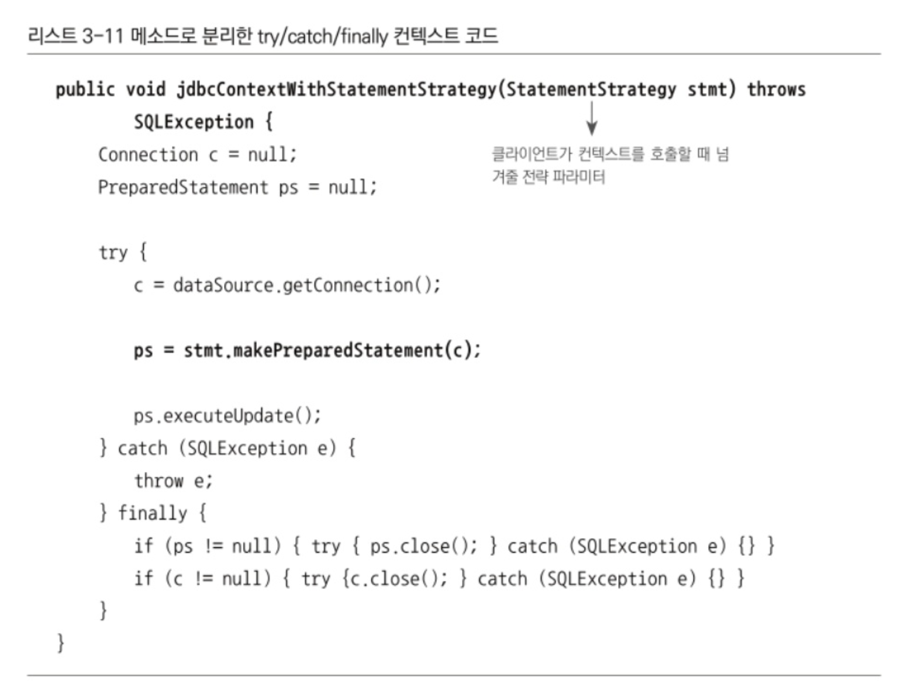
- `PreparedStatement()` 구문을 제공받은 전략에 따라 사용
- 변경된 deleteAll() 메소드는 다음과 같음

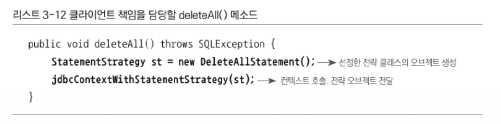
- 클라이언트가 컨텍스트를 사용할 전략을 정해서 전달한다는 면에서 DI 구조라 할 수 있음
### 마이크로 DI
- 보통은 의존관계의 객체 2개, 오브젝트 팩토리, 객체를 사용하는 클라이언트 이렇게 4개의 객체 사이에서 DI가 발생
- 하지만 가끔 클라이언트가 오브젝트 팩토리의 역할을 함께 하거나 클라이언트와 의존 객체가 결합되거나 클라이언트와 의존 객체 두 개가 모두 하나의 클래스에 담길 수도 있음
- 이러한 경우 작은 단위의 코드나 메소드에서 DI가 일어나기도 함
- IoC 컨테이너의 도움 없이 코드 내에서 적용한 경우를 마이크로 DI라고도 함

---- 

# JDBC 전략 패턴의 최적화
- 컨텍스트에 해당하는 `jdbcContextWithStatementStrategy()` 메소드에 사용할 적절한 전략, 즉 필요한 로직을 제공해 주는 방법으로 사용 가능
- 컨텍스트는 `PreparedStatement`를 실행하는 JDBC의 작업 흐름
- 전략은 `PreparedStatement`를 생성하는 것

## 전략 클래스의 추가 정보 
### add() 메소드에도 적용
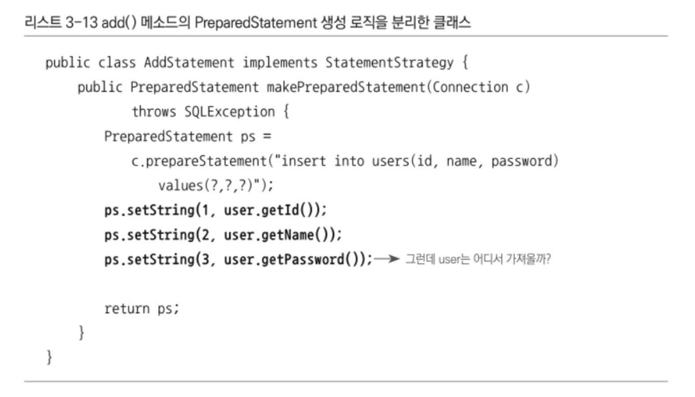
- 변하는 부분인 `PreparedStatement`를 만드는 코드를 `AddStatement` 클래스로 이동
- 이 때 user라는 정보가 `PreparedStatement`를 생성할 때 필요하기 때문에 컴파일 에러 발생
  - 따라서 해당 부분 추가

- 이후 add() 메소드에서 user 정보를 생성자로 전달하도록 수정

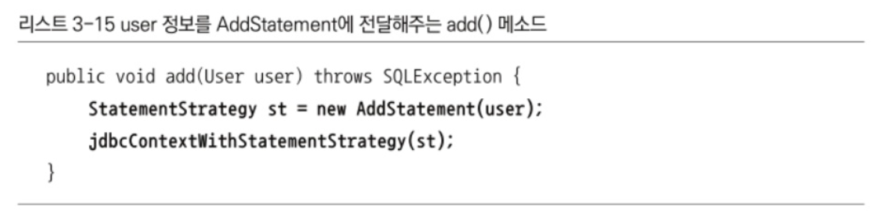

## 전략과 클라이언트의 동거
### 현 구조의 문제점
- DAO 메소드마다 새로운 `StatementStrategy`를 구현해 줘야 함
  - 클래스 파일의 개수 증가
  - 이러면 템플릿 메소드 패턴을 적용했던 것과 비슷
- `StatementStrategy`에 전달할 `User`와 같은 부가 정보가 있는 경우 오브젝트를 전달받을 생성자와 이를 저장해둘 인스턴수 변수를 만들어야 함
### 로컬 클래스로 해결
- 클래스 파일이 많아지는 문제에 대한 해결
- `StatementStrategy` 전략 클래스를 매번 독립된 파일로 만들지 않고 UserDao 클래스 안의 내부 클래스로 정의하는 것
- `DeleteAllStatement`나 `AddStatement`는 `UserDao` 밖에서는 사용되지 않기 때문에 가능한 방법

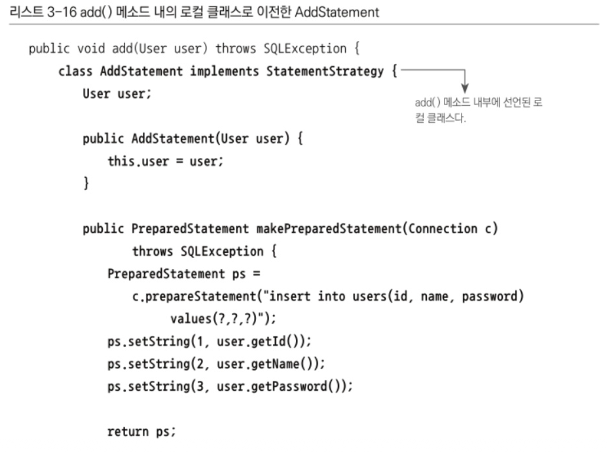
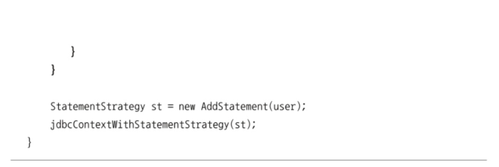
- 중첩 클래스의 종류
  - 다른 클래스 내부에 정의되는 클래스를 중첩 클래스라 부름
  - 종류 1. 독립적으로 오브젝트로 만들어질 수 있는 스태틱 클래스
  - 종류 2. 자신이 정의된 클래스의 오브젝트 안에서만 만들어질 수 있는 내부 클래스
    - 범위에 따라 3가지로 분류
      1. 멤버 내부 클래스: 멤버 필드처럼 오브젝트 레벨에 정의
      2. 로컬 클래스: 메소드 레벨에 정의
        - 불필요하게 클래스 파일을 생성하지 않아도 되고 하나의 파일에 있기 때문에 코드를 이해하기도 쉬움
        - 내부 클래스이기 때문에 자신이 선언된 곳의 정보에 접근 가능
          - 즉, 메소드의 파라미터로 들어오는 값 사용 가능
      3. 익명 내부 클래스: 이름을 갖지 않음
        - 익명 내부 클래스의 범위는 선언된 위치에 따라 다름
        - 클래스 선언과 오브젝트 생성이 결합된 형태로 만들어짐
        - 상속할 클래스나 구현할 인터페이스를 생성자 대신 사용
        - 선언과 동시에 오브젝트 생성
        - 이름이 없기 때문에 클래스 자신의 타입을 가질 수 없고 구현한 인터페이스 타입의 변수에만 저장 가능
        - 클래스를 재사용할 필요가 없고 구현한 인터페이스 타입으로만 사용할 경우에 유용
        - `new 인터페이스이름() { 클래스 본문 };`
- add() 메소드의 파라미터를 사용하도록 수정
 
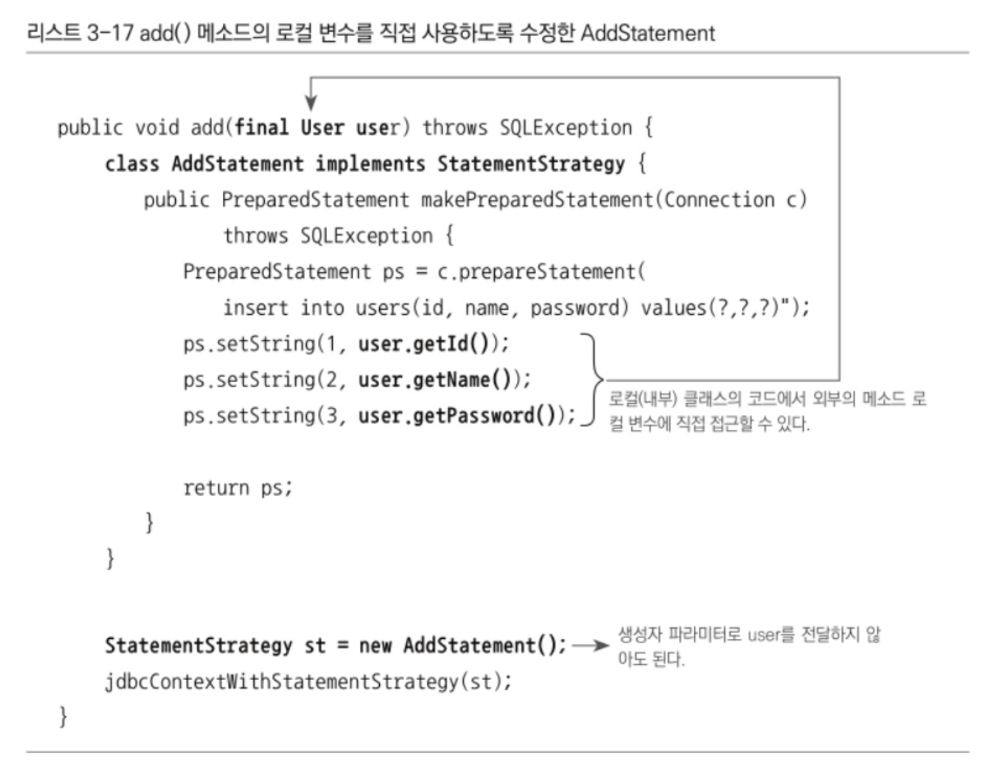
### 익명 클래스 사용
- `AddStatement`를 익명 내부 클래스로 변경

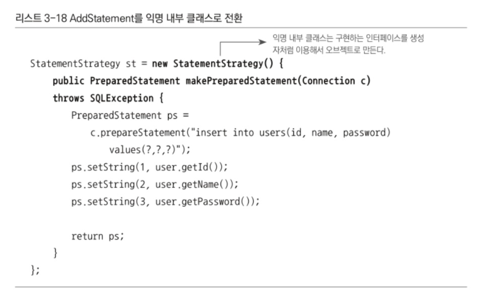
- 익명 내부 클래스의 오브젝트는 한 번만 사용하니 굳이 변수에 담아두지 않아도 됨
- 따라서 사용할 곳인 `jdbcContextWithStatementStrategy` 메소드의 파라미터에서 만들어 사용하는 것이 효율적

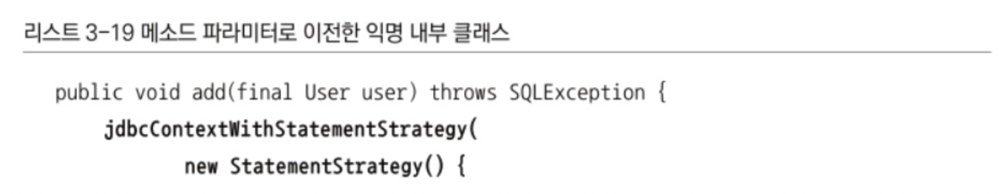
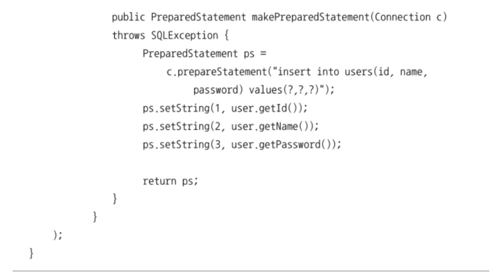

----

# 컨텍스트와 DI
- 컨텍스트, 즉 `PreparedStatement`를 실행하는 기능인 `jdbcContextWithStatementStrategy` 메소드는 다른 DAO에서도 사용하는 기능
- 따라서 UserDao 클래스 밖으로 독립시켜 모든 DAO가 사용하도록 하는 것이 좋음

## 클래스 분리
- JdbcContext라는 클래스로 분리
- 컨텍스트 메소드를 `workWithStatementStrategy` 메소드로 JdbcContext로 이동
- 이 때 DB 커텍션을 필요로 하는 코드는 JdbcContext 안에 있기 때문에 Datasource 타입 빈을 DI받을 수 있도록 해야함

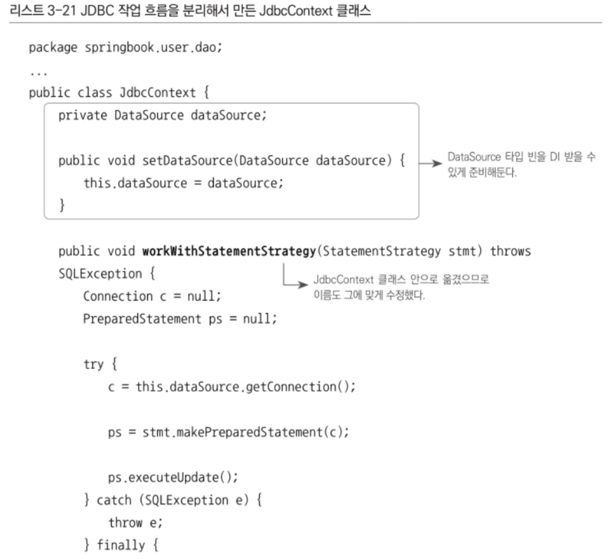
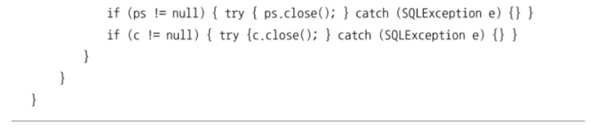
- UserDao가 JdbcContext를 DI받아 사용할 수 있도록 변경

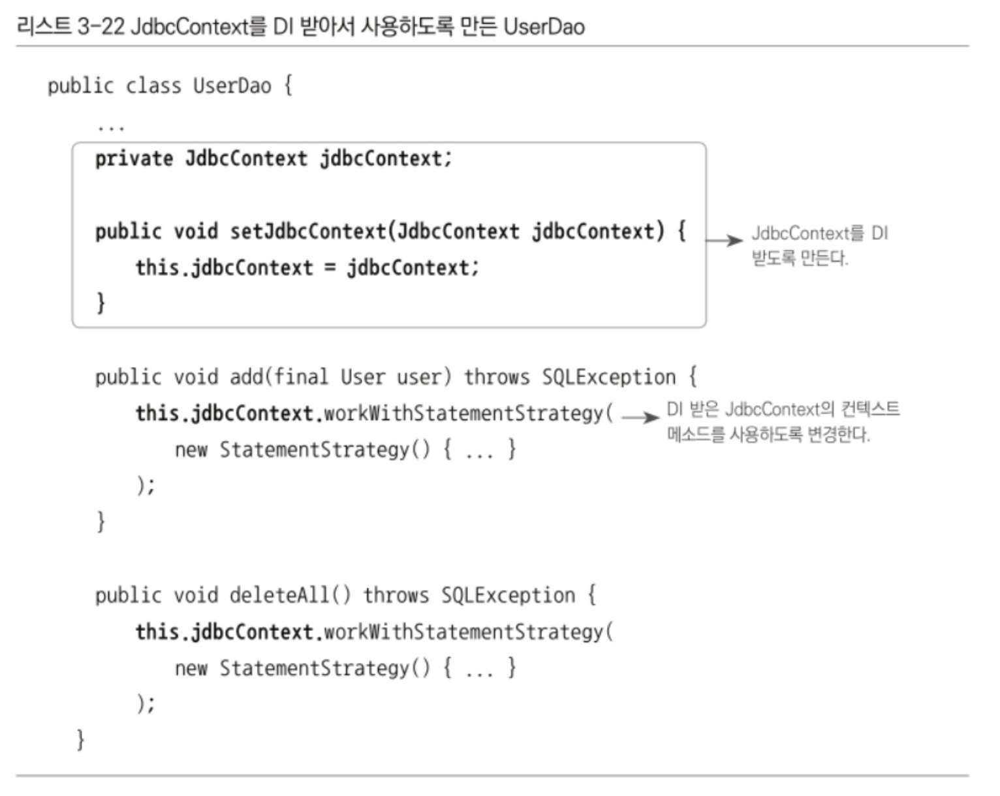

## 빈 의존관계 변경
- UserDao는 DB를 사용하기 위해 JdbcContext에 의존
- 하지만 JdbcContext는 인터페이스인 DataSource와는 다른 구체 클래스
- 스프링 DI의 목적은 인페이스를 사이에 두고 의존 클래스를 바꿔 사용하는 것
  - 이 경우 JdbcContext는 JDBC 컨텍스트를 제공하기만 하기 때문에 구현 방법이 바뀔 가능성은 없음
  - 따라서 인터페이스를 구현하도록 만들지 않음
  - 결국 UserDao와 JdbcContext는 인터페이스를 사이에 두지 않고 DI를 적용하는 구조
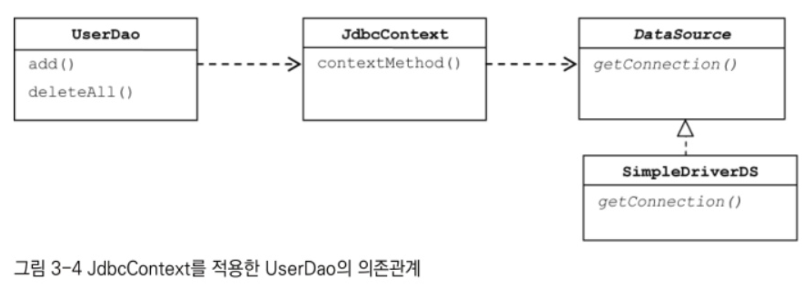
### 빈 오브젝트 사이의 관계
- userDao 빈과 dataSource 빈 사이에 jdbcContext 빈이 끼게 됨

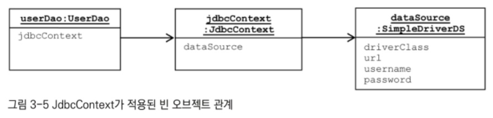

## JdbcContext의 지금까지와는 다른 DI
- UserDao와 JdbcContext 사이에는 인터페이스를 끼지 않음
- DI 방식으로 외부에서 오브젝트를 주입하기는 하지만 의존 오브젝트의 구현 클래스를 변경할 수는 없는 것
### 스프링 빈으로 DI
- 이렇게 인터페이스를 끼지 않아도 될까? 
- JdbcContext의 메소드를 인터페이스로 뽑아 정의하고 UserDao에서 이걸 끌어다 쓰게 해야 하지 않을까? 
- 해도 되지만 안 해도 됨
- 인터페이스를 사용하지 않았다면 온전한 DI는 아님
- 하지만 IoC의 개념을 따른다는 관점에서 DI를 보면 맞음
- 비록 인터페이스를 사용하지는 않았지만 JdbcContext와 UserDao를 DI 구조로 만들어야 할 이유
1. JdbcContext가 스프링 컨테이너의 싱글톤 레지스트리에서 관리되는 싱글톤 빈이 되기 때문
  - JdbcContext는 그 자체롤 변경되는 상태정보를 갖고 있지 않음
  - 내부에서 사용되는 `dataSource` 인스턴스 변수는 있지만 읽기 전용이므로 JdbcContext가 싱글톤이 되어도 문제 x
  - JdbcContext는 JDBC 컨텍스트 메솓를 제공해주는 일종의 서비스 오브젝트로서 의미가 있음
  - 따라서 싱글톤으로 등록되어 여러 오브젝트에서 공유해 사용되는 것이 이상적
2. **JdbcContext가 DI를 통해 다른 빈에 의존하고 있기 때문**
  - JdbcContext는 `dataSource` 프로퍼티를 통해 DataSource 오브젝트를 주입받음
  - DI를 위해서는 주입되는 오브젝트와 주입받는 오브젝트 양쪽 모두 스프링 빈으로 등록되어야 함
  - 따라서 JdbcContext는 다른 빈을 DI받기 위해서라도 스프링 빈으로 등록되어야 함
### 인터페이스를 사용하지 않는 클래스를 직접 의존하는 DI
- 인터페이스가 없다는 것은 두 클래스가 매우 강하게 결합되어 있다는 의미
- 즉, 두 클래스는 구분되어 있지만 강한 응집도를 가짐
- UserDao와 JdbcContext는 항상 같이 사용되어야 함
- UserDao가 JDBC 대신 다른 방식을 사용한다면 JdbcContext를 통째로 바꿔야 함
- 단, 인터페이스를 사용하지 않는 방식은 선택지 중 가장 마지막이 되어야 함

## 코드를 사용하는 수동 DI
- JdbcContext를 스프링 빈으로 등록하는 대신 UserDao 내부에서 직접 DI를 적용하는 방식
- 이 방식을 사용항면 JdbcContext를 싱글톤으로 만드는 것은 포기
  - DAO마다 하나의 JdbcContext 오브젝트를 가지고 있게 하는 것
  - JdbcContext 내부의 상태 정보가 없기 때문에 DAO 개수만큼 만들어져도 메모리에 부담은 적음
  - 또한 자주 만들어졌다가 삭제되는 것이 아니기 때문에  GC(Garbage Collector)에 부담도 적음
### JdbcContext의 생성과 초기화
- 스프링 빈으로 등록되지 않기 때문에 UserDao가 책임짐
- 자신이 사용할 오브젝트를 생성하고 초기화하는 전통적인 방법
### DataSource를 주입받는 것에 대한 문제
- 스프링 빈인 DataSource에게 주입받기 위해서는 JdbcContext 또한 스프링 빈이 되어야 함
- 수동 DI를 사용하면 스프링 빈이 아니기 때문에 JdbcContext가 직접 주입받지 못 함
- 따라서 JdbcContext의 제어권을 갖는 UserDao에 맡김
- UserDao가 임시로 DI 컨테이너처럼 동작하는 것
- DataSource를 UserDao가 받아 JdbcContext를 만들고 초기화하는 것에 사용하고 버림
- 따라서 빈의 의존관계는 다음과 같이 변경

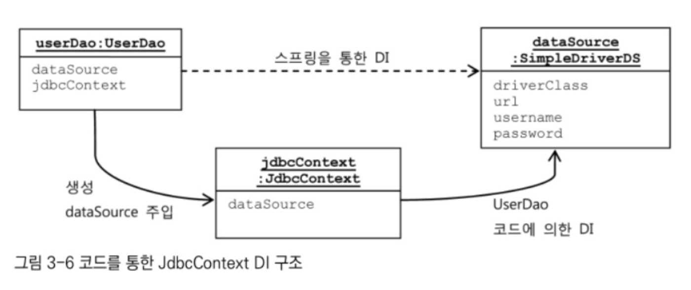
- JdbcContext 생성과 DI 작업 수행하는 UserDao의 메소드

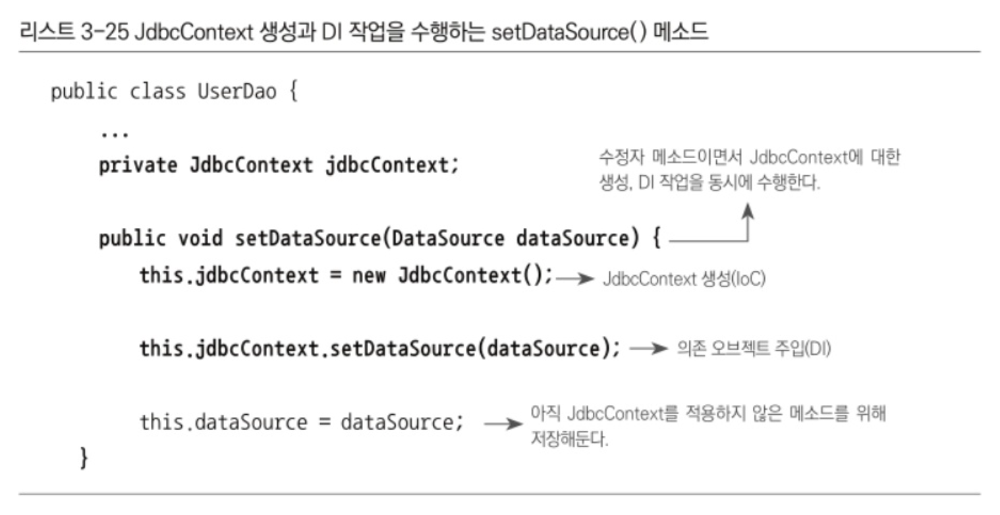
### 장점
- 긴밀한 관계인 DAO 클래스와 JdbcContext를 굳이 빈으로 분리하지 않고 내부에서 만들어 사용하면서도 다른 오브젝트에 대한 DI 적용 가능
### 단점
- 싱글톤 불가
- DI를 위한 부가적인 코드 필요
