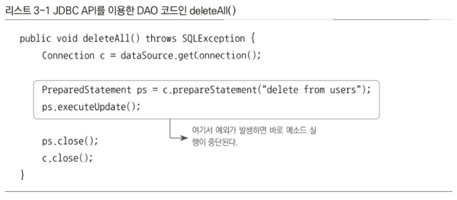

# 3장 템플릿

개방 폐쇄 원칙(OCP) : 코드에서 어떤 부분은 변경을 통해 그 기능이 다양해지고 확장하려는 성질이 있고, 어떤 부분은 고정되어 있고 변하지 않으려는 성질. 변화의 특성이 다른 부분을 구분해주고, 각각 다른 목적과 다른 이유에 의해 다른 시점에 독립적으로 변경될 수 있는 효율적인 구조를 만들어 준다

템플릿??

→ 바뀌는 성질이 다른 코드 중에서 변경이 거의 일어나지 않으며 일정한 패턴으로 유지되는 특성을 가진 부분을 자유롭게 변경되는 성질을 가진 부분으로부터 독립시켜서 효과적으로 활용할 수 있도록 하는 방법이다.

## 3.1 다시 보는 초난감 DAO

### 3.1.1 예외처리 기능을 갖춘 DAO

DB 커넥션이라는 제한적인 리소스를 공유해 사용하는 서버에서 동작하는 JDBC 코드에는 반드시 지켜야 할 원칙이 있다.

바로 **예외 처리**이다.

정상적인 JDBC코드의 흐름을 따르지 않고 중간에 어떤 이유로든 예외가 발생했을 경우에도 사용한 리소스를 반드시 반환하도록 만들어야 하기 때문이다.



이 메소드에서는 Connection과 PreparedStatement라는 두 개의 공유 리소스를 가져와서 사용한다.

정상적으로 처리되면 close()를 호출해 리소스를 반환한다.

근데 만약 예외가 발생하게 된다면??

어떤 일이 생길지 예상을 한번 해보자

- 예상
    
    Connection과  PreparedStatement를 close()하지 않아서 리소스를 반환하지 못하는 상황이 생길 수 있다.
    

일반적으로 서버에서는 제한된 개수의 DB 커넥션을 만들어서 재사용 가능한 풀로 관리한다.

DB풀은 매번 getConnection()으로 가져간 커넥션을 명시적으로 close()해서 돌려줘야지만 다시 풀에 넣었다가 다음 커넥션 요청이 있을 때 재사용할 수 있다.

그래서 커넥션 풀이 뭔데??

- 커넥션 풀
    
    
    
    커넥션 풀이란 미리 여러 개의 DB연결을 만들어 두고, 필요할 때마다 꺼내서 쓰고 다시 돌려주는 방식이다.
    
    커넥션 풀의 장점은 다음과 같다.
    
    - 커넥션 생성 비용 최소화 ( DB 연결 과정에서 부하가 심함)
    - 연결/해제 과정을 줄여 성능 향상
    - 멀티스레드 환경에 안전
    - 설정에 따라 유휴 연결, 타임 아웃 등 관리 가능
    
    SpringBoot에는 HikariCP라는 커넥션 풀 라이브러리가 사용된다.
    

근데 만약 계속 close()를 못하는 상황이 생긴다면? → 커넥션 풀에 여유가 없어지고 리소스가 모자란다는 심각한 오류를 내며 서버가 중단될 수 있다.

### 리소스 반환과 close()

Connection이나 PreparedStatement에는 close() 메소드가 있다.

단순하게 생가하면 만들어진 걸 종료하는 것이라고 볼 수도 있지만 보통 리소스를 반환한다는 의미로 이해하는 것이 좋다. Connection과 PreparedStatement는 보통 풀(pool) 방식으로 운영된다. 미리 정해진 풀 안에 제한된 수의 리소스(Connection, Statement)를 만들어두고 필요할 때 이를 할당하고, 반환하면 다시 풀에 넣는 방식으로 운영된다.

요청이 매우 많은 서버환경에서는 매번 새로운 리소스를 생성하는 대신 풀에 미리 만들어둔 리소스를 돌려가며 사용하는 편이 훨씬 유리하다. 대신, 사용한 리소스는 빠르게 반환해야 한다. 그렇지 않으면 풀에 있는 리소스가 고갈되고 결국 문제가 발생한다. close() 메소드는 사용한 리소스를 풀로 다시 돌려주는 역할을 한다.

그래서 JDBC 코드에는 try/catch/finally 구문 사용을 권장 하고 있다.


위 코드를 보면 예외 처리가 잘 되어있다는걸 확인할 수 있다. 


조회를 위한 코드에서는 ResultSet에 대한 예외 처리를 진행 했다.

## 3.2 변하는 것과 변하지 않는 것

### 3.2.1 JDBC try/catch/finally 코드의 문제점

위의 코드 두개를 보면 try/catch/finally가 적용돼서 완성도 높은 코드로 보이지만, 모든 메소드에서 반복되는 것과 중첩되어서 나오는 부분이 보이지 않는가?

이런 코드를 효과적으로 다룰 수 있는 방법이 없을까?

→ 이 문제의 핵심은 변하지 않는, 그러나 많은 곳에서 중복되는 코드와 로직에 따라 자꾸 확장되고 자주 변하는 코드를 잘 분리해내는 작업이다.


개선을 위해서 먼저 변하는 성격이 다른 것을 찾아내보자

PreparedStatement 부분은 변하고 이외의 나머지는 변하지 않는다는 것을 알 수 있다.

이를 아래 코드와 같이 분리할 수 있다.


자주 바뀌는 부분을 메소드로 독립시켰는데 당장 봐서는 별 이득이 없어 보인다.

Why? → 보통 메소드 추출 리팩토링을 적용하는 경우에는 분리시킨 메소드를 다른 곳에서 재사용할 수 있어야 하는데, 이건 반대로 분리시키고 남은 메소드가 재사용이 필요한 부분이고, 분리된 메소드는 DAO 로직마다 새롭게 만들어서 확장돼야 하는 부분이기 때문이다.

### 템플릿 메소드 패턴의 적용

템플릿 메소드 패턴을 이용ㅇ해서 분리해보자. 템플릿 메소드 패턴은 상속을 통해 기능을 확장해서 사용하는 부분이다. 변하지 않는 부분은 슈퍼클래스에 두고 변하는 부분은 추상 메소드로 정의해둬서 독립시킨 makeStatetment() 메소드를 다음과 같이 추상 메소드 선언으로 변경한다. 물론 UserDao 클래스도 추상 클래스가 돼야 할 것이다.

```java
abstract protected PreparedStatement makeStatement(Connection c) throws SQLException;
```

그리고 이를 상속하는 서브클래스를 만들어서 거기서 이 메소드를 구현한다. 고정된 JDBC try/catch/finally 블록을 가진 슈퍼클래스 메소드와 필요에 따라서 상속을 통해 구체적인 PreparedStatement를 바꿔서 사용할 수 있게 만드는 서브클래스로 깔끔하게 분리할 수 있다.


이제 UserDao 클래스의 기능을 확장하고 싶을 때마다 상속을 통해 자유롭게 확장할 수 있고, 확장 때문에 기존의 상위 DAO 클래스에 불필요한 변화는 생기지 않도록 할 수 있으니 객체지향 설계의 핵심 원리인 개방 폐쇄 원칙을 그럭저럭 지키는 구조를 만들어 낼 수는 있는 것 같다. 하지만 템플릿 메소드 패턴으로의 접근은 제한이 많다.

- 가장 큰 문제?
    
    가장 큰 문제는 DAO 로직마다 상속을 통해 새로운 클래스를 만들어야 한다는 점이다.
    


UserDao의 JDBC 메소드가 4개일 경우 그림 3-1과 같이 4개의 서브클래스를 만들어서 사용해야 한다.

또 확장구조가 이미 클래스를 설계하는 시점에서 고정되어 버린다는 점이다. 변하지 않는 코드를 가진 UserDao의 JDBC try/catch/finally 블록과 변하는 PreparedStatement를 담고 잇는 서브클래스들이 이미 클래스 레벨에서 컴파일 시점이 이미 그 관계가 결정되어 있다. 따라서 그 관계에 대한 유연성이 떨어져 버린다. 상속을 통해 확장을 꾀하는 템플릿 메소드 패턴의 단점이 고스란히 드러난다.

### 전략 패턴의 적용

개방 폐쇄 원칙을 잘 지키는 구조이면서도 템플릿 메소드 패턴보다 유연하고 확장성이 뛰어난 것이, 오브젝트를 아예 둘로 분리하고 클래스 레벨에서는 인터페이스를 통해서만 의존하도록 만드는 전략 패턴이다. 전략 패턴은 OCP 관점에 보면 확장에 해당하는 변하는 부분을 별도의 클래스로 만들어 추상화된 인터페이스를 통해 위임하는 방식이다.


좌측에 있는 Context의 contextMethod()에서 일정한 구조를 가지고 동작하다가 특정 확장 기능은 Strategy 인터페이스를 통해 외부의 독립된 전략 클래스에 위임하는 것이다.

deleteAll() 메소드에서 변하지 않는 부분이라고 명시한 것이 바로 이 contextMethod()가 된다. deleteAll()은 JDBC를 이용해 DB를 업데이트하는 작업이라는 변하지 않는 맥락을 갖는다.

deleteAll의 컨텍스트를 정리해보자면

- DB 커넥션 가졍괴
- PreparedStatement를 만들어줄 외부 기능 호출하기
- 전달받은 PreparedStatement 실행하기
- 예외가 발생하면 이를 다 시 메소드 밖으로 전지기
- 모든 경우에 만들어진 PreparedStatement와 Conncetion을 적절히 닫아주기

두 번째 작업에서 사용하는 PreparedStatement를 만들어주는 외부 기능이 바로 전략 패턴에서 말하는 전략이라고 볼 수 있다. 전략 패턴의 구조에 따라 이 기능을 인터페이스로 만들어두고 인터페이스의 메소드를 통해 PreparedStatement 생성 전략을 호출해주면 된다.


전략 패턴을 따라 deleteAll 메소드의 기능을 구현한 클래스이고


이렇게 deleteAll() 메소드를 변경 할 수 있다.

그럭저럭 전략패턴을 적용했다고 볼 수 있지만, 전략 패턴은 필요에 따라 컨텍스트는 그대로 유지되면서 전략을 바꿔 쓸 수 있다는 것인데, 이렇게 컨텍스트 안에서 이미 구체적인 전략 클래스인 DeleteAllStatement를 사용하도록 고정되어있다면 뭔가 이상하다. 컨텍스트가 Statement 인터페이스뿐 아니라 특정 구현 클래스인 DeleteAllStatement를 직접 알고 잇다는건, 전략 패턴에도 OCP에도 잘 들어맞는다고 볼 수 없기 때문이다.

### DI 적용을 위한 클라이언트/컨텍스트 분리

 


전략 패턴에 따르면 Context가 어떤 전략을 사용하게 할 것인가는 Context를 사용하는 앞단의 Client가 결정하는게 일반적이다. Client가 구체적인 전략의 하나를 선택하고 오브젝트로 만들어서 Context에 전달하는 것이다. Context는 전달받은 그 Strategy 구현 클래스의 오브젝트를 사용한다.

근데 이건 1장에서 처음 UserDao와 ConnectionMaker를 독립시키고 나서 UserDao가 구체적인 ConnectionMaker 구현 클래스를 만들어 사용하는데 문제가 있다고 판단됐을 때 적용했던 바로 그 방법이다.

결국 이 구조에서 전략 오브젝트 생성과 컨텍스트로의 전달을 담당하는 책임을 분리시킨것이 바로 ObjectFactory이며, 이를 일반화한 것이 앞에서 살펴봤던 의존관계 주입이었다. 결국 DI란 이러한 전략 패턴의 장점을 일반적으로 활용할 수 있도록 만든 구조라고 볼 수 있다.

중요한 것은 이 컨텍스트에 해당하는 JDBC try/catch/finally 코드를 클라이언트 코드인 Statement Strategy를 만드는 부분에서 독립시켜야 한다는 점이다.

```java
StatementStrategy strategy = new DeleteAllStatement();
```

컨텍스트에 해당하는 부분은 별도의 메소드로 독립시켜보자. 클라이언트는 DeleteAllStatement 오브젝트와 같은 전략 클래스의 오브젝트를 컨텍스트의 메소드를 호출하며 전달해야 한다. 이를 위해 전략 인터페이스인 StatementStrategy를 컨텍스트 메소드 파라미터로 지정할 필요가 있다.


이 메소드는 컨텍스트의 핵심적인 내용을 잘 담고 있다.


컨텍스트를 별도의 메소드로 분리했으니  deleteAll() 메소드가 클라이언트가 된다. deleteAll()은 전략 오브젝트를 만들고 컨텍스트를 호출하는 책임을 지고 있다. 사용할 전략 클래스는 DeleteAllStatement이므로 이 클래스의 오브젝트를 생성하고, 컨텍스트로 분리한 jdbcContextWithStatementStrategy() 메소드를 호출해주면 된다.

### 마이크로 DI

의존관계 주입은 다양한 형태로 적용할 수 있다. DI의 가장 중요한 개념은 제3자의 도움을 통해 두 오브젝트 사이의 유연한 관계가 설정되도록 만든다는 것이다. 이 개념만 따른다면 DI를 이루는 오브젝트와 구성요소의 구조나 관계는 다양하게 만들 수 있다.

일반적으로 DI는 의존관계에 있는 두 개의 오브젝트와 이 관계를 다이내믹하게 설정하주는 오브젝트 팩토리(DI 컨테이너), 그리고 이를 사용하는 클라이언트라는 4개의 오브젝트 사이에서 일어난다.

하지만 때로는 원시적인 전략 패턴 구조를 따라 클라이언트가 오브젝트 팩토리의 책임을 함께 지고 있을 수도 있다. 또는 클라이언트와 전략(의존 오브젝트)이 결합될 수도 있다. 심지어는 클라이언트와 DI 관계에 있는 두 개의 오브젝트가 모두 하나의 클래스 안에 담길 수도 있다.

이런 경우에는 DI가 매우 작은 단위의 코드와 메소드 사이에서 일어나기도 한다. 얼핏 보면 DI 같아보이지 않지만, 세밀하게 관찰해보면 작은 단위지만 엄연히 DI가 이뤄지고 있음을 알 수 있다. 이렇게 DI의 장점을 단순화 해서 IoC 컨테이너의 도움 없이 코드 내에서 적용한 경우를 마이크로 DI라고도 한다. 또는 코드에 의한 DI라는 의미로 수동 DI라고 부를 수도 있다.

## 3.3 JDBC 전략 패턴의 최적화

Context는 PreparedStatement를 실행하는 JDBC의 작업 흐름이고, 전략은 PreparedStatement를 생성하는 것이다.

### 3.3.1 전략 클래스의 추가 정보


PreparedStatement를 만드는 코드를 AddStatement 클래스로 옮겨 담는 과정에서

분리를 하니 컴파일 에러가 발생한다. deleteAll과는 달리 add에서는 PreparedStatement를 만들 때 user라는 부가적인 정보가 필요하기 때문이다.


클라이언트로부터 User 타입 오브젝트를 받을 수 있도록 AddStatement의 생성자를 통해 제공받게 만들자.


이렇게 해서 두 군데에서 모두 PreparedStatement를 실행하는 JDBC try/catch/finally 컨텍스트를 공유해서 사용할 수 있게 됐다.

### 3.3.2 전략과 클라이언트의 동거

DAO 메소드마다 StatementStrategy 구현 클래스를 만들어야 하는 점이 개선해야할 부분이다.

이렇게 되면 기존 UserDao때보다 클래스 파일의 개수가 많이 늘어난다.

이래서는 런타임 시에 다이내믹하게 DI 해준다는 점을 제외하면 로직마다 상속을 사용하는 템플릿 메소드 패턴을 적용했을 때보다 그다지 나을게 없다.

또 다른 개선할 점은 DAO 메소드에서 StatementStrategy에 전달할 User와 같은 부가적인 정보가 있는 경우, 이를 위해 오브젝트를 전달받는 생성자와 이를 저장해둘 인스턴스 변수를 번거롭게 만들어야 한다는 점이다. 이 오브젝트가 소요되는 시점은 컨텍스트가 전략 오브젝트를 호출할 때이므로 잠시 어딘가에 다시 저장해둘수밖에 없다.

이 두 가지 문제를 어떻게 해결할 수 있을까?


클래스 파일이 많아지는 문제를 해결하는 방법으로 UserDao 클래스 안에 내부 클래스로 정의해버리는 것인 로컬 클래스를 사용한다.

DeleteAllStaetementsk AddStatement는 UserDao 밖에서는 사용되지 않는다. 둘 다 UserDao에서만 사용되고, UserDao의 메소드 로직에 강하기 결합되어 있다.

### 중첩 클래승틔 종류

다른 클래스 내부에 정의되는 클래스를 중첩 클래스라고 한다. 중컵 클래스는 독립적으로 오브젝트로 ㅁ나들어질 수 있는 스태틱 클래스와 자신이 정의된 클래스의 오브젝트 안에서만 만들어질 수 있는 내부 클래스로 구분된다.

내부클래스는 다시 범위에 따라 세 가지로 구분된다. 멤버 필드처럼 오브젝트 레벨에 정의되는 멤버 내부 클래스와 메소드 레벨에 정의되는 로컬클래스, 그리고 이름을 갖지 않는 익명 내부 클래스다. 익명 내부클래스의 범위는 선언된 위치에 따라서 다르다.

로컬 클래스의 장점은 클래스 파일이 줄어들 뿐만 아니라 클래스가 내부 클래스이기 때ㅔ문에 자신이 선언된 곳의 정보에 접근할 수 있다는 점이다.


### 익명 내부 클래스

익명 내부클래스는 이름을 갖지 앟는 클래스다. 클래스 선언과 오브젝트 생성이 결합된 형태로 만들어지며, 상속할 클래스나 구현할 인터페이스를 생성자 대신 사용해서 다음과 같은 형태로 만들어 사용한다. 클래스를 재사용할 필요가 없고, 구현한 인터페이스 타입으로만 사용할 경우에 유용하다.

```java
new 인터페이스이름() { 클래스 본문 };
```


## 3.4 컨텍스트와 DI

### 3.4.1 JdbcContext의 분리

전략 패턴의 구조로 보자면 UserDao의 메소드가 클라이언트이고, 익명 내부 클래스로 만들어지는 것이 개별적인 전략이고, jdbcContextWithStatementStrategy() 메소드는 컨텍스트다.

컨텍스트 메소드는 UserDao내의 PreapredStatement를 실행하는 기능을 가진 메소드에서 공유할 수 있다.

그런데 JDBC의 일반적인 작업 흐름을 담고있는 jdbcContextWithStatementStrategy()는 다른 DAO에서도 사용 가능하다. 그러니 UserDao 클래스 밖으로 독립시켜서 모든 DAO가 사용할 수 있게 해보자.


### 빈 의존관계 변경

UserDao는 이제 JdbcContext에 의존하고 있다. 그런데 JdbcContext는 인터페이스인 DataSource와는 달리 구체 클래스다. 스프링의 Di는 기본적으로 인터페이스를 사이에 두고 의존 클래스를 바꿔서 사용하도록 하는 게 목적이다. 하지만 이 경우 JdbcContext는 그 자체로 독립적인 JDBC 컨텍스트를 제공해주는 서비스 오브젝트로서 의미가 있을뿐이고 구현 방법이 바뀔 가능성은 없다. 따라서 인터페이스를 구현하도록 만들지 않았고, UserDao와 JdbcContext는 인터페이스를 사이에 두지 않고 DI를 적용하는 특별한 구조가 된다. 


### 3.4.2 JdbcContext의 특별한 DI

UserDao는 인터페이스를 거치지 않고 코드에서 바로 JdbcContext 클래스를 사용하고 있다. UserDao와 JdbcContext는 클래스 레벨에서 의존관계가 결정된다. 비록 런타임 시에 DI 방식으로 외부에서 오브젝트를 주입해주는 방식을 사용하긴 했지만, 의존 오브젝트의 구현 클래스를 변경할 수는 없다.

### 스프링 빈으로 DI

이렇게 인터페이스를 사용하지 않고 DI를 적용하는 것은 문제가 있지 않을까? 스프링 DI의 기본 의도에 맞게 JdbcContext의 메소드를 인터페이스로 뽑애내어 정의해두고, 이를 UserDao에서 사용하게 해야하지 않을 까?

→ 꼭 그럴 필요는 없다.

의존 관계 주입이라는 개념을 충실히 따르자면, 인터페이스를 사이에 둬서 크랠스 레벨에서는 의존관계가 고정되지 않게 하고, 런타임 시에 의존할 오브젝트와의 관계를 다이내믹하게 주입해주는 것 이 맞다.

따라서 인터페이스를 사용하지 않았다면 엄밀히 말해서 온전한 DI라고 볼 수 없다. 그러나 스프링의 DI는 넓게 보자면 객체의 생성과 설정에 대한 제어권한을 오브젝트에서 제거하고 외부로 위임했다는 IoC라는 개념을 포괄한다. 그런 의미에서 JdbcContext를 스프링을 이용해 UserDao 객체에서 사용하게 주입했다는건 DI의 기본을 따르고 있다고 볼 수 있다.

인터페이스를 사용해서 클래스를 자유롭게 변경할 수 있게 하지는 않았지만, JdbcContext를 UserDao와 DI 구조로 만들어야 할 이유를 생각해보자.

- JdbcContext가 스프링 컨테이너의 싱글톤 레지스트리에서 관리되는 싱글톤 빈이 되기 때문이다.

- JdbcContext가 DI를 통해 다른 빈에 의존하고 있기 때문이다.

실제로 스프링에는 드물지만 이렇게 인터페이스를 사용하지 않는 클래스를 직접 의존하는 DI가 등장하는 경우도 있다.

중요한 것은 인터페이스의 사용 여부다.

인터페이스가 없다는 건 UserDao와 JdbcContext가 매우 긴밀한 관계를 가지고 강하게 결합되어 있다는 의미다.

### 코드를 이용하는 수동 DI

JdbcContext를 스프링의 빈으로 등록해서 UserDao에 DI 하는 대신 사용할 수 있는 방법이 있다.

UserDao내부에서 직접 DI를 적용하는 방법이다.

이 방법을 쓰려면 JdbcContext를 스프링의 빈으로 등록해서 사용했던 첫 번째 이유인 싱글톤으로 만들려는 것은 포기해야 한다. 물론 스프링의 도움을 받아서 싱글톤으로 만드는 걸 포기했다고 해서 DAO 메소드가 호출될 때마다 JdbcContext 오브젝트를 새로 만드는 무식한 방법을 사용해야 한다는 뜻은 아니다.

JdbcContext를 스프링 빈으로 등록하지 않았으므로 다른 누군가가 JdbcContext의 생성과 초기화를 책임져야 한다.  JdbcContext의 제어권은 UserDao가 갖는 것이 적당하다.

JdbcContext는 다른 빈을 인터페이스를 통해 간접적으로 의존하고 있다. 다른 빈을 의존하고 있다면, 의존 오브젝트를 DI를 통해 제공받기 위해서라도 자신도 빈으로 등록돼야 한다고 했다. 그렇다면 UserDao에서 JdbcContext를 직접 생성해서 사용하는 경우에는 어떻게 해야할까?


이런 경우에 사용할 수 있는 방법이 한가지 있다. 그것은 JdbcContext에 대한 제어권을 갖고 생성과 관리를 담당하는 UserDao에게 DI까지 맡기는 것이다. 오브젝트를 생성하고 그 의존 오브젝트를 수정자 메소드로 주입해주는 것이 바로 DI의 동작원리이지 않은가?

그렇다면 UserDao가 임시로 DI 컨테이너처럼 동작하게 만들면 된다.


이 방법의 장점은 굳이 인터페이스를 두지 않아도 될 만큼 긴밀한 관계를 갖는 DAO 클래스와 JdbcContext를 어색하게 따로 빈으로 분리하지 않고 내부에서 직접 만들어 사용하면서도 다른 오브젝트에 대한 DI를 적용할 수 있다는 점이다.

이렇게 한 오브젝트의 수정자 메소드에서 다른 오브젝트를 초기화하고 코드를 이용해 DI 하는 것은 스프링에서 도 종종 사용되는 기법이다.

인터페이스를 사용하지 않는 클래스와의 의존관계이지만 스프링의 DI를 이용하기 위해 빈으로 등록해서 상용하는 방법은 오브젝트 사이의 실제 의존관계가 설정파일에 명확하게 드러난다는 장점이 있다. 하지만 DI의 근본적인 원칙에 부합하지 않는 구체적인 클래스와의 관계가 설정에 직접 노출된다는 단점이 있다.

반면에 코드를 이용해 수동으로 DI를 하는 방법은 JdbcContext가 UserDao의 내부에서 만들어지고 사용되면서 그 관계를 외부에는 드러내지 않는다는 장점이 있다. 필요에 따라 내부에서 은밀히 DI를 수행하고 그 전략을 외부에는 감출 수 있다. 하지만 JdbcContext를 여러 오브젝트가 사용하더라도 싱글톤으로 만들 수 없고, DI 작업을 위한 부가적인 코드가 필요하다는 단점도 있다.

# 상황에 따라 적절하다고 판단되는 방법을 선택해서 사용.

# 다만 왜 그렇게 선택했는지에 대한 분명한 이유와 근거 必