# 탬플릿과 콜백
- 전략 패턴의 기본 구조에 익명 내부 클래스를 활용한 방식
- 복잡하지만 바뀌지 않는 일정한 패턴을 갖는 작업 흐름이 존재하며 그중 일부분만 자주 바꿔 사용하는 경우에 적용
## 템플릿
- 어떤 목적을 위해 미리 만들어둔 모양이 있는 틀
- 고정된 틀 안에 바꿀 수 있느 부분을 넣어서 사용하는 경우에 템플릿이라 함
- 템플릿 메소드 패턴은 고정된 틀의 롤직을 가진 템플릿 메소드를 수퍼클래스에, 바뀌는 부분을 서브클래스에 둠
## 콜백
- 실행되는 것을 목적으로 다른 오브젝트의 메소드에 전달되는 오브젝트
- 파라미터로 전달되지만 값을 참조하기 위한 것이 아니라 특정 로직을 담은 메소드를 실행시키기 위해 사용
### aka functional object
- 자바에서는 메소드 자체를 파라미터로 전달할 수 없음
- 따라서 메소드가 담긴 오브젝트를 전달해야 함

----

# 템플릿/콜백의 동작원리
## 탬플릿과 콜백
- 탬플릿: 고정된 작업 흐름을 가진 코드를 재사용
- 콜백: 탬플릿 안에서 호출되는 것을 목적으로 만들얼진 오브젝트
## 탬플릿/콜백의 특징
### 1. 여러 메소드를 가지는 일반적인 인터페이스와 달리 단일 메소드 인터페이스 사용
- 특정 기능을 위해 한 번만 호출되는 경우가 일반적이기 때문
- 한 탬플릿에서 여러 전략을 사용해야 한다면 하나 이상의 콜백 오브젝트를 사용할 수도 있음
- 콜백은 일반적으로 하나의 메소드를 가진 인터페이스를 구현한 익명 내부 클래스로 만들어짐
### 2. 콜백 인터페이스의 메소드에는 보통 파라미터가 존재
- 파라미터는 탬플릿의 작업 흐름 중 만들어지는 컨텍스트 정보를 전달받을 때 사용
## 일반적인 탬플릿/콜백의 작업 흐름
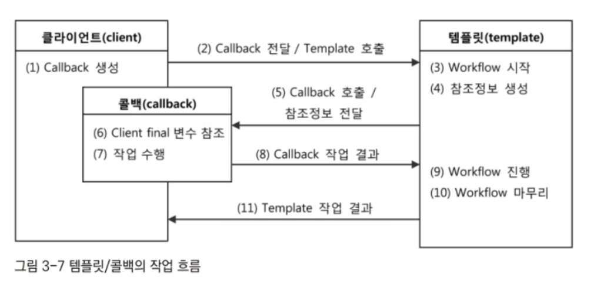
- 클라이언트의 역할
  1. 탬플릿 안에서 실행될 로직을 담은 콜백 오브젝트 생성
  2. 콜백이 참조할 정보 제공
  - 만들어진 콜백은 클라이언트가 탬플릿 메소드를 호출할 때 파라미터로 전달
- 탬플릿은 정해진 작업 흐름을 따라 작업을 진행하다가 내부에서 생성한 참조 정보를 가지고 콜백 오브젝트의 메소드 호출
  - 콜백은 클라이언트 메소드에 있는 정보와 탬플릿이 제공한 참조정보를 이용해 작업 수행 후 결과를 탬플릿에 리턴
- 탬플릿은 콜백이 돌려준 정보를 사용해 작업 수행
  - 경우에 따라 최종 결과를 클라이언트에 돌려주기도 함
### 일종의 DI 방식의 전략 패턴
- 메소드 레벨의 DI가 일어남
  - 클라이언트가 탬플릿 메소드를 호출하면서 콜백 오브젝트를 전달하는 것
- 일반적인 경우: 탬플릿의 인스턴스 변수에 수정자 메소드로 의존 오브젝트 전달
- 탬플릿/콜백의 경우: 매번 메소드 단위로 사용할 오브젝트를 새롭게 전달받음
- 탬플릿/콜백의 고유 특징
  - 콜백 오브젝트가 내부 클래스로서 자신을 생성한 클라이언트 메소드 내의 정보를 직접 참조
  - 클라이언트와 콜백이 강하게 결합
## `JdbcContext`에 적용된 탬플릿/콜백
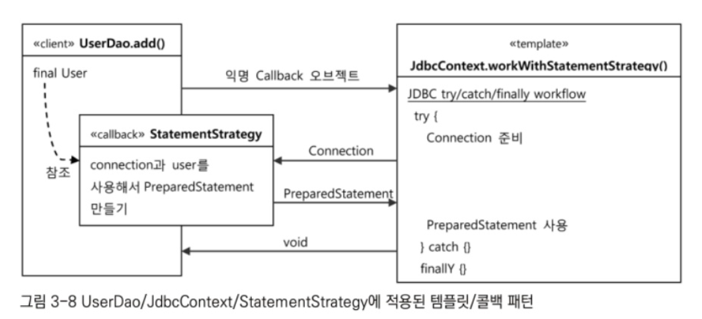
- 리턴 값이 없는 단순한 구조
- 조회 작업에서는 보통 탬플릿의 작업 결과를 클라이언트에 리턴
- 한 번 이상 콜백을 호출하거나 여러 개의 콜백을 클라이언트로부터 받아서 사용하기도 함

----

# 편리한 콜백의 재활용 
## 콜백의 분리와 재활용
- 익명 내부 클래스의 사용을 최소화
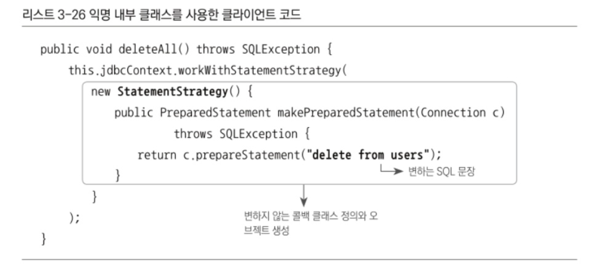
- 변하지 않는 문자열만 두고 나머지 내용을 분리
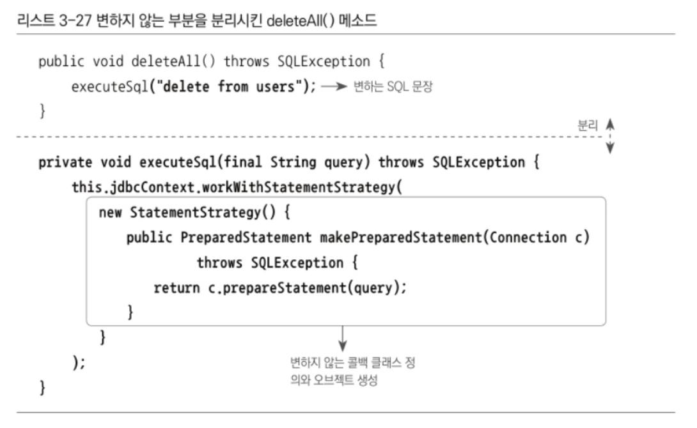
- 바뀌지 않는 부분을 `executeSql()` 메소드로 추출
- SQL을 담은 파라미터를 final로 선언해 익명 내부 클래스인 콜백 안에서 직접 사용할 수 있게 해야함
## 콜백과 탬플릿의 결합
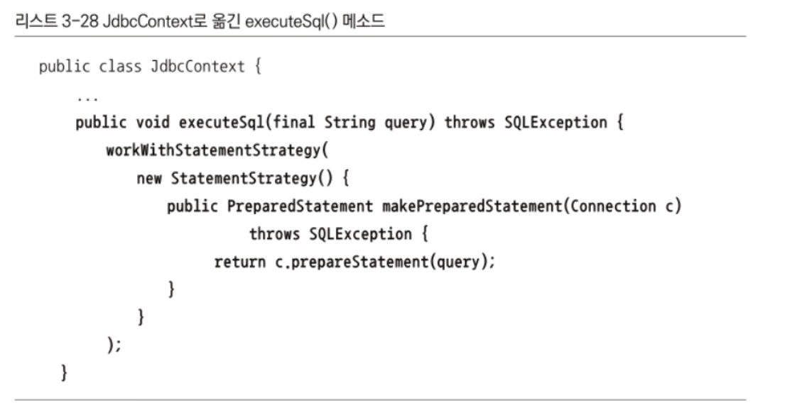
- `executeSql()` 메소드를 `JdbcContext`로 이동
- 모든 DAO 메소드에서 `executeSql()` 메소드 사용 가능
### 성격이 다른 코드를 같은 곳에 모은 이유
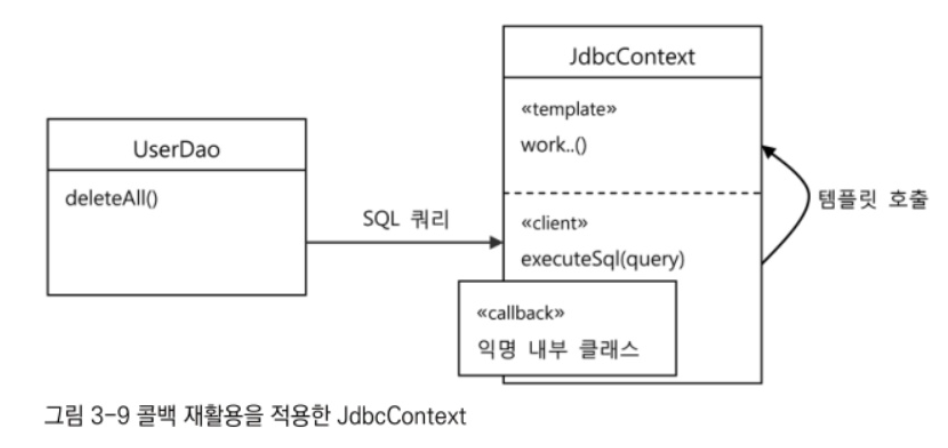
- 일반적으로 성격이 다른 코든는 분리
- 하지만 이 경우는 하나의 목적을 위해 서로 연관되어 있는 응집력이 강한 코드들
- 따라서 한 군데에 모여있는 것이 유리
- 구체적인 구현, 내부의 전략 패턴, 코드에 의한 DI, 익명 내부 클래스 등은 감춤
- 외부에는 필요한 기능을 제공하는 단순한 메소드만 노출

----

# 탬플릿/콜백의 응용
- 전형적인 탬플릿/콜백 패턴 후보는 try/catch/finally
  - 일정한 리소스를 가져와 작업하는 경우 try/catch/finally문을 사용할 가능성 높음
  - 이 때 해당 구문이 반복된다면 탬플릿/콜백 패턴 적용
## 테스트와 try/catch/finally
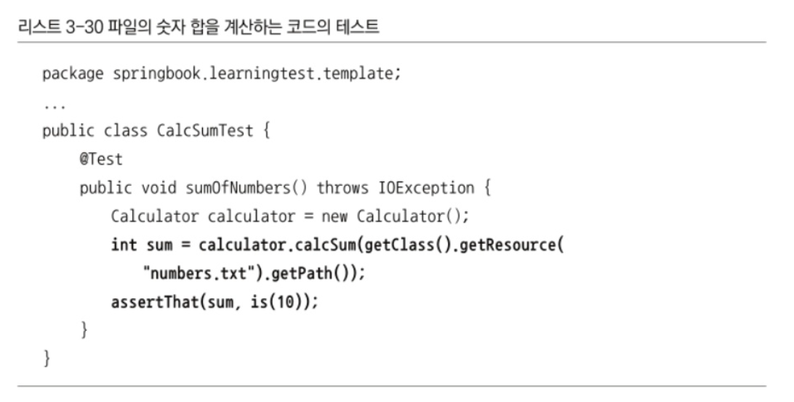
- 테스트 코드
  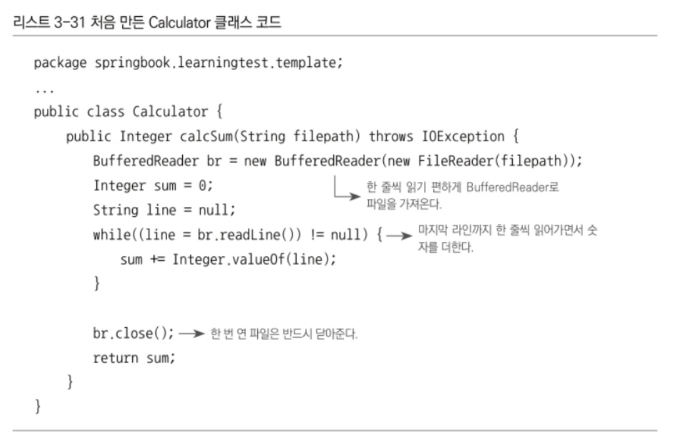
- 클래스 코드
- 파일의 숫자 합을 계산
### 문제점
- `calcSum()` 메소드가 파일을 읽거나 처리 중 예외가 발생하면 파일이 정상적으로 닫히지 않고 메소드를 빠져나감
- 따라서 try/finally 블록을 적용해 파일이 열렸을 시 무조건 닫도록 설정
### try/catch/finally를 적용한 구문
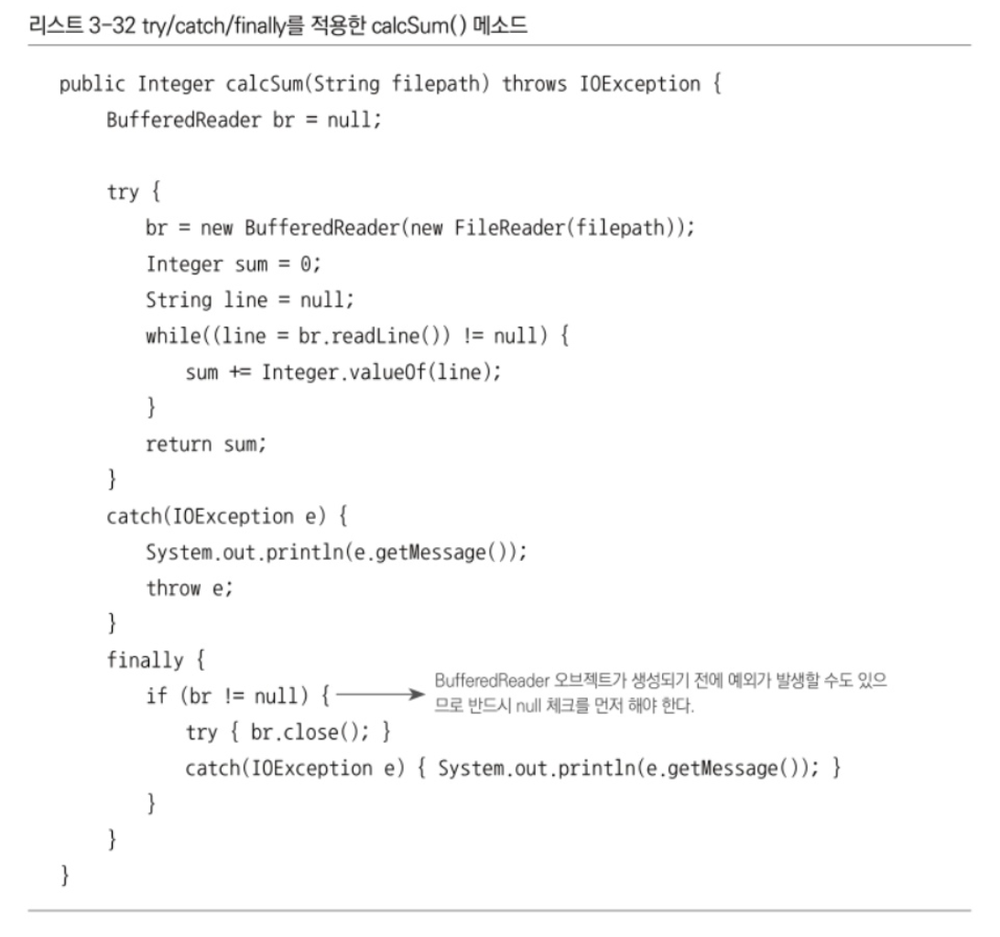
## 중복의 제거와 탬플릿/콜백 설계
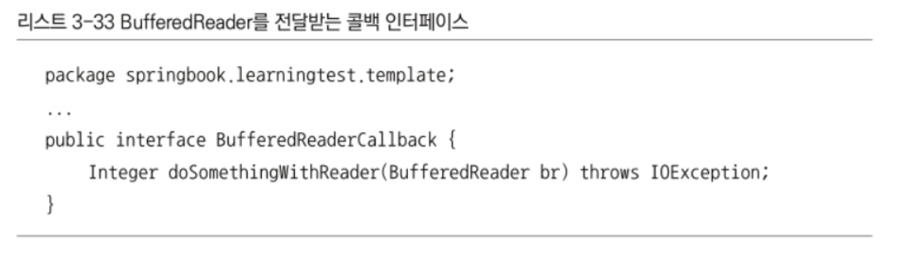
- 탬플릿과 콜백의 경계를 정하고 탬플릿->콜백, 콜백->탬플릿 전달하는 내용이 무엇인지 파악하는 것이 중요
- 여기서는 탬플릿이 파일을 열고 라인을 읽을 `BufferedReader`를 생성해 콜백에게 전달
- 콜백이 라인을 읽고 처리해 최종 결과만 탬플릿에게 전달
### 탬플릿 부분을 메소드로 분리
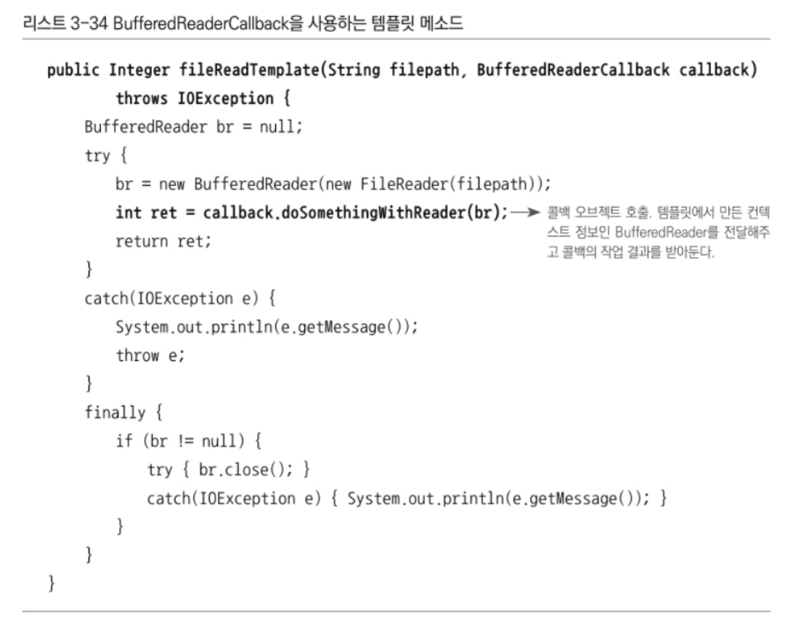
- 탬플릿에서는 `BufferedReaderCallback` 인터페이스 타입의 콜백 오브젝트를 받아 적절한 시점에 실행
- 콜백이 돌려준 결과는 모든 처리를 마친 후 클라이언트에게 리턴
- 번거로운 작업에 대한 흐름은 탬플릿에서 진행
- `BufferedReader`를 이용해 작업을 수행하는 것은 콜백 함수로 처리
### 수정된 코드
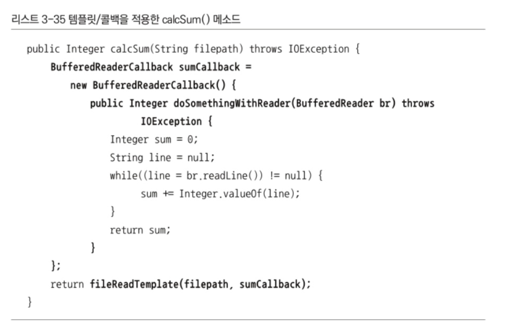
- 곱하는 기능을 추가할 때는 메소드 내부만 수정하면 됨
## 탬플릿/콜백의 재설계
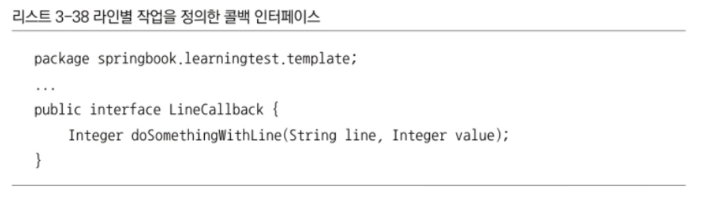
- `LineCallback`은 파일의 각 라인과 현재까지 계산한 값을 넘겨줌
- 새로운 계산 결과를 리턴 값을 통해 다시 전달받음
### `LinkeCallback`을 사용하는 탬플릿
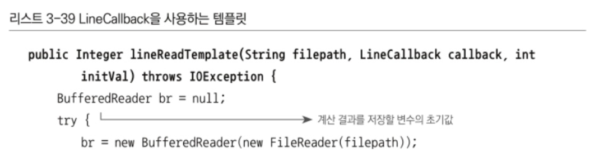

- while문을 사용해 콜백을 여러 번 반복적으로 호출하는 구조
### 간소화된 코드
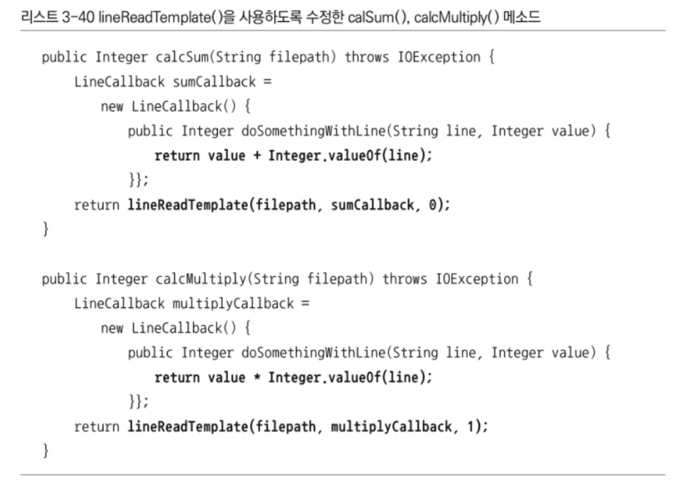
- 파일 처리가 탬플릿으로 분리
- 순수한 계산 로직만 남기 때문에 코드의 관심사를 확실히 보여줌
## 제네릭스를 이용한 콜백 인터페이스
- `LineCallback()`과 `lineReadTemplate`는 리턴 결과가 Integer 타입으로 고정되어 있음
- 반환 값을 제네릭으로 설정하면 활용도 높아짐
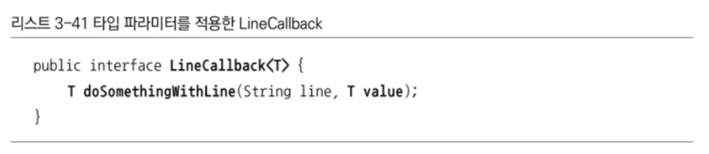
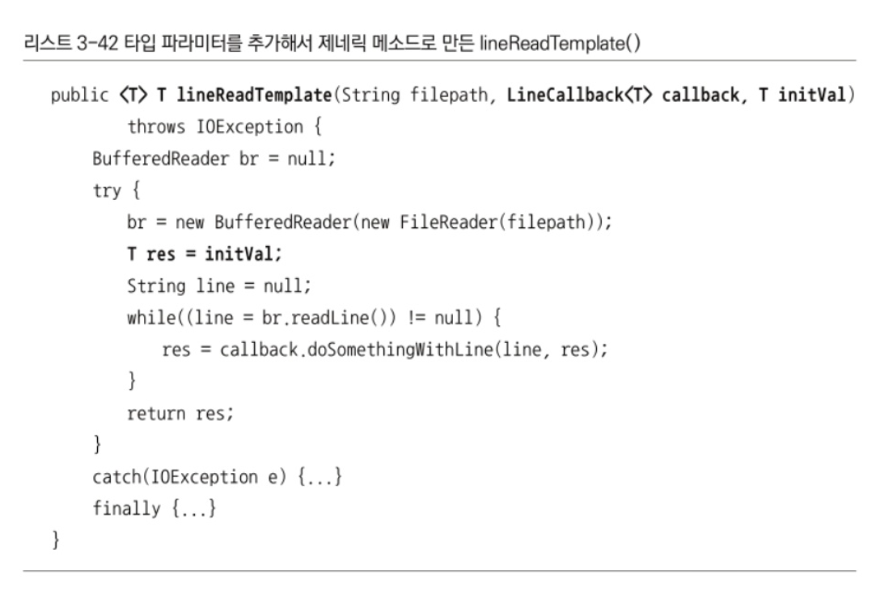
- 제네릭으로 전부 변경
- 탬플릿은 T 타입 파라미터로 선언된 `LineCallback()` 메소드를 호출해 처리하고 T 타입의 결과 리턴

----

# 스프링의 JdbcTemplate
- 스프링은 JDBC를 이용하는 DAO에서 사용할 수 있도록 준비된 다양한 탬플릿과 롤백 제공
- 자주 사용되는 패턴을 가진 콜백은 다시 탬플릿에 결합시켜 간단한 메소드 호출만으로 사용 가능
- `JdbcTemplate`가 스프링이 제공하는 JDBC 코드용 기본 템플릿
- `JdbcContext`에서 `JdbcTemplate`로 변경
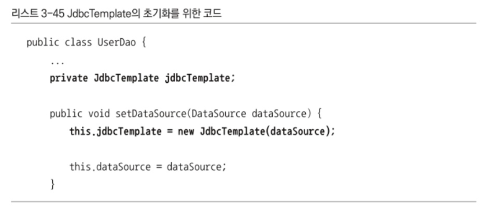
## `update()
### `delteAll()`에 적용
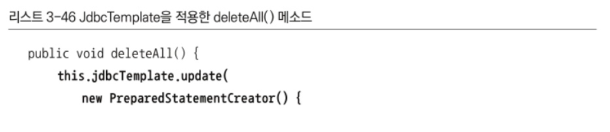
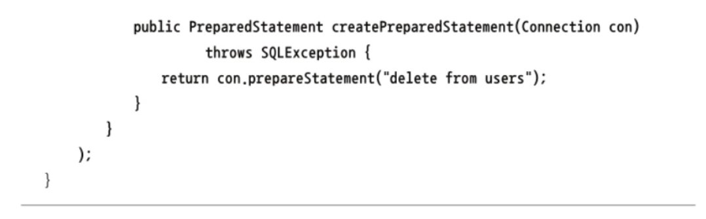
## `queryForInt()`
- `getCount()` 메소드는 SQL 쿼리를 실행하고 `ResultSet`을 통해 결과 값을 가져오는 코드
- `query()` 메소드 활용
### `query()` 메소드
- `PreparedStatementCreator` 콜백과 `ResultSetExtractor` 콜백을 파라미터로 받음
- `ResultSetExtractor`: 탬플릿이 제공하는 `ResultSet`을 이용해 원하는 값을 추출해 탬플릿으로 전달하면 탬플릿이 나머지 작업을 수행한 후 그 값을 `query()` 메소드의 리턴 값으로 반환
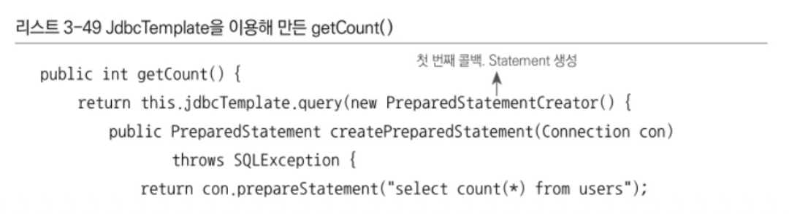
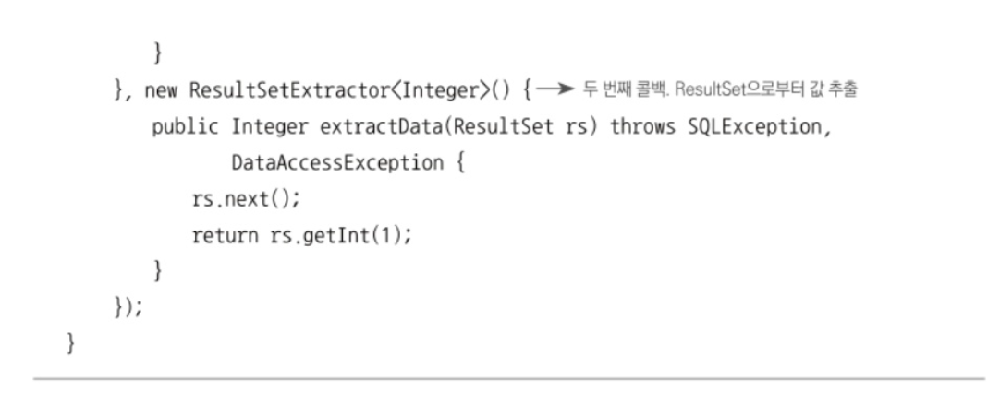
- 원래 `getCount()` 메소드에 있던 코드 중 변하는 부분만 콜백으로 만들어 제공
- 두 번째 콜백에서 리턴하는 값은 탬플릿 메소드의 결과로 다시 리턴
- 콜백이 만들어낸 결과는 탬플릿을 거쳐야 클라이언트로 전달 가능한 것
- `ResultSetExtractor`는 제네릭스 타입 파라미터를 가져 다양한 리턴 가능
### 수정된 `getCount()`
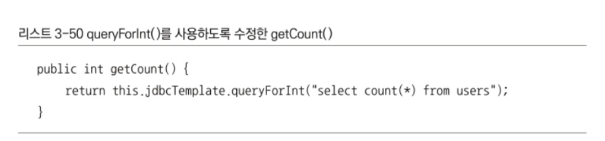
## `queryForObject()`
- `get()` 메소드에 `JdbcTemplate` 적용
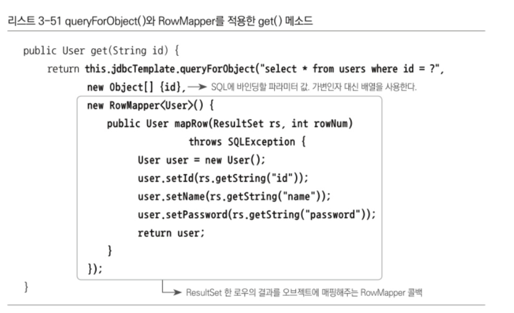
- `RowMapper`도 `ResultSetExractor`와 마찬가지로 탬플릿으로부터 `ResultSet`을 전달받고 필요한 정보 추출해 리턴
- `RowMapper`는 `ResultSetExractor`와 다르게 행 하나를 매핑하기 위해 사용되기 때문에 여러번 호출될 수 있음
- `RowMapper` 콜백은 첫 번째 행에 담긴 정보를 하나의 `User` 오브젝트에 매핑하도록 함
- 첫 파라미터는 `PreparedStatement`를 만들기 위한 SQL
- 두 번째는 여기에 바인딩할 값
- `queryForObject()` 내부에서 두 파라미터를 사용하는 `PreapredStatement` 콜백 생성
## `query()`
### `getAll()` 메소드
- 현재 등록된 사용자를 전부 가져오는 메소드
- `get()` 메소드가 하나의 행을 `User` 오브젝트 담았으니 `List<User>` 타입으로 돌려주는게 가장 좋음
- 테스트 코드
  - 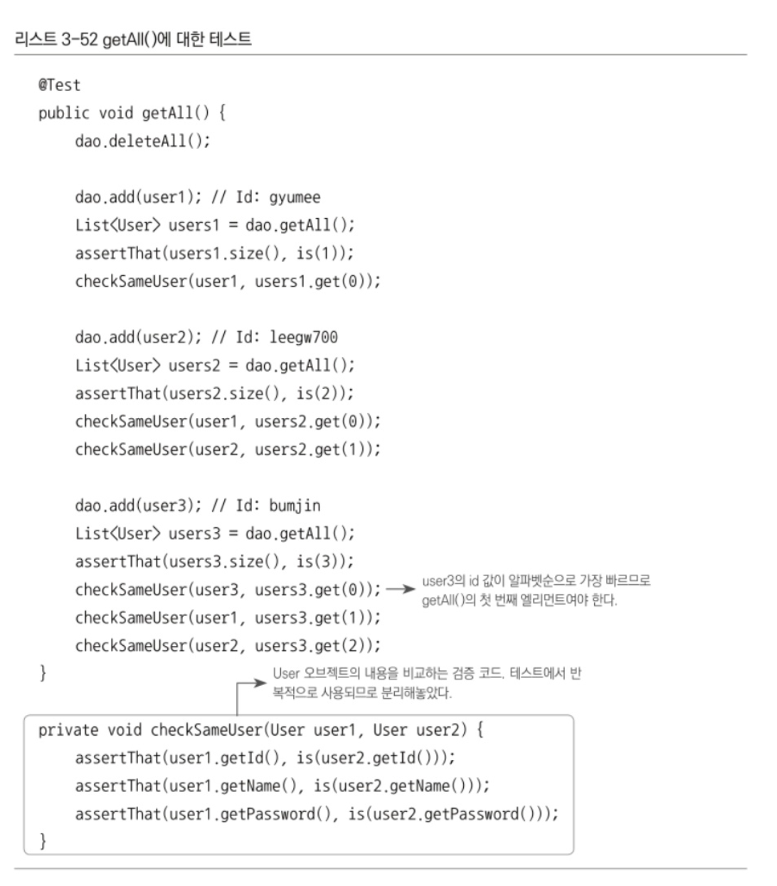
### `getAll()` 메소드 구현
- `query()` 메소드는 쿼리의 결과가 여러 개의 행으로 나오는 일반적인 경우에 사용 가능
- `query()`의 리턴 타입은 `List<T>`
- `T` 타입은 `RowMapper<T>`에서 결정
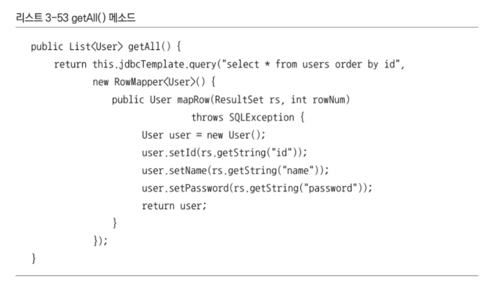
- 첫 파라미터에서 실행할 SQL 삽입
- 바인딩할 파라미터가 있다면 두 번째에 추가, 없으면 생략 가능

