# 잘못된 예외 처리
## 예외 블랙홀
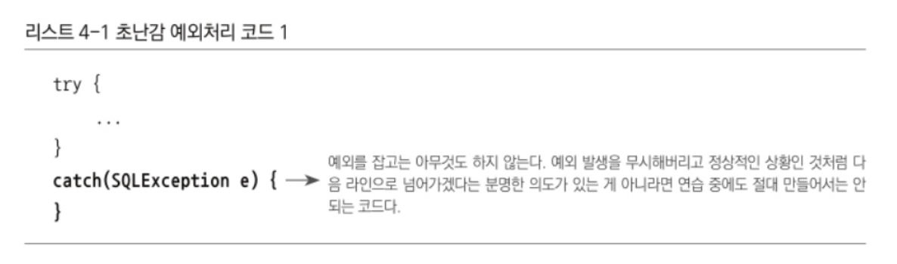
- catch 문에서 아무 것도 하지 않음
- catch 문으로 잡고 아무 것도 하지 않으면 프로그램 실행 중 예외가 발생해도 그것을 무시하고 계속 진행
  - 결국 어떤 기능이 비정상적으로 동작
  - 메모리나 리소스 소진
  - 예상치 못한 다른 문제 발발
- 그냥 `e.printStackTrace()`나 `System.out.println(e)`도 다른 메시지에 가려 보이지 않을 수 있으니 좋지 않음
- 모든 예외는 적절히 복구되던지 작업을 중단시키고 운영자 또는 개발자에게 통보되어야 함
- 굳이 예외를 잡아 조치를 취할 방법이 없다면 안 잡는게 나음
## 무책임한 throw
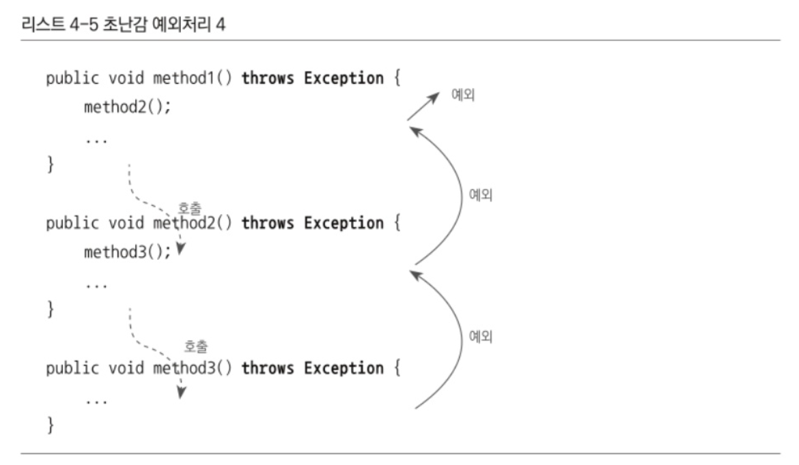
- 자신이 사용하려는 메소드에 throws Exception이 선언되어 있으면 해당 메소드 선언에서 의미 있는 정보를 얻을 수 없음
  - 정말 어떤 예외 상황이 발생하는 것인지 기계적으로 붙여놓은 것인지 알 수 없음

----

# 예외의 종류와 특징
## Error
- `java.lang.Error` 클래스의 서브클래스들
- 잡아봤자 대응 방법이 없기 때문에 애플리케이션 코드에서 잡으려고 하면 안 됨
- 시스템 레벨에 작업 아니라면 이런 에러에 대한 처리는 신경쓰지 않아도 됨
## Exception
- `java.lang.Exception` 클래스와 그 서브클래스로 정의되는 예외들
- 개발자들이 만든 애플리케이션 코드의 작업 중 예외상황이 발생했을 경우에 사용됨
### 체크 예외
- `Exception` 클래스의 서븟클래스이면서 `RuntimeException` 클래스를 상속하지 않음
- 체크 예외가 일반적으로 얘기하는 예외
- 반드시 예외 처리하는 코드를 함께 작성해야 함
- 작성하지 않는다면 컴파일 에러 발생
### 언체크 예외
- `Exception` 클래스의 서븟클래스이면서 `RuntimeException` 클래스를 상속
## RuntimeException과 언체크/런타임 예외
- `java.lang.RuntimeException` 클래스를 상속한 예외들은 명시적인 예외처리를 강제하지 않기 때문에 언체크 예외라 불림
- aka 런타임 예외
- catch문으로 잡거나 throws로 선언하지 않아도 되고 해도 됨
- 런타임 예외는 주로 프로그램의 오류가 있을 때 발생되도록 의도된 것들
- `NullPointerException`, `IllegalArgumentException` 등

----

# 예외 처리 방법
## 예외 복구
- 예외 상황을 파악하고 문제를 해결해 정상 상태로 돌려놓는 것
- 예외로 인해 기본 작업 흐름이 불가능하면 다른 작업 흐름으로 자연스럽게 유도
- 예외가 처리되었으면 비록 기능적으로는 사용자에게 예외상황으로 비쳐도 애플리케이션에서는 정상적으로 설계된 흐름을 따라 진행되어야 함
## 예외 처리 회피
- 예외 처리를 자신이 담당하지 않고 자신을 호출한 쪽으로 던져버리는 것
- throws 문으로 선언하거나 catch 문으로 일단 잡고 로그를 남기고 다시 예외를 던짐
- 예외 처리를 회피하려면 반드시 다른 오브젝트나 메소드가 예외를 대신 처리할 수 있도록 던져야 함
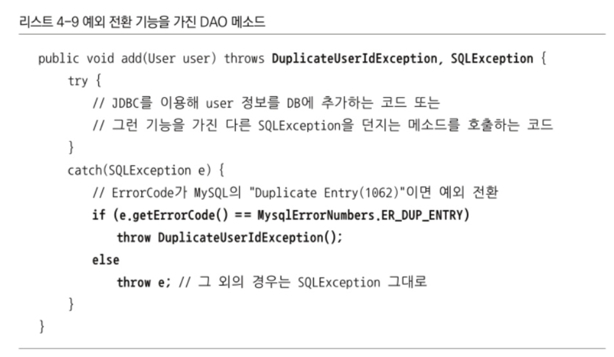
- `SQLException`을 자신이 처리하지 않고 탬플릿으로 던져버림
- 콜백 메소드는 `SQLException`을 처리하는 역할이 아니라고 생각하기 때문
- 그러나 콜백과 탬플릿처럼 긴밀하게 역할을 분담하고 있는 것이 아니라면 자신의 코드에서 발생하는 예외를 그냥 던져버리는 것은 무책임한 회피가 될 수 있음
- 처리하는 로직이 없다면 던져진 에러가 서버까지 이동할 수 있음
- 따라서 예외를 회피하는 것은 예외를 복구하는 것처럼 의도가 분명해야 함
## 예외 전환
- 예외를 복구해서 정상적인 상태로 만들 수 없기 때문에 예외를 메소드 밖으로 던지는 것
- 하지만 발생한 예외를 그대로 넘기는 것이 아니라 적절한 예외로 전환해서 던짐
### 예외 전환의 첫 번째 목적
- 내부에서 발생한 예외가 해당 상황에 대한 적절한 의미를 부여하지 못 할 때, 의미를 분명히 해 줄 수 있는 예외로 바꾸기 위함
- 단순히 `SQLException`을 던지는 것이 아니라 발생한 이유에 따라 다른 예외로 바꿔 던짐
- 의미가 분명한 예외가 던져지면 서비스 계층 오브젝트에서 적절한 복구 작업 시도 가능
  - 서비스 계층에서 `SQLException` 예외를 분석하는 것도 가능은 하지만 게층의 특징에 어울리지는 않음
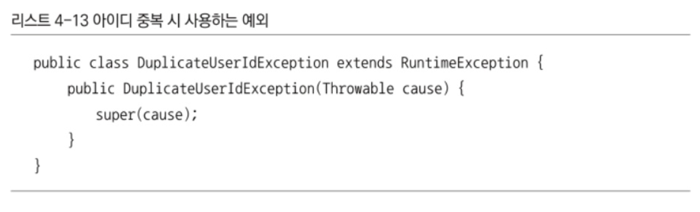
- 보통 전환하는 예외에 원래 발생한 예외를 담아 중첩 예외로 만드는 것이 좋음
## 예외 전환의 두 번째 목적
- 예외를 처리하기 쉽고 단순하게 만들기 위해 포장하기 위함
- 의미를 명확하게 하기 위해 다른 예외로 전환하는 것이 아니라 예외처리를 강제하는 체크 예외를 언체크 예외인 런타임 예외로 바꾸는 데 사용
- 비즈니스 로직으로 볼 때 의미 있는 예외이거나 복구 가능한 예외가 아니면 런타임 예외로 포장하는게 나음
- 다만 애플리케이션 코드에서 로직 상의 예외가 발생하면 체크 예외를 사용하는 것이 적절
  - 비즈니스적인 의미가 있으면 적절한 대응이 필요하기 때문

----

# 예외 처리 전략
## 런타임 예외의 보편화 
- 체크 예외는 복구 가능성이 조금이라도 있는 예외 상황이기 때문에 자바는 catch 블록이나 throws 선언을 강제
- 예전에는 전부 처리해 주는 것이 필요했지만 지금 자바 엔터프라이즈 환경에서는 각 요청이 독립적으로 취급되기 때문에 예외가 발생하면 해당 작업만 중지시키면 됨
- 서버 특정 계층에서 예외가 발생했을 때 작업을 중지하고 사용자와 바로 소통해 예외 상황을 복구할 수는 없음
- 자바의 환경이 서버로 이동하며 체크 예외의 활용도와 가치는 점점 떨어지고 있음
- 자칫 `throws Exception`으로 도배될 수 있기 때문에 대응 불가능한 체크 예외라면 런타임 에러로 전환해 던지는 게 나음
## `add()` 메소드 예외 처리
- 앞 이미지를 보면 `DuplicatedUserException`, `SQLException`을 발생시킴
- `SQLException`의 경우 해결 방법도 없기 때문에 런타임 에러로 포장해 던지는 것이 나음
- `DuplicatedUserException`도 체크 예외로 두어야 하는 것은 아님
  - 해당 경우에는 의미가 있는 예외이기 때문에 `add()` 메소드를 호출한 오브젝트보다 앞단의 오브젝트에서 다룰 수 있음
  - 어디서든 예외를 처리할 수 있다면 굳이 체크 예외로 만들지 않고 런타임 예외로 만드는 게 나음
## `add()` 메소드 수정
### 예외 생성

- 아이디가 중복되었을 때 사용하는 `DuplicatedUserException` 생성
- 굳이 처리할 필요 없다면 신경 쓰지 않아도 되도록 `RuntimeException`을 상속한 런타임 예외로 만듬
- 중첩 예외를 만들 수 있도록 생성자 추가
### throws 선언 수정
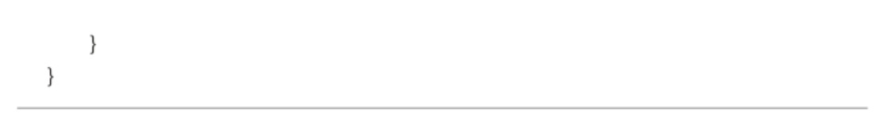
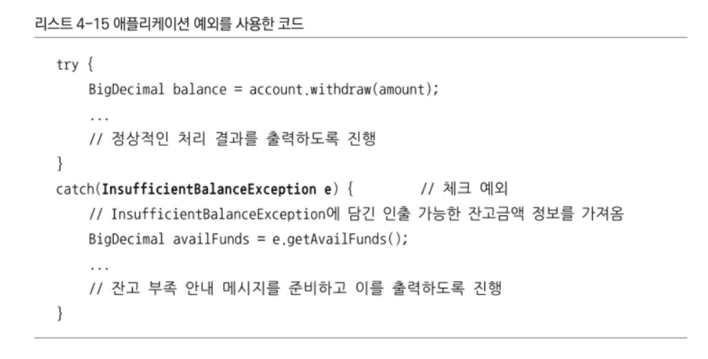
- 시스템 예외에 해당하는 `SQLException`은 언체크 예외가 되었음
- 따라서 메소드 선언의 throws에 포함시킬 필요 x
- 반대로 `add()` 메소드를 사용하는 쪽에서 아이디 중복 예외를 처리하고 싶은 경우에 활용할 수 있도록 알려주기 위해 `DuplicatedUserException`은 메소드의 throws에 추가
### 결과
- `SQLException`을 처리하기 위해 불필요한 throws 선언 필요 없어짐
- 필요한 경우 아이디 중복 상황을 해결하기 위해 `DuplicatedUserException` 사용 가능
- 런타임 예외를 일반화하해서 사용할 때는 컴파일러가 예외 처리를 강제하지 않기 때문에 해당 예외에 대한 내용을 문서로 남겨두는 것이 좋음

----

# 애플리케이션 예외
- 애플리케이션 자체의 로직에 의해 의도적으로 발생시키고 반드시 catch해 무엇인가 조치를 취하도록 요구하는 예외
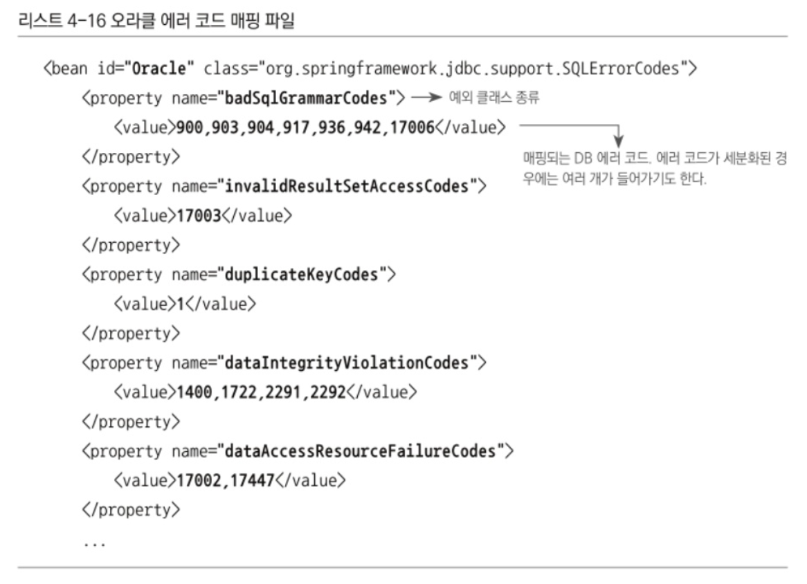
- 정상적인 흐름을 기본으로 잡고 흐름에서 벗어날 때 예외 처리를 함으로써 코드가 더 효율적

----

# `SQLException`의 행방
## `SQLException`은 복구 가능한 예외인가
- 99퍼센트는 코드 레벨에서 복구 불가
- 시스템의 예외라면 당연히 애플리케이션 레벨에서 복구 불가
- 따라서 예외 처리 전략을 적용해야 함
- 가능한 한 빨리 언체크/런타임 예외로 전환해 주어야 함

----

# 예외 전환
## JDBC의 한계
- JDBC는 DB를 자유롭게 변경해 사용할 수 있는 유연한 코드를 보장해 주지는 못 함
### 문제점 1. 비표준 SQL
- 대부분 DB는 표준을 따르지 않는 비표준 문법과 기능도 제공
- 비표준 SQL은 결국 DAO 코드에 들어가고 해당 DAO는 결국 특정 DB에 종속
- 보통은 DB를 잘 바꾸지 않기에 상관 없지만 DB에 유연한 것이 중요하다면 고려해야 할 문제
- DB 별로 별도의 DAO를 만들거나 SQL을 외부에 독립시켜 DB에 따라 변경해 가는 사용 방법이 있음
### 문제점 2. 호환성 없는 `SQLException`의 DB 에러정보
- JDBC는 다양한 예외를 그냥 `SQLException`에 담아버림
- 하지만 `getErrorCode()`로 가져오는 값은 모두 구분
- DB의 JDBC 드라이버에서 `SQLException`을 담을 코드를 제대로 만들어 주지 않기 때문에 호환성이 좋지 않음
## DB 에러 코드 매핑을 통해 전환
- `SQLException`에 담긴 SQL 상태 코드보다 DB 전용 에러 코드가 더 정확
- DB 에러 코드는 DB에서 직접 제공해 주는 것이니 버전이 올라가도 어느정도 일관성이 있음
- DB별 에러 코드를 참고해 발생한 예외의 원인이 무엇인지 해석해 주는 기능을 만드는 것
- 스프링은 세분화된 예외 클래스들을 제공
  - 문제는 DB마다 에러 코드가 제각각이라는 것
  - DAO 메소드나 JdbcTemplate 등의 코드에서 일일이 DB 별로 에러 코드를 확인하는 것은 부담스러움
- 스프링은 DB 별 에러 코드를 분류해 스프링이 정의한 예외 클래스와 매핑해 둔 에러 코드 매핑정보 테이블을 만들어두고 이용
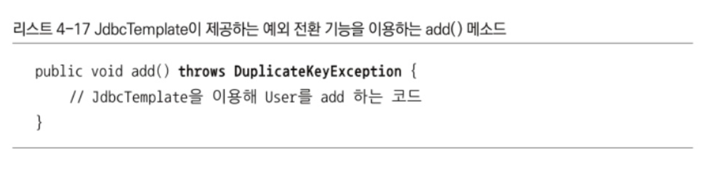
- JdbcTemplate은 `SQLException`을 단지 런타임 예외인 `DataAccessException`으로 포장하는 것이 아님
- DB의 에러 코드를 `DataAccessException` 계층 구조의 클래스 중 하나로 매핑
- 전환되는 JdbcTemplate에서 던지는 예외는 모두 `DataAccessException`의 서브클래스 타입
- DB 별로 매핑 정보를 참고해 적절한 에외 클래스를 선택하기 때문에 DB가 달라져도 같은 종류의 에러람련 동일한 예외를 받을 수 있음
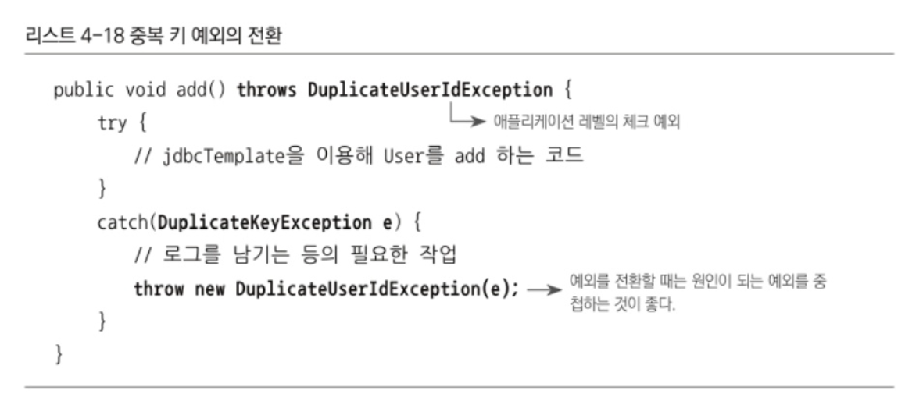
- `add()` 메소드를 스프링의 JdbcTemplate를 사용하도록 변경
- JdbcTemplate가 계층 구조의 예외로 포장해 주기 때문에 `add()` 메소드에는 예외 포장을 위한 코드가 따로 필요 없음
- JdbcTemplate를 사용한다면 JDBC에서 발생하는 DB 관련 예외는 거의 신경쓰지 않아도 됨
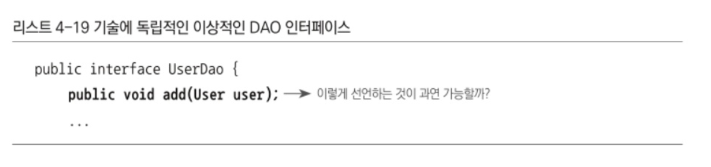
- 중복 키 에러가 발생했을 때 애플리케이션에서 직접 정의한 예외를 발생시키고 싶을 경우의 처리

----

# DAO 인터페이스와 `DataAccessException` 계층 구조
- `DataAccessException`은 의미가 같은 예외라면 데이터 엑세스 기술의 종류오 상관없이 일관된 예외가 발생하도록 함
- 데이터 엑세스 기술에 추상화된 예외를 제공하는 것
- 스프링은 왜 계층 구조를 이용해 기술에 독립적인 예외를 정의하고 사용케 하는가
## DAO 인터페이스와 구현의 분리
- DAO를 따로 만들어 사용하는 것은 인터페이스를 이용해 구체적인 클래스 정보와 구현 방법을 감추고 DI를 통해 제공되는 것이 바람직하기 때문
- 하지만 메소드 선언에 나타나는 예외 정보가 문제가 될 수 있음
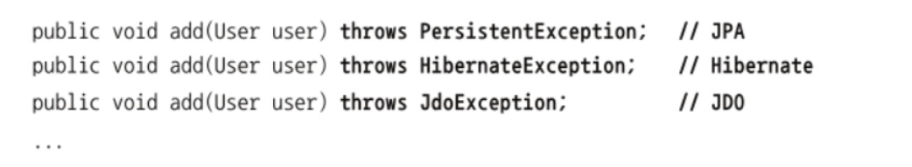
- UserDao의 인터페이스를 분리해 기술에 독립적인 인터페이스로 만들기 위함
- 하지만 인터페이스의 메소드 선언에 없는 예외를 구현 클래스 메소드의 throws에 넣을 수는 없음
- 따라서 인터페이스 메소드는 `public void add(User user) throws SQLException`이 되야 함
- 이렇게 정의하면 JDBC에서 다른 데이터 엑세스 기술로 전환할 수 없음
  - 데이터 엑세스 기술의 API는 각자 독자적인 예외를 던지기 때문
  - 
- 가장 단순한 방법은 `throws Exception`으로 선언하는 것
  - JDBC 이후에 나온 기술들은 체크 예외 대신 런타임 예외 사용
  - 따라서 throws에 선언해 주지 않아도 됨
  - `SQLException`을 던지는 JDBC API를 직접 사용한는 DAO는 메소드 내에서 런타임 예외로 포장해서 던져주면 됨
  - 그러면 `public void add(User user)`로 선언 가능
- 하지만 데이터 엑세스 예외를 의미 있게 분류할 필요도 있음
- 따라서 DAO의 사용 기술에 따라 예외 처리 방법이 달라져야 함
- 단지 인터페이스로 추상화하고 일부 기술에서 발생하는 체크 예외를 런타임 예외로 전환하는 것만으로는 불충분
## 데이터 엑세스 예외 추상화와 `DataAccessException` 계층 구조
- 스프링은 자바의 다양한 데이터 엑세스 기술을 사용할 때 발생하는 에외들을 추상화 해 `DataAccessException` 계층 구조 안에 정리해 놓음
- 데이터 엑세스 기술에 따라 다른 예외를 발생해 전달
### 낙관적인 락킹
- 오브젝트/엔티티 단위로 정보를 업데이트하는 경우 발생 가능
- 같은 정보를 두 명 이상의 사용자가 동시에 조회하고 순차적으로 업데이트할 때 이후 것이 앞선 것을 덮어쓰지 않도록 막아주는 기능
- 이런 예외들은 사용자에게 적절한 안내 메시지를 보여주고 다시 시도할 수 있도록 해야함
- JDO, JPA, Hibernate마다 다른 종류의 낙관적인 락킹 발생
- 하지만 스프링 예외 전환 방법을 적용하면 `ObjectOptimisticLockingFailureException`으로 통일 가능
- 어떤 데이터 엑세스 기술을 사용했는지 상관 없이 낙관적인 락킹을 처리하는 코드 만들어낼 수 있음
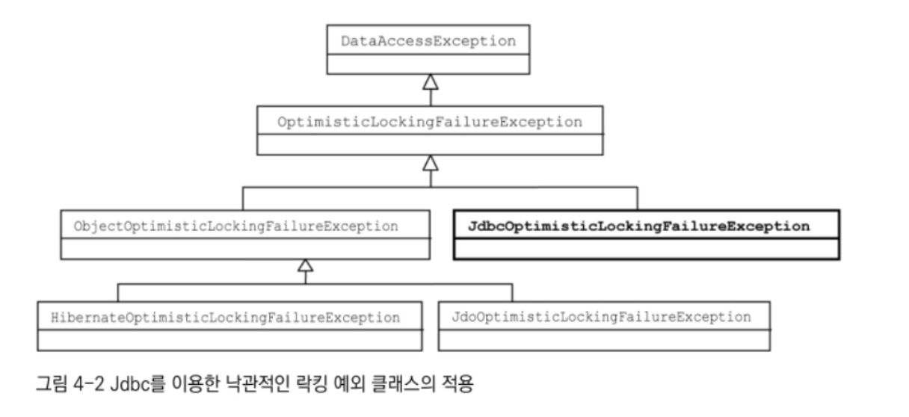

----

# 기술에 독립적인 UserDao
## 인터페이스 적용
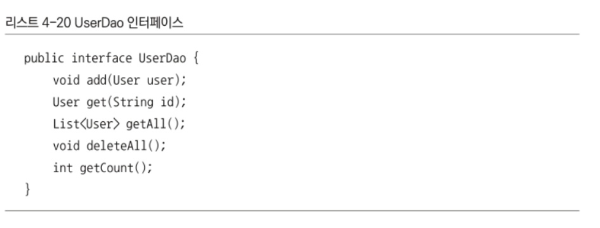
- `setDataSource()`는 구현 방법에 따라 변경될 수 있기 때문에 인터페이스에 포함시키지 않음
- 기존 UserDao는 UserDaoJdbc로 변경 후 UserDao 인터페이스를 구현하도록 implements로 선언
- 빈 클래스도 이름을 바꿔줌