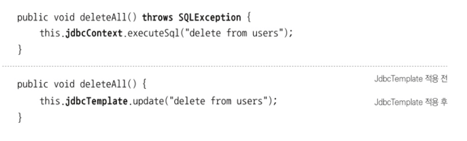

# 4장 예외

자바 개발자가 가장 신경 쓰기 귀찮아하는 것 중의 하나가 바로 예외처리다.

JdbcTemplate을 대표로 하는 스프링의 데이터 액세스 기능에 담겨 있는 예외처리와 관련된 접근 방법에 대해 알아보자.



얼핏 보면 달라진게 없는 것 같지만 자세히 메소드의 정의를 들여다보면

JdbcTemplate 적용 이전에는 있었던 `throws SQLException` 선언이 적용 후에는 사라졌음을 알 수 있다.

SQLException은 JDBC API의 메소드들이 던지는 것이므로 당연히 있어야 한다. 비록 로그를 남기기 위해 catch를 했다고 해도 다시 JDBC 템플릿 메소드 밖으로 던져서 예외상황이 발생했다는 사실을 알려야 한다.

그런데 JdbcTemplate을 적용한 코드에서는 모두 이 SQLException이 사라졌다.

어디로 간 걸까??

### 4.1.1 초난감 예외처리

먼저 개발자들의 코드에서 종종 발견되는 초난감 예외처리의 대표선수들을 살펴보자.


이 코드는 자바의 기초를 배우는 학생들이 만들어낸 JDBC 코드에서 흔히 볼 수 있는 코드다.

예외가 발생하면 그것을 catch 블록을 써서 잡아내는 것까지는 좋은데 그리고 아무것도 하지 않고 별문제 없는 것처럼 넘어가 버리는 건 정말 위험한 일이다. 원치 않는 예외가 발생하는 것보다도 훨씬 더 나쁜 일이다.

- Why?
    
    왜냐하면 프로그램 실행 중에 어디선가 오류가 있어서 예외가 발생했는데 그것을 무시하고 계속 진행해버리기 때문이다. 결국 발생한 예외로 인해 어떤 기능이 비정상적으로 동작하거나, 메모리나 리소스가 소진되거나, 예상치 못한 다른 문제를 일으킬 것이다. 더 큰 문제는 그 시스템 오류나 이상한 결과의 원인이 무엇인지 찾아내기가 매우 힘들다는 점이다.
    

어떤 경우에도 위와 같은 코드를 만들면 안된다. 습관이 되면 절대 안 된다.


위와 같은 코드들도 똑같다. 화면에 출력해주는데 그래서 “뭐가?” 라고 할 수 있지만 개발중에는 IDE 콘솔이나 서버 실행창에 이 메시지가 눈에 확 띄게 보이니 문제가 생겨도 금방 알아차리고 뭔가 조치를 취할 수 있을지 모르겠다. 그래 봤자 다른 로그나 메시지에 금방 묻혀버리면 놓치기 쉽상이다.

운영 서버에 올라가면 더욱 심각하다. 콘솔 로그를 누군가가 계속 모니터링하지 않는 한 이 예외 코드는 심각한 폭탄으로 남아 있을 것이다.

**예외는 처리돼야 한다.** catch 블록을 이용해 화면에 미시지를 출력한 것은 예외를 처리한 게 아니다. ****

예외를 처리할 때 반드시 지켜야 할 핵심 원칙은 한 가지다. **모든 예외는 적절하게 복구되든지 아니면 작업을 중단시키고 운영자 또는 개발자에게 분명하게 통보돼야 한다**.

- printStackTrace()가 뭔데?
    
    
    

SQLException이 발생하는 이유는 SQL에 문법 에러가 있거나 DB에서 처리할 수 없을 정도로 데이터 액세스 로직에 심각한 버그가 있거나, 서버가 죽거나, 네트워크가 끊기는 등의 심각한 상황이 벌어졌기 때문이다.

그런데 그냥 예외를 무시하고 정상적으로 동작하고 있는 것처럼 모른 척 다음 코드로 샐힝을 이어간다는 건 말이 되지 않는다. 콘솔이나 로그에 예외 메세지를 출력하는 건 아무런 도움이 되지 않는다.


물론 실전에서 이렇게 만들라는 건 아니다. 예외를 무시하거나 잡아먹어 버리는 코드를 만들지 말라는 뜻이다. 굳이 예외를 잡아서 뭔가 조치를 취할 방법이 없다면 잡지 말아야 한다.  메소드에 throws SQ:Exception을 선언해서 메소드 밖으로 던지고 자신을 호출한 코드에 예외처리 책임을 전가해라.


### 무의미하고 무책임한 THROWS

catch 블록으로 예외를 잡아봐야 해결할 방법도 없고 JDK API나 라이브러리가 던지는 각종 이름도 긴 예외들을 처리하는 코드를 매번 throws로 선언하기도 귀찮아지기 시작하면, 메소드 선언에 throws Exception을 기계적으로 붙이는 개발자도 있다.

EJB가 한창 쓰이던 시절에 흔히 볼 수 있던 코드다. API 등에서 발생하는 예외를 일일이 catch하기도 귀찮고, 별 필요도 없으며 매번 정확하게 예외 이름을 적어서 선언하기도 귀찮으니 아예 throws Exception이라는, 모든 예외를 무조건 던져버리는 선언을 모든 메소드에 기계적으로 넣는 것이다.

—> 이런 무책임한 throws 선언도 심각한 문제점이 있다.

자신이 사용하려고 하는 메소드에 throws Exception이 선언되어 있다고 생각해보자.

그런 메소드 선언에서는 의미 있는 정보를 얻을 수 없다. 정말 무엇인가 실행 중에 예외적인 상황이 발생할 수 있다는 것인지, 아니면 그냥 습관적으로 복사해서 붙여놓은 것인지 알 수가 없다.

결국 이런 메소드를 사용하는 메소드에서도 역시 throws Exception을 따라서 붙이는 수 밖에 없다. 결과적으로 적절한 처리를 통해 복구될 수 있는 예외상황도 제대로 다룰 수 있는 기회를 박탈당한다.

**지금까지 살펴본 두가지 나쁜 습관은 어떤 경우에도 용납하지 않아야 한다.**

### 4.1.2 예외의 종류와 특징

예외처리에 관해서는 자바 개발자들 사이에서도 오랫동안 많은 논쟁이 있었다. 가장 큰 이슈는 체크 예외라고 불리는 명시적인 처리가 필요한 예외를 사용하고 다루는 방법이다.

자바에서 throw를 통해 발생시킬 수 있는 예외는 크게 세 가지가 있다.

- Error
    
    첫째는 java.lang.Error 클래스의 서브클래스들이다. 에러는 시스템에 뭔가 비정상적인 상황이 발생했을 경우에 사용된다. 그래서 주로 자바 VM에서 발생시키는것이고 애플리케이션 코드에서 잡으려고 하면 안 된다. OutOfMemoryError나 ThreadDeath 같은 에러는 catch 블록으로 잡아봤자 아무런 대응 방법이 없기 때문이다.
    
    따라서 시스템 레벨에서 특별한 작업을 하는 게 아니라면 애플리케이션에서는 이런 에러에 대한 처리는 신경 쓰지 않아도 된다.
    

- Exception과 체크 예외
    
    java.lang.Exception 클래스와 그 서브클래스로 정의되는 예외들은 에러와 달리 개발자들이 만든 애플리케이션 코드의 작업 중에 예외상황이 발생했을 경우에 사용된다.
    
    
    
    Exception 클래스는 다시 체크 예외와 언체크 예외로 구분된다. 전자는 Exception 클래스의 서브클래스이면서 RuntimeExecption을 상속한 클래스들을 말한다.
    
    일반적으로 예외라고 하면 Exception 클래스의 서브클래스 중에서 RuntimeException을 상속하지 않은 것만을 말하는 체크 예외라고 생각해도 된다.
    
    체크 예외가 발생할 수 있는 메소드를 사용할 경우 반드시 예외를 처리하는 코드를 함께 작성해야 한다. 사용할 메소드가 체크 예외를 던진다면 이를 catch 문으로 잡든지, 아니면 다시 throws를 정의해서 메소드 밖으로 던져야 한다. → 그렇게 하지 않으면 컴파일 에러가 발생
    

- RuntimeException과 언체크/런타임 예외
    
    java.lang.RuntimeException 클래스를 상속한 예외들은 명시적인 예외처리를 강제하지 않기 때문에 언체크 예외라고 불린다. 또는 대표 클래스 이름을 따서 런타임 예외라고도 한다. 에러와 마찬가지로 이 런타임 예외는 catch문으로 잡거나 throws로 선언하지 않아도 된다. 물론 명시적으로 throws로 선언해줘도 상관 없다.
    
    런타임 예외는 주로 프로그램의 오류가 있을 때 발생하도록 의도된 것들이다. NullpointerException이나, IllegalArgumentException 등이 있다. 이런 예외는 코드에서 미리 조건을 체크하도록 주의 깊게 만든다면 피할 수 있다. 피할 수 있지만 개발자가 부주의해서 발생할 수 있는 경웨 발생하도록 만든 것이 런타임 예외다. 따라서 런타임 예외는 예상하지 못했던 예외상황에서 발생하는 게 아니기 때문에 굳이 catch나 throws를 사용하지 않아도 되도록 만든 것이다.
    
    ### 4.1.3 예외처리 방법
    
    ### 예외 복구
    
    첫 번째 예외처리 방법은 예외상황을 파악하고 문제를 해결해서 정상 상태로 돌려놓는 것이다.
    
    예를 들어 사용자가 요청한 파일을 읽으려고 시도했는데 해당 파일이 없다거나 다른 문제가 있어서 읽히지가 않아서 IOException이 발생했다고 생각해보자. 이때는 사용자에게 상황을 알려주고 다른 파일을 이용하도록 안내해서 예외상황을 해결할 수 있다. 예외로 인해 기본 작업 흐름이 불가능하면 다른 작업 흐름으로 자연스럽게 유도해주는 것이다.
    
    단, IOException 에러 메시지가 사용자에게 그냥 던져지는 것은 예외 복구라고 볼 수 없다.
    
    예외가 처리됐으면 비록 기능적으로는 사용자에게 예외상황으로 비쳐도 애플리케이션에서는 정상적으로 설계된 흐름을 따라 진행돼야 한다.
    
    
    

예외처리 코드를 강제하는 체크 예외들은 이렇게 예외를 어떤 식으로든 복구할 가능성이 있는 경우에 사용한다. API를 사용하는 개발자로 하여금 예외상황이 발생할 수 있음을 인식하도록 도와주고 이에 대한 적절한 처리를 시도해보도록 요구하는 것이다.

위의 코드를 한번 보자 통제 불가능한 외부 요인으로 인해 예외가 발생하면 MAX_RETRY만큼 재시도를 하는 간단한 예다. 사전에 미리 성공 여부를 확인할 수 없고, 재시도가 의미 있는 경우라면 이렇게 최대 횟수만큼 반복적으로 시도함으로써 예외상황에서 복구되게 할 수 있다.

### 예외처리 회피

두 번째 방법은 예외처리를 자신이 담당하지 않고 자신을 호출한 쪽으로 던져버리는 것이다.

throws 문으로 선언해서 예외가 발생하면 알아서 던져지게 하거나 catch 문으로 일단 예외를 잡은 후에 로그를 남기고 다시 예외를 던지는것이다.


콜백 오브젝트의 메소드는 SQLException에 대한 예외를 회피하고 템플릿 레벨에서 처리하도록 던져준다.

하지만 콜백과 템플릿처럼 긴밀하게 역할을 분담하고 있는 관계가 아니라면 자신의 코드에서 발생하는 예외를 그냥 던져버리는 건 무책임한 책임회피일 수 있다.

예외를 회피하는 것은 예외를 복구하는 것처럼 의도가 분명해야 한다. 콜백/템플릿처럼 긴밀한 관계에 있는 다른 오브젝트에게 예외처리 책임을 분명히 지게 하거나, 자신을 사용하는 쪽에서 예외를 다루는 게 최선의 방법이라는 분명한 확신이 있어야 한다.

### 예외 전환

마지막으로 예외를 처리하는 방법은 예외 전환을 하는 것이다. 예외 회피와 비슷하게 예외를 복구해서 정상적인 상태로는 만들 수 없기 때문에 예외를 메소드 밖으로 던지는 것이다. 하지만 예외 회피와 달리, 발생한 예외를 그대로 넘기는 게 아니라 적절한 예외로 전환해서 던진다는 특징이 있다.

예외 전환은 보통 두 가지 목적으로 사용된다.

1. 내부에서 발생한 예외를 그대로 던지는 것이 그 예외상황에 대한 적절한 의미를 부여해주지 못하는 경우에, 의미를 분명하게 바꿔주기 위해서다.

API가 발생하는 기술적인 로우레벨을 상황에 적합한 의미를 가진 예외로 변경하는 것이다.


예를 들어 새로운 사용자를 등록하려고 시도했을 때 같은 사용자가 있어서 DB 에러가 발생하면 JDBC API는 SQLException을 발생시킨다. 이 경우 DAO 메소드가 SQLException을 그대로 밖으로 던져버리면, DAO를 이용해 사용자를 추가하려고 한 서비스 계층 등에서는 왜 SQLException이 발생했는지 쉽게 알 방법이 없다.

로그인 아이디 중복 같은 경우는 충분히 예상 가능하고 복구 가능한 예외 상황이다. 이럴 땐 DAO에서 SQLException의 정보를 해석해서 DuplicateUserIdException같은 예외로 바꿔서 던져주는 게 좋다.

서비스 계층 오브젝트에서 SQLExecption의 원인을 해석해서 대응하는 것도 불가능하지는 않지만, 특정 기술의 정보를 해석하는 코드를 비즈니스 로직을 담은 서비스 계층에 두는 건 매우 어색하다.

—> ?? 그럼 DAO 같은 Repository를 참조하는 계층에서 작업하라는 의미인지?


보통 전환하는 예외에 원래 발생한 예외를 담아서 중첨 예외로 만드는 것이 좋다.

중첩 예외는 getCause() 메소드를 이용해서 처음 발생한 예외가 무엇인지 확인할 수 있다.


1. 두 번째 전환 방법은 예외를 처리하기 쉽고 단순하게 만들기 위해 포장(wrap)하는 것이다.

중첩 예외를 이용해 새로운 예외를 만들고 원인이 되는 예외를 내부에 담아서 던지는 방식은 같다.

하지만 의미를 명확하게 하려고 다른 예외로 전환하는 것이 아니다.

주로 예외처리를 강제하는 체크 예외를 언체크 예외인 런타임 예외로 바꾸는 경우에 사용한다.

대표적으로 EJBException을 들 수 있다.

EJBException은 RuntimeException 클래스를 상속한 런타임 예외다. 이렇게 런타임 예외로 만들어서 전달하면 EJB는 이를 시스템 익셉션으로 인식하고 트랜잭션을 자동으로 롤백해준다. 런타임 예외이기 때문에 EJB 컴포넌트를 사용하는 다른 EJB나 클라이언트에서 일일이 예외를 잡거나 다시 던지는 수고를 할 필요가 없다. 이런 예외는 잡아도 복구할 만한 방법이 없기 때문이다.

반대로 애플리케이션 로직상에서 예외조건이 발견되거나 예외상황이 발생할 수도 있다. 이런 것은 API가 던지는 예외가 아니라 애플리케이션 코드에서 의도적으로 던지는 예외다. 이때는 체크 예외를 사용하는 것이 적절하다. 비즈니스적인 의미가 있는 예외는 이에 대한 적절한 대응이나 복구작업이 필요하기 때문이다.

일반적으로 체크 예외를 계속 throws를 사용해 넘기는 건 무의미하다. 메[소드 선언은 지저분해지고 아무런 장점이 없다. DAO에서 발생한 SQLException이 웹 컨트롤러 메소드까지 명시적으로 전달된다고 해서 무슨 소용이 있을까? 어차피 복구가 불가능한 예외라면 가능한 한 빨리 런타임 예외로 포장해 던지게 해서 다른 계층의 메소드를 작성할 때 불필요한 throws 선언이 들어가지 않도록 해줘야 한다.

### 4.1.4 예외 처리 전략

사실 자바의 예외를 이요하는 것은 간단하다. 하지만 예외를 효과적으로 사용하고, 예외가 발생하는 코드를 깔끔하게 정리하는 데는 여러 가지 신경 써야 할 사항이 많다.

### 런타임 예외의 보편화

일반적으로는 체크 예외가 일반적인 예외를 다루고, 언체크 예외는 시스템 장애나 프로그램상의 오류에 사용한다고 했다. 문제는 체크 예외는 복구할 가능성이 조금이라도 있는, 말 그대로 예외적인 상황이기 때문에 자바는 이를 처리하는 catch 블록이나 throws선언을 강제하고 있다는 점이다. 이렇게 예외처리를 강제하는 것은 예외가 발생할 가능성이 있는 API 메소드를 사용하는 개발자의 실수를 방지하기 위한 배려라고 볼 수도 있겠지만, 실제로는 예외를 제대로 다루고 싶지 않을 만큼 짜증나게 만드는 원이 되기도 한다.

자바의 환경이 서버로 이동하면서 체크 예외의 활용도와 가치는 점점 떨어지고 있다. 자칫하면 throws Exception으로 점철된 아무런 의미도 없는 메소드들을 낳을 뿐이다. 그래서 대응이 불가능한 체크 예외라면 빨리 런타임 예외로 전환해서 던지는 게 낫다.

### add() 메소드의 예외처리


add() 메소드는 DuplicateUserIdException과 SQLException, 두 가지의 체크 예외를 던지게 되어 있다., JDBC 코드에서 SQLException이 발생할 수 있는데, 그 원인 ID 중복이라면 좀 더 의미 있는 예외인DuplicateUserIdException으로 전환해주고, 아니라면 SQLException을 그대로 던지게 했다. DuplicateUserIdException은 충분히 복구 가능한 예외이므로 add() 메소드를 사용하는 쪽에서 잡아서 대응할 수 있다. 하지만 SQLException은 대부분 복구 불가능한 예외이므로 잡아봤자 처리할 것도 없고, 결국 throws를 타고 계속 앞으로 전달되다가 애플리케이션 밖으로 던져질 것이다. 그럴바에는 그냥 런타임 예외로 포장해 던져버려서 그 밖의 메소드들이 신경 쓰지 않게 해주는 편이 낫다.


먼저 사용자 아이디가 중복됐을 때 사용하는 DuplicateUserIdException을 만든다.

필요하면 언제든 잡아서 처리할 수 있도록 별도의 예외로 정의하기는 하지만, 필요 없다면 신경 쓰지 않아도 되도록 RuntimeException을 상속한 런타임 예외로 만든다. 중첩 예외를 만들 수 있도록 생성자를 추가해주는 것을 잊지 말자.


원래는 SQLException이 발생한 경우에 직접 메소드 밖으로 던지게 했는데, 이제는 런타임 예외로 전환해서 던지도록 만든다. 기존의 아이디 중복 때문에 SQLException이 발생한 경우에는 DuplicateUserIdException

을 던지게 하는 코드는 그대로 두면 된다.

이제 SQLException은 언체크 예외가 됐다.

이제 이 add()메소드를 사용하는 오브젝트는 SQLException을 처리하기 위해 불필요한 throws 선언을 할 필요는 없으면서, 필요한 경우 아이디 중복 상황을 처리하기 위해 DuplicateUserIdException을 이용할 수 있다.

이렇게 런타임 예외를 일반화해서 사용하는 방법은 여러모로 장점이 많다.

단, 런타임 예외로 만들었기 때문에 사용에 더 주의를 기울일 필요도 있다. 컴파일러가 예외처리를 강제하지 않으므로 신경 쓰지 않으면 예외상황을 충분히 고려하지 않을 수도 있기 때문이다. 런타임 예외를 사용하는 경우에는 API 문서나 레퍼런스 문서 등을 통해, 메소드를 사용할 때 발생할 수 있는 예외의 종류와 원인, 활용 방법을 자세히 설명해두자.

### 애플리케이션 예외

런타임 예외 중심의 전략은 굳이 이름을 붙이자면 낙관적인 예외처리 기법이라고 할 수 있다. 일단 복구할 수 있는 예외는 없다고 가정하고 예외가 생겨도 어차피 런타임 예외이므로 시스템 레벨에서 알아서 처리해줄 것이고, 꼭 필요한 경우는 런타임 예외라도 잡아서 복구하거나 대응해줄 수 있으니 문제 될 것 없다는 낙관적인 태도를 기반으로 하고 있다. 이럼 면에서 직접 처리할 수 없는 예외가 대부분이라고 하더라도 혹시 놓치는 예외가 있을 수 있으니, 일단 잡고 보도록 강제하는 체크 예외의 비관적인 접근 방법과 대비된다.

반면에 시스템 또는 외부의 예외상황이 원이 아니라 애플리케이션 자체의 로직에 의해 의도적으로 발생시키고, 반드시 catch해서 무엇인가 조치를 취하도록 요구하는 예외를 애플리케이션 예외라고 한다.

```sql
예를 들어 사용자가 요청한 금액을 은행계좌에서 
출금하는 기능을 가진 메소드가 있다고 생각해보자.

무턱대고 출금을 허용하고, 현재 잔고가 얼마인지 상관없이 요청한
금액만큼 계좌 잔액을 차감하도록 만드는 개발자는 없을 것이다.
당연히 현재 잔고를 확인하고, 허용하는 범위를 넘어서 출금을 요청하면, 출금 작업을 중단시키고,
절적한 경고를 사용자에게 보내야한다.

```


- 첫 번째 방법은 정상적인 출금처리르 했을 경우와 잔고 부족이 발생했을 경우에 각각 다른 종류의 리턴 값을 돌려주는 것이다.

리턴 값을 일종의 결과 상태를 나타내는 정보로 활용한다.

우선 예외상황에 대한 리턴 값을 명확하게 코드화하고 잘 관리하지 않으면 혼란이 생길 수 있다.

정상적인 처리가 안 됐을 때 전달하는 값의 표준 같은 것은 없다. 일관된 예외상황에서의 결과 값에 대한 정책이 완벽하게 갖춰져 있고, 사전에 상수로 정의해둔 코드를 사용하지 않는다면 자칫 개발자 사이의 의사소통 문제로 인해 제대로 동작하지 않을 위험이 있다. 또 한가지 문제는 결과 값을 확인하는 조건문이 자주 등장한다는 점이다. 이런식으로 결과를 도려주는 메소드를 연이어 사용하는 경우라면 if 블록이 범벅된 코드가 이어질지 모른다. 코드는 지저분해지고 흐름을 파악하고 이해하기가 힘들어질 것이다.

- 두 번째 방법은 정상적인 흐름을 따르는 코드는 그대로 두고, 잔고 부족과 같은 예외상황에서는 비즈니스적인 의미를 띤 예외를 던지도록 만드는 것이다.

예외 상황을 처리하는 catch 블록을 메소드 호출 직후에 둘 필요는 없다. 정상적인 흐름을 따르지만 예외가 발생할 수 있는 코드를 try 블록 안에 깔끔하게 정리해두고 예외상황에 대한 처리는 catch 블록에 모아둘 수 있기 때문에 코들르 이해하기도 편하다. 번거로운 if 문을 남발하지 않아도 된다.

이때 사용하는 예외는 의도적으로 체크하게 만든다. 그래서 개발자가 잊지 않고 잔고 부족처럼 자주 발생 가능한 예외상황에 대한 로직을 구현하도록 강제해주는 게 좋다.

### 4.1.5 SQLException은 어떻게 됐나?

지금까지 다룬 예외처리에 대한 내용은 JdbcTempate을 적용하는 중에 throws SQLException선언이 왜 사라졌는가를 설명하는 데 필요한 것이었다. 스프링의 예외처리 전략과 원칙을 알고 있어야 하기 때문이다.

지금까지 살펴 살펴본 예외처에리 관한 내용을 바탕으로, DAO에 존재하는 SQLException에 대해 생각해보자

먼저 생각해볼 사항은 SQLException은 과연 복구가 가능한 예외인가이다.

프로그램의 오류 또는 개발자의 부주의 때문에 발생하는 경우이거나, 통제할 수 없는 외부상황 때문에 발생하는 것이다.

시스템의 예외라면 당연히 애플리케이션 레벨에서 복구할 방법이 없다.

대부분의 SQLException은 복구가 불가능하다. 더군다나 DAO 밖에서 SQLException을 다룰 수 있는 가능성은 거의 없다. 따라서 예외처리 전략을 적용해야 한다. 필요도 없는 기계적인 throws 선언이 등장하도록 방치하지말고 가능한 한 빨리 언체크/런타임 예외로 전환해줘야 한다.

스프링의 JdbcTemplate은 바로 이 예외처리 전략을 따르고 있다. JdbcTemplate 템플릿과 콜백 안에서 발생하는 모든 SQLException을 런타임 예외인 DataAccessExcetion으로 포장해서 던져준다. 따라서 JdbcTemplate을 사용하는 UserDao 메소드에선 꼭 필요한 경우에만 런타임 예외인 DataAccessException을 잡아서 처리하면 되고 그 외의 경우에는 무시해도 된다. 그래서 DAO 메소드에서 SQLException이 모두 사라진 것이다.

```java
public int update(final String sql) throws DataAccessException{ ... }
```

그 밖에도 스프링의 API 메소드에 정의되어 있는 대부분의 예외는 런타임 예외다. 따라서 발생 가능한 예외가 있다고 하더라도 이를 처리하도록 강제하지 않는다.

## 4.2 예외 전환

예외를 다른 것으로 바꿔서 던지는 예외 전환의 목적은 두가지라고 설명했다.

1. 런타임 예외로 포장해서 굳이 필요하지 않은 catch/throws를 줄여주는 것
2. 로우레벨의 예외를 좀 더 의미 있고 추상화된 예외로 바꿔서 던져주는 것

스프링의 JdbcTemplate이 던지는 DataAccessException은 일단 런타임 예외로 SQLException을 포장해주는 역할을 한다.그래서 대부분 복구가 불가능한 예외인 SQLException에 대해 애플리케이션 레벨에서는 신경 쓰지 않도록 해주는 것이다. 또한 DataAccessException은 SQLException에 담긴 다루기 힘든 상세한 예외정보를 의미 있고 일관성 있는 예외로 전환해서 추상화해주려는 용도로 쓰이기도 한다.

### 4.2.1 JDBC의 한계

JDBC는 자바를 이용해 DBN에 접근하는 방법을 추상화된 API 형태로 정의해놓고, 각 DB 업체가 JDBC 표준을 따라 만들어진 드라이버를 제공하게 해준다. 내부 구현은 DB마다 다르겠지만 JDBC의 Connection, Statement, ResultSet 등의 표준 인터페이스를 통해 그 기능을 제공해주기 때문에 자바 개발자들은 표준화된 JDBC의 API에만 익숙해지면 DB의 종류에 상관없이 일관된 방법으로 프로그램을 개발 할 수 있다.

표준화된 JDBC API가 DB 프로그램 개발 방법을 학습하는 부담은 확실히 줄여주지만 DB를 자유롭게 변경해서 사용할 수 있는 유연한 코드를 보장해주지는 못한다.

현실적으로 DB를 자유롭게 바꾸어 사용할 수 있는 DB 프로그램을 작성하는 데는 두 가지 걸림돌이 있다.

### 비표준 SQL

첫째 문제는 JDBC 코드에서 사용하는 SQL이다. SQL은 어느 정도 표준화된 언어이고 몇 가지 표준 규약이 있긴 하지만, 대부분의 DB는 표준을 따르지 않는 비표준 문법과 기능도 제공한다. 이런 비표준 특정 DB 전용 문법은 매우 폭넓게 사용되고 있다. 해당 DB의 특별한 기능을 사용하거나 최적화된 SQL을 만들 때 유용하기 때문이다.

ex)

대용량 데이터를 처리하는 경우 성능을 향상시키기 위해 최적화 기법을 SQL에 적용

웹 화면의 페이지 처리르 위해 가져오는 로우의 시작 위치와 개수를 지정하거나,

쿼리에 조건을 포함시킨다거나…

작성된 비표준 SQL은 결국 DAO 코드에 들어가고, 해당 DAO는 특정 DB에 대해 종속적인 코드가 되고 만다. 다른 DB로 변경하려면 DAO에 담긴 SLQ을 적지 않게 수정해야한다. 보통은 DB가 자주 변경되지도 않고, 사용하는 DB에 최적화 하는것이 중요므로 비표준 SQL을 거리낌 없이 사용한다.

### 호환성 없는 SQLException의 DB 에러 정보

두 번째 문제는 바로 SQLException이다. DB를 사용하다가 발생할 수 있는 예외의 원인은 다양하다. SQL의 문법 오류, DB 커넥션 연결, 테이블이나 필드가 존재하지 않거나, 등등 수백여 가지에 이른다.

문제는 DB마다 SQL만 다른 것이 아니라 에러의 종류와 원인도 제각각이라는 점이다. 그래서 JDBC는 데이터 처리 중에 발생하는 다양한 예외를 이 SQLException 한 가지만 던지도록 설계되어 있다. 예외가 발생한 원인은 SQLException 안에 담긴 에러 코드와 SQL 상태정보를 참조해봐야 한다. 그런데 SQLException의 getErrorCode()로 가져올 수 있는 DB 에러 코드는 DB별로 모두 다르다.


여기서 사용한 에러 코드는 MYSQL 전용 코드이다. 만약 DB가 바뀐다면 이 코드는 기대한 대로 동작하지 못할 것이다.

그래서 SQLException은 예외가 발생했을 때의 DB 상태를 담은 SQL 상태정보를 부가적으로 제공한다.

getSQLState() 메소드로 예외상황에 대한 상태정보를 가져올 수 있다.

이 상태정보는 DB별로 달라지는 에러 코드를 대신할 수 있도록, Open Group의 XOPEN SQL 스펙에 정의된 SQL 상태 코드를 따르도록 되어있는데 자세한건 패스하겠다.

ex) 테이블이 존재하지않는경우 42S02

SQLException이 이러한 상태 코드를 제공하는 이유는 DB에 독립적인 에러정보를 얻기 위해서다. 그런데 문제는 DB의 JDBC 드라이버에서 SQLException을 담을 상태코드를 정확하게 만들어주지 않는다는 점이다.

결과적으로 이 SQL 상태코드를 믿고 결과를 파악하도록 코드를 작성하는 것은 위험하다.

결국 호환성 없는 에러 코드와 표준을 잘 따르지 않는 상태 코드를 가진 SQLException만으로 DB에 독립적인 유연한 코드를 작성하는 건 불가능에 가깝다.

### 4.2.2 DB 에러 코드 매핑을 통한 전환

DB 종류가 바뀌더라도 DAO를 수정하지 않으려면 이 두 가지 문제를 해결해야 한다.

SQLException의 비표준 에러 코드와 SQL 상태정보에 대한 해결책을 알ㄴ아보자.

SQL 상태코드는 신뢰할 만 게 아니므로, DB별 에러 코드를 참고해서 발생한 예외의 원인이 무엇인지 해석해주는 기능을 만드는 것이다.

예를 들어 키가 중복돼서 중복 오류가 발생하는 경우 MYSQL은 1062, 오라클은 1 이라는 에러 코드를 받게 된다.

이런 에러 코드 값을 확인할 수 있다면, 키 중복때문에 발생하는 SQLException을 DuplicateKeyException

이라는 의미가 분명히 드러나느 예외로 전환할 수 있다.

DB 종류에 상관없이 동일한 상황에서 일관된 예외를 전달받을 수 있다면 효과적인 대응이 가능하다.

스프링은 DataAccessException이라는 SQLException을 대체할 수 잇는 런타임 예외를 정의하고 있을 뿐 아니라 DataAccessException의 서브클래스로 세분화된 예외 클래스들을 정의하고 있다.

SQL 문법 때문에 발생하는 에러라면 BadSqlGrammerException,

DB 커넥션을 가져오지 못했을 때는 DataAccessResourceFailureException,

데이터의 제약조건을 위배했거나 일관성을 지키지 않는 작업을 수행했을 때는 DataIntegrityViolationException을, 그 중에서 중복 키 때문에 발생한 경우는 DuplicatedKeyException을 사용할 수 있다.

문제는 DB 마다 에러 코드가 제각각 이라는 점이다. DAO 메소드나 JdbcTemplate 등의 코드에서 일일이 DB별로 에러 코드의 종류를 확인하는 작업을 수행하는 건 부담이 너무 크다. 


대신 스프링은 DB별 에러 코드를 분류해서 스프링이 정의한 예외 클래스와 매핑해놓은 에러 코드 매핑정보 테이블을 만들어두고 이를 이용한다.

JdbcTemplate은 SQLException을 단지 런타임 예외인 DataAccessException으로 포장하는 것이 아니라 DB의 에러 코드를 DataAccessException 계층구조의 클래스 중 하나로 매핑해준다.


중복 키 에러를 따로 분류해서 예외처리르 해줬던 리스트 4-9의 add() 메소드를 스프링의 JdbcTemplate을 사용하도록 바꾸면 위 코드와 같이 간단해진다.

DuplicateKeyException은 DB를 변경하더라도 동일한 예외가 던져지는 것이 보장된다. JdbcTemplate안에서 DB별로 미리 준비된 에러 코드와 비교해서 적절한 예외를 던져주기 때문이다.


그런데 중복키 에러가 발생했을 때 애플리케이션에서 직접 정의한 예외를 발생시키고 싶을 수 있다.

개발 정책 때문일 수도 있고, 스프링 DuplicateKeyException의 런타임 예외이기 때문에 예외처리르 강제하지 않는 것이 불안해서 그럴 수도 있다. 아무튼 애플리케이션 레벨의 체크 예외인 DuplicateUserIdException을 던지게 하고 싶다면 위 코드와 같이 작성하면 된다.

### 4.2.3 DAO 인터페이스와 DataAccessException 계층 구조

DataAccessException은 JDBC에만 국한된건 아니라 JDO나 JPA에도 적용된다.

DataAccessException은 의미가 같은 예외라면 데이터 액세스 기술의 종류와 상관없이 일관된 예외가 발생하도록 만들어준다.

### DAO 인터페이스와 구현의 분리

DAO를 굳이 따로 만들어서 사용하는 이유는 데이터 액세스 로직을 담은 코들르 성격이 다른 코드에서 분리해놓기 위해서다. 또한 분리된 DAO는 전략 패턴을 적용해 구현  방법을 변경해서 사용할 수 있게 만들기 위해서이기도 하다.


그런데 DAO의 사용 기술과 구현 코드는 전략 패턴과 DI를 통해서 DAO를 사용하는 클라이언트에게 감출 수 있지만, 메소드 선언에 나타나는 예외정보가 문제가 될 수 있다. UserDao의 인터페이스를 분리해서 기술에 독립적인 인터페이스를 만들려면 위와 같이 정의해야 한다.

하지만 위와 같이 메소드를 선언할 수는 없다. DAO에서 사용하는 데이터 엑세스 기술의 API가 예외를 던지기 때문이다.

JDBC라면 SQLException을 던질 것이다. 인터페이스의 메소드 선언에는 없는 예외를 구현 클래스의 메소드의 throws에 넣을 수는 없다. 따라서 인터페이스 메소드도 다음과 같이 선언돼야 한다.

```java
public void add(User user) throws SQLExecption;
```

이렇게 정의한 인터페이스는 JDBC가 아닌 데이터 액세스 기술로 DAO를 구현을 전환하면 사용할 수 없다.

데이터 액세스 기술의 API는 자신만의 독자적인 예외를 던지기 때문에 다음과 같이 인터페이스 메소드를 바꿔주면 모르겠지만, SQLException을 던지도록 선언한 인터페이스 메소드는 사용할 수 없다.


결국 인터페이스로 메소드의 구현은 추상화했지만 구현 기술마다 던지는 예외가 다르기 때문에 메소드의 선언이 달라진다는 문제가 발생한다.

그럼 가장 큰 클래스로 예외를 받아주면 어떡할까?

```java
public void add(User user) throws Exception;
```

간단하지만 무책임한 선언이다.

JDBC보다는 늦게 등장한 JDO,Hibernate,JPA 등의 기술은 SQLException 같은 체크 예외 대신 런타임 예외를 사용한다. 따라서 throws에 선언을 해주지 않아도 된다.

남은 것은 SQLException을 던지는 JDBC API를 직접 사용하는 DAO뿐인데, 이 경우에는 DAO 내에서 런타임 예외로 포장해서 던져줄 수 있다.

JDBC를 이용한 DAO에서 모든 SQLException을 런타임 예외로 포장해주기만 한다면 DAO의 메소드는 처음 의도했던 대로 다음과 같이 선언해도 된다.

```java
public void add(User user);
```

이제 DAO에서 사용하는 기술에 완전히 독립적인 인터페이스 선언이 가능해졌다. 이것으로 충분할까?

→ 아니다.

대부분의 데이터 엑세스 예외는 애플리케이션에서는 복구 불가능하거나 할 필요가 없는 것이다. 그렇다고 모든 예외를 다 무시해야하는 건 아니다. 중복 키 에러처럼 비즈니스 로직에서 의미 있게 처리할 수 있는 예외도 있다. 애플리케이션에서는 사용하지 않더라도 시스템 레벨에서 데이터 액세스 예외를 의미있게 분류할 필요도 있다.

문제는 데이터 액세스 기술이 달라지면 같은 상황에서도 다른 종류의 예외가 던져진다는 점이다.

중복키 에러가 발생하면 JDBC로 만든 DAO에서는 SQLException, JPA는 PersistenceException, 하이버네이트에서는 HibernateException이 던져진다. 따라서 DAO를 사용하는 클라이언트 입장에서는 DAO의 사용 기술에 따라서 예외 처리 방법이 달라져야 한다.

단지 인터페이스로 추상화하고, 일부 기술에서 발생하는 체크 예외를 런타임 예외로 전환하는 것만으로 불충분하다.

### 데이터 액세스 예외 추상화와 DataAccessException 계층 구조

그래서 스프링은 자바의 다양한 데이터 액세스 기술을 사용할 때 발생하는 예외들을 추상화해서 DataAccess

Execption 계층 구조 안에 정리해놓았다.


스프링의 JdbcTemplate은 SQLException의 에러 코드를 DB 별로 매핑해서 그에 해당하는 의미 있는 DataAccessException의 서브 클래스 중 하나로 전환해서 던져준다. 그렇다고 DataAccessException 클래스들이 단지 JDBC의 SQLException을 전환하는 용도로만 쓰이는 것은 아니다.

예를 들어 JDBC, JDO, JPA, 하이버네이트에 상관 없이 데이터 액세스 기술을 부정확하게 사용했을 때는 InvalidDataAccessResourceUsageException 예외가 던져진다. 이를 다시 구체적으로 세분화하면 JDBC에서 발생할 수 있는 BadSqlGrammarException이나, 하이버네이트에서 발생하는 HibernateQueryException 또는 잘못된 타입을 사용하려고 했을 때 발생하는 TypeMismatchDataAccessException 등으로 구분된다. InvalidDataAccessResourceUsageException 예외는 거의 대부분 프로그램을 잘못 작성해서 발생하는 오류다. 스프링이 기술의 종류에 상고나 없이 이런 성격의 예외를  InvalidDataAccessResourceUsageException 타입의 예외로 던져주므로 시스템 레벨의 예외처리 작업을 통해 개발자에게 빠르게 통보해주도록 만들 수 있다.

또는 JDO,JPA 하이버네이트처럼 오브젝트/엔티티 단위로 정보를 업데이트하는 경우에는 낙관적인 락킹이 발생할 수 있다.

낙관적인 락킹 : 같은 정보를 두 명 이상의 사용자가 동시에 조회하고 순차적으로 업데이트 할 때, 뒤늦게 업데이트한 것이 먼저 업데이트한 것을 덮어쓰지 않도록 막아주는 데 쓸 수 있는 편리한 기능이다.

- 참고
    
    **비관적 락**은 트랜잭션이 시작된 후 데이터를 읽을 때부터 변경할 때까지 데이터에 대한 락을 걸어 다른 트랜잭션이 데이터를 변경하지 못하도록 하는 것이다. 이때 단순 조회만 하는 것은 가능하다 !
    

이런 예외들은 사용자에게 적절한 안내 메시지를 보여주고, 다시 시도할 수 있도록 해줘야 한다. 하지만 기술마다 다른 종류의 낙관적인 락킹 예외를 발생시키면 서브클래스의 ObjectOptimisticLockingFailureException으로 통일시킬 수 있다.

또한 상속해서 정의해 사용할 수도 있다.


다양한 예외가 있는 것을 알 수 있고, JdbcTemplate과 같이 스프링의 데이터 액세스 지원 기술을 이용해 DAO를 만들면 사용 기술에 독립적인 일관성 있는 예외를 던질 수 있다. 결국 인터페이스 사용, 런타임 예외 전환과 함께 DataAccessException 예외 추상화를 적용하면 데이터 액세스 기술과 구현 방법에 독립적인 이상적인 DAO를 만들 수가 있다.

### 4.2.4 기술에 독립적인 UserDao 만들기

### 인터페이스 적용

지금까지 만들어서 써왔던 UserDao 클래스를 이제 인터페이스와 구현으로 분리해보자.

인ㅌ처페이스와 구현클래스의 이름을 정하는 방법은 여러 가지가 있다. 인터페이스를 구분하기 위해 인터페이스 앞에는 I라는 접두어를 붙이는 방법도 있고, 인터페이스 이름은 가장 단순하게 하고 구현 클래스는 각각의 특징을 따르는 이름을 붙이는 경우도 있다.

사용자 처리 DAO의 이름은 UserDao라 하고, JDBC를 이용해 구현한 클래스의 이름을 UserDaoJdbc라고 하자. 나중에 JPA나 하이버네이트로 구현한다면 UserDaoJpa 등등 이라고 일므을 붙일 수 있다.


필요한 것들만 추려서 인터페이스로 만들었다.

public 접근자를 가진 메소드이긴 하지만 UserDao의 setDataSource() 메소드는 인터페이스에 추가하면 안 된다는 사실에 주의하자. setDataSource() 메소든느 UserDao의 구현방법에 따라 변경될 수 있는 메소드이고, UserDao를 사용하는 클라이언트가 알고 있을 필요도 없다.

기존의 userDao클래스를 UserDaoJdbc로 변경한다.


빈 설정도 위와 같이 변경해준다.


여기도 변경해야하나?

→ 그럴 필요는 없다. @Autowired는 스프링의 컨텍스트 내에서 정의된 빈 중에서 인스턴스 변수에 주입 가능한 타입의 빈을 찾아준다. UserDao는 UserDaoJdbc가 구현한 인터페이스이므로 UserDaoTest의 dao 변수에 UserDaoJdbc 클래스로 정의된 빈을 넣는 데 아무런 문제가 없다. UserDaoJdbc 오브젝트는 UserDao타입이기 때문이다.


인터페이스와 구현을 분리함으로써 데이터 액세스의 구체적인 기술과 UserDao의 클라이언트 사이에 DI가 적용된 모습을 보여준다. 아직 UserDao를 사용하는 애플리케이션 코드를 만들지 않았지만 일단 테스트를 하나의 클라이언트라고 생각해도 좋다.


UserDaoTest에 중복된 키를 가진 정보를 등록했을 때 어떤 예외가 발생하는지를 확인하기 위한 테스를 진행했다.

아이디가 같은 사용자를 두번 add() 메소드로 등록하면 USER 테이블의 기본키 중복때문에 예외가 발생할 것이다.

이때, 스프링의 DataAccessException 예외 중의 하나가 던져져야 한다.


테스트는 성공이다. 성공한 것으로 보아 DataAccessException 타입의 예외가 던져졌음이 분명하다

DuplicateKeyException은 DataAccessException의 서브클래스로 DataIntegrityViolationException의 한 종류임을 알 수 있다.

만약 정밀한 테스트를 한다면 예외를 DuplicateKeyException으로 바꾸고 테스트하면 될 것이다.

### DataAccessException 활용 시 주의사항

이렇게 스프링을 활용하면 DB 종류나 데이터 액세스 기술에 상관없이 키 값이 중복이 되는 상황에서는 동일한 예외가 발생하리라고 기대할 것이다.

안타깝게도 DulicateKeyException은 아직까지는 JDBC를 이용하는 경우에만 발생한다.

데이터 액세스 기술을 하이버네이트나 JPA를 사용했을 때도 동일한 예외가 발생할 것으로 기대하지만 실제로 다른 예외가 던져진다. 그 이유는 SQLExecption에 담긴 DB의 에러 코드를 바로 해석하는 JDBC의 경우와 달리 하이네이트, JPA 등등 각 기술이 재정의한 예외를 가져와 스프링이 최종적으로 DataAccessException으로 변환하는데, DB의 에러 코드와 달리 이런 예외들은 세분화되어 있지 않기 때문이다.


만약 DAO에서 사용하는 기술의 종류와 상관없이 동일한 예외를 얻고 싶다면 DuplicateUserIdException처럼 직접 예외를 정의해두고, 각 DAO의 add()메소드에서 좀 더 상세한 예외 전환을 해줄 필요가 있다.

스프링은 SQLException을 DataAccessException으로 전환하는 다양한 방법을 제공한다. 가장 보편적이고 효과적인 방법은 DB 에러코드를 이용하는 것이다. SQLException을 코드에서 직접 전환하고 싶다면 SQLExceptionTranslator 인터페이스를 구현한 클래스 중에서 SQLErrorCodeSQLExceptionTranslator를

사용하면 된다. 이 SQLErrorCodeSQLExceptionTranslator는 에러 코드에 변환에 필요한 DB의 종류를 알아내기 위해 현재 연결된 DataSource를 필요로 한다.


먼저 JdbcTemplate을 사용하는 UserDao를 이용해 강제로 DuplicateKeyException을 발생시킨다. 이렇게 가져온 DuplicateKeyException은 중첩된 예외로 JDBC API에서 처음 발생한 SQLException을 내부에 갖고 있다. getRootCause() 메소드를 이용하면 중첩되어 있는 SQLException을 가져올 수 있다.

이제 검증해볼 사항은 스프링의 예외 전환 API를 직접 적용해서 DuplicateKeyException이 만들어지는가이다. 주입받은 dataSource를 이용해 SQLErrorCodeSQLExceptionTranslator의 오브젝트르 만든다. 그리고 SQLExecption을 파라미터로 넣어서 translate() 메소드를 호출해주면 SQLException을 DataAccessException 타입의 예외로 변환해준다. 변환된 DataAccessException 타입의 예외가 정확히 DuplicateKeyException 타입인지 확인하면 된다.