# 서비스 추상화
## Service 서비스
- @Service
## 스프링 애플리케이션의 빈이 존재하는 계층 구조
### @Controller
- Presentation(Web, UI) Layer
### @Service
- Bussiness(Service, Application) Layer
- 핵심 비즈니스 로직이 위치
- 서비스 어노테이션으로 만들어진 빈들이 존재
- 서비스 추상화에서 말하는 것은 단순 어노테이션이 붙은 빈이 아님
### @Repository
- Persistence(Data Access, Infra) Layer
- 영속적인 데이터 저장
- 이전에 백엔드는 받은 데이터를 처리 후 데이터베이스에 저장하는 것이 주된 업무였음
## 서비스란?
- 일반적인 용어이기 때문에 쓰이는 곳에 따라 다른 의미를 가짐
- 같은 서비스라는 단어라도 다른 것을 의미할 수 있음
### 1. 서비스는 클라이언트에게 서비스를 제공하는 오브젝트나 모듈
- 곧 서버와도 같음
- image1
- 서비스를 이야기 할 때는 이 서비스의 클라이언트가 누구인지 명확히 얘기해야 함
### 2. 서비스는 일반적으로 상태를 가지지 않음
- 많은 수의 클라이언트에 대응
- 속성 자체를 서버에 존재하는 서비스 오브젝트에 넣어두지 않음
- 상태 없는(stateless) 싱글톤 스프링 빈을 사용하기에 적합
- 서비스 추상화에서 다루는 대상은 아님
- 스프링 빈을 사용하는 전제는 상태를 갖지 않는 것
  - 멀티 스레드 형식으로 여러 요청을 한 번에 처리하기 때문에 하나의 상태를 가져서는 안 됨
- 상태의 예시
  - MemberService라면
    - 생년월일, 이름 등
    - 이것을 상태로 가지고 있다면 너무 방대해짐
    - 두 개 이상의 요청이 있을 시 제공해야 할 데이터가 꼬일 수 있음
    - 상태는 데이터베이스에 저장
## 서비스의 종류
### 1. 애플리케이션 서비스
- 애플리케이션 계층에 존재하는 서비스
- 주로 서비스 어노테이션이 붙음
- 여러 종류의 서비스 중 하나인 것
- 비즈니스 로직을 담당
### 2. 도메인 서비스
- 도메인 모델 패턴을 이용해 비즈니스 로직을 엔티티에 집어넣을 때 사용
- 도메인을 특정 엔티티로 표현하기 힘들 때 사용 
### 3. 인프라 서비스
- 서비스 추상화의 대상
- 도메인/애플리케이션 로직에 참여하지 않음
- 비즈니스 로직이 없음
- **단지 기술만을 제공하는 서비스**
- 이메일을, 캐시를, 트랜잭션을, 메시징을 **어떻게** 발송할 것인가? 등을 다룸
- **서비스 추상화의 대상**
----

# 애플리케이션 서비스 도입
## 애플리케이션 서비스
- image2
- @Service 빈으로 구성
- Application/Service 계층에 존재
- 해당 제품의 핵심적인 기능 제공을 위한 비즈니스 로직 구현 
- 애플리케이션/도메인 로직- 도메인 오브젝트/엔티티 활용
- 인프라 서비스의 도움을 필요로 함
- **인프라 레이어에 존재하는 기술에 가능한 의존하지 않도록 만들어야 함**
  - 서비스 코드가 같이 바뀌어서는 안됨
- image3
## @Import(ConfigClassName.class)
- 어노테이션이 붙은 클래스를 로딩할 때 `ConfigClassName.class`에 있는 모든 빈 설정들을 가져오게 됨
## @Service를 사용할 때
- Repository에 대한 의존성을 생성자로 주입
- 만약 트랜잭션을 설정하여 원하는 때 commit을 시키고 싶다면 해당 기능을 사용하기 위한 JpaTransactionManger 또한 생성자 주입으로 의존성을 해결해 주어야 함

----

# 기술에 독립적인 애플리케이션 서비스
## OrderService
- 데이터 액세스 기술의 하나인 JPA에 의존
  - JPA를 사용하는 Repository 클래스에 의존
    - JPA를 이용하지 않는 Repository를 사용하고자 한다면 OrderService의 코드를 수정해야 함
  - JPA Transaction Manager에 의존
    - JPA 만을 위한 트랜잭션 기술에 의존하는 것
- 즉, 특정 기술에 대해 의존하고 있음
- 따라서 기술에 의존하지 않는 독립적으로 동작하는 Service로 수정할 것
## Order Entity
- '주문'이라는 데이터를 저장하는데 사용
- @Entity라는 어노테이션이 붙은 JPA 엔티티로 작성
- 컴파일 시점에만 JPA 라이브러리에 의존하고 실행 이후 클래스 코드에는 JPA 기술과 관련된 내용이 들어가지 않음
  - 클래스 내부에 JPA 관련 라이브러리, 기술 등은 사용되지 않음
## Order에서 JPA 메타데이터 분리
- 어노테이션을 JPA에서 메타데이터라 부름
- @Entity는 관계형 데이터베이스와 어떻게 매핑할 것인지를 알려주고 클래스의 사용 용도 등을 알려주는 설정 정보의 느낌인 것
  - 편리하긴 하지만 JPA에서 어노테이션을 사용하는 것이 필수는 아님
### 어노테이션은 컴파일 시에만 라이브러리 의존성을 가짐
- 엔티티의 동작에는 영향을 주지 않기 때문에 엔티티 클래스를 다른 데이터 기술(NoSQL 등)에서 사용해도 됨
- 그럼에도 불구하고 어노테이션을 삭제하고 싶다면?
  - JPA가 결국 원하는 것은 해당 클래스에 대한 정보(엔티티인지, 무슨 역할을 하는지 등)
  - 외부 XML 디스크립터를 사용해 메타데이터를 작성
### /META-INF/orm.xml
- 어노테이션과 동일한 정보를 담은 메타데이터를 xml에 넣어주면 됨
- JPA 라이브러리가 xml 파일에서 @Entity와 마찬가지로 필요한 메타데이터를 읽어오게 됨
- Order 엔티티에 대한 내용을 작성하면 @Entity를 붙일 필요 없이 완전한 어노테이션의 삭제가 가능해짐
- JPA를 사용하지 않으면 Hibernate도 사용하지 않기 때문에 `.sql` 파일에 DB 설정을 해 두어야 함

----

# 특정 기술(JPA)에 의존하지 않는 애플리케이션 서비스 만들기
- JPA Repository - OrderRepository에 의존하지 않도록 변경할 것
- 의존관계 역전을 만들면 됨
- 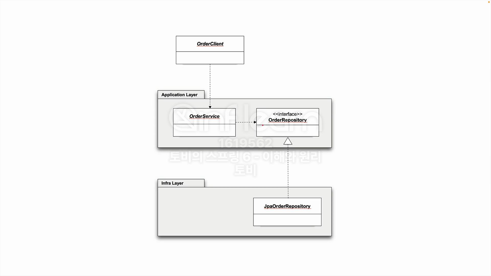
- OrderRepository를 인터페이스화해 JpaOrderRepository로 구현 
- 인터페이스는 사용하는 쪽과 가까운 폴더 계층에 위치하는 것이 좋음
  - OrderRepository 인터페이스는 OrderService에서 사용할 것이기 때문에 OrderService와 같은 폴더에 위치
- OrderService에 `private final JpaOrderRepository orderRepository`라고 선언을 하면 JPA에 종속됨
  - 따라서 인터페이스인 `OrderRepository`로 선언하여 의존하는 것이 좋음
- `OrderConfig`에서 Bean으로 설정해 주는 부분도 OrderRepository를 반환 타입으로 지정
## 테스트로 확인
### 어노테이션 종류
- `@ExtendWith(SpringExtension.class)`
  - JUnit5 환경에서 테스트를 실행할 때 스프링의 테스트 기능을 통합해 사용 가능하도록 함
  - 해당 테스트 클래스를 실행할 때 Spring 환경을 불러와 테스트가 Spring 컨테이너를 사용하도록 하라는 뜻
- `@ContextConfiguration(classes = OrderConfig.class)`
  - 사용할 Configuration 클래스 지정
### var
- 타입을 명시하지 않고 결과값에 따라 컴파일러가 타입을 지정해줌 
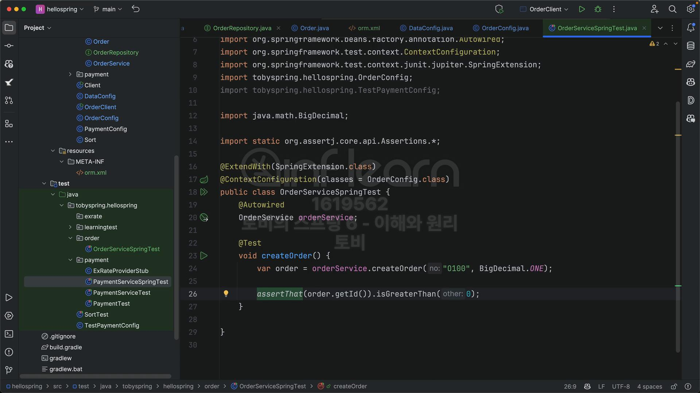

----

# 트랜잭션 서비스 추상화
- 여전히 JPA Transaction Manager에 의존하고 있기 때문에 수정할 것
## Transaction은 데이터 기술에 따라 방법이 다름
- JDBC, JPA, MyBatis, Jooq 등 
### JPA 트랜잭션
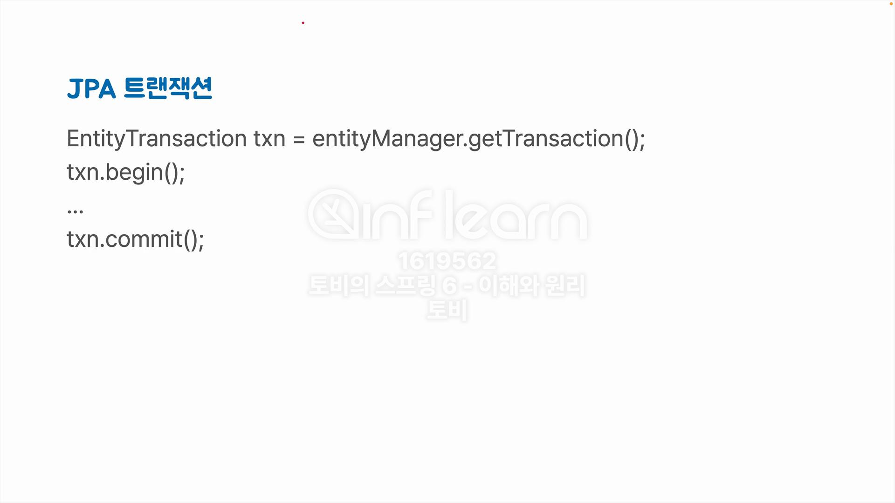
- `getTransaction()`으로 트랜잭션을 가져옴
- 이후 `begin(), commit()`으로 트랜잭션 시작 및 커밋
### JDBC 트랜잭션
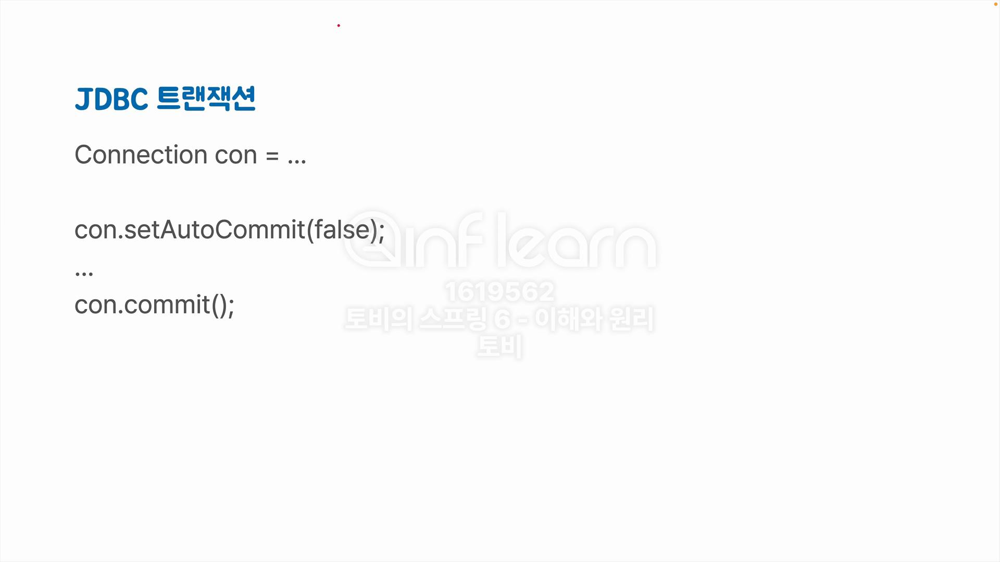
- 자동으로 커밋이 진행됨
- 처음에는 편하지만 작업할 때 여러 개의 트랜잭션이 하나로 묶여야 할 경우에 문제 발생
- 따라서 `Connection`을 이용해 원하는 작업을 묶을 수 있음
## 추상화
- 구현의 복잡함과 디테일을 감추고 중요한 것만 남기는 기법
- 여러 인프라 서비스 기술의 공통적이고 핵심적인 기능을 인터페이스로 정의하고 이를 구현하는 어댑터를 만들어 일관된 사용이 가능하게 만드는 것
- 개별 트랜잭션 기술의 디테일에 의존하는 클라이언트라면 기술이 바뀔 때마다 많은 코드가 수정되어야 함
## 트랜잭션을 관리하는 오브젝트의 추상화
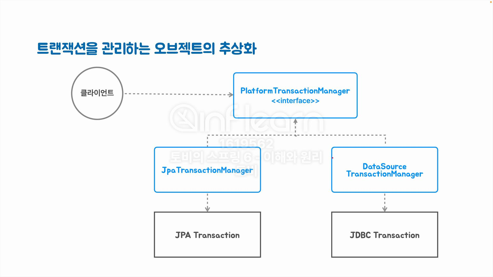
- 모든 기술들이 가진 공통 부분인 트랜잭션 시작, 커밋 등의 기능을 모아 놓은 `PlatformTransactionManager Interface`
- `JpaTransactionManger`, `DataSourceTransactionManger`는 interface의 구현체
- `JPA Transaction`, `JDBC Transaction`의 코드를 변환해 주는 어댑터 역할
### `PlatformTransactionManager`
- `getInstance()`
  - 현재 트랜잭션에 참여하도록 함
- `commit()`
  - 커밋
- `rollback()`
  - 롤백 
## 코드에 적용
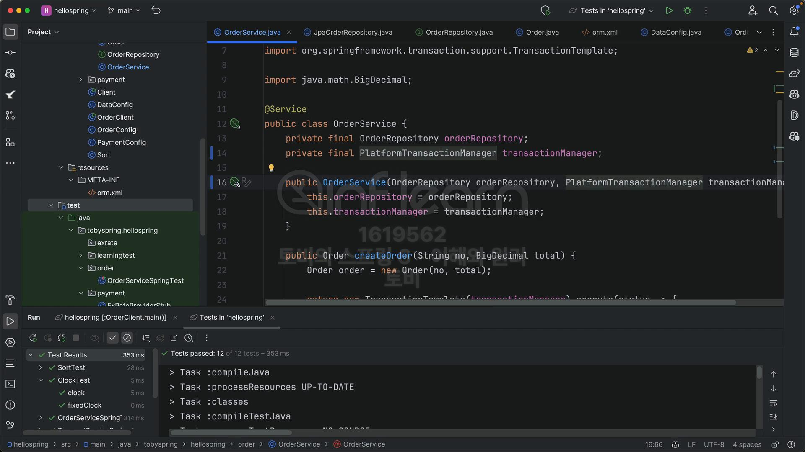
- `PlatformTransactionManager` 타입으로 선언
  - 어떤 트랜잭션 기술이 들어와도 코드가 변경될 필요 없음
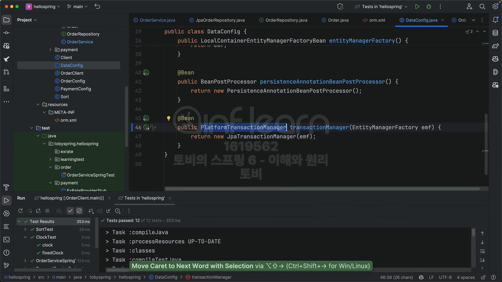
- config 파일의 빈 객체의 return 타입도 `PlatformTransactionManager`으로 변경

----

# JDBC 데이터 엑세스 기술 
## JdbcClient 
- Spring 6.1에서 추가
- SQL을 사용하는 JDBC 데이터 처리 코드를 유연하게 작성하도록 도와줌
- 일종의 탬플릿/콜백
- 스프링의 JdbcTemplate의 대체 기술
## DataSourceTransactionManager
- JDBC의 Connection을 이용하는 트랜잭션 매니저
- Connection을 리턴하는 DataSource 오브젝트 필요 
## JDBC 데이터 액세스용 구성 정보
- DataSource
- DataSourceTransactionManager
## 코드 작성
- `OrderRepository`를 구현하는 `JdbcOrderRepository` 생성
- `OrderConfig` 파일의 OrderRepository를 반환하는 빈 객체의 반환값을 JdbcOrderRepository로 변경
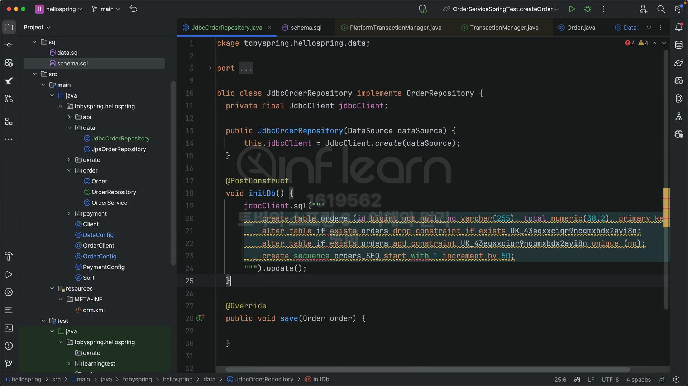
- `@PostConstruct`로 생성자 실행 이후에 실행할 코드를 작성
- JPA와 달리 테이블을 생성해 주는 작업이 필요
- JPA는 메타데이터를 읽어와 엔티티에 대한 정보로 테이블을 생성해 주지만 JDBC는 그런거 없기 때문
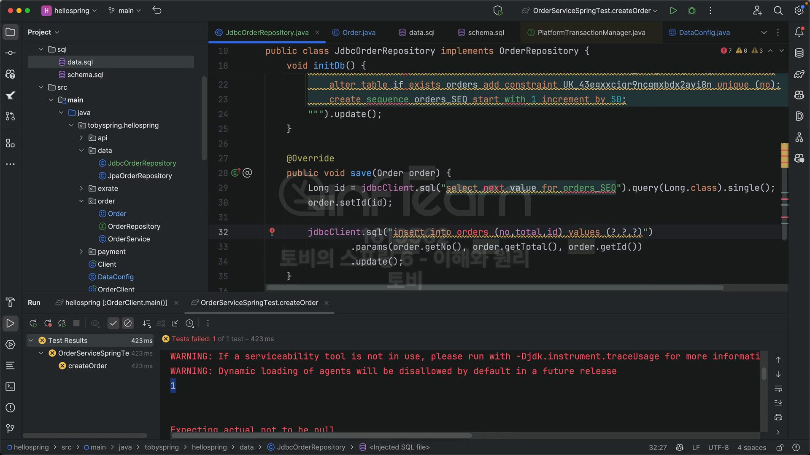
- `jdbcClient`로 sql 설정 및 쿼리 실행
## 결론
- 추상화가 잘 되어 있다면 해당 기술을 사용하는 곳의 코드를 수정할 필요 없음 

----

# 트랜잭션 테스트
## OrderService에서 기술 관련 코드 제거
- 특정 기술에 의존하고 있는 코드들을 삭제
  - 데이터 기술이 변경되어도 기존 코드는 영향을 받지 않음
- 하지만 TransactionTemplate, PlatformTransactionManager와 같은 기술과 연관된 코드가 계속 등장
- 트랜잭션은 하나의 단위 작업으로 이루어지기 때문에 서비스에서 다뤄져야 함
- 트랜잭션의 시작과 종료는 보통 애플리케이션 서비스 메소드 실행 전후 
## 트랜잭션 테스트
- 트랜잭션이 필요한 곳에 정확하게 적용되었는지 테스트 하기는 매우 어려움 
- JDBC처럼 자동 커밋이 되거나 Spring Data JPA처럼 기본 리포지토리 구현에서 트랜잭션을 알아서 적용해주는 기술을 사용할 때 트랜잭션이 바르게 적용되지 않은 것을 놓치기 쉬움
- 모든 작업이 성공하면 하나의 트랜잭션으로 진행된 것인지 여러개의 트랜잭션으로 쪼개진 것인지 확인하기 어려움 
- 트랜잭션 중간에 실패하는 케이스를 만들 수 있다면 롤백 여부로 확인 가능 
## 코드
### OrderService
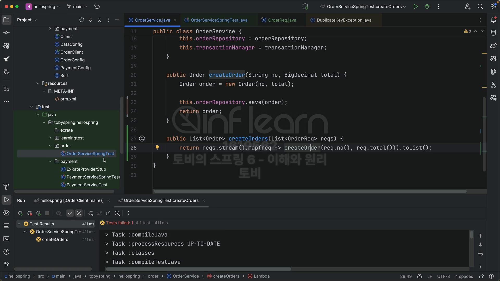
- map으로 요청받은 order를 List로 만들어 리턴 
### 1차 테스트
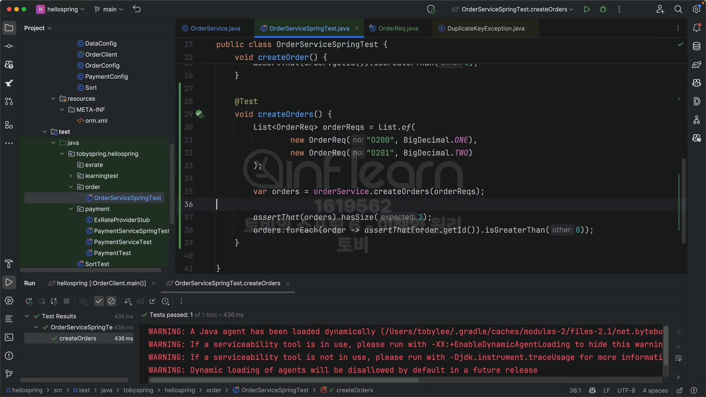
- 여러 개의 order를 데이터베이스에 저장하는 것을 검증 
- Jdbc는 자동 커밋이 활성화되어 있기 때문에 트랜잭션을 명시하는 코드 없이도 테스트 코드가 정상 작동
### 2차 테스트
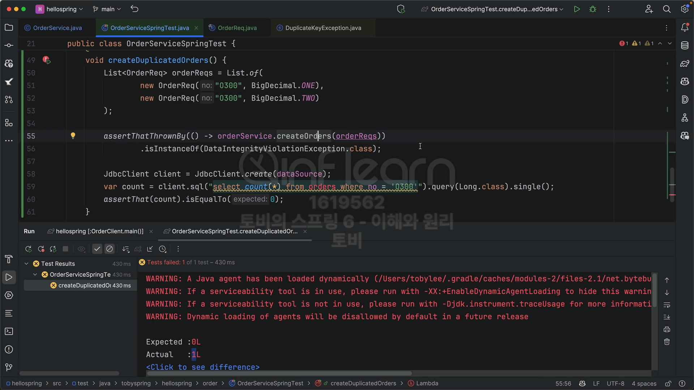
- `assertThatThrownBy`를 사용해 에러가 던져진다면 성공 
- 첫 번째와 두 번째가 각각의 트랜잭션으로 동작하기 때문에 두 번째에서 에러가 발생해도 첫 번째 값은 데이터베이스에 저장됨 
### OrderService
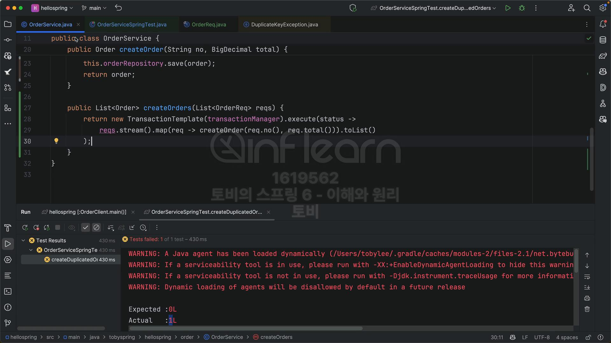
- 여러 개의 작업을 하나의 트랜잭션으로 묶어 실행 

----

# 트랜잭션 프록시
- 아직 트랜잭션을 기술에 종속적으로 사용중 
- OrderServce에 부가적인 기능으로서 트랜잭션을 컨트롤하고 싶음 
## 데코레이터 패턴
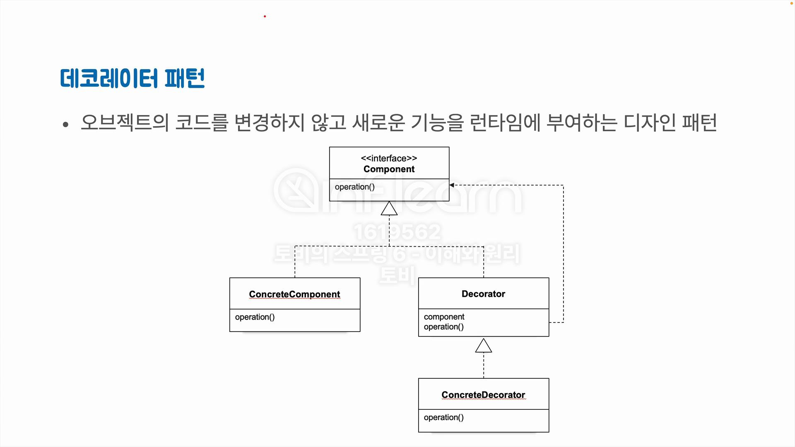
- 오브젝트의 코드를 변경하지 않고 새로운 기능을 런타임에 부여하는 디자인 패턴 
## 프록시 패턴 
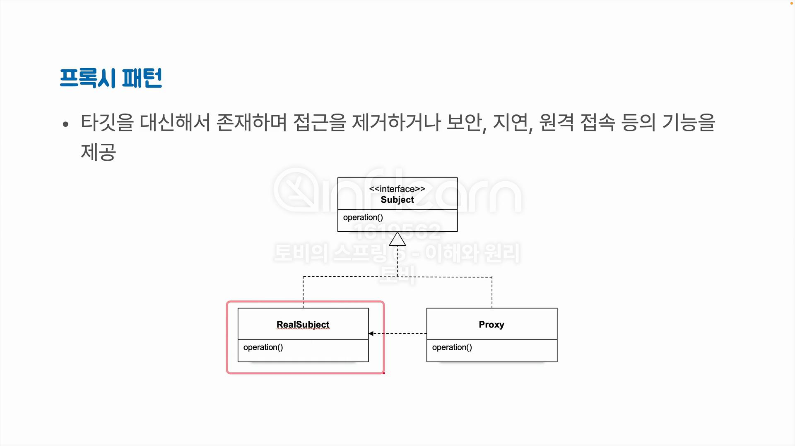
- 타깃을 대신해 존재하며 접근을 제거하거나 보안, 지연, 원격 접속 등의 기능을 제공 
## 트랜잭션 프록시
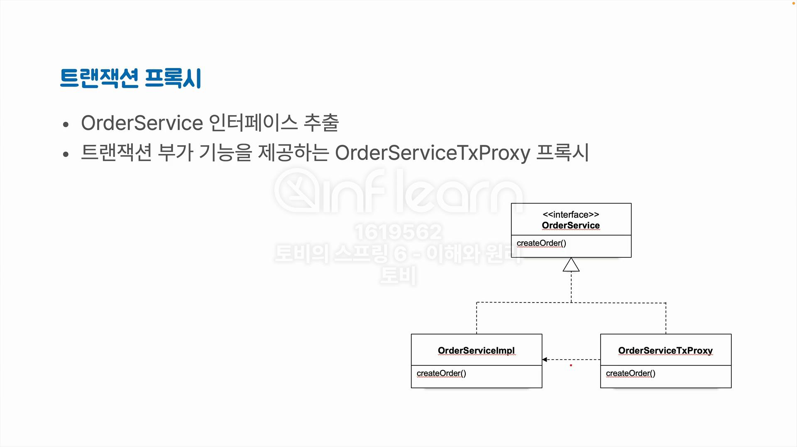
- OrderService 인터페이스 추출
- 트랜잭션 부가 기능을 제공하는 OrderServiceTxProxy
## 코드 
- OrderService를 인터페이스로 추출
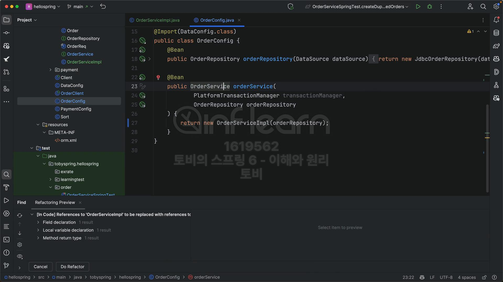
- OrderConfig에서 OrderService 인터페이스를 반환하도록 변경 
### 프록시
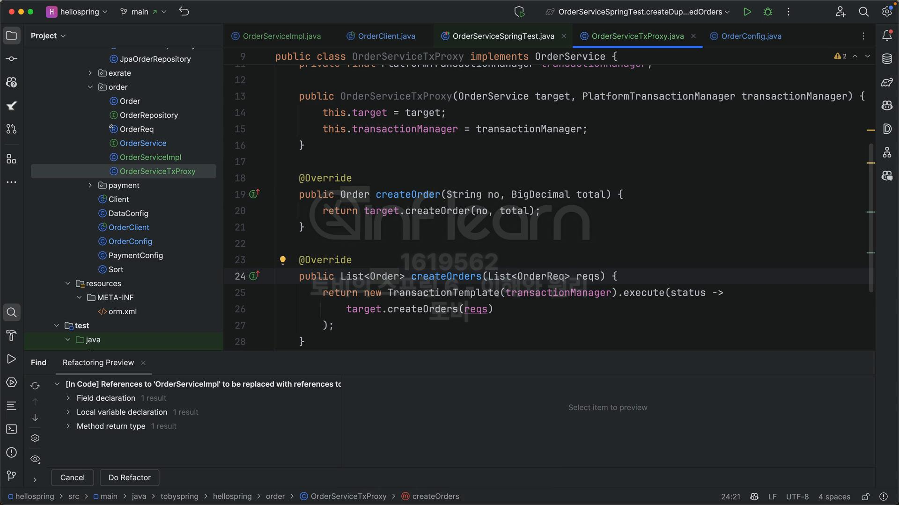
- target으로 프록시가 바라보고 있는 객체 정의 
- createOrders의 경우 트랜잭션이 필요
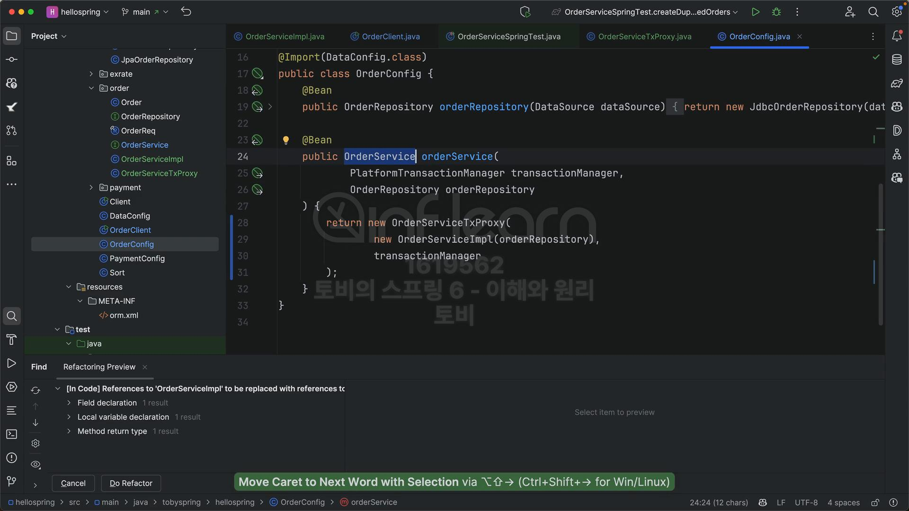
- OrderService를 반환할 대 OrderServiceTxProxy를 반환하도록 변경 

----

# `Transactional과 AOP`
## 트랜잭션 프록시 적용
- 동일한 OrderService 인터페이스를 구현한 프록시를 OrderClient에 주입 
## 스프링이 만들어주는 트랜잭션 프록시
- `@Transactional`이 붙은 클래스의 메소드가 트랜잭션 안에서 실행되도록 프록시를 만들어줌 
- `@EnableTransactionManagement`
  - 트랜잭션 기능 사용 가능 
## 스프링의 프록시 AOP
- AOP는 스프링에서 그다지 성공하지 못한 핵심 기술 중 하나 
- 활용 용도가 제한적이며 막상 사용하기는 매우 어려움 
- 스프링 만들어 놓은 트랜잭션과 보안 기술에서는 유용하게 사용
- 직접 활용하려면 꽤 많은 학습이 필요
- AOP는 아니더라도 데코레이터/프록시 패턴의 동작원리를 이해하고 필요한 곳에 활용 가능 