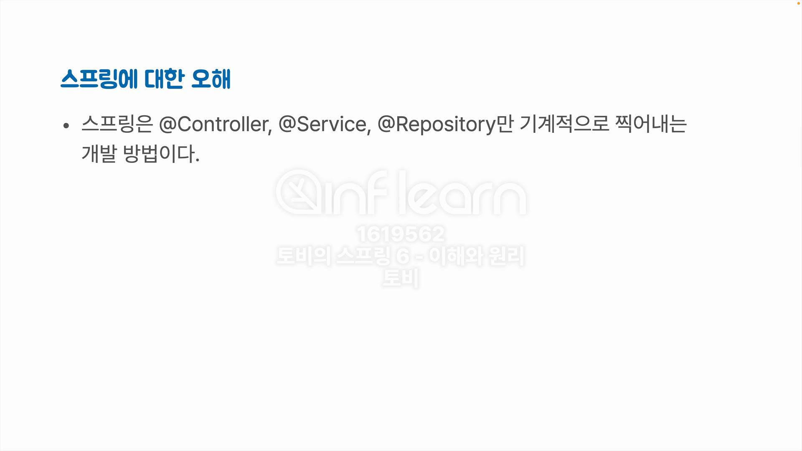

# 5장 서비스 추상화

서비스 추상화는 스프링의 핵심 원리 중에 하나이다.

서비스 추상화는 서비스와 추상화로 이루어져있다.

스프링에 대한 오해?

스프링은 단순히 엔티티 찍어내고, 컨트롤러 만들고, 서비스, 레포지토리 만들고 끝?

이 아니다.

이건 세개의 어노테이션만 있는 게 아니고 사실 적어도 이 세 가지 종류의 빈은 구분해서 만들어야한다는 가이드.

컨트롤러 서비스 레포지토리라는 건 스프링의 스테레오 타입, 전형적인 어노테이션이라고 불리는데 이거는 워낙 관심사가 다른 종류의 것들이기 때문에 적어도 이 세가지는 구분을 해서 만들어야 한다.

이 계층이 서로 의존관계로 구분된다.

컨트롤러는 Presentation Layer가 들어가있다.

서비스는 전체 애플리케이션의 핵심적인 비즈니스 로직 도메인 로직 등 이런 것들이 들어간다.

헥사고날 아키텍처에서는 애플리케이션 레이어라는 이름으로도 많이 불린다.

레포지토리는 엔티티를 저장하거나 조회하는 기능을 가진 클래스를 정의하고 거기다가 붙이는 어노테이션

보통 퍼피스턴스 레이어, 영속 레이어라고 해서 뭔가 저장해두면 오랫동안 보존이 되는 그런 기능을 담당하는 계층이다.

스프링에서는 데이터 액세스 계층으로 불림. 요즘은 인프라 레이어라고 불림.

서비스는 굉장히 일반적인 용어지만 개발 쪽에서는 서비스라고 하면 특히 백엔드 쪽에서는

통용되어지는 두 가지 중요한 개념이 있다.

첫 번째는 서비스는 반드시 클라이언트가 존재해야 한다.

두 번째는 서버에서 동작하는 서비스들은 일반적으로 상태를 가지지 않음.

상태라는 것은 오브젝트가 그 안에 어떤 속성 값을 이렇게 저장해 두고 그걸 활용해서 그 다음에 어떤 기능을 수행하거나 그 값을 돌려주는 것.

스프링 빈이 기본적으로 싱글톤으로 만들어지고, 이 싱글톤 빈을 이용할 때 기본적인 전제는 상태를 가지고 있으면 안된다.

멀티 스레드로 여러 개의 요청을 한꺼번에 처리하기 때문에 상태를 가지고 있으면 안된다.

모든 클라이언트의 속성을 다 담아두면 너무 커지기 때문에 권장하지 않음.

### 서버에 존재하는 서비스의 종류

- 애플리케이션 서비스
    
    애플리케이션 계층에 존재하는 서비스
    
    서비스라는 어노테이션이 붙음.
    
    비즈니스 로직을 담당하기 시작하는 시작점, 종료가 되는 경계에 있는 서비스를 말할때 씀.
    

- 도메인 서비스
    
    도메인 모델 패턴을 이용해서 비즈니스 로직을 엔티티 같은 도메인 오브젝트에 집어 넣는 경우에 특정 엔티티로는 표현하기 힘든 그런 로직들을 도메인 서비스의 오브젝ㄴ트를 만들어서 그 안에다가 집어 넣을 수 있다.
    

- 인프라 서비스
    
    
    
    도메인 / 애플리케이션 로직에 참여하지 않는 기술을 제공하는 서비스 (굉장히 기술적인 부분)
    
    이메일을 어떻게 제공할것인가… 라는 고민
    
    이번 파트의 핵심은 트랜잭션 서비스
    
    트랜잭션은 그 자체로는 어떤 애플리케이션의 로직을 갖고 있지 않음.
    
    ### 기억하자!
    
    서비스 추상화의 서비스는 서비스 어노테이션이 붙은 애플리케이션 서비스가 아니다!
    
    기술과 관련된 기술을 제공하는  종류의 서비스. 보통 인프라 스트럭처 레이어에 존재하는 서비스이다.
    

애플리케이션이 웹에서 어떤 요청을 받고 거기에 대해서 응답을 만들고,

데이터베이스나 API나 어떤 다른 더 기술적인 더 뒷단에 처리되어지는 그런 일을 담당하는것 말고 순수하게 이 서버가 제공하고자 하는 전체 서비스의 핵심적인 로직이 있다면 그게 들어가는 것이 appication 레이어

중요한건 특정 기술의 변경이나 특정 기술이 적용되어진 환경에 의존하지 않도록, 의존한다는거는 그런 변경이 일어날 때 이 애플리케이션 서비스 쪽에 있는  서비스 코드가 같이 따라서 바뀌지 않도록 해야한다는 것.

여기서 OrderConfig을 로딩할 때 data config에 있는 모든 빈을 들고올려면

@Import 어노테이션을 사용해주면 된다.

반대 말은 기술에 의존적인 서비스라는 것이고

기술에 의존했다는 것은 기존의 기술에서 다른 기술로 변경하면 다른 코드도 다 변경된다는 것을 의미한다.

@Entity를 붙이고 있어도 JPA를 사용하지 않으면 JPA 라이브러리에 의존하고 있지 않음.

Order클래스에서 어노테이션은 메타데이터라고 불림.

JPA에서 어노테이션은 필수가 아님.

처음에 실행될때 Hibernate라는 JPA 라이브러리가

처음에 실행할 때 Hibernate가 이 엔티티 클래스의 정보를 보고 스키마를 만들어준다. 

다 제거한 상태에서 돌린다면?

엔티티 타입을 몰라서 생기는 오류이다.

이렇게 xml로 작성하면

잘 동작하는걸 확인할 수 있다.

전체 의존 관계가 하위 모듈이 상위 모듈에 의존하는 방식으로 완전히 변경된걸 볼 수 있다.

현재는 Repository가 이렇게 되어있다.

이걸 분리해서

새롭게 만든 OrderRepository를 인터페이스로 만들어주고

implements한 뒤 override를 해준다.

그리고 서비스에는 interface에만 의존하게끔 변경해준다.

뒤에 메소드 명이 명확하거나 어떠한 타입인지 명확히 알 경우 var 타입을 사용하는것도 고려해볼만 하다.

기본적으로 auto commit 활성화

오더 서비스에 영향을 주지 않고 트랜잭션을 바꿀 수 있을까?

단순하게 리포지토리를 만들어서 DIP를 적용하는것은 안된다.

스프링에서는 오픈소스나 표준 기술이나 우리가 직접 컨트롤할 수 없는 그런 여러 기술에 대한 추상화 작업을 할 때 스프링의 서비스 추상화에서는 어댑터라는 것을 이용한다.

여기선 OrderService가 클라이언트다.

만약 JDBC로 Data Acess를 한다면?

모든 코드를 다 바꿔줘야 한다.

스프링에 있는 PlatformTransactionManager를 사용한다.

트랜잭션을 관리하는 게 예전에는 하나의 서버 안에서 돌아가는 트랜잭션이 있고 그 다음에 글로벌한 트랜잭션을 사용하는 방법이 있었다.

두 가지를 분리하게 하기 위해서 스프링에서는 로컬에서만 동작하고 관리하는 트랜잭션을 처리하는 것을  PlatformTransactionManager으로 만들었다.

JPA나 JDBC나 사용 방법은 다 다르기때문에

Platform TranscationManager와 각 기술들 사이에 변환해주는 어댑터를 넣는다.

상위 인터페이스를 구현한 어댑터를 쓴다.

이게 기존 코드라면

요렇게 변경한다.

지금까진 JPA를 사용한것을 했기때문에 JDBC를 사용해서 한번 진행해보고자 한다.

JPA를 쓰니깐 JDBC는 쓸 일이 없지 않을까?

→ 전혀 그렇지 않다.

굉장히 최적화된 방식으로 DB를 사용하거나 할 경우에 심지어 JPA하고 JDBC를 같이 사용할 수도 있다.

여기선 주입받지 않고 그냥 생성자에서 만들어준다. ( 왜 인지 이유는 모르겠음)

JPA를 쓸 때 굉장히 편리한 기능 중의 하나는 간단히 옵션만 주면 엔티티 메타 데이터 정보를 읽어가지고 그걸 가지고 거꾸로 DB 테이블을 생성해준다.

근데 JDBC에는 해당 기능이 존재하지 않으니 Bean의 초기화 작업이 끝난 후에 실행하도록

자바의 표준 어노테이션인 @PostConstruct를 사용한다.

save로 넘어오는 시점에서는 ID 값이 존재하지 않는다.

JPA는 sequence를 알아서 가져와서 넣어주는데 JDBC는 알아서 구현해야한다.

.query에는 반환에서 올 클래스 타입을 적어준다.

JPA는 필드를 직접 액세스한다. Reflection API 같은 걸 이용해서

- Reflection API란?
    
    자바 리플렉션(Reflection - 사전적 의미 : 거울 등에 비친, 반사)은 객체를 통해 클래스의 정보를 분석하여 런타임에 클래스의 동작을 검사하거나 조작하는 프로그램 기법이다. 클래스 파일의 위치나 이름만 있다면 해당 클래스의 정보를 얻어내고, 객체를 생성하는 것 또한 가능하게 해주어 유연한 프로그래밍을 가능케 해준다.
    
    구체적인 클래스 타입을 알지 못해도 그 클래스의 정보(메소드, 타입, 변수, ...)에 접근할 수 있게 해주는 자바 기법
    
    리플렉션은 애플리케이션 개발에서보다는 프레임워크, 라이브러리에서 많이 사용된다. 왜냐하면 프레임워크, 라이브러리는 사용하는 사람이 어떤 클래스명과 멤버들을 구성할지 모르는데, 이러한 사용자 클래스들을 기존의 기능과 동적으로 연결 시키기 위하여 리플렉션을 사용한다고 보면 된다. 대표적인 예로는 스프링의 DI(dpendency injection), Proxy, ModelMapper 등이 있다. 이미 Spring, Hibernate, Lombok 등 많은 프레임워크에서 Reflection 기능을 사용하고 있다.
    

점점점 복잡한 요구 사항들이 이 안으로 들어갈 예정이다.

그런 코드하고 트랜잭션을 새로 만들기 위해서 복잡하니깐 템플릿 형태로 만들고 또 기술에 독립적으로 추상화해 놓은 플랫폼 트랜잭션 매니저를 집어넣고 이걸 갖다가 또 람다식 안에서 실행시키고 ← 이 방법이 반복됨.

### 줄일 수는 없을까?

기존의 TransactionManager를 지워도 동작하냐?

동작 한다.

- 왜?
    
    기본적으로 JDBC는 AUTO commit이기 때문에
    

하지만 우리가 트랜잭션을 넣는다는 거는 적어도 2개 이상의 데이터를 변경하거나 조작하는 어떤 작업을 수행하는 것이 하나의 단위 작업으로 다 성공하든 아니면 다 실패하든 둘 중에 하나로 끝나도록 정확하게 그걸 제어하기 위한건데

그런 경우들이 계속 등장을 한다면 트랜잭션을 사용하는게 맞다.

데이터를 단순하게 집어 넣었다가 꺼내 오기만 할때는 Record를 사용할 수도 있다.

이런식으로 예외 발생 시에 테스트를 통과할 수 있게 할 수 있다.

- 왜 실패했을까?
    
    createOrders가 하나의 트랜잭션으로 묶여서 동작하지 않았기 때문에, 첫번째 OrderReq는 통과해서 다음번 카운트가 1이 되었고, 두 번째 때 중복키 오류가 발생해 카운트가 1로 된 것을 알 수 있다.
    

요렇게 한다면?

잘 동작하는 것을 확인할 수 있다.

애플리케이션 서비스 메소드가 하나의 트랜잭션으로 반드시 돌아가야 된다는

조건이 붙어있다면 트랜잭션이라는 특별한 어떤 기능을 담당하는 기술적인 클래스나 인터페이스들이 등장할 수 없는가? 하는 의문을 가질 수 있다.

놀랍게도 제거할 방법이 있다!! 

오더 서비스라고 하는 어떤 기능을 가진 오브젝트를 수정하지 않은 채로 부가적인 기능을 더한다.

“런타임”에 부여하는게 포인트다.

대상이 되는 원래 그 클래스가 구현하고자 했던 어떤 작업을 인터페이스로 먼저 추출을 해

그 대상이 되는 클래스를 인터페이스 구현하는 방식으로 만들어 놓는다.

인터페이스를 구현한 또 다른 클래스를 만든다. 데코레이터라는 이름으로 만들어 놓고 그 다음에 데코레이터의 구현 클래스들을 상속해서 여러가지를 만들 수 있는데 두 가지를 그냥 묶어서 만들어도 상관 없다.

데코레이터에서 중요한 것은 인터페이스가 가지고 있는 오퍼레이션외에 컴포넌트라고 불리는 인터페이스를 구현한 또 다른 어떤 오브젝트를 가리킬 수 있도록 만들어 놓는다.

그림을 잘 보면 일종의 컴포지트 패턴과 되게 유사한 형태임을 알 수 있다.

- 컴포지트 패턴
    
    컴포지트 패턴 (Composite Pattern)은 객체 지향 디자인패턴 중 하나로,복합 객체를 구성하는 개별적인 객체들을 모두 동일한 방법으로 다룰 수 있게 하는 패턴이다.
    
    
    

프록시 패턴은 데코레이터 패턴처럼 인터페이스를 구현한 최종적인 그 기능을 가지고 있는 객체를 보통 타깃이라고 하는데 최종 타깃과 동일한 인터페이스를 구현하는 클래스를 하나 더 만들어 놓는다.

프록시 패턴은 어떤 부가적인 기능을 넣는 게 목적은 아니고 필요에 따라서 타깃 인척 하면서 대신 껴서 등장한다.

인터페이스를 통해서 proxy를 호출하면 필요에 따라서 외부 API로 호출해준다거나 지연해서 만들어주는것도 가능하다.

스프링과 자바에서는 이 두가지를 뭉뚱그려서 프록시라는 이름으로 부른다.

기능을 부여하는건지 접근을 제어하는건지는 생각해보면 좋을 것 같다.

proxy에서 트랜잭션을 시작하고 에러가 없으면 커밋하고 에러가 있으면 롤백하는 그런 기능을 담당함.

요런식으로 OrderService를 타겟으로 하고 부가 기능을 넣어준 후

이런식으로 사용하면 된다.

Test코드에서 autowired를 하면

TranscationProxy 오브젝트가 들어온다.

그 안에 만들어진 OrderServiceImpl의 인스턴스를 타깃으로 갖고 있다.

@Transactional 어노테이션은 프록시와 관련된 꽤 복잡한 그런 작업을 자동화해주는 그런 기능을 제공한다.

런타임에 기능을 넣어준다.

config에 해당 어노테이션을 붙이고 @Transactional을 사용하면 된다.

