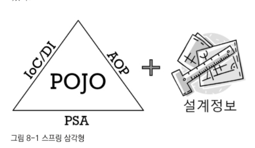
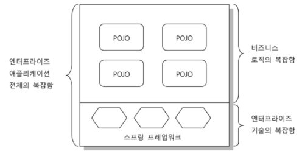

# 스프링의 정의
- **자바 엔터프라이즈 개발을 편하게 해주는 오픈소스 경량급 애플리케이션 프레임워크**
## 애플리케이션 프레임워크
- 일반적으로 라이브러리나 프레임워크는 특정 업무 분야나 한 가지 기술에 특화된 목표를 가짐
- 따라서 프레임워크는 애플리케이션 특정 계층에서 동작하는 한 가지 기술 분야에 집중
- 하지만 스프링은 애플리케이션 프레임워크란느 특징을 가짐
### 정의
- 애플리케이션의 전 과정을 빠르고 편리하며 효율적으로 진행하는데 일차적인 목표를 두는 프레임워크
### 이렇게 불리는 이유
- 애플리케이션의 전 영역을 관통하는 일관된 프로그래밍 모델과 핵심 기술을 바탕으로 각 분야의 특성에 맞는 필요를 채워주고 있음
- 애플리케이션을 빠르고 효과적인 개발 가능
### 스프링의 1차 목적
- 핵심 기술엥 담긴 프로그래밍 모델을 일관되게 적용
- 엔터프라이즈 애플리케이션 전 계층과 전 영역에 전략과 기능을 제공
- 애플리케이션을 편리하게 개발하게 해주는 애플리케이션 프레임워크로 사용되는 것 
## 경량급
- 스프링이 적은 코드로 이루어졌다는게 아님
- 불필요하게 무겁지 않다는 것
### EJB
- 매우 무겁고 복잡
- WAS가 필요했음
- 비싼 제품으로 개발환경을 갖추지 않으면 개발이 힘들었음
### 스프링이 좋은 이유
- 단순한 서버 환경인 톰캣이나 제타에서도 완벽하게 동작 
- 복잡한 EJB와 WAS를 사용하지 않고도 해당 기능들을 사용 가능 
- 스프링 기반 코드가 다른 프레임워크에서 동작하기 위해 만들어진 코드에 비해 상대적으로 작고 단순 
- 기술 수준은 비슷해도 빠르고 간결하게 작성이 가능 
- 생산성과 품질 면에서 유리
## 자바 엔터프라이즈 개발을 편하게
- 스프링은 엔터프라이즈 개발의 근본적인 문제점에 도전해 해결책을 제시함
- 자신이 작성하는 애플리케이션의 로직에 더 많은 관심과 시간을 쏟게 해줌 
- 엔터프라이즈 개발의 기술적인 복잡함과 그에 따른 수고를 제거
- 엔터프라이즈 개발의 기술적 요구를 충족하며 개발을 복잡하게 만들지 않음 
## 오픈소스
- 오픈소스 방식으로 개발됨 
- 수익 창출의 목적으로 배포할 때도 기본적인 의무사항 따르면 됨 
- 회사가 개발하기 때문에 안정적 

----

# 스프링의 목적
## 엔터프라이즈 개발이 복잡한 이유
### 1. 기술적인 제약조건과 요구사항이 늘어남
- 엔터프라이즈 시스템이란 서버에서 동작하며 기업의 조직과 업무를 처리해주는 시스템
- 많은 사용자의 요청을 동시 처리해야 하기 때문에 서버의 자원을 효율적으로 공유하고 분배해 사용애햐 함
- 보안, 안정성, 확장성 면에서도 뛰어나야 함 
- 즉, 비즈니스 로직 구현 외에도 고려해야 할 사항이 많음 
- 리모팅, 분산 트랜잭션 지원 등 
### 2. 비즈니스 로직의 복잡성 증가
- 처리해야 하는 업무의 종류가 늘어남 
- 기능 요구사항, 업무 정책 등이 바뀌며 애플리케이션을 자주 수정해 줘야 함 
- 개발, 유지보수, 추가 개발 등 작업에 대한 부담감 늘어남
## 복잡함을 가중시키는 원인
- 비즈니스 로직의 복잡함과 기술적인 복잡함 
- 복잡함이란 세부 요소가 이해하기 힘든 방식으로 엮여 있고 이 때문에 쉽게 다루기 어렵다는 것 
- 비즈니스 로직과 앤터프라이즈 기술이 둘 다 복잡한데 서로 얽혀 있으니 더 복잡 
## 복잡함을 해결하는 도전 
### 제거 불가능한 근본적인 복잡함
- 엔터프라이즈 개발의 근본적인 복잡함의 원인은 제거할 대상은 아님 
- 기술적인 복잡함을 해결하기 위해 보안을 취약하게 하거나 사용자의 수를 제한할 수는 없음 
- 따라서 복잡함을 효과적으로 상대할 수 있는 전략과 기법이 필요함 
- 비즈니스 로직의 복잡함과 기술적인 부분의 복잡함은 처리하기 위한 방법이 다르기 때문에 분리가 필요
### 실패한 해결책: EJB
- 일부 성공 
- 하지만 EJB라는 환경과 스펙에 종속되는 코드가 만들어짐 
### 비침투적인 방법을 통한 효과적인 해결책인 스프링 
- 기술적인 복잡함과 애플리케이션 핵심 로직의 복잡함을 분리하는데 목표
  - 그 과정에서 스프링의 자체 코드가 애플리케이션 코드에 불필요하게 나타나지 않음 
## 복잡함을 상대하는 스프링의 전략 
### 기술적 복잡함의 문제를 상대하는 전략
1. 기술에 대한 접근 방식이 일관성이 없고 특정 환경에 종속적 
   - 환경, 서버, 조건이 바뀌면 적용하는 기술이 달라지고 그에 따라 코드가 바뀐다는건 심각한 문제 
   - 이러한 일관성 없는 것에 대한 스프링의 해결 방법은 추상화
   - 트랜잭션 추상화, 데이터 엑세스에 관환 일관된 예외변환 기능 등 
2. 기술적인 처리를 담당하는 코드가 성격이 다른 코드에 섞여서 등장
   - 비즈니스 로직 전후로 경계가 설정돼야 하는 트랜잭션, 비즈니스 로직에 대한 보안 적용, 계층 사이에 주고받는 데이터와 예외의 일관 변환이나 로깅이나 감사 기능이 그 예
   - 기술과 비즈니스 로직의 혼재를 해결하는 것은 스프링의 AOP
   - AOP는 애플리케이션 로직을 담당하는 코드에 남아 있는 기술 관련 코드를 깔끔히 분리해 별도의 모듈로 관리 
### 비즈니스와 애플리케이션 로직의 복잡함을 상대하는 전략
- 기술적인 코드, 침투적인 기술이 가져온 흔적을 제거하면 애플리케이션의 주요 기능과 비즈니스 로직을 담은 코드만 독립적으로 존재
- 비즈니스 로직 코드는 핵심이고 자주 변경 및 수정되며 대채로 복잡 
- 예전에는 비즈니스 로직을 DB에서 구현하는 것이 좋다고 여겨졌음
  - 하지만 비용, 개발, 유지보수, 테스트 측면에서 단점이 많음
- 따라서 비즈니스 로직은 애플리케이션 안에서 처리하도록 만드는 추세 
  - DB는 데이터의 영구적인 저장과 검색과 같은 자체 특화 기능에만 활용 
  - 로직을 처리하는 부분은 애플리케이션 서버 쪽으로 이동 
  - 객체지향인 자바와 합이 좋아 테스트도 쉬워짐 
### 핵심 도구: 객체지향과 DI
- 스프링은 자바의 기본인 객체지향에 충실한 설계가 가능하도록 단순한 오브젝트로 개발 가능하도록 함 
- DI같은 유용한 기술을 편하게 적용하도록 도와줌 
- 기술적인 복잡함을 효과적으로 다루게 해주는 기법은 모두 DI 바탕
  - 서비스 추상화, 템플릿/콜백, AOP 등 
- DI는 객체지향 설계 기술 없이는 존재 의미가 없음 
  - DI는 특별한 기술이라기보다는 유연하게 확장할 수 있는 오브젝트를 설계하다보면 자연스럽게 적용되는 객체지향 프로그래밍 기법일 뿐
  - 스프링은 그것을 쉽게 도와줌 
- DI보다 객체지향 설계 기법이 더 중요
  - 순수한 비즈니스 로직만을 담고 있는 코드에는 객체지향 분석과 설계에서 나온 도메인 모델을 쉽게 적용 가능 
  - 기술적인 코드에 침범받지 않았다면 이런 설계를 비즈니스 로직을 구현하는데 그대로 반영 가능 

----

# POJO 프로그래밍 
- 스프링의 정수는 엔터프라이즈 서비스 기능을 POJO에 제공하는 것 
## 스프링의 핵심: POJO
### 스프링의 구조

- 스프링 = POJO를 이용해 만든 애플리케이션 코드 + POJO가 어떻게 관계를 맺고 동작하는지 정의해 놓은 설계 정보  
- IoC/DI, AOP, PSA는 애플리케이션을 POJO로 개발할 수 있게 해주는 가능기술이라 불림
## POJO란?
- Plain Old Java Object
- 자바의 단순한 오브젝트
## POJO의 조건
### 1. 특정 규약에 종속되지 않음
- 자바 언어와 꼭 필요한 API 외에는 종속되지 않아야 함 
- 별다른 가치를 주지 않는 규약에 종속되지 않고 객체지향 설계의 자유로운 적용이 가능한 오브젝트여야만 함 
### 2. 특정 환경에 종속되지 않음 
- EJB는 JNDI라는 서버 서비스를 필요로 하기 때문에 POJO 아님
- 특정 벤더의 서버나 특정 기업의 프레임워크 안에서만 동작 가능한 코드도 POJO 아님 
- 비즈니스 로직을 담고 있는 POJO 클래스는 웹이라는 환경정보나 웹 기술을 담고 있는 클래스나 인터페이스를 사용해서는 안 됨 
- 나중에 연결되어 사용되더라도 직접적으로 웹이라는 환경으로 제한해버리는 오브젝트나 API에 의존해선 안 됨 
  - 그렇게 하면 웹 이외의 클라이언트가 사용하지 못하게 되기 때문 
  - 웹 서버에 올리지 않고 독립적으로 테스트 하기도 힘듬 
  - 기술적인 내용을 담은 웹정보가 비즈니스 로직과 얽혀 있으니 이해하기도 힘들고 수정하기도 어려움 
- 어노테이션을 사용하는 경우
  - 어노테이션이 코드로 표현하기에는 적절하지 않은 부가적인 정보를 담고 있고 그 때문에 환경에 종속되지만 않는다면 POJO
  - 어노테이션이 특정 기술과 환경에 종속적인 정보를 담고 있다면 POJO 아님 
- 특정 기술 규약과 환경에 종속되지 않기만 하면 POJO인가?
  - 기본적으로 객체지향적인 자바 언어의 기본에 충실하게 만들어져야 함 
  - **객체지향 설계**가 적용되어야 함 
## POJO의 장점 
- POJO가 될 수 있는 조건이 곧 장점 
### 깔끔한 코드
- 특정 기술과 환경에 종속되지 않는 오브젝트는 그만큼 깔끔한 코드가 됨 
- 로우레벨의 기술과 환경 종속적인 코드는 지저분
- 개발하기 힘들고 오류 찾고 디버깅도 힘듬 
### 자동화된 테스트에 매우 유리 
- 환경의 제약은 코드의 자동화 테스트를 어렵게 함 
- 환경에 종속되지 않는 POJO 코드는 유연한 방식으로 원하는 레벨에서 코드를 빠르고 명확하게 테스트 가능 
### 객체지향적 설계를 자유롭게 적용 가능 
- 도메인 모델, 재활용 가능한 설계 모델인 디자인 패턴 등은 POJO가 이니고는 적용 힘듬 
## POJO 프레임워크 
- POJO 프로그래밍이 가능하도록 기술적인 기반을 제공하는 프레임워크 
- 스프링과 하이버네이트가 대표적 
- 하이버네이트는 주로 DB 이용 기술에 POJO를 적용하는 것이 목적 
- 스프링은 모든 영역과 계층에서 POJO 방식의 구현이 가능하게 하려는 목적으로 만들어짐
### 스프링이 엔터프라이즈 시스템의 복잡함을 다루는 법

- 비즈니스 로직의 복잡함과 엔터프라이즈 기술의 복잡함을 분리해 구성
- 스프링은 기술 영역에만 관여 
- 비즈니스 로직을 담당하는 POJO에서는 보이지 않음 

----

# 스프링의 기술 
## 제어의 역전(IoC)/의존관계 주입(DI)
- 스프링의 가장 기본이 되는 기술이자 스프링의 핵심 개발 원칙 
- AOP와 PSA도 여기에 바탕을 둠 
- 3대 기술은 아니지만 템플릿/콜백이 적용된 부분도 IoC/DI가 핵심 원리 
### DI의 활용 방법
**1. 핵심 기능의 변경** 
   - 의존 대상의 구현을 변경하는 것
   - A -> B 구조에서 A의 기능 일부를 B에게 위임한다고 했을 때 B의 구현 방식을 필요에 따라 B1, B2, B3로 바꾸는 것 
   - DAO의 구현을 JDBC, JPA, Hibernate 등으로 바꾸는 것 
**2. 핵심 기능의 동적인 변경** 
   - 동적으로 매번 다르게 변경 가능
   - 원래라면 DI는 기본적으로 런타임 시에 동적으로 의존 오브젝트를 연결해주는 것이기 때문에 한 번 연결되면 바뀌지 않는 정적인 관계
   - 하지만 사용할 자원을 다르게 선택하면 동적인 변경 가능 
**3. 부가기능의 추가**
   - 데코레이터 패턴 
   - 인터페이스를 두고 사용하게 하고 실제 사용할 오브젝트는 외부에 주입하는 DI를 적용하면 데코레이터 패턴을 쉽게 적용 가능 
**4. 인터페이스의 변경** 
   - 사용하려고 하는 오브젝트가 가진 인터페이스가 클라이언트와 호환되지 않는 경우가 있음 
   - 또는 여러 종류의 인터페이스를 가졌지만 사실은 비슷한 기능을 담당하는 오브젝트를 바꿔가며 사용하고 싶을 때도 있음 
   - 클라이언트가 사용하는 인터페이스와 실제 오브젝트 사이에 인터페이스가 일치하지 않는 경우에도 DI가 유리 
**5. 프록시** 
   - 필요한 시점에서 실제 사용할 오브젝트를 초기화하고 리소스를 준비하게 해주는 지연된 로딩을 적용하려면 프록시가 필요
   - 원격 오브젝트를 호출할 때 마치 로컬에 존재하는 오브젝트처럼 사용할 수 있게 해주는 원격 프록시를 적용하려고 해도 프록시 필요
   - 두 가지 방법 모두 DI를 필요로 함
**6. 탬플릿/콜백**
   - 반복적으로 등장하지만 고정적인 작업 흐름과 그 사이에서 자주 바뀌는 부분을 분리해 템플랫/콜백으로 만들고 DI 원리를 응용해 적용 
   - 코드를 간결하게 만들 수 있음 
   - 필요에 따라 DI 원리를 따라 직접 응용할 수 있어야 함 
**7. 싱글톤과 오브젝트 스코프**
   - DI할 오브젝트의 생명주기를 제어할 수 있다는 것이 DI가 필요한 이유 중 하나 
   - DI를 프레임워크로 이용한다는 것은 DI 대상 오브젝트를 컨테이너가 관리한다는 의미 
   - 오브젝트의 생성, 관계설정, 이용, 소멸에 이르는 과정을 DI 컨테이너가 주관하기 때문에 오브젝트의 스코프를 자유롭게 제어 가능 
   - 가장 기본 스코프는 싱글톤
     - 하나 또는 소수의 오브젝트가 많은 클라이언트를 상대로 고성능 서비스를 제공하는 방식은 엔터프라이즈 개발에서 매우 종요
     - 무상태 오브젝트가 멀티쓰레드 요청을 처리하려면 만들어지는 오브젝트의 개수를 제어하는 일이 매우 중요 
   - 전통적인 싱글톤 패턴보다는 컨테이너가 오브젝트를 관리하는 IoC 방식이 유용
   - 스프링의 DI는 기본적으로 싱글톤으로 오브젝트를 만들어서 사용하게 함 
**8. 테스트**
   - 다른 오브젝트와 협력해 동작하는 오브젝트를 효과적으로 테스트하는 방법은 가능한 한 고립시키는 것 
   - 다른 오브젝트와의 사이에서 일어나는 일을 테스트를 위해 조작할 수 있도록 만듬
   - 그래야만 테스트의 대상이 되는 오브젝트의 기능에 충실하게 테스트가 가능 
   - 협력하는 기능을 전부 허용하고 테스트하면 너무 테스트해야하는 양이 많아질 수 있음 
## 애스펙트 지향 프로그래밍(AOP)
- AOP와 OOP는 배타적이 아님 
- 객체지향 기술의 한계와 단점을 극복하도록 도와주는 보조 프로그래밍 기술 
### AOP 적용 기법 1. 스프링과 같이 다이나믹 프록시 사용
- 데코레이터 패턴을 응용
- 자바의 객체지향 패턴을 활용한 방법이기 때문에 만들기 쉽고 적용하기 간편 
- 부가기능을 부여할 수 있는 곳은 메소드의 호출이 일어나는 지점뿐이라는 단점 
  - 인터페이스와 DI를 활용하는 데코레이터 패턴이 기반 원리이기 때문 
- 부가기능을 구현한 코드나 기능을 적용할 대상을 찾는 방법 모두 평범한 자바 클래스로 만들면 됨 
- 대부분 엔터프라이즈 개발에서 필요로 하는 AOP는 이 프록시 방식의 AOP
### AOP 적용 기법 2. 자바 언어의 한계를 넘어서는 언어의 확장을 이용하는 방법 
- AspectJ라는 오픈소스 AOP 툴 
- 메소드 호출 뿐 아니라 인스턴스 생성, 필드 엑세스, 특정 호출 경로를 가진 메소드 호출 등에도 부가기능 제공 가능 
- 별도의 AOP 컴파일러를 이용한 빌드 과정을 거치거나 클래스가 메모리로 로딩될 때 바이트코드를 조작하는 위빙과 같은 별도의 방법 이용해야 함
- 까다롭고 번잡
- 프록시 방식으로 불가능할 때 AspectJ 사용 
## AOP 적용 단계
- AOP는 하나의 모듈이 수많은 오브젝트에 보이지 않게 적용되어 있기 때문에 주의해서 사용 
### 1단계: 미리 준비된 AOP 이용
- 스프링이 만들어 제공하는 것 그대로 가져다 사용
- 대표적인 AOP는 트랜잭션 
### 2단계: 전담팀을 통한 정책 AOP 적용
- AOP 담당자 관리 하에 적용 
### 3단계: AOP의 자유로운 이용 
- 열심히 해보기 
## 포터블 서비스 추상화(PSA)
- 환경과 세부 기술의 변화에 관계없이 일관된 방식으로 기술에 접근할 수 있도록 함 
- POJO 코드는 다양한 기술을 사용하더라도 그러한 기술들에 직접 노출되지 않음 
- 이를 위해 스프링에 제공하는 기술이 일관성 있는 서비스 추상화 기술 

