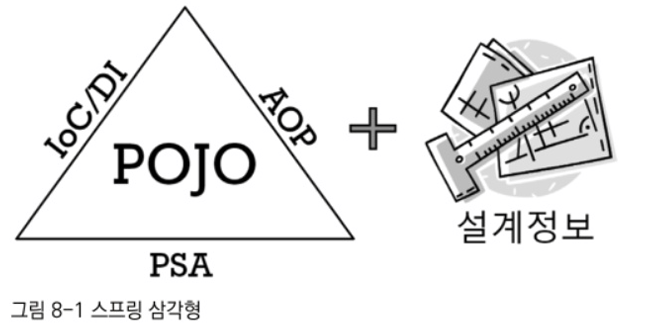

# 8장 스프링이란 무엇인가?

## 8.1 스프링의 정의

스프링이란 이런 것이다로 한마디로 정의하기 쉽지 않다. 스프링은 간단한 몇 단어로 규정하기에는 쉽지 않은 독특한 특징이 있기 때문이다.

2011년 기준 스프링에 대해 가장 잘 알려진 정의는 이렇다.

자바 엔터프라이즈 개발을 편하게 해주는 오픈소스 경량급 애플리케이션 프레임워크

그럼 이 정의를 하나씩 풀어서 살펴보자

### 애플리케이션 프레임워크

일반적으로 라이브러리나 프레임워크는 특정 업무 분야나 한 가지 기술에 특화된 목표를 가지고 만들어진다.

웹 MVC나 ORM같은 기술을 제공하는 프레임워크들을 예시로 들 수 있겠다. 그래서 프레임워크는 애플리케이션의 특정 계층에서 주로 동작하는 한 가지 기술 분야에 집중된다. 하지만 스프링은 이와 다르게 ‘애플리케이션 프레임워크’라는 특징을 갖고 있다.

애플리케이션 프레임워크는 특정 계층이나, 기술, 업무 분야에 국한되지 않고 애플리케이션의 전 영역을 포괄하는 범용적인 프레임워크를 말한다. 애플리케이션 프레임워크는 애플리케이션 개발의 전 과정을 빠르고 편리하며 효율적으로 진행하는 데 일차적인 목표를 두는 프레임워크다.

스프링을 처음 만든 사람은 로드 존슨이고, 2003년에 Expert Onde-on-One J2EE Design and Development라는 책을 출간했다.

이 책에서 강조한 중요한 전략의 하나는 “항상 프레임워크 기반으로 접근하라”는 것이었다.

이 책에서 주장하는 자바 엔터프라이즈 개발의 이상적인 프로그래밍 모델을 추구하는 데 필요한 기반이 돼주는 코드, 즉 프레임워크가 지금 스프링의 원시 버전이라고 보면 된다.

스프링의 기원이 된 예제 애플리엨이션의 프르임워크는 책에서 설명한 각종 자바 엔터프라이즈 개발의 전 계층에 등장하는 기술과 애플리케이션의 전 영역에 대한 효과적인 설계와 개발  기법을 다루고 있었기 때문에 예제 프레임워크 또한 애플리케이션 전반에 걸친 모든 분야를 포괄하고 있었다.

애플리케이션의 전 영역을 관통하는 일관된 프로그래밍 모델과 핵심 기술을 바탕으로 해서 각 분야의 특성에 맞는 필요를 채워주고 있기 때문에, 애플리케이션을 빠르고 효과적으로 개발할 수가 있다.

→ 이것이 스프링이 애플리케이션 프레임워크라고 불리는 이유다.

스프링을 MVC 프레임워크 또는 JDBC/ORM 지원 프레임워크라고 생각하는 것은 스프링이 다루는 일부 영역만 봤기 때문이다. 또, 스프링을 IoC/DI 프레임워크나 AOP 툴이라고 보는 이유는 스프링이 제공하는 핵심 기술에만 주목했기 때문이다.

스프링의 일차적인 존재 목적은 핵심 기술에 담긴 프로그래밍 모델을 일관되게 적용해서 엔터프라이즈 애플리케이션 전 계층과 전 영역에 전략과 기능을 제공해줌으로써 애플리케이션을 편리하게 개발하게 해주는 애플리케이션 프레임워크로 사용되는 것임을 기억해두자.

### 경량급

스프링 정의의 다음 항목은 경량급이다. 스프링이 경량급이라는 건 스프링 자체가 아주 가볍다거나 작은 규모의 코드로 이뤄졌다는 뜻은 아니다.

오히려 스프링은 20여 개의 모듈로 세분화되고 수십만 라인에 달하는 코드를 가진 매우 복잡하고 방대한 규모의 프레임워크다.

그럼에도 스프링이 가볍다고 하는 이유는 무엇일까?

→ 불필요하게 무겁지 않다는 의미다.

스프링이 처음 등장하던 시절의 자바 주류 기술이었던 예전에 EJB 같은 과도한 엔지니어링이 적용된 기술과 스프링을 대비시켜 설명하려고 사용됐던 표현이다.

당시 EJB는 기술에 대한 과도한 욕심으로 인해 개발환경과 운용서버, 개발과 빌드, 테스트 과정, 작성된 코드 모두를 매우 무겁고 복잡하게 만들었다. EJB가 동작하려면 고가의 느리고 무거운 자바 서버(WAS)가 필요했다.

그에 반해 스프링은 가장 단순한 서버환경인 톰캣이나 제티에서도 완벽하게 동작한다. 단순한 개발툴과 기본적인 개발환경으로도 엔터프라이즈 개발에서 필요로 하는 주요한 기능을 갖춘 애플리케이션을 개발하기에 충분하다. 서블릿 컨테이너만으로 충분하니 EJB 컨테이너를 비롯해 복잡한 기능이 잔뜩 포함된 고급 WAS를 굳이 사용하지 않아도 된다.

경량급은 만들어진 코드가 지원하는 기술수준은 비슷하더라도 그것을 훨씬 빠르고 간편하게 작성하게 해줌으로써 생산성과 품질 면에서 유리하다는 것이 바로 경량급이라는 말로 표현되는 스프링의 특징이다.

### 자바 엔터프라이즈 개발을 편하게

이번에 살펴볼 정의 내용은 ‘자바 엔터프라이즈 개발을 편하게 해주는’이다. 스프링뿐 아니라 기존에 등장했던 대부분의 자바 엔터프라이즈 기술과 프레임워크는 저마다 ‘개발을 편하게 해준다’고 주장하고 있다.

하지만 스프링이 말하는 ‘개발은 편하게’라는 말은 그 무게가 다르다. 스프링은 근본적인 부분에서 엔터프라이즈 개발의 복잡함을 제거해내고 진정으로 개발을 편하게 해주는 해결책을 제시한다. 단순히 편리한 몇 가지 도구나 기능을 제공해주는 차원이 아니다.

엔터프라이즈 개발의 기술적인 복잡함과 그에 따른 수고를 제거해준다.

엔터프라이즈 개발에서 필연적으로 요구되는 기술적인 요구를 충족하면서도 개발을 복잡하게 만들지 않는다는 점이 스프링의 뛰어난 면이다.

### 오픈소스

스프링은 오픈소스 프로젝트 방식으로 개발돼왔다. 오픈소스란 말 그대로 소스가 모두에게 공개되고, 특별한 라이선스를 취득할 필요 없이 얼마든지 가져다 자유롭게 이용해도 된다는 뜻이다.

오픈소스 개발 모델을 사용하는 스프링 역시 전 세계의 많은 엔터프라이즈 시스템 개발자의 참여를 통해 발전해왔다.

오픈소스 제품을 사용하는 기업이나 사용자 입장에서 보자면 라이선스 비용에 대한 부담이 없다는 것도 큰 장점으로 꼽을  수 있다.

하지만 오픈소스 개발 모델에는 단점도 있다. 오픈소스 개발 방식의 가장 큰 취약점은 지속적이고 안정적인 개발이 계속될지가 불확실하다는 것이다. 상당수의 오픈 소스 제품은 핵심 개발자의 여가시간을 이용해 일종의 취미활동으로 만들어진다.

## 8.2 스프링의 목적

스프링의 개발 철학과 궁극적인 목표가 무엇인지를 생각해보자.

스프링을 제대로 사용하는 건 생각보다 쉽지 않다. 이런 식으로 만들면 된다는 표준 샘플이 있는 것도 아니다. 스프링의 개발 표준 따위가 존재하지도 않지많, 스프링 적용 베스트 프랙티스를 모아다가 그대로 따른다고 해도 스프링을 잘 사용하고 있다고 확신할 수는 없다.

스프링은 그 기능과 API 사용 방법을 잘 안다고 해서 잘 쓸 수 있는 게 아니다.

예시로 자바를 처음 배울때 생각해보자. 자바 언어 문법과 JDK의 API 사용법이 자세히 설명된 두꺼운 자바 입문서를 읽고, 더 욕심을 내 웬만한 철학서적보다도 더 지루한 자바 언어 스펙까지도 공부했다고 치자.

그러면 정말 자바로 개발을 잘할 수 있을까? → 정답은 아니라는 것이다.

자바 언어와 JDK 라이브러리는 모두 일종의 편리한 도구로서 자바 언어의 특징인 객체지향 프로그래밍을 좀 더 손쉽게 할 수 있도록 돕고 있을 뿐이다. 자바로 개발을 잘 할려면 결국 근본적인 프로그래밍 실력이 필요하다. 자바의 근본적인 목적은 객체지향 프로그래밍을 통해 유연하고 확장성 좋은 애플리케이션을 빠르게 만드는 것이다. 자바를 가져다가 절차지향 언어처럼 사용한다면 자바를 사용하는 가치를 얻을 수 없다.

마찬가지로 스프링도 목적을 이해하고, 그 목적을 이루는 도구로 스프링을 잘 활용해야만 스프링으로부터 제대로 된 가치를 얻을 수 있다. 

그렇다면 스프링의 목적은 무엇인가? 스프링이 만들어진 이유는 무엇이고, 스프링을 통해 궁극적으로 이루려고 하는 것은 무엇인가?

→ 정의를 통해 살펴봤듯이 ‘경량급 프레임워크인 스프링을 활용해서 엔터프라이즈 애플리케이션 개발을 편하게’ 하는 것이다.

### 8.2.1 엔터프라이즈 개발의 복잡함

2000년대 초반 각종 자바 컨퍼런스에서 자주 논의됐던 주제는 ‘왜 자바 엔터프라이즈 프로젝트는 실패하는가?였다.

많은 원인이 있지만 가장 대표적인게 ‘엔터프라이즈 시스템 개발이 너무 복잡해져서’였다.

크게 두가지 원인으로 살펴 볼 수 있겠다.

- 첫 번째는 기술적인 제약조건과 요구사항이 늘어가기 때문이다.
    
    엔터프라이즈 시스템이란 서버에서 동작하며 기업과 조직의 업무를 처리해주는 시스템을 말한다.
    
    엔터프라이즈 시스템은 많은 사용자의 요청을 동시에 처리해야 하기 때문에 서버의 자원을 효율적으로 공유하고 분배해서 사용할 수 있어야 한다. 또한 중요한 기업의 핵심 정보를 처리하거나 미션 크리티컬한 금융, 원자력, 항공, 국방 등의 시스템을 다루기도 하기 때문에 보안과 안정성, 확장성 면에서도 뛰어나야 한다.
    
    → 뛰어난 성능과 서비스 안정성이 요구되고 그런 점을 고려한 개발 기술이 필요하다.
    
    엔터프라이즈 시스템을 개발하는데 순수한 비즈니스 로직을 구현하는 것 외에도 기술적으로 고려할 사항이 많다는 뜻이다.
    
    → 복잡도가 증가가 되고 시스템 설계자와 개발자 개개인이 져야 할 기술적인 부담은 점점 커짐.
    

- 두 번째는 엔터프라이즈 애플리케이션이 구현해야 할 핵심 기능인 비즈니스 로직의 복잡함이 증가하기 때문이다.
    
    예전에는 기업 업무 중 회계처럼 복잡한 계산이나 빠른 분석 작업이 필요한 영역에서만 IT 시스템을 활용했다. 하지만 갈수록 엔터프라이즈 시스템을 이용해 기업의 핵심 업무를 처리하는 비율이 늘어갔고, 점차 대부분의 업무 처리는 컴퓨터를 이용하지 않고는 아예 진행하기 힘들 만큼 엔터프라이즈 시스템에 대한 업무 의존도가 높아졌다.
    
    이전과 다르게 시스템 개발과 유지보수, 추가 개발 등의 작업에 대한 부담은 커지고 그에 따른 개발의 난이돈는 더욱 증가했다.
    

### 복잡함을 가중시키는 원인

엔터프라이즈 애플리케이션 개발이 실패하는 주요 원인은 비즈니스 로직의 복잡함과 기술적인 복잡함이다.

단지 복잡하다는 건 양이 많고 어렵다는 뜻이 아니다. 세부 요소가 이해하기 힘든 방식으로 얽혀 있고, 그 때문에 쉽게 다루기 어렵다는 의미다.

자바 엔터프라이즈 시스템 개발이 어려운 가장 큰 이유는 근본적인 비즈니스 로직과 엔터프라이즈 기술이라는 두 가지 복잡함이 한데 얽혀 있기 때문이다. 하나씩 놓고 봐도 만만치 않은데, 그 두 가지를 한 번에 다뤄야 하니 복잡함이 몇 배로 가중되는 것이다.

예를 들어 고객의 기존 거래내역을 분석하고 그 특성을 파악해서 그에 따른 적절한 추천상품을 선정하는 로직을 담당하는 코드를 짠다고 가정해보자

- XML 문서를 통한 리모팅 서비스로 받기 째문에 고객 ID 추출을 위한 XML 파서 라이브러리
- 고객 정보 조회를 위해 DB 조회 시 캐시 먼저 점검 → 없으면 DB가서 JDBC API를 이용해 가져옴
- 가져온 정보를 분석한 내용을 만일을 위해 로그 남기기위한 라이브러리 호출
- 그다음 요청을 보낸 사용자의 정보를 보안 API를 통해 가져와 요청한 작업에 대한 권한이 있는지도 파악해야함 → 없으면 예외 발생
- 최종적으로 추천상품으로 선정한 내역을 로컬 DB에 저장하고 메시지로도 전송해야 하는데, 반드시 하나의 트랜잭션 안에서 동작하도록 하기 위해 JTA를 이용해야 한다고 생각해보자

고객에 대한 추천제품 선정이라는 비즈니스 로직을 제대로 구현하는 일도 만만치 않은데 동시에 이런저런 다양한 기술적인 문제도 함께 신경 써야 한다면 어떨까?  각종 엔터프라이즈 기술 서비스를 적용하기 위한 코드와 각종 기술적인 API의 호출 코드를 비즈니스 로직에 대한 구현 코드와 함께 덕지덕지 붙여서 만드는 것은 매우 어렵다.

결국 개발자가 동시에 두 가지 모두를 신경써서 개발해야하는 과도한 부담을 줬고, 그에 따라 전체적인 복잡함은 몇 배로 가중됐다.

### 8.2.2 복잡함을 해결하려는 도전

엔터프라이즈 개발의 근본적인 복잡함의 원인은 제거할 대상은 아니다. 물론 구현해야할 비즈니스 로직의 적용범위를 줄이고, 기술적인 요구조건을 일부 생략한다면 그만큼 개발은 편해질 것이고 적어도 실패하지 않을지는 모른다. 하지만 현실적으로는 불가능 하다.

결국 근본적으로 엔터프라이즈 개발에 나타나는 복잡함의 원인은 제거 대상이 아니다. 대신 그 복잡함을 효과적으로 상대할 수 있는 전략과 기법이 필요한데

비즈니스 로직의 복잡함을 효과적으로 다루기 위한 방법과 기술적인 복잡함을 효과적으로 처리하는 데 적용되는 방법이 다르다는 점이다.

### 실패한 해결책 : EJB

EJB가 처음 당장했을 때 내세웠던 목표를 봐도 알 수 있듯이 EJB의 기본 전략도 이 두 가지 종류의 복잡함을 분리하는 것이었다. 개발자가 로우레벨의 기술적인 복잡함에 신경쓰지 않고 비즈니스 로직을 효과적으로 개발하는 데 더 집중할 수 있게 하자는 목표가 있었다.

하지만 기존 EJKB는 결과적으로 그런 목표를 달성하는 데 실패했다. EJB는 기설적인 복잡함을 애플리케이션의 핵심 로직에서 일부분 분리하는 데 성공하긴 했다.

선언적 트랜잭션이나 선언적 보안 등등

→ EJB는 결국 일부 기술적인 복잡함을 덜어주려는 시도를 하다가 오히려 더 큰 복잡함을 추가하는 실수를 범했다.

### 비침투적인 방식을 통한 효과적인 해결책 : 스프링

스프링은 EJB의 실패를 교훈으로 삼아서 출발했다. EJB의 처음 목표와 마찬가지로 기술적인 복잡함을 애플리케이션 핵심 로직의 복잡함에서 제거하는 데 목표를 뒀다.

EJB처럼 어떤 기술을 적용했을 때 그 기술과 관련된 코드나 규약 등이 코드에 등장하는 경우를 침투적인 기술이라고 한다.

→ 물론 꼭 필요한 기능을 사용하는 것도 아니면서 단지 어떤 기술을 바탕으로 만들어진다고 해서 특정 클래스나 인터페이스, API 등의 코드에 마구 등장한다면 그것은 침투적인 기술이 되며 복잡함을 가중시키는 원인이 된다.

반면 비침투적인 기술은 기술의 적용 사실이 코드에 직접 반영되지 않는다는 특징이 있다. 어딘가에는 기술의 적용에 따라 필요한 작업을 해줘야 하겠지만, 애플리케이션 코드 여기저기에 불쑥 등장하거나, 코드의 설계와 구현 방식을 제한하지는 않는다는 게 비침투적인 기술의 특징이다.

스프링을 이용하면 기술적인 복잡함과 비즈니스 로직을 다루는 코드를 깔끔하게 분리할 수 있다.

중요한 점은 그 과정에서 스프링 스스로가 애플리케이션 코드에 불필요하게 나타나지 않도록 하는 것이다.

## 8.2.3 복잡함을 생다하는 스프링의 전략

기술적인 복잡함을 분리해서 생각하면 그것을 효과적으로 상대할 수 있는 적절한 전략을 발견할 수 있다.

스프링은 엔터프라이즈 기술을 적용했을 때 발생하는 복잡함의 문제를 두 가지로 분류하고 각각에 대한 적절한 대응 방법을 제공한다.

### 첫 번째 문제: 기술에 대한 접근방식이 일관성이 없고, 특정 환경에 종속적이다.

환경이 바뀌고, 서버가 바뀌고, 적용되는 조건이 바뀌면 족용하는 기술이 달라지고 그에 따라 코드도 바뀐다는 건 심각한 문제다. 비록 동일한 목적으로 만들어졌지만 API의 사용 압버이 다르고, 접근 방식이 다른 기술이 난립하는 것이 현실이다. 그래서 목적이 유사하지만 호환이 안 되는 표준, 비표준, 오픈소스, 상용 제품 등이 제공하는 각기 다른 API를 사용하도록 코드를 일일이 변경해야 하는 번거로움이 발생한다.

이렇게 일관성 없는 기술과 서버환경의 변화에 대한 스프링의 공략 방법은 바로 서비스 추상화다.

스프링이 제공하는 템플릿/콜백 패턴은 판에 박힌 반복적인 작업 흐름과 API 사용 코드를 제거해준다. 이를 통해 기술을 사용하는 코드도 최적화된 핵심 로직에만 집중하도록 도와준다.

### 두 번째 문제: 기술적인 처리를 담당하는 코드가 성격이 다른 코드에 섞여서 등장한다.

비즈니스 로직 전후로 경계가 설정돼야 하는 트랜잭션, 비즈니스 로직에 대한 보안 적용, 계층 사이에 주고받는 데[이터와 예외의 일괄 변환이나 로깅이나 감사기능 등이 대표적인 예다. 책임에 따라 계층을 구분하고 그 사이에 서로의 기술과 특성에 의존적인 인터페이스나 예외처리 등을 최대한 제거한다고 할지라도 근본적으로 엔터프라이즈 서비스를 적용하는 한 이런 문제는 쉽게 해결할 수 없다.

→ 이런 기술과 비즈니스 로직의 혼재로 발생하는 복잡함을 해결하기 위한 스프링의 접근 방법은 바로 AOP다.

AOP는 최후까지 애플리케이션 로직을 담당하는 코드에 남아 있는 기술 관련 코드를 깔끔하게 분리해서 별도의 모듈로 관리하게 해주는 강력한 기술이다.

AOP를 적용하지 않았을 때는 기술과 비즈니스 로직이 지저분하게 얽혀서 다루기 힘들다는 문제도 있지만, 기술적인 코드가 여기저기 중복돼서 나타난다는 것도 심각한 문제점이다.

이 때문에 기술적인 작업을 처리하는 방식이 변경될 경우 많은 곳을 수정해야 한다.

AOP는 기술을 다루는 코드로 인한 복잡함이 기술 그 자체 이상으로 불필요하게 증대되지 않도록 도와주는 가장 강력한 수단이다.

### 비즈니스와 애플리케이션 로직의 복잡함을 상대하는 전략

기술적인 코드, 침투적인 기술이 가져온 불필요한 흔적 등을 제거하고 나면 순수하게 애플리케이션의 주요 기능과 비즈니스 로직을 담은 코드만 독립적으로 존재하게 된다.

이 중에서 기술적인 부분과 느슨하게나마 연관되는 데이터 처리 코드나 웹이나 리모트 인터페이스 코드 등을 제외하면 비즈니스 로직 코드를 다루는 코드가 남는다. 비즈니스 로직을 담은 코드는 애플리케이션에서 가장 중요한 핵심이 되는 부분이다.

예전에는 비즈니스 로직의 상당 부분을 DB에 두는 것이 유행이었다., SQL을 통해 비즈니스 로직을 표현하고, DB에서 동작하는 저장 프로시저를 통해 핵심 로직을 처리하는 경우도 많았다. 하지만 엔터프라이즈 시스템의 규모가 커지고, 복잡함이 증가하면서 DB에 비즈니스 로직을 두는 건 매우 불편할뿐더러 위험한 일이라고 여겨지기 시작했다. 가장 확장하기 힘들고 확장하더라도 많은 비용이 드는 공유 자원인 DB에 커더란 부담을 주는 것도 문제고, 데이터 액세스를 중심으로 로직을 다루면 개발과 유지보수는 물론이고 테스트도 매우 어렵다.

따라서 엔터프라이즈 시스템 개발의 흐름은 점차로 비즈니스 로직은 애플리케이션 안에서 처리하도록 만드는 추세다.

DB는 단지 데이터의 영구적인 저장과 복잡한 조건을 가진 검새과 같은 자체적으로 특화된 기능에만 활용하고, 데이터를 분석하고 가공하고 그에 따라 로직을 처리하는 부분은 확장하기 쉽고, 비용도 싼 애플리케이션 서버 쪽으로 이동하는 것이다.

오브젝트에 담긴 로직은 테스트하기도 쉽다. 목 오브젝트 등을 이용하면 심지어 DB가 없어도 테스트를 할 수 있다. 게다가 CBD를 비롯한 최신 설계와 개발 기법, 모델링을 중심으로 한 개발 방법은 오브젝트 기반의 설계와 구현에 잘 들어맞는다.

자바는 객체 지향 언어의 장점을 잘 살려서 설계된 언어다. 객체지향 프로그래밍 기법과 언어가 주는 장점인 유연한 설계가 가능하고 재사용성이 높다는 점을 잘 활용하면 자주 바뀌고 조건이 까다로운 비즈니스 로직을 효과적으로 구현해낼 수 있다. 객체지향 분석과 설계(OOAD)를 통해서 작성된 모델을 코드로 구현하고 지속적으로 발전시킬 수 있다.

비즈니스 로직의 복잡함을 상대하는 전략은 자바라는 객체지향 기술 그 자체다. 스프링은 단지 객체지향 언어의 장점을 제대로 살리지 못하게 방해했던 요소를 제거하도록 도와줄 뿐이다.

### 핵심 도구: 객체지향과 DI

기술과 비즈니스 로직의 복잡함을 해결하는 데 스프링이 공통적으로 사용하는 도구가 있다. 바로 객체지향이다.

스프링의 모토는 결국 “기본으로 돌아가자”이다. 자바의 기본인 객체지향에 충실한 설계가 가능하도록 단순한 오브젝트로 개발할 수 있고, 객체지향의 설계 기법을 잘 적용할 수 있는 구조를 만들기 위해 DI 같은 유용한 기술을 편하게 적용하도록 도와주는 것이 스프링의 기본 전략이다.

지금까지 살펴봤듯이 기술적인 복잡함을 효과적으로 다루게 해주는 기법은 모두 DI를 바탕으로 하고 있다. 서비스 추상화, 템플릿/콜백, AOP와 같은 스프링의 기술은 DI 없이는 존재할 수 없는 것들이다.

그리고 DI는 객체지향 설계 기술이 없이는 그 존재의미가 없다. DI란 특별한 기술이라기보다는 유연하게 확장할 수 있는 오브젝트 설계를 하다 보면 자연스럽게 적용하게 되는 객체지향 프로그래밍 기법일 뿐이다.

스프링은 단지 그것을 더욱 편하고 쉽게 사용하도록 도와줄 뿐이다.

DI가 자연스럽게 확장성이 좋은 설계로 이끄는 과정을 생각해보자.

DI를 의식하다보면 오브젝트를 설계할 때 자주 DI를 적용할 후보가 더 이상 없을까라는 생각해보게 된다. 여기서 성격이 다르고, 변경의 이유가 다른 기능은 무엇일까?

그리고 그런 후보를 찾을 수 있다면 DI를 적용해서 오브젝트를 분리하고, 인터페이스를 도입하고, DI로 관계를 연결해줄 것이다.

결국 DI는 좋은 오브젝트 설계의 결과물이기도 하지만, 반대로 DI를 열심히 적용하다 보면 객체지향 설계의 원칙을 잘 따르고 그 장점을 살린 설계가 나올 수도 있다.

그런 면에서 객체지향과 DI 는 서로 떼놓고는 생각할 수 없다. 만약 스프링을 사용하고 DI를 적용했다고 하지만, 기계적인 방법으로 항상 사용하는 틀에 박힌 구조의 빈만 정의하고 나머지 코드에는 DI를 적용해볼 생각조차 안 한다면 DI를 잘못 사용하고 있는 것이다.

기술적인 복잡함을 해결하는 문제나 기술적인 복잡함이 비즈니스 로직에 침범하지 못 하도록 분리하는 경우에도 DI가 바탕이 된 여러 가지 기법이 활용된다. 반면에 비즈니스 로직 자체의 복잡함을 해결하려면 DI보다는 객체지향 설계 기법이 더 중요하다.

왜 스프링이 힘들게 비즈니스 로직 자체를 기술적인 코드와 특정 기술의 스펙이 침범하지 않는 코드로 만들어주는 데 그토록 힘을 썼을까 생각해보자. 단지 코드가 좀 더 단순해지고 명확해지기 때문만이 아니다.

그 보다는 순수한 비즈니스 로직만을 담고 있는 코드에는 객체지향 분석과 설계에서 나온 도메인 모델을 쉽게 적용할 수 있기 때문이다. 객체지향적인 특성을 잘 살린 설계는 상속과 다형성, 위임을 포함해서 많은 객체지향 디자인 패턴과 섥ㅖ 기법이 잘 녹아들어 갈 수 있따.

결국 모든 스프링의 기술과 전략은 객체지향이라는 자바 언어가 가진 강력한 도구를 극대화해서 사용할 수 있도록 돕는 것이라고 볼 수 있다.

## 8.3 POJO 프로그래밍

스프링의 목적은 애플리케이션 개발의 복잡함을 줄여주는 것 또는 효과적으로 대응하게 해주는 것이라고 하면 맞는 말이긴 하지만 하지만 좀 추상적이다. 좀 더 기술적으로 스프링이 지향하는 목적이 무엇인지 정의해보자

스프링의 핵심 개발자들이 함께 쓴  Professional Spring Framework라는 책에서 스프링 핵심 개발자들은 “스프링의 정수는 엔터프랑이즈 서비스 기능을 POJO에 제공하는 것”이라고 했다. 엔터프라이즈 서비스라고 하는 것은 보안, 트랜잭션과 같은 엔터프라이즈 시스템에서 요구되는 기술을 말한다.

이런 기술을 POJO에 제공한다는 말은, 뒤집어 생각해보면 엔터프라이즈 서비스 기술과 POJO라는 애플리케이션 로직을 담은 코드를 분리했다는 뜻이기도 하다. ‘분리됐지만 반드시 필요한 엔터프라이즈 서비스 기술을 POJO 방식으로 개발된 애플리케이션 핵심 로직을 담은 코드에 제공한다’는 것이 스프링의 가장 강력한 특징과 목표다.

### 8.3.1 스프링의 핵심: POJO

위 그림은 스프링으로 개발한 애플리케이션의 기본 구조를 보여준다. 스프링 애플리케이션은 POJO를 이용해서 만든 애플리케이션 코드와, POJO가 어떻게 관계를 맺고 동작하는지를 정의해놓은 설계정보로 구분된다.

DI의 기본 아이디어는 유연하게 확장 가능한 오브젝트를 만들어두고 그 관계는 외부에서 다이내믹하게 설정해준다는 것이다. 이런 DI의 개념을 애플리케이션 전반에 걸쳐 적용하는 것이 스프링의 프로그래밍 모델이다.

스프링의 주요 기술인 IoC/DI, AOP와 PSA(Portable Service Abstraction)는 애플리케이션을 POJO로 개발할 수 있게 해주는 가능기술이라고 불린다.

POJO가 뭘까?

### 8.3.2. POJO란 무엇인가

POJO : Plain Old Java Object의 첫 글자를 따서 만든 약자다.

EJB같이 그럴싸한 이름이 없기 때문에 있어보이도록 만든 이름이 POJO다.

### 8.3.3 POJO의 조건

POJO는 다음의 세가지 조건을 충족해야 POJO라고 불릴 수 있다.

- 특정 규약에 종속되지 않는다.
    
    POJO 는 자바 언어와 꼭 필요한 API외에는 종속되지 않아야 한다.
    
    특정 규약에 따라 만들게 하는 경우는 대부분 규약에서 제시하는 특정 클래스를 상속하도록 요구한다. 그럴 경우 자바의 단일 상속 제한 때문에 더 이상 해당 클래스에 객체지향적인 설계 기법을 적용하기가 어려워지는 문제가 생긴다. 또한 규약이 적용된 환경에 종속적이 도기 때문에 다른 환경으로 이전이 힘들다는 문제점이 있다.
    

- 특정 환경에 종속되지 않는다.
    
    특정 환경에 종속적이어야만 동작하는 오브젝트도 POJO라고 할 수 없다.
    
    특히 비즈니스 로직을 담고 있는 POJO 클래스는 웹이라는 환경정보나 웹 기술을 담고 있는 클래스나 인터페이스를 사용해서는 안 된다. 설령 나중에는 웹 컨트롤러와 연결돼서 사용될 것이 뻔하다고 할지라도 직접적으로 웹이라는 환경으로 제한해버리는 오브젝트나 API에 의존해선 안 된다. 그렇게 하면 웹 외의 클라이언트가 사용하지 못하게 된다. 또 웹 서버에 올리지 않고 독립적으로 테스트하기도 힘들어진다.
    
    비즈니스 로직을 담은 코드에 HttpServletRequest나 HttpSession, 캐시와 관련된 API가 등장하거나 웹 프레임워크의 클래스를 직접 이용하는 부분이 있다면 그것은 진정한 POJO라고 볼 수 없다.
    

요즘은 소스코드에 직접 메타정보를 추가해주는 어노테이션을 많이 사용한다. 그렇다면 어노테이션을 사용했을 경우에는 POJO일까 이날까?

→ 이전에 XML에 담겨 있던 설정정보를 자바 코드로 가져왔으니 이는 POJO가 아니라고 할지 모르겠지만 꼭 그런 건 아니다. 어노테이션이 단지 코드로 표현하기는 적절치 않은 부가적인 정보를 담고 있고, 그, 때문에 환경에 종속되지만 않는다면 여전히 POJO라고 할 수 있다. 하지만 어노테이션이나 엘리먼트 값에 특정 기술과 환경에 종속적인 정보를 담고 있다면 그때는 POJO로서의 가치를 잃어버린다고 할 수 있다.

책임과 역할이 각기 다른 코드를 한 클래스에 몰아넣어 덩치 큰 만능 클래스로 만드는 경우, 재사용이 불가능할 정도로 다른 레이어와 영역의 코드와 강한 결합을 가지고 만들어지는 경우, 상속과 다형성의 적용으로 처리하면 fi/switch 문이 가득 찬 길고 긴 메소드로 작성해놓은 경우라면 과연 그것이 객체지향적인 자바 오브젝트라고 할 수 있을지 의문이다.

진정한 POJO란 객체지향적인 원리에 충실하면서, 환경과 기술에 종속되지 않고 필요에 따라 재활용될 수 있는 방식으로 설계된 오브젝트를 말한다. 그런 POJO에 애플리케이션의 핵심 로직과 기능을 담아 설계하고 개발하는 방법을 POJO 프로그래밍이라고 할 수 있다.

### 8.3.4 POJO의 장점

POJO가 될 수 있는 조건이 그대로 POJO의 장점이 된다.

특정한 기술과 환경에 종속되지 않는 오브젝트는 그만큼 깔끔한 코드가 될 수 있다.

또 POJO로 개발된 코드는 자동화된 테스트에 매우 유리하다. 환경의 제약은 코드의 자동화된 테스트를 어렵게 한다.

객체지향적인 설계를 자유롭게 적용할 수 있다는 것도 큰 장점이다. 개발자들이 자바와 객체지향 프로그래밍, 모델링과 설계에 대해 배울 때 그려봤던 도메인 모델과, 오랜 경험을 통해 쌓여온 재활용 가능한 설계 모델인 디자인 패턴 등은 POJO가 아니고는 적용하기 힘들다.

그렇다면 왜 이런 장점이 있는 POJO 방식, 어쩌면 가장 기초적이라고 할 수 있는, 자바의 초기부터 애용되던 이러한 POJO를 이용한 개발 방식이 왜 EJB처럼 제약이 심하고 특정 기술에 종속적인 코드를 강요하고 자바의 객체지향적인 특징을 무시해버리는 기술에 밀려버렸던 것일까?

→ 엔터프라이즈 시스템의 개발이라는 복잡한 과제에 대9해 잘못된 접근 방법을 선택했기 때문이다.

### 8.3.5 POJO 프레임워크

스프링은 POJO를 이용한 엔터프라이즈 애플리케이션 개발을 목적으로 하는 프레임워크라고 했다. POJO 프로그래밍이 가능하도록 기술적인 기반을 제공하는 프레임워크를 POJO 프레임워크라고 한다. 스프링 프레임워크와 하이버네이트를 대표적인 POJO 프레임워크로 꼽을 수 있다.

스프링을 이용하면 POJO 프로그래밍의 장점을 그대로 살려서 엔터프라이즈 애플리케이션의 핵심 로직을 객체지향적인 POJO를 기반으로 깔금하게 구현하고, 동시에 엔터프라이즈 환경의 각종 서비스와 기술적인 필요를 POJO 방식으로 만들어진 코드에 적용할 수 있다.

스프링은 비즈니스 로직의 복잡함과 엔터프라이즈 기술의 복잡함을 분리해서 구성할 수 있게 도와준다. 하지만 자신은 기술영역에만 관여하지 비즈니스 로직을 담당한느 POJO에서는 모습을 감춘다. 데이터 액세스 로직이나 웹 UI 로직을 다룰 때만 최소한의 방법으로 관여한다. POJO 프레임워크로서 스프링은 자신을 직접 노출하지 않으면서 애플리케이션을 POJO로 쉽게 개발할 수 있게 지원해준다.

객체지향적 POJO 프로그래밍을 어떻게 효과적으로 적용할지는 개발제엑 또 하나의 숙제이고 부담이다. 이를 위해 객체지향 분석과 설계에 대한 지식을 습득하고 훈련해야 한다. 당연히 자바 언어와 JVM 플랫폼 그리고 JDK API의 사용법도 잘 알아야 한다. 객체지향 기술의 선구자들이 잘 정리해놓은 디자인 패턴과 구현 패턴, 좀 더 나은 코드 구조를 만들기 위한 리팩토링 기술 또한 필요하다.

## 8.4 스프링의 기술

기술과 비즈니스 로직을 분리하고 POJO 방식의 애플리케이션 개발을 가능하게 한다는 스프링의 목적으로 쉽게 이루려면 스프링과 같은 POJO 프레임워크가 필요하다. 스프링에는 POJO 프로그래밍을 손쉽게 할 수 있도록 지원하는 세 가지 가능기술을 제공한다.

그 세 가지 기술은 IoC/DI, AOP, PSA다.

이 세 가지 모두 스프링이 있기 이전에도 여러 가지 형태로 시도됐고 발전하고 있던 기술이었다.

사실은 객체지향의 설계와 개발원리를 잘 적용하다보면 자연스럽게 만들어지는 것이기도 하다.

다만 스프링은 그것을 통일성 있게, 더 세련된 방법으로, 자바 엔터프라이즈 개발의 전 영역에 걸쳐 효과적으로 적용될 수 있도록 프레임워크 형태로 제공하고 있다.

스프링의 기술들은 스프링 프레임워크가 만들어진 진정한 목표인 POJO 기반의 엔터프라이즈 개발을 편리하게 해주는 도구일 뿐이다. 또 다른 관점에서 보자면 IoC/DI, AOP, PSA라는 것 자체가 이미 스프링이 중요한 가치를 두는 객체지향의 원리를 충실히 적용해서 나온 결과이기도 하다. 스프링은 엔터프라이즈 개발에 등장하는 다양한 기술에 대해 이미 잘 만들어진 서비스 추상화 기능을 제공하고 있지만, 그렇다고 스프링이 제공하는 PSA만 사용하고 말라는 뜻은 아니다. 스프링 사용자라면 스프링이 직접 제공하지 않는 기술에 대해서도 PSA만 달랑 사용하고 말라는 뜻은 아니다.  스프링이 제공하지 않는 기술에 대해서도 PSA를 적용할 줄 알아야 한다.

### 8.4.1. 제어의 역전

IoC/DI는 스프링의 가장 기본이 되는 기술이자 스프링의 핵심 개발 원칙이기도 하다.

나머지 두 가지 기술인 AOP와 PSA도 IoC/DI에 바탕을 두고 있다. 3대 기술은 아니지만 자주 등장하는 템플릿/콜백 패턴이 적용된 부분도 IoC/DI가 그 핵심 원리다.

여기서는 IoC/DI의 활용 방법을 생각해보자

이런 질문을 해볼 수 있다. 왜 두 개의 오브젝트를 분리해서 만들고, 인터페이스를 두고 누슨하게 연결한 뒤, 실제 사용할 대상은 DI를 통해 외부에서 지정하는 것일까?

이렇게 DI 방식으로 하는 것이 그렇지 않은 경우, 즉 직접 자신이 사용할 오브젝트를 new 키워드로 생성해서 사용하는 강한 결합을 쓰는 방법보다 나은 점은 무엇일까?

→ 가장 간단한 답변은 ‘유연한 확장이 가능하게 하기 위해서’라고 할 수 있다. DI는 개방 폐쇄 원칙이라는 객체지향 설계 원칙으로 잘 설명될 수 있다. 유연한 확장이라는 장점은 OCP의 ‘확장에는 열려 있다(개방)’에 해당한다. DI는 역시 OCP의 ‘변경에는 닫혀 있다(폐쇄)’라는 말로도 설명이 가능하다. 폐쇄 관점에서 볼 때 장점은 ‘재사용이 가능하다’라고 볼 수 있다.

A → B 라는 의존 관계를 갖는 오브젝트 구조라고 생각해보자. 여기서 확장은 B가 자유롭게 변경될 수 있음을 의미한다. 이는 B가 변경돼도 A는 아무런 영향을 받지 않고 그대로 유지 가능하다는 뜻이기도 하다. B 관점에서는 유연한 확장이고, A 관점으로 보자면 변경 없이 재사용이 가능하다고 볼 수 있는 것이다.

### DI의 활용 방법

- 핵심 기능의 변경

DI의 가장 대표적인 적용 방법은 바로 의존 대상의 구현을 바꾸는 것이다. 디자인 패턴의 전략 패턴이 대표적인 예다. A→B 구조에서 A의 기능 일부를 B에게 위임한다고 했을 때 B의 구현 방식을 필요에 따라 통째로 B1,B2,B3로 바꾸는 것이다.

DAO의 구현을 JDBC에서 JPA로 바꾸는 것이다.

- 핵심기능의 동적인 변경

두 번째 활용 방법은 첫 번째랑 비슷하게 의존 오브젝트의 핵심기능 자체를 바꾸는 것이다. 하지만 일반적인 DI를 이용한 변경 방법과는 달리, 동적으로 매번 다르게 변경할 수 있다. DI도 기본적으로는 런타임 시에 동적으로 의존 오브젝트를 연결해주는 것이긴 하지만, 일단 DI 되고 나면 그 후로는 바뀌지 않는다, 즉 동적인 방식으로 연결되지만 한번 DI 되면 바뀌지 않는 정적인 관계를 맺어주는 것이다.

하지만 DI를 잘 활용하면 애플리케이션이 동작하는 중간에 그 의존 대상을 다이내믹하게 변경할 수 있다.

- 예
    
    사용자의 등급에 따라서 다른 DataSource 를 사용하게 만들 수도 있다.
    
    DAO는 DataSource에 의존한다. DAO→DataSource 관계가 만들어진다. 그런데 이를 DAO 하나가 여러 개의 DataSource에 의존하게 만들 수도 있다. 그리고 현재 접속한 사용자의 등급에 따라서 그때그때 다른 DataSource를 DAO가 사용하게 할 수도 있다. VIP 사용자는 좀 더 속도가 빠른 DB를 이용하게 해서 빠른 처리 속도를 보장해주려고 할 때 적용할 수 있는 기법이다. 물론 DAO를 따로 만들 필요는 없다. 대신 매우 지능적인 방식으로 동작하는 DI 덕분에 선택적으로 사용할 DataSource를 바꿔주는 기법이 가능하다.
    

동적인 방식으로 핵심기능을 변경하는 건, 기술적으로 보자면 다이내믹 라우팅프록시나 프록시 오브젝트 기법을 활용한 것이다. 그런 기법을 적용할 수 있었던 이유는 역시 DI가 있기 때문이다. DI 없이는 불가능하다. DI의 원칙은 여전히 지켜지므로 확장과 재사용이라는 장점은 손상되지 않고 오히려 더 가치를 드러낸다.

- 부가 기능의 추가

DI의 세 번째 활용 방법은 핵심기능은 그대로 둔 채로 부가기능을 추가하는 것이다.

데코레이터 패턴을 생각해보면 된다. 인터페이스를 두고 사용하게 하고, 실제 사용할 오브젝트는 외부에서 주입하는 DI를 적용해두면 데코레이터 패턴을 쉽게 적용할 수 있다. 그래서 핵심기능과 클라이언트 코드에는 전혀 영향을 주지 않으면서 부가적인 기능을 얼마든지 추가할 수 있다.

트랜잭션 기능을 부여했던 것이 그 대표적인 예다. 때로는 핵심기능을 그대로 둔 채로 결과나 전달 파라미터를 조작할 수도 있고, 파라미터나 리턴 결과를 활용해 로깅이나 보안 처리 같은 부가적인 작업을 수행할 수도 있다.

부가 기능의 추가 방식을 특정 오브젝트가 아니라 좀 더 많은 대상으로 일반화해서 적용하면 AOP가 된다.

부가기능ㅇ을 추가할 수 있는 것도 바로 DI 덕분이다. DI 구조로 만들어놨기 때문에 가능한 것이며 DI의 핵심 원칙인 OCP에도 충실하게 잘 들어맞는다. OCP가 말하는 확장에 열려 있다는 것은 전략 패턴에서처럼 핵심기능을 변경해서 쓰는 수준만을 말하는 게 아님을 기억해야 한다.

- 인터페이스의 변경

때로는 사용하려고 하는 오브젝트를 가진 인터페-이스가 클라이언트와 호환되지 않는 경우가 있다. 또는 여러 종류의 인터페이스를 가졌지만 사실은 비슷한 기능을 담당하는 오브젝트를 바꿔가면서 사용하고 싶을 때도 있다. 이렇게 클라이언트가 사용하는 인터페이스와 실제 오브젝트 사이에 인터페이스가 일치하지 않는 경우에도 DI가 유용하다.

A가 C 오브젝트를 사용하려 한다고 해보자. 하지만 A는 원래 B 인터페이스르 사용하도록 만들어져 있고 C는 B 인터페이스를 구현하지 않았다. 이때 A가 DI를 통해 B의 구현 오브젝트를 받도록 만들어져 있다면 B 인터페이스를 구현했으면서 내부에서 C를 호출해주는 기능을 가진 어댑터 오브젝트를 만들어 A에 DI 해주면 된다.

이처럼 인터페이스가 일치하지 않는 호출이 필요한 경우에도 DI는 유용하다. 디자인 패턴에서 말하는 오브젝트 방식의 어댑터 패턴의 응용이라고 볼 수 있다.

이를 좀 더 일반화해서 아예 인터페이스가 다른 다양한 구현을 같은 방식으로 사용하도록 중간에 인터페이스 어댑터 역할을 해주는 레이어를 하나 추가하는 방법도 있다. DI의 응용 방법 중 하나이자 스프링의 대표적인 기술로도 분류되는 일관성 있는 서비스 추상화가 그런 방법이다.

서비스 추상화는 클라이언트가 일관성 있게 사용할 수 있는 인터페이스르 정의해주고 DI를 통해 어댑터 역할을 하는 오브젝트를 이용하게 해준다. 이를 통해서 다른 인터페이스를 가진 로우레벨의 기술을 변경하거나 확장해가면서 사용할 수 있는 것이다.

- 프록시

프록시 패턴의 전형적인 응용 방법도 있다. 필요한 시점에서 실제 사용할 오브젝틀를 초기화하고 리소스를 준비하게 해주는 지연된 로딩을 적용하려면 프록시가 필요하다. 원격 오브젝트를 호출할 때 마치 로컬에 존재하는 오브젝트처럼 사용할 수 있게 해주는 원격 프록시를 적용하려고 할 때도 프록시가 필요하다.

- 템플릿과 콜백

템플릿/콜백 패턴은 DI의 특별한 적용 방법이다. 반복적으로 등장하지만 항상 고정적인 작업 흐름과 그 사이에서 자주 바뀌는 부분을 분리해서 템플릿과 콜백으로 만들고 이를 DI 원리를 응용해 적용하면 지저분하게 매번 만들어야 하는 코드를 간결하게 만들 수 있다.

스프링이 제공하는 20여 가지의 템플릿/콜백이 적용된 기능을 가져다 활용하는 것뿐 아니라 필요에 따라서는 DI 원리를 따라 직접 응용할 수 있어야 한다. 콜백을 템플릿에 주입하는 방식으로 동작하게 하는 것은 DI의 원리에 가장 충실한 응용방법이다. 콜백을 얼마든지 만들어서 사용할 수 있다는 건 개방을 통한 유현한 확장성을 보여주는 것이며, 템플릿은 한 번 만들어두면 계속 재사용할 수 있다는 건 기능의 확장에도 변하지 않는다는 OCP의 폐쇄 원칙에 가장 잘 들어맞는 것이다.

- 싱글톤과 오브젝트 스코프

DI가 필요한 중요한 이유 중 한가지는 DI할 오브젝트의 생명주기를 제어할 수 있다는 것이다. DI를 프레임워크로 이용한다는 건 DI 대상 오브젝트를 컨테이너가 관리한다는 의미다. 오브젝트의 생성부터 관계설정, 이용, 소멸에 이르기까지의 모든 과정을 DI 컨테이너가 주관하기 때문에 그 오브젝트의 스코프를 자유롭게 제어할 수 있다.

가장 기본이 되는 스코프는 역시 싱글톤이다. 하나 또는 소수의 오브젝트가 수많은 클라이언트를 상대로 고성능 서비스를 제공하는 방식은 엔터프라이즈 개발에서 매우 중요하다. 상태를 갖지 않도록 만든 오브젝트가 동시에 여러 스레드의 요청을 처리하는 이런 방식을 적용하려면, 만들어지는 오브젝트의 개수를 제어하는 일이 매우 중요하다.

- 테스트

마지막으로 살펴볼 DI의 중요한 용도는 바로 테스트다. 여타 오브젝트와 협력해서 동작하는 오브젝트를 효과적으로 테스트 하는 방법은 가능한 한 고립시키는 것이다. 즉 다른 오브젝트와의 사이에서 일어나는 일을 테스트를 위해 조작할 수 있도록 만든다. 그래야만 테스트 대상인 오브젝트의 기능에 충실하게 테스트가 가능하다.

의존 오브젝트를 대신해서 스텁 또는 목 오브젝트 같은 테스트 대역을 활용할 수 있는 방법 도 있다.

이때도 DI는 중요한 역할을 한다. DI를 위해 만든 수정자 메소드를 사용하면 테스트 코드 안에서 수동으로 목 오브젝트를 주입할 수 있다. 또는 테스트용으로 설정을 별도로 만드는 방법도 있다. DI없이는 이런 테스트 기법을 적용하기란 불가능하다.

### 8.4.2 관점 지향 프로그래밍(AOP)

관점지향 프로그래밍이라고 많이 알려진 AOP도 스프링의 3대 가능기술의 하나다.

계속해서 스프링은 객체지향 기술과 프로그래밍을 위해 존재하는 프레임워크라고 설명했는데, 난데없이 관점 지향 프로그래밍이라는 새로운 프로그래밍 패러다임이 왜 필요할까? 사실 관점지향 프로그래밍은 객체지향 프로그래밍처럼 독립적인 프로그래밍 패러다임이 아니다. AOP와 OOP는 서로 배타적이 아니라는 말이다.

AOP는 애플리케이션의 복잡한 요구조건과 기술적인 난해함을 해결하는 객체지향 기술의 한계와 단점을 극복하도록 도와주는 보조적인 프로그래밍 기술이다.

스프링의 목적인, POJO만으로 엔터프라이즈 애플리케이션을 개발하면서도 엔터프라이즈 서비스를 선언적으로 제공하는 데 반드시 필요한 것이 바로 이 AOP기술이다.

IoC/DI를 이용해서 POJO에 선언적인 엔터프라이즈 서비스를 제공할 수 있지만 일부 서비스는 순수한 객체지향 기법만으로는 POJO의 조건을 유지한 채로 적용하기 힘들다.

→ AOP로 해결

### AOP의 적용기법

AOP를 자바 언어에 적용하는 기법은 크게 두 가지로 분류할 수 있다.

- 첫 번째는 스프링과 같이 다이내믹 프록시를 사용하는 방법이다.
    
    이 방법은 기존 코드에 영향을 주지 않고 부가기능을 적용하게 해주는 데코레이터 패턴을 응용한 것이다. 자바의 객체지향 패턴을 활용한 방법이기 때문에 만들기 쉽고 적용하기 간편하다. 대신 부가기능을 부여할 수 있는 곳은 메소드의 호출이 일어나는 지점뿐이라는 제약이 있다.
    
    인터페이스와 DI를 활용하는 데코레이터 패턴이 기반원리이기 때문이다. 부가기능을 구현한 코드나 기능을 적용할 대상을 찾는 방법 모두 평범한 자바 클래스로 만들면 된다. 스프링의 기본적인 AOP 구현 방법은 다이내믹 프록시를 이용하는 프록시 AOP 방식이다. 엔터프라이즈 개발에서는 이 프록시 방식을 사용한다.
    

- 두 번째는 자바 언어의 한계를 넘어서는 언어의 확장을 이용하는 방법이다.
    
    AspectJ라는 유명한 AOP툴을 사용하고, AspectJ는 프록시 방식의 AOP에서는 불가능한 다양한 조인 포인트를 제공한다. 메소드 호출뿐 아니라 인스턴스 생성, 필드 액세스, 특정 호출 경로를 가진 메소드 호출 등에도 부가기능을 제공할 수 있다. 이런 고급 AOP 기능을 적용하라면 자바 언어와 JDK의 지원만으로는 불가능하다. 그 대신 별도의 AOP 컴파일러를 이용한 빌드 과정을 거치거나, 클래스가 메모리로 로딩될 때 그 바이트코드를 조작하는 위빙과 같은 별도의 방법을 이용해야 한다.
    
    그만큼 사용하기 까다롭고 번잡하지만 따라서는 프록시 방식의 AOP로는 할 수 없는 작업을 위해 AspectJ를 사용해야한다.
    

### AOP의 적용 단계

AOP가 객체지향 개발 방법에서 기본 아이디어를 가져왔다고는 하지만 본격적으로 적용하기에는 그 성격이 자바의 일반적인 개발 방법과는 상당히 다르기 때문에 제대로 적용하려면 충분한 시간과 노력이 필요하다. 또 AOP의 장점이 많다고 해서 무작정 사용하면 심각한 문제가 발생할 위험이 있다. 개발자 개개인이 아무렇게나 AOP를 남발해서 사용하다 보면 다른 개발자가 만든 코드가 예상하지 않은 방식으로 돌아가는 등의 혼란을 초래할 수 있기 때문이다.

AOP는 하나의 모듈이 수많은 오브젝트에 보이지 않게 적용되기 때문에 매우 주의해서 사용해야한다.

AOP에 익숙하지 않은 상태라면 차근차근 단계를 밟아 AOP를 도입하는 접근 방법이 좋다.

- AOP 적용 1단계 : 미리 준비된 AOP 이용

일단 처음에는 스프링이 미리 만들어서 제공하는 AOP 기능을 그대로 가져다 적용하는 것으로 시작한다. 스프링이 직접 제공하는 대표적인 AOP는 바로 트랜잭션이다.

DB를 사용하는 애플리케이션이라면 트랜잭션이 필요할 테니 이 트랜잭션 적용을 스프링 AOP 도입의 첫 번째 단계로 이용한다.

- AOP 적용 2단계 : 전담팀을 통한 정책 AOP 적용

다음 단계는 좀 더 적극적으로 AOP를 적용할 차례다. 아직까지는 개발자 개개인이 AOP 기능을 직접 이용하게 해서는 안 된다. 대신 애플리케이션 전체적으로 이용 가능한 것을 소수의 AOP 담당자 관리하에 적용해볼 수 있다. 대표적으로 비즈니스 로직을 가진 오브젝트에 대한 보안, 특정 계층의 오브젝트 이용 전후의 작업 기록을 남기는 로깅, 데이터 추적을 위한 트레이싱, 특정 구간의 실시간 성능 모니터링과 같은 정책적으로 적용할 만한 기능에 AOP를 이용하는 것이다.

- AOP 적용 3단계 : AOP의 자유로운 이용

첫 번째와 두 번째 단계를 거쳐서 AOP에 어느 정도 친숙해지고, 그 장단점과 응용 전략, 위험성 등을 어느 정도 이해했다면 이제는 개발자 스스로가 AOP를 활용할 수 있는 단계로 넘어갈 수 있다.

### 8.4.3. 포터블 서비스 추상화(PSA)

세 번째 가능기술은 환경과 세부 기술의 변화에 관계없이 일관된 방식으로 기술에 접근할 수 있게 해주는 PSA다. POJO로 개발된 코드는 특정 환경이나 구현 방식에 종속적이지 않아야 한다. 스프링은 JavaEE를 기본 플랫폼으로 하는 자바 엔터프라이즈 개발에 주로 사용된다. 다만 POJO 코드가 그런 기술에 직접 노출되어 만들어지지 않는다는 말이다. 이를 위해 스프링이 제공하는 대표적인 기술이 바로 일관성 있는 서비스 추상화 기술이다.

스프링의 서비스 추상화의 개념과 장점을 잘 이해한다면 때에 따라 직접 서비스 추상화 기법을 적용할 필요도 있다.

서비스 추상화를 위해 필요한 기술은 DI뿐이다. 결국 DI 응용 방법의 한 가지이므로 DI를 적극 활용해서 개발한다면 서비스 추상화는 자연스럽게 만들어 쓸 수 있다.