# 애플리케이션 아키텍처
## 계층형 아키텍처
- 인터페이스와 같은 유연한 경계를 만들어두고 분리하거나 모아주는 작업 필요
### 아키텍처와 SoC
- 지금까지는 오브젝트 레벨의 분리를 생각해옴
- 아키텍처 레벨에서 좀 더 큰 단위에 대해서도 동일하게 적용 가능 
- 데이터 엑세스 로직, 비즈니스 서비스 로직 등으로 묶을 수 있음 
  - 기준에 따라 나눠두지 않으면 여러 분야에 대한 로직이 혼재되어 있어 복잡함 
  - 성격이 다른 것은 아키텍처 레벨에서 분리하는 것이 좋음 
  - 분리된 각 오브젝트는 독자적으로 개발과 테스트 가능 
  - 또한 구현 방법이나 세부 로직은 서로 영향을 주지 않고 변경될 수 있을 만큼 유연 
- 성격이 다른 것을 크게 그룹으로 만들어 분리해 두는 것을 계층형 아키텍쳐라고 부름 (aka 멀티 티어 아키텍처)
- 웹 기반 엔터프라이즈 애플리케이션은 일반적으로 세 개의 계층을 갖는다고 하여 3계층 애플리케이션이라고도 함 
### 3계층 아키텍처와 수직 계층 
- 백엔드의 DB나 레거시 시스템과 연동하는 인터페이스 역할을 하는 데이터 엑세스 계층
- 비즈니스 로직을 담고 있는 서비스 계층
- 웹 기반의 UI를 만들어내고 그 흐름을 관리하는 프레젠테이션 계층으로 구분 
- 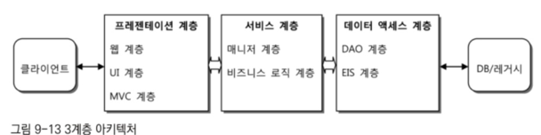
- 데이터 엑세스 계층
  - DAO 패턴을 보편적으로 사용하기 때문에 DAO 계층이라고도 불림
  - ERP, 레거시 시스템, 메인프레임 등에 접근하기 때문에 EIS(Enterprise Information System) 계층이라고도 함
  - 하지만 대부분 DB가 가장 메인 
  - 외부 시스템을 호출해 서비스를 이용하는 것은 기반 계층으로 따로 분류하기도 함
  - 사용 기술에 따라 분리
  - 추상화에 가깝기 때문에 그림으로 표현할 때는 세로로 배열하여 표현 
  - 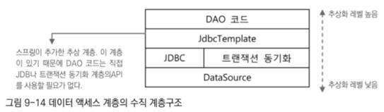
  - JdbcTemplate이 추상화를 위한 계층으로 사용돼서 로우레벨 기반 계층에 존재하는 JDBC와 드라이버, 스프링의 트랜잭션 추상화 서비스의 동기화 기능을 간접적으로 이용하게 함 
  - JdbcTemplate이 없어도 강제로 접근은 가능하지만 추상화 계층구조를 따르는 것이 합리적 
  - 새로운 계층을 추가하면 영향이 크기 때문에 주의 
- 서비스 계층
  - 구조로 보면 가장 단순
  - 이상적인 POJO로 작성됨
  - POJO로 만든다면 객체지향적인 설계 기법이 적용된 코드를 통해 비즈니스 로직의 핵심을 담아내고 쉽게 테스트하고 유연하게 확장 가능 
  - 서비스 계층은 DAO 계층을 호출하고 이를 활용해 만들어짐
  - 데이터 엑세스를 위한 기능 외에 서버나 시스템 레벨에서 제공하는 기반 서비스를 활용할 필요도 있음 
  - 기반 서비스는 3계층 어디에서나 접근이 가능하도록 만들 수도, 제한할 수도 있음
    - 코드의 특징과 장단점, 활용 예를 살펴 결정하면 됨 
  - 추상화 수직 계층 구조를 가질 필요 없음
    - 단순 상속 구조를 만들 수는 있어도 기술 API를 직접 다루는 코드가 아니기 때문에 기술에 일관된 방식으로 접근하게 하거나 편하게 사용하게 해주는 추상화는 필요 없기 때문
    - 기반 서비스 계층을 사용하는 경우에도 독립된 계층의 서비스를 이용하는 것으로 봐야함 
    - 기반 서비스 계층에서 서비스 계층의 코드를 실행시키는 경우가 있음
      - 스케쥴링이 대표적 
      - 미리 정해진 시각에 특정 서비스 계층의 로직이 동작하게 만드는 백그라운드 서비스가 필요하다면 기반 서비스 계층에서 서비스 계층의 오브젝트를 이용하게 할 수도 있음
    - 원칙적으로 서비스 계층 코드가 기반 서비스 계층의 구현에 종속되면 안 됨
      - 서비스 계층의 코드는 추상화된 기반 서비스 인터페이스를 통해서만 접근 가능하도록 만들어 특정 구현과 기술에 대한 종속성을 제거해야 함
    - 
- 프레젠테이션 계층
  - 가장 복잡한 계층
  - 다양한 기술과 프레임워크의 조합을 가질 수 있음
  - 사용할 기술을 선택하는 것이 까다로움 
  - 엔터프라이즈 애플리케이션의 프레젠테이션 계층은 클라이언트의 종류와 상관없이 HTTP 프로토콜을 사용하는 서블릿이 바탕 
  - 다른 계층과 달리 클라이언트까지 범위가 확장될 수 있음 
  - 모든 프레젠테이션 로직은 서버의 프레젠테이션 계층 컴포넌트에서 처리됨
### 계층형 아키텍처 설계 원칙
- 대부분의 객체지향 설계 원칙은 아키텍처 레벨의 계층과 그 관계에도 동일하게 적용되어야 함 
- 각 계층은 응집도가 낮으며 다른 계층과는 낮은 결합도를 유지해야 함 
- 각 계층은 자신의 계층의 책임에만 충실해야 함
  - 데이터 엑세스 계층은 데이터 엑세스에 관한 모든 것을 스스로 처리
  - 자신과 관련된 기술이 아닌 다른 기술 API의 사용을 삼가해야 함
- 자신의 역할과 기술에만 충실한 계층을 만들면 각 계층 사이의 결합도는 낮아짐 
- 다른 계층에 작업을 요청할 때 인터페이스를 통해 하게 되고 인터페이스 메소드에는 특정 계층의 기술이 최대한 드러나지 않게 만들어야 함 
- 
  - 데이터 엑세스 계층의 기술과 그 역할을 다른 계층에 노출
  - ResultSet 오브젝트를 서비스 계층에서 직접 다뤄야 함
  - 데이터 엑세스 계층에 종속되는 서비스 계층이 되는 것
  - SQLException이라는 예외도 기술 종속적
- 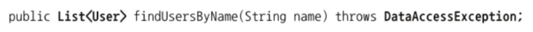
  - 이렇게 수정되어야 함 
  - User는 사용자 정보를 담는 단순 객체이기 때문에 특정 계층의 기술이나 구현에 종속되지 않음 
  - DataAccessException처럼 런타임 예외로 해야 함
- 계층의 경계를 넘어갈 때는 특정 계층에 종속되지 않는 오브젝트 형태로 변환해 줘야 함
- 특정 기술에 종속된다면 해당 코드의 재사용은 불가능함
  - 같은 로직이지만 클라이언트의 종류에 따라 비즈니스 로직 코드가 달라져야 할 수도 있음 

# 애플리케이션 정보 아키텍처
- 엔터프라이즈 애플리케이션은 일반적으로 사용자의 요청을 처리하는 동안만 간단한 상태를 유지
- 애플리케이션의 주요 사앹 정보는 클라이언트나 백엔드 시스템에 분산되어 보관 
- 애플리케이션에서 사용하는 정보들을 어떻게 다룰지를 결정하는 일도 아키텍처를 결정하는 중요한 기준 
- 데이터 중심 아키텍쳐
  - 애플리케이션에 흘러다니는 정보를 단순히 값이나 값을 담기 위한 목적의 오브젝트 형태로 취급하는 구조
  - DB나 백엔드 시스템에서 가져온 정보를 값으로 다루고 그 값을 취급하는 코드를 만들어 로직을 구현, 값을 그대로 사용자 화면으로 전송
  - 객체지향 기술을 사용하기 전과 다를바 없음
## DB/SQL 중심의 로직 구현 방식
- 하나의 업무 트랜잭션에 모든 계층의 코드가 종속되는 경향이 있음 
  - 검색 조건은 SQL로 만들어짐
  - SQL의 결과는 컬럼 이름을 키로 갖는 맵에 저장되거나 조회 페이징 ㅔ필요한 네 가지 정보를 담을 수 있는 단순한 오브젝트에 저장돼서 전달됨
- 업무의 내용이 바뀌면 모든 계층의 코드가 전부 변경됨 
- 대용량 데이터를 다루며 빠른 처리가 필요한 경우에는 일부 로직을 DB 내에 존재하는 PL/SQL과 같은 프로시저 형태로 만들기도 함 
  - 조회 로직이 조건이 많고 복잡하다면 그만큼 복잡한 SQL이 만들어짐
- 대부분 코드는 대응되는 작업 단위에 1:1로 매핑
  - 여러 작업엣 ㅓ반복되는 기능이 있다면 그에 대한 코드는 중복되기 쉬움 
  - 하나의 업무 트랜잭션을 모두 담은 서비스 계층 코드와 해당 업무에 특화된 SQL을 담은 하나 또는 여러 개의 DAO 메소드로 구성 
  - 서비스 계층이 프레젠테이션 계층에 전달하는 결과의 포맷은 보통 DAO의 SQL 결과와 동일
  - 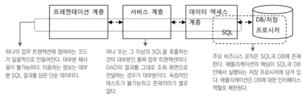
- 개발하기 쉽다는 장점
- 하지만 이렇게 복잡한 로직의 SQL을 작성하는 방식을 따르면 자바의 이점을 살리지 못 함 
- DB 중심 업무 단위로 코드를 만들면 정보가 항상 단순한 포맷임 
  - 결과가 SQL에 종속됨 
- 스프링을 사용하면 이런 데이터 중심 코드가 많아짐 
  - 변화에 취약 
  - 객체지향 장점이 활용되지 않고 각 계층의 코드가 긴밀히 연결되어 있음 
  - 중복 제거 쉽지 않음 
  - 로직을 DB와 SQL에 많이 담을수록 확장성 떨어짐 
## 거대한 서비스 계층 방식 
- 프로시저 사용 자제하고 복잡한 SQL을 피하면서 주요 로직은 서비스 계층의 코드에서 처리하도록 만드는 것 
- 여전히 SQL의 결과를 담고 있는 단순한 오브젝트 또는 맵을 이용해 데이터를 주고받음
- 대신 애플리케이션 코드의 비중이 커짐
- 구조는 단순해지고 객체지향 개발의 장점 살릴 기회 많아짐 
- DAO에서 단순한 결과를 돌려줌 
- 해당 정보를 분석, 가공하는 것은 서비스 계층 코드의 책임
- 비즈니스 로직이 복잡해지면 서비스 계층의 코드도 복잡해짐
  - 업무 트랜잭션 단위로 서비스 계층의 메소드가 만들어지는데 메소드가 커지기도 함
  - 따라서 거대한 서비스 게층을 만들게 됨 
  - 로직 대부분이 서비스 계층 코드에 집중되기 때문 
- 코드의 중복도 적지 않게 발생 
  - 트랜잭션 단위로 만들어지기 때문 
- 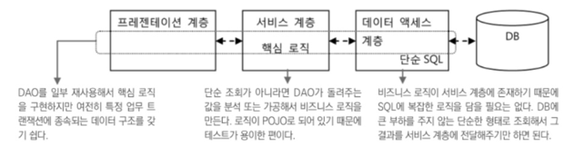
- 장점
  - 자바 언어의 장점 활용 가능
  - 테스트 수월
  - 일부 DAO 코드는 여러 비즈니스 로직에서 고융해 사용 가능 
  - 독립적인 개발 가능하기 때문에 초기 개발 속도 빠름
- 하지만 데이터 엑세스 계층과의 결합도 여전히 큼 
- 또 중복 코드가 많음
  - 제공해 주는 값에 대한 일반화가 어려움
  - 필요한 정보를 한 번에 가져오고 그 값을 저장하는 방식이 매번 달라질 수 있기 때문

# 오브젝트 중심 아키텍처
- 도메인 모델을 반영하는 오브젝트 구조를 만들어두고 그것을 각 계층 사이에서 정보를 전송하는데 사용 
- 오브젝트 중심 아키텍처는 객체지향 분석과 모델링의 결과로 나오는 도메일 몬델을 오브젝트 모델로 활용 
- 관계형 DB의 엔티티 구조와도 유사한 형태일 가능성 높음 
- 오브젝트 구조 안에 정보를 담아 각 계층 사이에 전달하게 만드는 것이 오브젝트 중심 아키텍처
## 데이터와 오브젝트
- 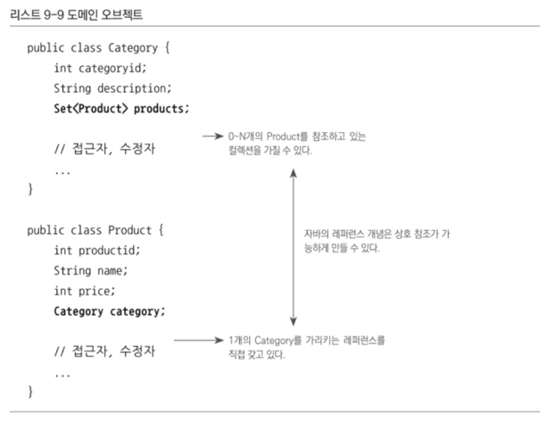
- 일관된 형식의 도메인 정보를 담음 
- 정보의 가공에 유리 
- 레퍼런스를 통한 상호 참조가 가능하기 때문에 다른 테이블의 내용도 확인 가능 
- 도메인 모델을 따르는 오브젝트 구조를 만들기 위해서는 DB에서 가져온 데이터를 도메인 오브젝트 구조에 맞게 변환해줄 필요가 있음 
## 도메인 오브젝트를 사용하는 코드 
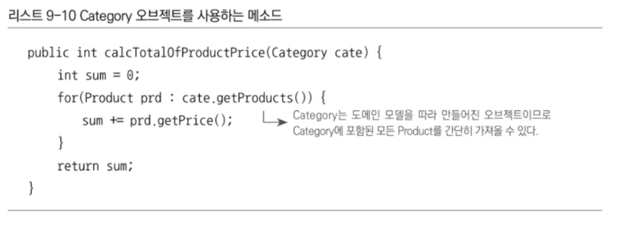
- 도메인 모델을 알고 있다면 해당 메소드의 작업을 이해하기도 쉬움 
- 테스트 수월, 코드 수정도 수월
- Category는 독립된 객체이기 때문에 서비스 계층 어디에서든지 사용 가능 
- DAO 방식에서는 중복이 발생할 것
## 도메인 오브젝트 사용의 문제점
- 최적화된 SQL을 매번 만드는 것에 비해 성능 쪽은 부족할 수 있음 
- 보통 도메인 오브젝트의 모든 필드 값을 채워 전달하는 경우가 대부분
  - 낭비일 수 있음 
- 연관되어 있는 두 도메인의 경우 불필요한 정보까지 가져오게 될 수 있음
  - 그렇다고 null로 채워 오자니 불안 
  - 따라서 오브젝트를 어디까지 사용해야 할 지를 알아야 하는데 이러면 DAO와 비즈니스 로직의 결합도가 높아짐 
### 해결법
- 지연된 로딩
  - 최소한의 오브젝트 정보만 읽어두고 관계하고 있는 오브젝트가 필요한 경우에만 DB에서 다시 읽어올 수 있음
  - 도메인 오브젝트를 사용하는 코드는 처음부터 전부 제공된다고 생각하면 됨 
- 자주 사용되는 것을 골라 별도의 오브젝트로 정의한 뒤 필요에 따라 구분해 사용 
  - DAO 메소드가 추가되어야 하고 어느 DAO를 사용할지 서비스 계층에서 알고 있어야 하기 때문에 약한 결합 발생
- 가장 이상적인 방법은 JPA나 JDO, Hibernate 같은 오브젝트/RDB 매핑(ORM) 기술을 사용하는 것
  - 기본적으로 지연된 로딩 기법 제공 
  - 복잡한 DAO 코드를 만들지 않아도 됨 
  - 내부적으로 최적화된 SQL을 사용하도록 튜닝도 가능 
  - 자주 변경되지 않으면서 많은 로직에서 참조하는 레퍼런스 테이블은 오브젝트 캐시에 담아두고 사용 가능 
- 도메인 오브젝트를 사용하는 오브젝트 중심 아키텍처에서는 가능하다면 ORM과 같은 오브젝트 중심 데이터 엑세스 기술을 사용하는 것을 권장 
  - 쉽고 직관적이고 코드의 양도 줄음 
## 빈약한 도메인 오브젝트 방식
- 빈약한 오브젝트: 도메인 오브젝트에 정보만 담겨있고 정보를 활용하는 기능 없을 때
- 스프링에서 자주 사용되긴 함 
- 빈약한 도메인 오브젝트 방식은 데이터 중심 아키텍처의 거대 서비스 계층구조와 비슷 
- 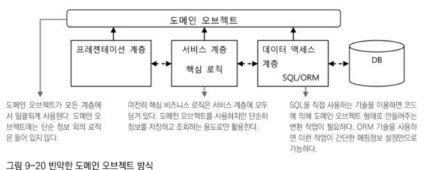
- 서비스 계층의 메소드에 대부분의 비즈니스 로직이 들어 있기 때문에 로직의 재사용성 떨어지고 중복 문제 발생하기 쉬움
- 비즈니스 로직이 복잡하지 않다면 괜찮음
## 풍성한 도메인 오브젝트 방식
- 도메인 오브젝트의 객체지향적인 특성을 잘 사용할 수 있도록 개선한 것 
- 특정 도메인 오브젝트와 관련이 깊은 비즈니스 로직을 해당 오브젝트에 넣어주고 서비스 계층의 비즈니스 로직에서 재사용하게 만드는 것 
- 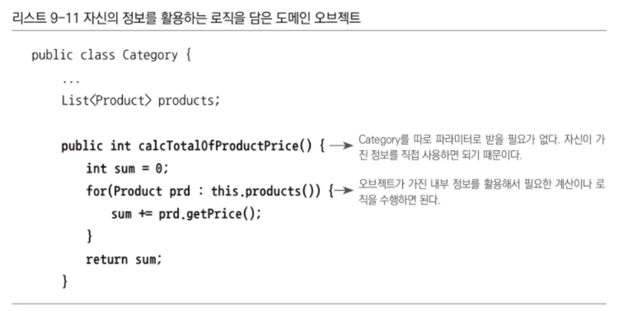
- 이 로직을 서비스 계층의 메소드에 따로 만드는 것보다 응집도 높음
  - 데이터와 그걸 사용하는 기능이 한 데 있으니까
- 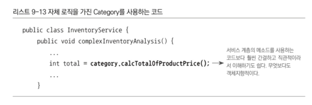
  - 간결하고 직관적이고 이해하기 쉽고 객체지향적
- 도메인 오브젝트에 비즈니스 로직을 넣는다고 해서 비즈니스 로직을 담고 있던 서비스 계층 오브젝트가 필요 없어지는 건 아님 
- 도메인 오브젝트 안에 메소드로 들어가는 로직들은 대부분 해당 오브젝트나 긴밀한 연관관계를 맺고 있는 오브젝트의 정보와 기능만을 활용 
- 여러 도메인 오브젝트의 기능을 조합해 만들었다면 특정 도메인 오브젝트에 넣기 애매함 
- 도메인 오브젝트는 다른 계층에 직접 접근이 불가하기 때문에 서비스 계층이 필요하기도 함 
- 도메인 오브젝트는 스프링이 관리하는 빈이 아니기 때문에 DI 불가능함 
  - 결국 DB에 결과를 저장하거나 메일로 발송하거나 DB를 검색해 원하는 정보를 가져와 활용하는 것은 도메인 오브젝트에서 불가능 
- DAO와 기반계층 오브젝트를 DI받아 사용할 수 있는 서비스 계층의 코드 필요함 
- 서비스 계층은 도메인 오브젝트의 기능을 활용해 비즈니스 로직 처리 
- 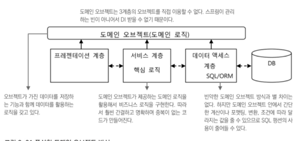
- 빈약한 도메인 오브젝트 방식보다 서비스 계층의 코드 간결 
## 도메인 계층 방식
- 변경된 정보가 저장되려면 서비스 계층 오브젝트의 부가적인 작업이 필요 
- 도메인 계층 방식은 도메인 오브젝트가 기존 3계층과 같은 레벨로 올라오는 것 
- 서비스 계층과 데이터 액세스 계층 사이에 도메인 계층이 위치 
### 특징 1: 도메인에 종속적인 비즈니스 로직의 처리는 서비스 계층이 아닌 도메인 계층의 오브젝트 안에서 진행
- 해당 도메인 오브젝트를 중심으로 만들어진 로직이라면 그 이후의 작업은 도메인 오브젝트와 그 관련 오브젝트 사이에서 진행
### 특징 2: 도메인 오브젝트가 기존 데이터 엑세스 계층이나 기반 계층의 기능을 직접 활용 가능 
- DI 사용해서 가능하게 함 
- 스프링이 직접 관리하지 않는 오브젝트에 대한 DI 서비스가 일종의 AOP 부가기능으로 도메인 오브젝트에 적용
- 스프링의 빈 오브젝트를 DI받게 할 수 있음 
- 서비스 계층의 비중과 규모는 단순히 도메인 오브젝트를 사용하는 방식에 비해 작음 
  - 복잡하지 않으면 아예 도메인 오브젝트 계층만 있는 경우도 있음 
- 도메인 오브젝트를 독립적인 계층으로 만들 때
  - 도메인 오브젝트가 도메인 계층을 벗어나서도 사용되게 할지 말지 결정해야 함 
    - 1. 모든 계층에서 도메인 오브젝트 사용
      - 가장 편함 
      - 도메인/비즈니스 로직을 담고 있기 때문에 프레젠테이션 계층으로 나가면 위험할 수 있음 
      - 가이드라인을 만들어두고 적용
    - 2. 도메인 오브젝트가 도메인 계층을 벗어나지 못하게
      - 밖으로 내보낼 때는 내용을 복사해서 넘겨줘야 함 
      - DTO 사용하는 것 
- 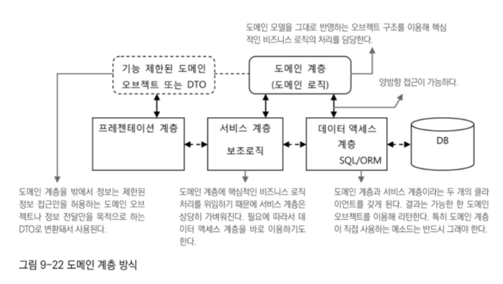
- 도메인 계층 오브젝트는 싱긂톤인 다른 계층과 달리 짧은 시간 존재했다가 사라지는 것을 반복 
  - 각 사용자의 요청 별로 독립적으로 도메인 계층을 이루는 오브젝트들이 생성됐다가 해당 요청을 처리하고 나면 버려짐
  - 생명주기가 짧은 편 
  - 도메인 오브젝트는 사용자별 요청에 대해 독립적인 상태를 유지하고 있어야 하기 때문 
  - 상태 정보를 담고 있기 때문에 여러 스레드가 공유하는 싱글톤이 될 수 없음 
  - 스프링이 아닌 다른 요소에 의해 만들어지는 경우도 많기 때문에 빈으로 등록도 할 수 없음 
  - 따라서 특별한 방법으로 DI를 해 줘야만 다른 3계층의 빈들과 협력하여 업무 처리 가능 
- 복잡하고 변경이 잦은 도메인을 가질 때 이러한 방식을 사용
  - 복잡한 도메인의 구조와 로직을 최대한 도메인 계층의 오브젝트에 반영 
  - 도메인 모델과 설계에 변경이 발생했을 때 도메인 계층의 오브젝트도 빠르게 대응해 변경해주기 위함 
- 도메인 계층은 응집도가 높아 단위 테스트를 작성하기에 편리 
- 도메인 계층을 이용하는 방식을 사용할 때는 오브젝트 중심 아키텍처의 기본 두 가지 방법을 경험해보고 오브젝트 중심의 갭잘 방식에 익숙해진 뒤 접근하는게 좋음 

## DTO와 리포트 쿼리 
- 오브젝트 중심 아키텍처라고 해서 모든 정보를 항상 도멩니 오브젝트에 담고 다녀야 하는 것은 아님 
- 도메인 계층을 벗어난 정보를 DTO에 담아 사용하기도 함 
### 리포트 쿼리
- DB 쿼리의 실행 결과를 담는 경우
- 리포트를 출력하기 위해 생성하는 쿼리라는 의미 
- 종합 분석 리포트처럼 여러 테이블에 걸쳐 존재하는 자료를 분석하고 그에 따른 분석/통계 결과를 생성하는 쿼리라는 의미 
- 여러가지를 조합해 만들어지기 때문에 적절한 도메인 오브젝트를 찾을 수 없음 
- 따라서 DTO를 사용하거나 키와 값 쌍을 갖는 맵을 사용 

# 스프링 애플리케이션을 위한 아키텍처 설계
## 계층형 아키텍처
- 3계층 구조는 스프링을 사용하는 엔터프라이즈 애플리케이션에서 가장 많이 사용되는 구조 
- 3계층은 논리적이고 개념적인 부분이지 오브젝트 단위로 끊어져 구분되는 것은 아님 
  - 비즈니스 로직이 단순하여 서비스 계층을 도입할 필요도 없다면 서비스 계층과 데이터 엑세스 계층을 통합할 수도 있음 
- 프레젠테이션 계층에 서비스 계층을 통합하는 방법도 가능 
  - DAO는 순수한 DB 인터페이스 역할을 하는 데이터 엑세스 기능만 갖게 하고 조건에 따른 간단한 로직의 적용은 프레젠테이션 계층의 컨트롤러에 넣는 것 
    - 스프링에서 권장되는 방식은 아님 
    - 스프링 AOP를 이용해 트랜잭션의 경계를 설정하기 애매하기 때문 
## 정보 전송 아키텍처 
- 스프링에 가장 잘 맞는 것은 오브젝트 중심 아키텍처의 도메인 오브젝트 방식 
- DAO는 기술이 어떤 것이든 상관없이 서비스 계층에서 요청을 받거나 결과를 돌려줄 때 오브젝트를 이용해 작성 
- 서비스 계층의 비즈니스 로직 또한 도메인 오브젝트를 이용해 작성 
- 도메인 오브젝트를 사용해 애플리케이션의 정보를 일관된 형태로 유지하는게 스프링에 가장 잘 맞는 방식 
- 레거시 시스템을 스프링으로 전환하는 경우 데이터 중심의 아키텍처를 사용해도 무방 
  - 3계층의 기본 구조로 잘 분리할 수만 있다면 DB 중심의 접근 방식을 사용해 기존에 만들어 사용했던 SQL을 재사용 
  - 전환 작업과 검증이 끝난 후 단계적으로 로직을 DB에서 애플리케이션으로 가져오고 오브젝트 중심으로 전환하는 시도를 하면 됨 
## 상태 관리와 빈 스코프
- 앤터프라이즈 애플리케이션은 동시에 수많은 사용자의 요청을 처리하기 위해 매번 간단한 요청을 받아 그 결과를 돌려주는 방식으로 동작 
  - 따라서 서버의 자원이 특정 사용자에게 일정하게 할당되지 않음 
  - 이러한 이유로 서버 기반의 애플리케이션은 지속적으로 유지되는 상태를 갖지 않는다는 특징이 있음 
- 하지만 장시간 진행되는 작업 정보는 유지되어야 함 
  - URL, 파라미터, 쿠키 등을 이용해 상태 정보 또는 서버에 저장된 상태정보에 키 값 등을 전달해야 함 
  - 클라이언트와 서버 사이에 많은 양의 정보를 계속해서 주고받을 수는 없기 때문에 중요한 상태 정보는 파일 시스템, DB 등에 저장되기도 함 
- 상태를 저장, 유지하는데 어떤 방식을 사용할지 결정하는 것은 매우 중요
  - 스프링은 기본적으로 상태가 유지되지 않는 빈과 오브젝트를 사용하는 것을 권장 
  - 웹 생리에 맞고 서버를 여러 대로 확장하는 것에 유리하기 때문 
## 서드파티 프레임워크, 라이브러리 적용
- 스프링은 거의 대부분의 자바 표준 기술과 함께 사용 가능 
- 스프링이 지원하는 기술이란 무슨 의미일까?
### 1. 해당 기술을 스프링의 DI 패턴을 따라 사용 가능
- 프레임워크나 라이브러리의 핵심 클래스를 빈으로 등록할 수 있게 지원해 주는 것 
- 프레임워크의 핵심 오브젝트를 빈의 형태로 등록해 둘 수 있다며 프로퍼티를 이용해 세부 설정을 조정할 수도 있고 DI를 통해 다른 오브젝트에서 손쉽게 사용도 가능 
- 스프링이 제공하는 추상화 서비스를 통해 다른 리소스에 투명하게 접근 가능 
- 스프링에서는 Hibernate의 SessionFactory를 스프링이 제공하는 빈을 등록하는 것만으로 간단히 생성하게 해주는 LocalSessionFactoryBean이라는 클래스 제공 
### 2. 스프링의 서비스 추상화 적용
- 비슷한 기능을 제공하는 기술에 대한 일관된 접근 방식을 정의
- 서드파티 프레임워크를 적용 가능하고 필요에 따라 호한 가능한 기술로 손쉽게 교체 가능 
- 일관된 방법으로 코드를 작성하게 해 준다는 것은 큰 의미를 가짐 
### 3. 스프링이 지지하는 프로그래밍 모델 적용
- 대표적인 예는 스프링의 데이터 엑세스 기술에 대한 일관된 예외 적용 
- 데이터 엑세스 기술의 종류에 상관 없이 일관된 예외 계층 구조를 따라 예외가 던져짐 
### 4. 탬플릿/콜백 지원
- JDBC 등을 비롯한 20여가지 기술을 지원하는 탬플릿/콜백 제공
- 해당 기능들을 간편하게 사용 가능 
