# AOP
- IoC/DI, 서비스 추상화와 더불어 스프링의 3대 기반기술 중 하나 
- 개념이 난해하고 어려움
- 선언적 트랜잭션이 AOP의 대표적인 적용 대상 

----

# 트랜잭션 코드의 분리
## 메소드 분리
- 이전 메소드
  - 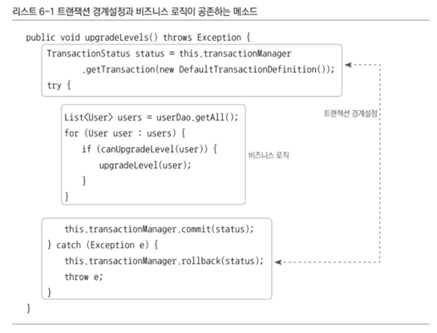
- 뚜렷하게 두 종류의 코드가 구분되어 있음
- 비즈니스 로직 코드를 사이에 두고 트랜잭션의 시작과 종료를 담당하는 코드가 앞뒤에 위치
- 특징은 트랜잭션 경계설정의 코드와 비즈니스 로직 코드 간에 서로 주고받는 정보가 없다는 것
  - 비즈니스 로직 코드에서 직접 DB를 사용하지 않음
  - 따라서 트랜잭션 준비 과정에서 만들어진 DB 커넥션 정보 등을 직접 참조할 필요가 없음
- 해당 메소드에서 시작된 트랜잭션 정보는 트랜잭션 동기화 방법을 통해 DAO가 알아서 활용
- 결론적으로 두 가지 코드는 성격이 다를 뿐 아니라 완전히 독립적 
- 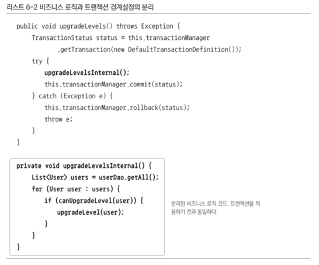
## DI를 이용한 클래스의 분리
- 아직도 트랜잭션 코드가 UserService 내부에 존재
- 직접적으로 정보를 주고받는 것이 없기 때문에 없애고 싶음
- 트랜잭션 코드를 클래스 밖으로 뽑아내자
### DI 적용을 이용한 트랜잭션 분리
- 다른 코드에서 UserService를 사용한다면 UserService 클래스를 직접 참조하게 됨 
  - 트랜잭션 코드를 UserService 밖으로 분리하면 호출할 때 트랜잭션 기능이 빠진 UserService가 되어버림
- 직접 사용할 때 문제가 되는 것이니 간접적으로 사용하면 됨 
- DI는 실제 사용할 오브젝트의 정체는 감춘 채 인터페이스를 통해 간접적으로 접근하는 것이기 때문에 구현 클래스는 외부에서 변경 가능
- 현재 구조
  - 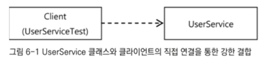
  - UserService 클래스와 그 사용 클라이언트 간의 관계가 강한 결합도로 고정되어 있음
  - 이 사이에 다른 무언가를 추가하기 어려움
- 변경할 구조
  - 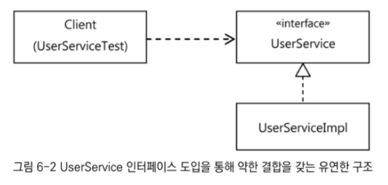
  - UserService를 인터페이스로 만듬
  - 기존 코드는 UserService 인터페이스 구현 클래스를 만들어 넣도록 함 
  - 클라이언트와 결합이 약해지고 직접 구현 클래스에 의존하고 있지 않기 때문에 유연한 확장 가능해짐 
- 런타임 시 DI를 통해 적용하는 방법을 쓰는 이유는 일반적으로 구현 클래스를 바꿔가며 사용하기 위함 
  - 테스트 때는 테스트 구현 클래스를, 정식 운영 중에는 정규 구현 클래스를 DI하는 식 
  - 한 번에 한 가지 클래스를 선택하는 것
- 한 번에 한 클래스를 고집할 필요는 없음
  - 한 번에 두 개의 UserService 인터페이스 구현 클래스를 동시에 이용한다면?
- 새로운 구조
  - 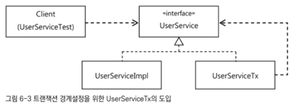
  - UserService를 구현한 또 다른 구현 클래스 생성
  - 해당 클래스는 사용자 관리 로직을 담고 있는 구현 클래스인 UserServiceImpl을 대신하기 위함이 아님
  - 트랜잭션 경계설정 역할을 하는 것 
  - 스스로 비즈니스 로직을 담고 있지 않기 때문에 비즈니스 로직을 담고 있는 다른 UserService 구현 클래스에 실질적인 로직 처리는 위임 
### UserService 인터페이스 도입
- 기존 UserService 클래스를 UserServiceImpl로 이름을 변경 
- 클라이언트가 사용할 로직을 담은 핵심 메소드만 UserService 인터페이스로 만든 후 UserServiceImpl이 구현하도록 만듬 
- 클라이언트에 노출할 메소드를 남은 인터페이스
  - 
- UserService 인터페이스의 구현 클래스인 UserServiceImpl은 기존 UserService 클래스의 내용을 대부분 그대로 유지하면 됨
  - 단, 트랜잭션 관련 코드는 독립시키기로 했으니 제거
  - 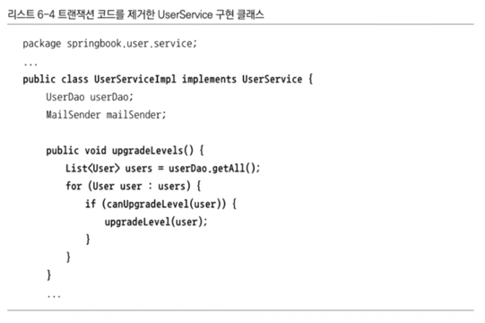
- 기술이나 서버환경, 스프링 관련 코드가 없어짐
- 단순하게 로직만을 구현한 모습 
### 분리된 트랜잭션 기능
- 비즈니스 트랜잭션 처리를 담은 UserServiceTx를 만들 것
- 기본적으로 UserService를 구현하게 만듬 
- 같은 인터페이스를 구현한 다른 오브젝트에게 작업을 위임하게 만들면 됨 
- 비즈니스 로직에 대해서는 UserServiceTx가 아무런 관여도 하지 않음 
- 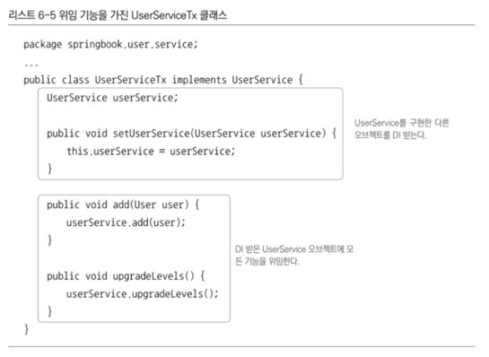
- 클라이언트에 대해 UserService 타입 오브젝트의 하나로서 기능 가능 
- UserServiceTx는 사용자 관리라는 비즈니스 로직을 전혀 갖지 않고 다른 UserService 구현 오브젝트에 기능을 위임
- 이를 위해 UserService 오브젝트를 DI받을 수 있도록 만듬
- 이제 UserServiceTx에 트랜잭션 경계설정이라는 부가적인 작업을 부여할 것
  - UserService에 스프링 트랜잭션 경계설정 API를 도입한 것과 동일 
- transactionManager라는 이름으의 빈으로 등록된 트랜잭션 매니저를 DI로 받아뒀다가 트랜잭션 안에서 동작하도록 만들어줘야 하는 메소드 호출의 전과 후에 필요한 트랜잭션 API를 사용해주면 됨 
- 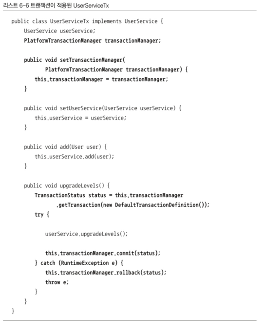
- upgradeLevels()는 UserService에서 트랜잭션 처리 메소드와 비즈니스 로직 메소드를 분리했을 때 트랜잭션을 담당한 메소드와 거의 한 메소드가 되었음
- 추상화된 트랜잭션 구현 오브젝트를 DI받을 수 있도록 PlatformTransactionManager 타입의 프로퍼티도 추가
### 트랜잭션 적용을 위한 DI 설정
- 설정 파일을 수정해야 함 
- 클라이언트가 UserService라는 인터페이스를 통해 사용자 관리 로직을 이용하려고 할 때
  - 먼저 트랜잭션을 담당하는 오브젝트가 사용되어 트랜잭션에 관련된 작업을 진행
  - 실제 사용자 관리 로직을 담은 오브젝트가 이후에 호출되어 비즈니스 로직에 관련된 작업을 수행
- 빈 오브젝트와 그 의존관계
  - 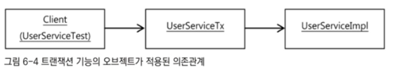
- 기존에 userService 빈이 의존하고 있던 transactionManager는 UserServiceTx의 빈이, userDao와 mailSender는 UserServiceImpl 빈이 각각 의존하도록 프로퍼티 정보를 분리
- 스프링 설정파일의 내용
  - 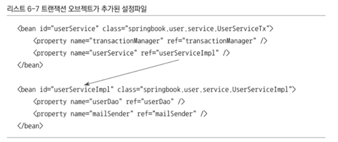
- 클라이언트는 UserServiceTx 빈을 호출해 사용할도록 만ㄷ르어야 함 
- 따라서 userService라는 대표적인 빈 아이디는 UserServiceTx 클래스로 정의된 빈에 부여
- userService 빈은 UserServiceImpl 클래스로 정의되는 아이디가 userServiceImpl인 빈을 DI하게 만듬
### 트랜잭션 분리에 따른 테스트 수정 
- 테스트 코드도 수정되어야 함 
- UserService라는 클래스를 직접 사용하는 테스트 구조에 각종 의존 오브젝트를 테스트용 DI 기법을 이용해 바꿔치기해 사용했었음
  - 기존의 UserService 클래스가 인터페이스와 두 개의 클래스로 분리된 만큼 테스트에서도 적절한 타입과 빈을 사용하도록 변경해야 함 
- 스프링의 테스트용 컨텍스트에서 가져올 빈들
  - 기존에는 UserService 클래스 타입의 빈을 @Autowired로 가져다가 사용 
    - 하지만 UserService는 인터페이스로 바뀌었음
    - 인터페이스라 하더라도 @Autowired로 가져오는데 문제는 없지만 @Autowired는 기본적으로 타입이 일치하는 빈을 찾아주기 때문에 다른 문제가 발생 
    - 수정한 스프링의 설정 파일에는 UserService라는 인터페이스 타입을 가진 두 개의 빈이 존재하기 때문 
    - @Autowired는 기본적으로 타입으로 빈을 찾지만 타입으로 하나의 밴을 결정할 수 없는 경우 필드 이름을 이용해 빈을 찾음
    - 따라서 `@Autowired UserService userService`라고 하면 아이디가 userService인 빈이 주입될 것
  - UserServiceImpl 클래스로 정의된 빈도 가져와야 함
    - 일반적인 UserService 기능의 테스트에서는 UserService 인터페이스를 통해 결과를 확인하는 것으로 충분
    - 하지만 MailSender 목 오브젝트를 이용한 테스트에서는 테스트에서 직접 MailSender를 DI 해줘야 할 필요가 있었음
    - MailSender를 DI 해줄 대상을 구체적으로 알고 있어야 하기 때문에 UserServiceImpl 클래스의 오브젝트를 가져올 필요가 있음
    - 목 오브젝트를 이용해 수동 DI를 적용하는 테스트라면 어떤 클래스의 오브젝트인지 분명히 알 필요가 있음 
    - 따라서 `@Autowired UserServiceImpl userServiceImpl`로 빈을 주입받도록 함 
- upgradeLevels() 테스트 메소드
  - MailSender의 목 오브젝트를 설정해주는 건 UserService 인터페이스를 통해서는 불가능하기 때문에 userServiceImpl 빈에 해줘야 함 
  - 
- upgradeAllOrNothing() 테스트도 수정할 부분이 있음
  - 해당 테스트는 트랜잭션 기술이 바르게 적용됐는지를 확인하기 위해 만든 일종의 학습 테스트
  - 직접 ㅔㅌ스트용 확장 클래스도 만들고 수동 DI도 적용한 만큼 바뀐 구조를 모두 반영해주는 작업이 필요
  - 기존에는 TestUserService 오브젝트를 만들어 필요한 의존 오브젝트를 넣어주고 테스트를 진행했음
  - 이제는 TestUserService가 트랜잭션 기능은 빠진 UserServiceImpl을 상속하도록 해야 함 
    - 트랜잭션 롤백의 확인을 위해 강제로 예외를 발생시킬 위치가 UserServiceImpl에 있기 때문 
  - 하지만 이 오브젝트로 테스트하면 트랜잭션이 빠져 있으니 트랜잭션 테스트가 정상적으로 동작하지 않음 
  - 따라서 TestUserService 오브젝트를 UserServiceTx 오브젝트에 수동 DI시킨 후 트랜잭션 기능까지 포함된 UserServiceTx의 메소드를 호출하며 테스트를 수행하도록 해야 함 
  - 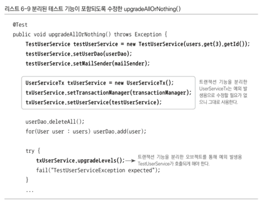
  - 트랜잭션 테스트용으로 정의한 TestUserService 클래스는 이제 UserServiceImpl 클래스를 상속하도록 바꿔줌
  - `static class TestUserService extends UserServiceImpl {`
### 트랜잭션 경계설정 코드 분리의 장점 
- 이제 비즈니스 로직을 담당하고 있는 UserServiceImpl의 코드를 작성할 때는 트랜잭션과 같은 기술적인 내용에는 전혀 신경쓰지 않아도 됨 
- 트랜잭션 적용이 필요한지도 신경쓰지 않아도 됨 
- 다른 트랜잭션 API도 필요하지 않음 
- 트랜잭션은 DI를 이용해 UserServiceTx와 같은 트랜잭션 기능을 가진 오브젝트가 먼저 실행되도록 만들기만 하면 됨 
- 따라서 언제든지 트랜잭션 도입 가능 
- 트랜잭션과 같은 기술적인 내용 때문에 비즈니스 로직에 손을 대서 잘못될 일이 없음 

----

# 고립된 단위 테스트
- 가장 편하고 좋은 테스틑 방법은 가능한 한 작은 단위로 쪼개서 테스트하는 것 
  - 테스트가 실패했을 때 그 원인을 찾기 쉽기 때문 
  - 테스트가 진행되는 동안 실행된 코드의 양이 많다면 실패 원인을 찾기 힘듬 
  - 테스트 단위가 작아야 테스트의 의도나 내용이 분명해지고 만들기도 쉬워짐 
  - 테스트할 대상이 크고 복잡하면 테스트를 만들기도 그만큼 어렵고 만들었다 해도 충분하지 못할 수 있음
## 복잡한 의존관계 속의 테스트
- UserService의 경우 간단한 기능만을 가짐 
- 그럼에도 UserService의 구현 클래스들이 동작하려면 세 가지 타입의 의존 오브젝트가 필요
  - UserDao 타입의 오브젝트를 통해 DB와 데이터를 주고받아야 함 
  - MailSender를 구현한 오브젝트를 이용해 메일을 발송해야 함 
  - 트랜잭션 처리를 위해 PlatformTransactionManager와 커뮤니케이션 필요 
- UserService를 분리하기 전의 테스트가 동작하는 모습 
  - 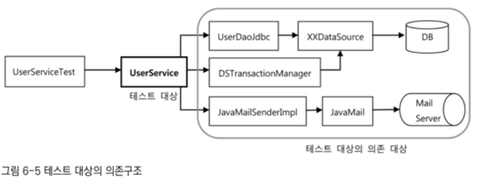
- UserServiceTest가 테스트하고자 하는 대상인 UserService는 사용자 정보를 관리하는 비즈니스 로직의 구현 코드
  - 따라서 UserService의 코드가 바르게 작성되어 있으면 성공, 아니면 실패 
  - 테스트의 단위는 UserService 클래스여야 함 
- 하지만 UserService는 UserDao, TransactionManager, MailSender라는 세 가지의 의존 관계를 가짐
  - 그 세 가지 의존관계를 갖는 오브젝트들이 테스트가 진행되는 동안에 같이 실행된다는 것이 문제 
  - 더 큰 문제는 세 가지 의존 오브젝트도 자신의 코드만 실행하고 마는 것이 아니라는 점 
  - JDBC를 이용해 UserDao를 구현한 UserDaoJdbc는 DataSource의 구현 클래스, DB 드라이버, DB 서버까지의 네트워크 통신, DB 서버 자체, 그 안에 정의된 테이블에 모두 의존 중 
  - TransactionManager는 데이터 소스 구현에만 의존
  - MailSender도 메일 서버의 셋업 상태에까지 모두 의존 
- UserService를 테스트하는 것처럼 보이지만 사실은 그 뒤에 존재하는 많은 오브젝트와 환경, 서비스, 서버, 네트워크까지 함께 테스트하는 셈이 됨 
- 그 중 하나라도 문제가 있다면 UserService에 대한 테스트가 실패하게 됨 
- 이런 경우의 테스트는 준비하기 힘들고 환경이 조금이라도 달라지만 동일한 테스트 결과를 내지 못 할 수 있음
  - 수행 속도는 느리고 그에 따라 테스트를 작성하고 실행하는 빈도가 점차 떨어질 것이 분명 
  - UserService는 문제가 없어도 누군가 UserDao의 코드를 잘못 수정해 UserService의 테스트가 실패한다면 원인을 찾기 위해 불필요한 시간 낭비가 생길 수도 있음
- DB가 함께 동작해야 하는 테스트는 작성하기 힘든 경우도 많음 
  - UserDao에서 사용하는 SQL이 여러 개의 테이블을 조인하고 복잡한 조건을 가지고 통계 계산을 해서 가져오는 경우
  - 이 DAO의 메소드가 수행돼서 테스트에 필요한 정보를 UserService가 사용하게 하려면 DAO를 위해 복잡한 테스트 데이터를 준비해야 함 
  - 그런데 UserService는 가져온 목록으로 간단한 계산을 하는게 전부라면 사전 작업 준비에 시간과 노력이 더 들어가는 경우가 될 수 있음
## 테스트 대상 오브젝트 고립시키기
- 테스트의 대상이 환경이나 외부 서버, 다른 클래스의 코드에 종속되고 영향을 받지 않도록 고립시킬 필요가 있음
- 테스트를 의존 대상으로부터 분리해 고립시키는 방법은 테스트를 위한 대역을 사용하는 것 
### 테스트를 위한 UserServiceImpl 고립
- 고립된 테스트가 가능하도록 UserService를 재구성했을 때의 구조
  - 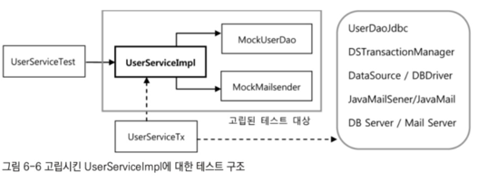
  - UserServiceImpl에 대한 테스트가 진행될 때 사전에 테스트를 위해 준비된 동작만 하도록 만든 두 개의 목 오브젝트에만 의존
- UserDao는 단지 테스트 대상의 코드가 정상적으로 수행되도록 도와주기만 하는 스텁이 아님 
  - 부가적인 검증 기능까지 가진 목 오브젝트
  - 고립된 환경에서 동작하는 upgradeLevels()의 테스트 결과를 검증할 방법이 필요하기 때문 
- UserServiceImpl의 upgradeLevels() 메소드는 리턴 값이 없는 void
  - 메소드를 실행하고 그 결과를 받아 검증하는 것을 불가능
  - upgradeLevels()는 DAO를 통해 필요한 정보를 가져와 일정한 작업을 수행하고 그 결과를 다시 DAO를 통해 DB에 반영
  - 그 코드의 동작이 바르게 됐는지 확인하려면 결과가 남아있는 DB를 직접 확인할 수밖에 없음 
  - 따라서 기존 테스트 코드에서는 UserService의 메소드를 실행시킨 후 UserDao를 이용해 DB에 들어간 결과를 가져와 검증하는 방법을 사용
- 의존 오브젝트나 외부 서비스에 의존하지 않는 고립된 테스트 방식으로 만든 UserServiceImpl은 아무리 그 기능이 수행되어도 결과가 DB 등을 통해 남지 않음
  - 기존 방법으로는 작업 결과를 검증하기 힘듬 
  - upgradeLevels()처럼 결과가 리턴되지 않는 경우는 더욱
- 이럴 땐 테스트 대상인 UserServiceImpl과 그 협력 오브젝트인 UserDao에게 어떤 요청을 했는지 확인하는 작업이 필요
  - 테스트 중에 DB가 반영되지는 않았지만 UserDao의 update() 메소드를 호출하는 것을 확인할 수 있다면 DB에 그 결과가 반영될 것이라고 결론을 내릴 수 있기 때문 
  - UserDao와 같은 역할을 하면서 UserServiceImpl과의 사이에서 주고받은 정보를 저장해 뒀다가 테스트의 검증에 사용할 수 있게 하는 목 오브젝트를 만들 필요가 있음
### 고립된 단위 테스트 활용
- 고립된 단위 테스트 방법을 UserServiceTest의 upgradeLevels() 테스트에 적용
- 기존 테스트 코드의 구성
  - 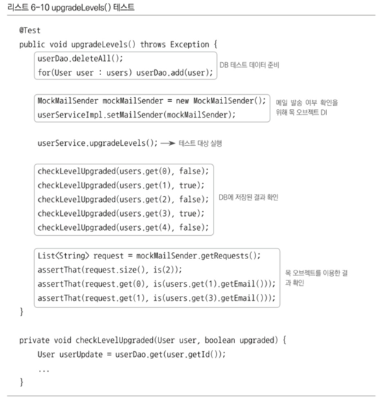
  - 다섯 단계의 작업으로 구성
    1. 테스트 실행 중 UserDao를 통해 가져올 테스트용 정보를 DB에 넣음
       - UserDao는 결국 DB를 이용해 정보를 가져오기 때문에 최후의 의존 대상인 DB에 직접 정보를 넣어줘야 함 
    2. 메일 발송 여부를 확인하기 위해 MailSender 목 오브젝트를 DI 해줌
    3. 실제 테스트 대상인 userService의 메소드 실행
    4. 결과가 DB에 반영되었는지 확인하기 위해서 UserDao를 이용해 DB에서 데이터를 가져와 결과 확인 
    5. 목 오브젝트를 통해 UserService에 의한 메일 발송이 있었는지를 확인하면 됨 
- 테스트 작업을 분류해보면 처음 두 가지는 UserService의 upgradeLevels() 메소드가 실행되는 동안에 사용하는 의존 오브젝트가 테스트의 목적에 맞게 동작하도록 준비하는 과정
- 첫 번째 작업은 의존 관계를 따라 마지막에 등장하는 DB를 준비하는 반면
- 두 번째는 테스트를 의존 오브젝트와 서버 등에서 고립시키도록 테스트만을 위한 목 오브젝트를 준비한다는 점이 다름 
- 네 번째와 다섯 번째는 테스트 대상 코드를 실행한 후에 결과를 확인하는 작업
- 네 번째는 의존 관계를 따라 결국 최종 결과가 반영된 DB의 내용을 확인하는 방법인 반면 다섯 번째는 메일 서버까지 갈 필요 없이 목 오브젝트를 통해 upgradeLevels() 메소드가 실행되는 중에 메일 발송 요청이 나간 적이 있는지만 확인
### UserDao 목 오브젝트
- 실제 UserDao와 DB까지 직접 의존하고 있는 첫 번째와 네 번째의 테스트 방식도 목 오브젝트를 만들어 적용할 것
- 목 오브젝트는 기본적으로 스텁과 같은 방식으로 테스트 대상을 통해 사용될 때 필요한 기능을 지원해줘야 함 
- upgradeLevels() 메소드가 실행되는 중에 UserDao와 어떤 정보를 주고받는지 입출력 내역을 먼저 확인할 필요가 있음
- UserServiceImpl의 코드에서 upgradeLevels() 메소드와 그 사용 메소드에서 UserDao를 사용하는 경우는 두 가지
  - 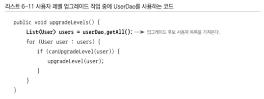
  - 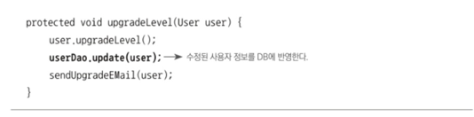
  - userDao.getAll()은 레벨 업그레이드 후보가 될 사용자의 목록을 받아옴 
    - 이 메소드 기능을 지원하기 위해 테스트용 userDao에는 DB에서 읽어온 것처럼 미리 준비된 사용자 목록을 제공해줘야 함 
    - userDao.update(user)의 호출은 리턴 값이 없음 
    - 따라서 테스트용 UserDao가 특별히 미리 준비해 둘 것은 없음
    - 테스트가 진행되도록 하기 위해서라면 아무런 내용도 없는 빈 메소드로 만들어도 됨 
  - 하지만 update() 메소드의 사용은 upgradeLevels()의 핵심 로직인 '전체 사용자 중에서 업그레이드 대상자는 레벨을 변경해준다'에서 '변경'에 해당하는 부분을 검증할 수 있는 중요한 기능
    - 업그레이드를 통해 레벨이 변경된 사용자는 DB에 반영되도록 userDao의 update()에 전달되어야 하기 때문
    - 그래서 getAll()에 대해서는 스텁으로서, update()에 대해서는 목 오브젝트로서 동작하는 UserDao 타입의 테스트 대역이 필요
    - 해당 클래스의 이름을 MockUserDao라 하자
- MockUserDao
  - 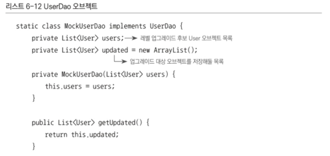
  - 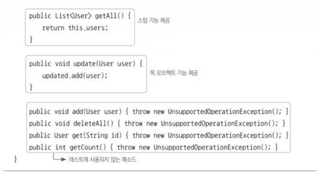
  - UserDao 구현 클래스를 대신해야 하니 UserDao 인터페이스를 구현해야 함 
  - 인터페이스를 구현하려면 인터페이스 내의 모든 메소드를 만들어줘야 한다는 부담이 있음 
  - 사용하지 않을 메소드도 구현해줘야 한다면 UnsupportedOperationException을 던지로록 만드는 편이 좋음 
  - 그냥 빈 채로 두거나 null을 리턴하게 해도 문제는 없음 
  - 하지만 실수로 사용될 위험이 있기 때문에 지원하지 않느 기능이라는 예외가 발생하도록 만드는 것 
- MockUserDao에는 두 개의 User 타입 리스트를 정의해 둠 
  - 하나는 생성자를 통해 전달받은 사용자 목록을 저장해 뒀다가 getAll() 메소드가 호출되면 Db에서 가져온 것처럼 돌려주는 용도
    - 목 오브젝트를 사용하지 않을 때는 일일이 DB에 저장했다가 다시 가져와야 했지만 MockUserDao는 미리 준비된 테스트용 리스트를 메모리에 갖고 있다가 돌려주기만 하면 됨 
  - 다른 하나는 update() 메소드를 실행하면서 넘겨준 업그레이드 대상 User 오브젝트를 저장해 뒀다가 검증을 위해 돌려주기 위한 것 
    - upgradeLevels() 메소드가 실행되는 동안 업그레이드 대상으로 선정된 사용자가 어떤 것인지 확인하는데 쓰임 
- upgradeLevels() 테스트가 MockUserDao를 사용하도록 수정
  - 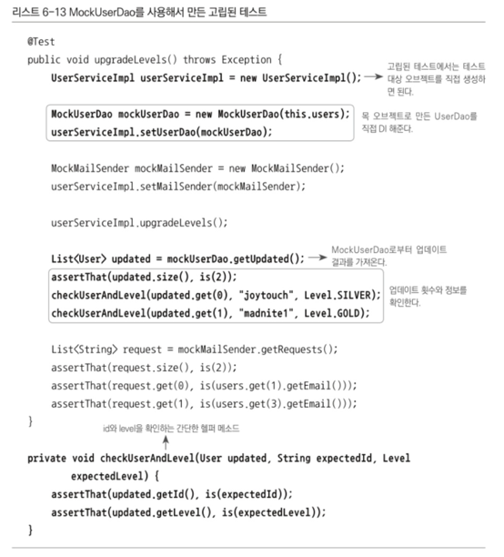
- 테스트 대역 오브젝트를 이용해 완전히 고립된 테스트로 만들기 전의 테스트 대상은 스프링 컨테이너에서 @Autowired를 통해 가져온 UserService 타입의 빈
  - 컨테이너에서 가져온 UserService 오브젝트는 DI를 통해 많은 의존이 있었음
  - 이제는 완전히 고립되어 테스트만을 위해 독립적으로 동작하는 테스트 대상을 사용할 것이기 때문에 스프링 컨테이너에서 빈을 가져올 필요가 없음 
- 먼저 테스트하고 싶은 로직을 담은 클래스인 UserServiceImpl의 오브젝트를 직접 생성
  - UserServiceTest 내의 다른 테스트들이 아직 스프링으로부터 가져온 빈을 가지고 테스트하기 때문에 테스트 클래스의 설정은 그대로 뒀지만 upgradeLevels() 테스트만 있었다면 스프링의 테스트 컨텍스트를 이용하기 위해 도입한 @RunWith 등은 제거 가능
- 사용자 정보를 모두 삭제하고 테스트용 사용자 정보를 DB에 등록하는 등의 번거로운 준비 작업은 필요 없음
  - 준비해둔 MockUserDao 오브젝트를 사용하도록 수동 DI 해주기만 하면 됨 
  - 이미 고립된 테스트가 가능하도록 준비된 MockMailSender도 수정자 메소드를 이용해 DI
- 준비가 끝났으면 UserServiceImpl 오브젝트의 메소드를 실행
  - MockUserDao가 의존 오브젝트로 DI되어 있으므로 미리 준비해 둔 사용자 목록을 받을 것임
  - 로직에 따라 업그레이드 대상을 선정해 레벨 변경 후 MockUserDao의 update() 메소드 호출
- UserServiceImpl은 UserDao의 update()를 이용해 몇 명의 사용자 정보를 DB에 수정하려 했는지, 그 사용자들이 누구인지, 어떤 레벨로 변경되었는지 검증
  - MockUserDao 오브젝트로부터 update()가 호출될 때 전달받은 사용자 목록을 가져옴 
  - 레벨 업그레이드가 두 명에게만 일어났는지를 확인
  - 기존에는 DB에서 모든 사용자 정보를 다시 가져와 일일이 확인해야 했지만 이제는 그럴 필요 없음
  - MockUserDao에는 update() 메소드가 호출될 때마다 저장해둔 사용자 목록이 있음
  - 준비했던 테스트 데이터에 따르면 업그레이드 대상자는 두 명 
  - 따라서 목록의 수는 2여야 함 
  - 전체 개수를 확인했으면 순서에 따라서 업그레이드된 사용자의 아이디와 바뀐 레벨을 확인하면 됨 
### 테스트 수행 성능의 향상 
- UserServiceTest의 upgradeLevels() 테스트를 실행 하면 성공하게 됨 
- 이전과 비교해서 속도가 빨라짐 
  - UserServiceImpl과 테스트를 도와주는 두 개의 목 오브젝트 외에는 사용자 관리 로직을 검증하는데 직접적으로 필요하지 않은 의존 오브젝트와 서비스를 모두 제거했기 때문
- DB와 직접 연결되어 있었다면 훨씬 많은 시간이 걸렸을 것 
- 고립된 테스트를 하면 다른 의존 대상에 영향을 받을 경우를 대비해 복잡하게 준비할 필요가 없음 
  - 테스트 수행 성능도 크게 향상 
  - 테스트가 빨리 돌아가면 자주 돌려볼 수 있음 
## 단위 테스트와 통합 테스트
- 단위 테스트의 단위는 정하기 나름 
- 사용자 관리 기능 전체를 하나의 단위로 볼 수도 있고 하나의 클래스나 하나의 메소드를 단위로 볼 수도 있음 
- 중요한 것은 하나의 단위에 초점을 맞춘 테스트라는 것 
- 여기서의 단위 테스트 정의: 테스트 대상 클래스를 목 오브젝트 등의 테스트 대역을 이용해 의존 오브젝트나 외부의 리소스를 사용하지 않도록 고립시켜 테스트하는 것
- 여기서의 통합 테스트 정의: 두 개 이상의 성격이나 계층이 다른 오브젝트가 연동되어 만들어 테스트하거나 외부의 DB나 파일, 서비스 등의 리소스가 참여하는 테스트
- 통합 테스트란 두 개 이상의 단위가 결합해서 동작하며 테스트가 수행되는 것 
- 스프링의 테스트 컨텍스트 프레임워크를 이용해 컨텍스트에서 생성되고 DI된 오브젝트를 테스트하는 것도 통합 테스트
- 단위 테스트와 통합 테스트 중 어떤 방법을 쓸 지에 대한 가이드라인
  - 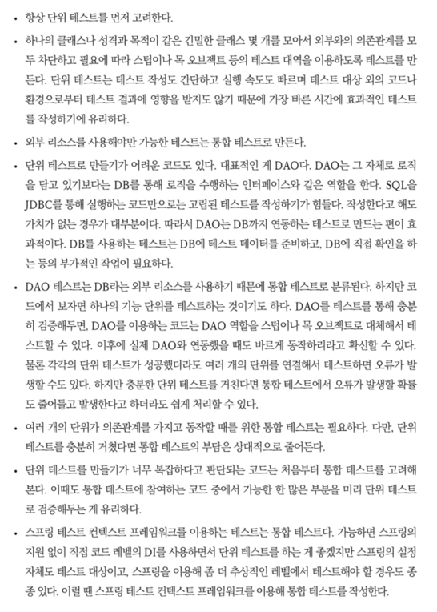
- 단위 테스트와 통합 테스트 모두 개발자가 스스로 자신이 만든 코드를 테스트하기 위해 만드는 개발자 테스트
- 전문 테스터나 고객에 의해 진행되는 기능 테스트는 다른 관점에서 생각해야 함 
- 테스트코드가 작성되고 빠르게 진행되는 편이 좋음 
- 테스트를 먼저 만들어두는 TDD는 코드를 만들자마자 바로 테스트가 가능하다는 장점이 있음 
- 코드를 만들고 나서 오랜 시간이 지난 뒤에 작성하는 테스트는 테스트 대상 코드에 대한 이해가 떨어지기 때문에 불완전해지기 쉽고 작성도 번거로움 
- 코드를 작성하며 테스트는 어떻게 만들 수 있을까를 생각해 보는 것은 좋은 습관
  - 테스트하기 편하게 만들어진 코드는 깔끔하고 좋은 코드가 될 가능성이 있음 
  - 다른 것에 약하게 결합되어 있다는 뜻이기 때문
## 목 프레임워크
- 단위 테스트를 만들기 위해서는 스텁이나 목 오브젝트의 사용이 필수적
- 의조노간계가 없는 단순한 클래스나 세부 로직을 검증하기 위해 메소드 단위로 테스트할 때가 아니라면 대부분 의존 오브젝트를 필요로 하는 코드를 테스트하게 되기 때문 
- 단위 테스트가 많은 장점이 있고 가장 우선시해야 할 테스트 방법인 건 사실이지만 작성이 번거롭다는 단점이 문제
- 특히 목 오브젝트를 만드는 일이 가장 큰 짐 
- 사용하지 않는 인터페이스도 모두 일일이 구현해줘야 함 
### Mockito 프레임워크
- 목 프레임워크의 특징은 목 클래스를 일일이 준비해둘 필요가 없다는 점 
- 간단한 메소드 호출만으로 다이나믹하게 특정 인터페이스를 구현한 테스트용 목 오브젝트를 만들 수 있음 
- UserDao 인터페이스를 구현한 테스트용 목 오브젝트는 스태틱 메소드 호출로 가능
  - `UserDao mockUserDao = mock(UserDao.class)`
  - 이런 목 오브젝트는 아직 아무런 기능이 없음 
  - getAll() 메소드가 불려올 때 사용자 목록을 리턴하도록 스텁 기능을 추가해줘야 함 
    - `when(mockUserDao.getAll()).thenReturn(this.users)`
  - mockUserDao.getAll()이 호출됐을 때 user 리스트를 리턴해주라는 선언
  - mockUserDao의 getAll() 메소드가 호출되면 users 리스트가 자동으로 리틴될 것 
- update() 호출이 있었는지 검증하는 부분
  - Mockito를 통해 만들어진 목 오브젝트는 메소드의 호출과 관련된 모든 내용을 자동으로 저장, 이를 간단한 메소드로 검증할 수 있게 해줌
  - 테스트를 진행하는 동안 mockUserDao의 update() 메소드가 두 번 호출됐는지 확인
    - `verify(mockUserDao, times(2)).update(any(User.class))`
  - User 타입의 오브젝트를 파라미터로 받으며 update() 메소드가 두 번 호출됐는지 확인하라는 것
  - UserDao 인터페이스를 구현한 클래스를 만들 필요도 없고 리턴 값을 생성자를 통해 넣어줬다가 메소드 호출 시 리턴하도록 코드를 만들 필요도 없음 
  - 특정 메소드의 호출이 있었는지, 어떤 값을 가지고 호출했는지를 일일이 기록해 뒀다가 반환하는 기능을 만들지 않아도 됨 
  - 편리하게 작성된 메소드 몇 개로 목 오브젝트를 사용할 수 있게 해줌 
- Mockito 목 오브젝트의 사용 단계
  - 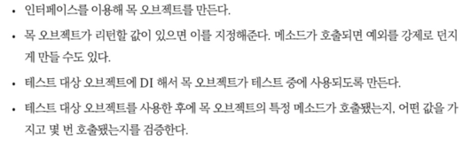
  - 두 번째와 네 번째는 각각 필요한 경우에만 사용 가능 
- 특별한 기능을 가진 목 오브젝트를 만들어야 하는 경우가 아니라면 거의 대부분의 단위 테스트에서 필요한 목 오브젝트는 Mockito를 사용하는 것만으로 충분
- Mockito를 이용해 만든 테스트 코드
  - 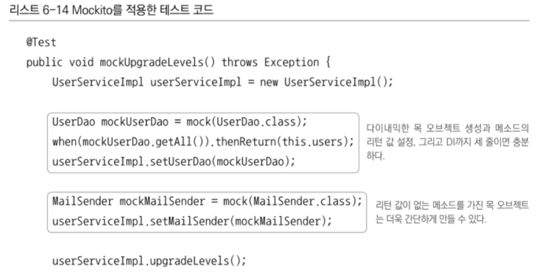
  - 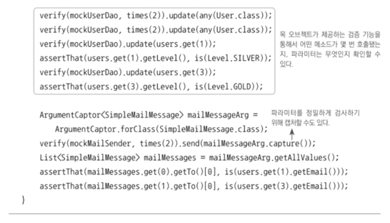
  - UserDao의 목 오브젝트를 생성하고 getAll()이 호출됐을 때의 리턴 값을 설정해준 뒤에 테스트 대상에 DI
  - UserDao 인터페이스를 구현해 목 클래스를 따로 정의할필요 없이 간단한 코드로 목 오브젝트의 준비 끝남 
  - userServiceImpl 메소드가 실행되는 동안 DI해준 목 오브젝트의 메소드가 호출되면 자동으로 호출 기록이 남겨짐 
  - getAll()처럼 미리 설정해둔 리턴 값이 있는 경우에는 그 값을 그대로 리턴해 주기도 함 
- 목 오브젝트의 메소드가 어떻게 호출됐는지를 검증할 차례
  - times()는 메소드 호출 횟수 검증
  - any()를 사용하면 파라미터의 내용은 무시하고 호출 횟수만 확인 가능
  - 호출 횟수 검사가 끝나면 목 오브젝트가 호출됐을 때의 파라미터를 하나씩 점검 
