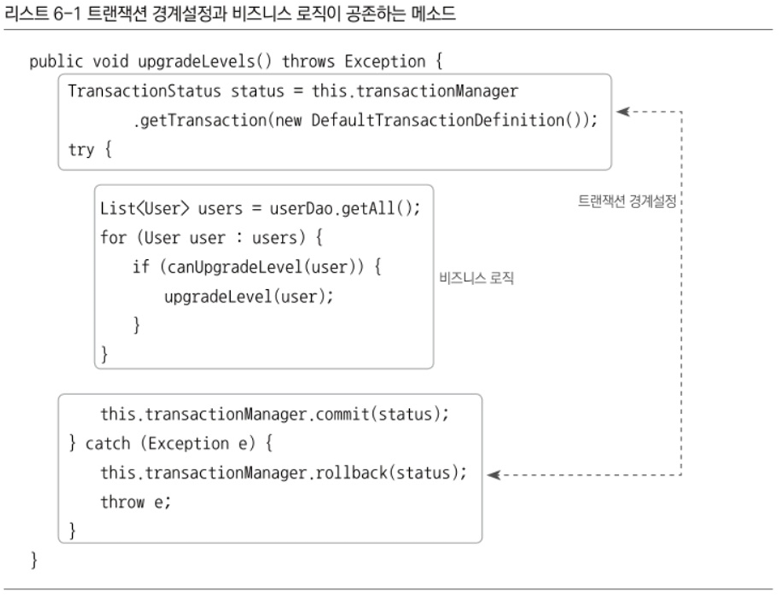

# 6장 AOP 6.2까지

AOP란?

- IoC/DI, 서비스 추상화와 더불어 스프링의 3대 기반기술의 하나
- 스프링의 기술 중에서 가장 이해하기 힘든 난해한 용어와 개념을 가진 기술로 악명이 높음

AOP를 바르게 이용하려면 OOP를 대체하려고 하는 것처럼 보여진 이름 뒤에 감춰전, 그 필연적인 등장배경과 스프링이 그것을 도입한 이유, 그 적용을 통해 얻을 수 있는 장점이 무엇인지에 대한 충분한 이해가 필요

스프링에 적용된 가장 인기 있는 AOP의 적용 대상은 바로 선언적 트랜잭션 기능이다.

서비스 추상화를 통한 트랜잭션 경계설정 기능을 AOP를 이용해 더욱 세련되고 깔끔한 방식으로 바꾸고, 그 과정에서 스프링이 AOP를 도입해야 했던 이유도 알아보자

# 6.1 트랜잭션 코드의 분리

UserService는 서비스 추상화 기법을 적용해 트랜잭션 기술에 독립적으로 만들어줬고, 메일 발송 기술과 환경에도 종속적이지 않은 깔끔한 코드로 다듬어 왔지만, 트랜잭션 경계설정을 넣은 코드 때문에 볼때마다 찜찜한 구석이 있다.

스프링이 제공하는 깔끔한 트랜잭션 인터페이스를 썼음에도 비즈니스 로직이 주인이어야할 메소드 안에 트랜잭션 코드가 더 많은 자리를 차지하고 있는 모습이 못마땅 하다.

트랜잭션의 경계는 분명히 비즈니스 로직의 전후에 설정돼야 하는 것이 분명하니 이 자리에 있어야하는 것은 맞다.

## 6.1.1 메소드 분리



얼핏 보면 트랜잭션 경계설정 코드와 비즈니스 로직 코드가 복잡하게 얽혀 있는 듯이 보이지만, 자세히 보면 뚜렷하게 두 가지 종류의 코드가 구분되어 있음을 알 수 있다.

또, 이 코드의 특징은 트랜잭션 경계설정의 코드와 비즈니스 로직 코드 간에 서로 주고받는 정보가 없다는 점이다.

이 메소드에서 시작된 트랜잭션 정보는 트랜잭션 동기화 방법을 통해 DAO가 알아서 활용한다.

따라서 이 두 가지 코드는 서로 주고받는 것도 없고 성격이 다른 완벽하게 독립적인 코드다.

그렇다면 성격이 다른 이 코드를 분리할 수 있지 않을까?


가독성면에서는 개선이 된 것 같다. 일단 리팩토링을 했으니 테스트를 돌려보는 것을 잊지 말자.

## 6.1.2 DI를 이용한 클래스의 분리

가독성은 확실히 개선되었지만, 여전히 트랜잭션을 담당하는 기술적인 코드가 버젓이 UserService안에 자리 잡고 있다.

어차피 서로 정보를 주고 받는 것이 없다면, 아예 트랜잭션 코드가 존재하지 않는 것처럼 사라지게 할 수는 없을까? → (이게 AOP라는 개념의 출발점인 느낌인것같음.)

꼭 필요한 기능이기 때문에 안보이게는 불가능하다.

그렇다면? 적어도 UserService에서는 보이지 않게 할 수는 있지 않을까? → 트랜잭션 코드를 밖으로 뽑아내보자.

### DI 적용을 이용한 트랜잭션 분리


지금 UserSerivce는 UserServiceTest가 클라이언트가 되어서 사용하고 있다.

실전에서는 아마 다른 클래스나 모듈에서 이 UserService를 호출해 사용할 것이다.

UserService는 현재 클래스로 되어 있으니 다른 코드에서 사용한다면 UserService 클래스를 직접 참조하게 된다.

트랜잭션 코드를 UserService 밖으로 빼낸다면 UserService를 직접 사용하는 클라이언트 코드에선 트랜잭션 기능이 빠진 UserService를 사용하게 될 것이다. → 구체적인 구현 클래스를 직접 참조하는 경우의 전형적인 단점이다.

그럼 직접 사용하는 것이 문제라면 간접적으로 사용하면 되지 않을까? → DI의 기본 아이디어는 실제 사용할 오브젝트의 클래스 정체는 감춘 채 인터페이스를 통해 간접으로 접근하는 것이다. 그 덕분에 구현 클래스는 얼마든지 외부에서 변경할 수 있다.

바로 이런 개념을 가진 DI가 지금 필요하지만 위 사진처럼 Client와 UserService의 관계가 강한 결합도로 고정되어 있기 때문에 이 사이를 비집고 다른 무엇인가를 추가하기 힘들다.


그래서 위 그림과 같이 UserService를 interface로 만들고 기존 코드는 UserService인터페이스의 구현 클래스를 만들어넣도록 한다. 그러면 클라이언트와 결합이 약해지고, 직접 구현 클래스에 의존하고 있지 않기 때문에 유연한 확장이 가능해진다.

이렇게 인터페이스를 이용해 구현 클래스를 클라이언트에 노출하지 않고 런타임 시에 DI를 통해 적용하는 방법을 쓰는 이유? → 일반적으로 구현 클래스를 바꿔가면서 사용하기 위해서다.

테스트 때는 필요에 따라 테스트 구현 클래스를, 정식 운영 중에는 정규 구현 클래스를 DI 해주는 방법처럼 한 번에 한 가지 클래스를 선택해서 적용하도록 되어 있다.

그런데 꼭 그래야 한다는 제약이 있을까?

한번에 두개의 UserService 인터페이스 구현 클래스를 동시에 이용한다면 어떨까?

지금 해결하려고 하는 문제는 UserService에는 순수하게 비즈니스 로직을 담고 있는 코드만 놔두고 트랜잭션 경계설정을 담당하는 코드를 외부로 빼내려는 것이다.

단, 클라이언트가 UserService의 기능을 제대로 이용하려면 트랜잭션이 적용돼야 한다.


그렇다면 위와 같은 구조를 생각해 볼 수 있다.

UserService를 구현한 또 다른 구현 클래스를 만든다. 이 클래스는 사용자 관리 로직을 담고 있는 구현 클래스인 UserServiceImpl을 대신하기 위해 만든게 아니다. 단지 트랜잭션의 경계설정이라는 책임을 맡고 있을 뿐이다. 그리고 스스로는 비즈니스 로직을 담고있지 않기 때문에 또 다른 비즈니스 로직을 담고 있는 UserService의 구현 클래스에 실제적인 로직 처리 작업은 위임하는 것이다.

실제적인 로직 처리의 위임을 위한 호출 작업 이전과 이후에 적절한 트랜잭션 경계를 설정해주면, 클라이언트 입장에서 볼 때는 결국 트랜잭션이 적용된 비즈니스 로직의 구현이라는 기대하는 동작이 일어날 것이다.

여기서 우리는 5장때 배웠던 점에 대해서 다시 한번 살펴볼 필요가 있다.

- 서비스 추상화때 배웠던점
    
    
    
    “런타임”에 부여하는게 포인트다.
    
    
    
    대상이 되는 원래 그 클래스가 구현하고자 했던 어떤 작업을 인터페이스로 먼저 추출을 해
    
    
    
    그 대상이 되는 클래스를 인터페이스 구현하는 방식으로 만들어 놓는다.
    
    
    
    인터페이스를 구현한 또 다른 클래스를 만든다. 데코레이터라는 이름으로 만들어 놓고 그 다음에 데코레이터의 구현 클래스들을 상속해서 여러가지를 만들 수 있는데 두 가지를 그냥 묶어서 만들어도 상관 없다.
    
    데코레이터에서 중요한 것은 인터페이스가 가지고 있는 오퍼레이션외에 컴포넌트라고 불리는 인터페이스를 구현한 또 다른 어떤 오브젝트를 가리킬 수 있도록 만들어 놓는다.
    
    그림을 잘 보면 일종의 컴포지트 패턴과 되게 유사한 형태임을 알 수 있다.
    
    - 컴포지트 패턴
        
        컴포지트 패턴 (Composite Pattern)은 객체 지향 디자인패턴 중 하나로,복합 객체를 구성하는 개별적인 객체들을 모두 동일한 방법으로 다룰 수 있게 하는 패턴이다.
        
        
        
        
        
        
        
        
        
    
    
    
    프록시 패턴은 데코레이터 패턴처럼 인터페이스를 구현한 최종적인 그 기능을 가지고 있는 객체를 보통 타깃이라고 하는데 최종 타깃과 동일한 인터페이스를 구현하는 클래스를 하나 더 만들어 놓는다.
    
    프록시 패턴은 어떤 부가적인 기능을 넣는 게 목적은 아니고 필요에 따라서 타깃 인척 하면서 대신 껴서 등장한다.
    
    인터페이스를 통해서 proxy를 호출하면 필요에 따라서 외부 API로 호출해준다거나 지연해서 만들어주는것도 가능하다.
    
    스프링과 자바에서는 이 두가지를 뭉뚱그려서 프록시라는 이름으로 부른다.
    
    기능을 부여하는건지 접근을 제어하는건지는 생각해보면 좋을 것 같다.
    
    
    
    proxy에서 트랜잭션을 시작하고 에러가 없으면 커밋하고 에러가 있으면 롤백하는 그런 기능을 담당함.
    
    
    
    요런식으로 OrderService를 타겟으로 하고 부가 기능을 넣어준 후
    
    
    
    이렇게 사용하면 된다.
    
    
    

### UserService 인터페이스 도입


먼저 기존의 UserSerivce 클래스를 UserServiceImpl로 이름을 변경한다.

그리고 클라이언트가 사용할 로직을 담은 핵심 메소드만 UserService 인터페이스로 만든 후 UserServiceImpl이 구현하도록 만든다.

인터페이스에는 현재 구현한 사용자 관리 로직의 메소드는 add()와 upgradeLevels() 두 개뿐이다.


UserService 인터페이스의 구현 클래스인 UserServiceImpl은 기존 UserService 클래스의 내용을 대부분 그대로 유지하면 된다. 단, 트랜잭션과 관련된 코드는 독립시키기로 했으니 모두 제거해도 좋다.

따라서 위 사진으로 바뀌게 된다.

이렇게 수정하고 보니 트랜잭션을 고려하지 않고 단순하게 로직만을 구현했던 처음 모습으로 돌아왔다.

코드 어디에도 기술이나 서버환경, 심지어는 스프링에 관련된 코드도 보이지 않는다.

이 자체로만 보면 UserDao라는 인터페이스를 이용하고, User라는 도메인 정보를 가진 비즈니스 로직에만 충실한 깔끔한 코드다.

### 분리된 트랜잭션 기능


비즈니스 트랜잭션 처리르 담은 UserServiceTx를 만들어 보자.

UserServiceTx는 기본적으로 UserService를 구현하게 만들고, 같은 인터페이스를 구현한 오브젝트에게 고스란히 작업을 위임하게 만들면 된다. 적어도 비즈니스 로직에 대해서는 UserServiceTx가 아무런 관여도 하지 않는다.

UserServiceTx는 UserService 인터페이스를 구현했으니, 클라이언트에 대해 UserService 타입 오브젝트의 하나로서 행세할 수 있다.

UserServiceTx는 사용자 관리라는 비즈니스 로직을 전혀 갖지 않고 고스란히 다른 UserService 구현 오브젝트에 기능을 위임한다. 이를 위해 UserService 오브젝트를 DI 받을 수 있도록 만든다.


이렇게 UserServiceTx에 트랜잭션의 경계설정이라는 부가적인 작업을 부여해보자.

구체적인 기술은 알지 못하지만 transactionManager라는 이름의 빈으로 등록된 트랜잭션 매니저를 DI로 받아뒀다가 트랜잭션 안에서 동작하도록 만들어줘야 하는 메소드 호출의 전과 후에 필요한 트랜잭션 경계설정 API를 사용해주면 된다.

upgradeLevels()는 UserService에서 트랜잭션 처리 메소드와 비즈니스 로직 메소드를 분리했을 때 트랜잭션을 담당한 메소드와 거의 한 메소드가 됐다. 추상화된 트랜잭션 구현 오브젝트를 DI 받을 수 있도록 PlatformTranscationManager 타입의 프로퍼티도 추가됐다.

### 트랜잭션 적용을 위한 DI 설정


위를 보면 프록시패턴과 동일하다는 것을 알 수 있다.

클라이언트가 UserService라는 인터페이스를 통해 사용자 관리 로직을 이용하려고 할 때 먼저 트랜잭션을 담당하는 오브젝트가 사용돼서 트랜잭션에 관련된 작업을 진행해주고, 실제 사용자 관리 로직을 담은 오브젝트가 이후에 호출돼서 비즈니스 로직에 관련된 작업을 수행하도록 만든다.


설정파일은 이렇게 구성하도록 한다.

기존에 userService 빈이 의존하고 있던 transactionManager는 UserServiceTx의 빈이, userDao와 mailSender는 UserServiceImpl 빈이 각각 의존하도록 프로퍼티 정보를 분리한다.

이제 클라이언트는 UserServiceTx 빈을 호출해서 사용하도록 만들어야 한다. 따라서 userService라는 대표적인 빈 아이디는 UserServiceTx 클래스로 정의된 빈에게 부여해준다. userService 빈은 UserServiceImpl 클래스로 정의되는, 아이디가 userServiceImpl인 빈을 DI하게 만든다.

### 트랜잭션 분리에 따른 테스트 수정

기본적인 분리 작업이 끝났으니 테스트를 돌려봐야 하는데, 그 전에 테스트 코드에 손볼 곳이 제법 있다.

UserService라는 클래스를 직접 사용하는 테스트 구조, 각종 의존 오브젝트를 테스트용 DI 기법을 이용해 바꿔치기해서 사용하곤 했으니, 기존의 UserService 클래스가 인터페이스와 두 개의 클래스로 분리된 만큼 테스트에서도 적합한 타입과 빈을 사용하도록 변경해야 할 것이다.

먼저 스프링의 테스트용 컨텍스트에서 가져올 빈들을 생각해보자.

기존에는 UserService 클래스 타입의 빈을 @Autowired로 가져다가 사용했다.

UserService는 이제 인터페이스로 바뀌었다.

- DI가 가능할까?
    
    인터페이스라고 하더라도 @Autowired로 가져오는 데는 아무런 문제가 없다.
    
    하지만 @Autowired는 기본적으로 타입이 일치하는 빈을 찾아 주기 때문에 다른 문제가 발생한다.
    
    수정한 스프링의 설정파일에는 UserSErvice라는 인터페이스 타입을 가진 두 개의 빈이 존재하기 때문이다.
    
    - 같은 타입의 빈이 두개라면 @Autowired를 적용한 경우 어떤 빈을 가져올까?
        
        @Autowired는 기본적으로 타입을 이용해 빈을 찾지만 만약 타입으로 하나의 빈을 결정할 수 없는 경우에는 필드 이름을 이용해 빈을 찾는다.
        
        따라서 UserServiceTest에서 다음과 같은 userService 변수를 설정해두면 아이디가 userService인 빈이 주입될 것이다.
        
        ```java
        @Autowired
        UserService userService;
        ```
        

UserService는 인터페이스로 변경했으므로 테스트 코드는 이제 구체적인 클래스 정보는 알지 못한채로 컨테이너가 제공해주는 대표적인 UserService 구현 오브젝트를 사용하게 된다. UserDao를 인터페이스로 바꿨을 때와 마찬가지라고 생각하면 된다.

그런데 UserServiceTest는 하나의 빈을 더 가져와야 한다. 바로 UserServiceImpl 클래스로 정의된 빈이다.

일반적인 UserService 기능의 테스트에서는 UserService 인터페이스를 통해 결과를 확인하는 것으로 충분하다. 그런데 앞 장에서 만든 MailSender 목 오브젝트를 이용한 테스트에서는 테스트에서 직접 MailSender를 DI 해줘야 할 필요가 있었다. MailSender를 DI 해줄 대상을 구체적으로 알고 있어야 하기 때문에 UserServiceImpl 클래스의 오브젝트를 가져올 필요가 있다.

개발자가 자신이 작성한 코드를 검증하기 위한 테스트인 만큼 내부 구조를 속속들이 알고 잇는 채로 테스트를 만드는 것에는 문제가 없다.

단순히 기능을 테스트할 때는 구체적인 클래스 정보를 굳이 테스트에 노출하지 않는 편이 낫겠지만, 이렇게 목 오브젝트를 이용해 수동 DI를 적용하는 테스트라면 어떤 클래스의 오브젝트인지 분명하게 알 필요가 있다.

```java
@Autowired UserServiceImpl userServiceImpl;
```

따라서 위와 같이 선언하고 해당 클래스로 만들어진 빈을 주입받도록 한다. 그래야만 MockMailSender를 설정해주기 위한 수정자 메소드에 접근할 수 있기 때문이다.


테스트 코드는 위와 같이 설정한다.


다른 테스트 메소드는 손댈 것이 없지만, upgradeAllOrNothing() 테스트는 수정할 부분이 있다.

이 테스트의 목적은 사용자 관리 로직을 테스트하려는 목적이 아니라, 트랜잭션 기술이 바르게 적용됐는지를 확인하기 위해 만든 일종의 학습테스트다.

그래서 직접 테스트용 확장 클래스도 만들고 수동 DI도 적용하고 한 만큼, 바꾸니 구조를 모두 반영해주는 작업이 필요하다.

기존에는 바로 TestUserService 오브젝트를 만들어서 필요한 의존 오브젝트를 넣어주고서 테스트를 진행했다.

이제는 TestUserService가 트랜잭션 기능은 빠진 UserServiceImpl을 상속하도록 해야 한다. 트랜잭션 롤백의 확인을 위해 강제로 예외를 발생시킬 위치가 UserServiceImpl에 있기 때문이다. 그래서 위와 같이 TestUserService 오브젝트를 UserServiceTx 오브젝트에 수동 DI시킨 후에 트랜잭션 기능까지 포함된 UserService의 메소드를 호출하면서 테스트를 수행하도록 해야한다.


트랜잭션 테스트용으로 특별히 정의한 TestUserService 클래스는 이제 UserServiceImpl 클래스를 상속하도록 바꿔주면 된다.

### 트랜잭션 경계설정 코드 분리의 장점

트랜잭션 경계설정 코드의 분리와 DI를 통한 연결은 지금까지 해왔던 작업 중에서 가장 복잡하고, 큰 개선 작업이었다. 이런 수고를 한 결과로 얻을 수 있는 장점은 무엇일까?

- 첫째, 이제 비즈니스 로직을 담당하고 있는 UserServiceImpl의 코드를 작성할 때는 트랜잭션과 같은 기술적인 내용에는 전혀 신경 쓰지 않아도 된다. 트랜잭션의 적용이 필요한지도 신경쓰지 않아도 된다.
    
    스프링의 JDBC나 JTA 같은 로우레벨의 트랜잭션 API는 물론이고 스프링의 트랜잭션 추상화 API조차 필요 없다.
    
    트랜잭션은 DI를 이용해 UserServiceTx와 같은 트랜잭션 기능을 가진 오브젝트가 먼저 실행되도록 만들기만 하면 된다. 따라서 언제든지 트랜잭션을 도입할 수 있다.
    
- 비즈니스 로직에 대한 테스트를 손쉽게 만들어낼 수 있다는 것이다.
    
    이건 이어서 서술하겠다.
    

# 6.2 고립된 단위 테스트

가장 편하고 좋은 테스트 방법은 가능한 한 작은 단위로 쪼개서 테스트하는 것이다.

작은 단위의 테스트가 좋은 이유 : 트세트가 실패했을 때 그 원인을 찾기 쉽기 때문이다.

반대로 테스트에서 오류가 발견됐을 때 그 테스트가 진행되는 동안 실행된 코드의 양이 많다면 그 원인을 찾기가 매우 힘들어질 수 있다. 또한 테스트 단위가 작아야 테스트의 의도나 내용이 분명해지고, 만들기도 쉬워진다. 테스트할 대상이 크고 복잡하면 테스트를 만들기도 그만큼 어렵고, 만들었다 해도 충분하지 못할 수 있다.

클래스 하나가 동작하도록 테스트를 만드는 것과 클래스 수십 개가 얽히고 설켜서 동작하도록 만드는 것 중에서 어떤 것이 논리적인 오류를 찾기 쉬울지는 분명하다.

따라서 테스트는 작은 단위로 하면 좋다. 하지만 작은 단위로 테스트하고 싶어도 그럴 수 없는 경우가 많다. 테스트 대상이 다른 오브젝트와 환경에 의존하고 있다면 작은 단위의 테스트가 주는 장점을 얻기 힘들다.

## 6.2.1 복잡한 의존관계 속의 테스트


UserService의 경우를 생각해보자. UserService는 엔터프라이즈 시스템의 복잡한 모듈과는 비교할 수 없을 만큼 간단한 기능만을 갖고 있다. 그럼에도 UserService의 구현 클래스들이 동작하려면 세 가지 타입의 의존 오브젝트가 필요하다. UserDao 타입의 오브젝트를 통해 DB와 데이터를 주고 받아야하고, MailSender를 구현한 오브젝트를 이용해 메일을 발송해야 한다. 마지막으로 트랜잭션 처리를 위해 PlatformTransactionManager와 커뮤니케이션이 필요하다,

UserServiceTest가 테스트하고자 하는 대상인 UserService는 사용자 정보를 관리하는 비즈니스 로직의 구현 코드다. 따라서 UserSerivce의 코드가 바르게 작성되어 있으면 성공하고, 아니라면 실패하면 된다. 따라서 테스트의 단위는 UserService 클래스여야 한다.

하지만 UserService는 세 가지 의존관계를 갖고있고, 그 오브젝트들이 테스트가 진행되는 동안에 같이 실행된다.

더 큰 문제는 이 세 가지 오브젝트도 자신의 코드만 실행하고 마는게 아니라느 점이다.

네트워크 통신, DB서버, 테이블 등등 따라서 UserService를 테스트하는 것처럼 보이지만 사실은 그 뒤에 존재하는 훨씬 더 많은 오브젝트와 환경, 서비스, 서버, 심지어 네트워크까지 함께 테스트하는 셈이다.

그 어느 것이라도 완벽하지 않다면 테스트에 실패해버리기 때문이다.

따라서 이런 경우의 테스트는 준비하기 힘들다.

## 6.2.2 테스트 대상 고립시키기

그래서 테스트의 대상이 환경이나, 외부 서버, 다른 클래스의 코드에 종속되고 영향을 받지 않도록 고립시킬 필요가 있다. 테스트를 의존 대상에서 분리해서 고립시키는 방법은ㄴ 테스트를 위한 대역을 사용하는 것이다.

### 테스트를 위한 UserServiceImpl 고립


트랜잭션을 담당하는 PlatformTransactionManager는 트랜잭션 코드를 독립시켰기 때문에 따로 작업할 필요가 없다.

이렇게 고립된 테스트가 가능하도록 UserService를 재구성해보면 위와 같은 구조가 될 것이다.

이제 UserServiceImpl에 대한 테스트가 진행될 때 사전에 테스트를 위해 준비된 동작만 하도록 만든 두 개의 목 오브젝트에만 의존하는, 완벽하게 고립된 테스트 대상으로 만들 수 있다.

UserDao는 단지 테스트 대상의 코드가 정상적으로 수행되도록 도와주기만 하는 스텁이 아니라, 부가적인 검증 기능까지 가진 목 오브젝트로 만들었다.

- 스텁?
    
    
    

그 이유는 고립된 환경에서 동작하는 upgradeLevels()의 테스트 결과를 검증할 방법이 필요하기 때문이다.

UserServiceImpl의 upgradeLevels() 메소드는 리턴 값이 없는 void형

따라서 메소드를 실행하고 그 결과를 받아서 검증하는 것은 아예 불가능.

그 코드의 동작이 바르게 됐는지 확인하려면 결과가 남아 있는 DB를 직접 확인할 수밖에 없다.

기존 테스트 코드에서는 UserSErvice의 메소드를 실행시킨 후에 UserDao를 이용해 DB에 들어간 결과를 가져와 검증하는 방법을 사용했다.

그런데 의존 오브젝트나 외부 서비스에 의존하지 않는 고립된 테스트 방식으로 만든 UserServiceImpl은 아무리 그 기능이 수행돼도 그 결과가 DB 등을 통해서 남지 않으니 기존의 방법으로는 작업 결과를 검증하기 힘듦.

그래서 이럴 땐 태스트 대상인 UserServiceImpl과 그 협력 오브젝트인 UserDao에게 어떤 요청을 했는지를 확인하는 작업이 필요하다. 테스트 중에 DB에 결과가 반영되지는 않았지만, UserDao의 update() 메소드를 호출하는 것을 확인할 수 있다면, 결국 DB에 그 결과가 반영될 것이라고 결론을 내릴 수 있기 때문이다.

UserDao와 같은 역할을 하면서 UserServiceImpl과의 사이에서 주고받은 정보를 저장해뒀다가, 테스트의 검증에 사용할 수 있게 하는 목 오브젝트를 만들 필요가 있다.

### 고립된 단위 테스트 활용


이 테스트는 다섯 단계의 작업으로 구성된다.

1. 테스트 실행 중에 UserDao를 통해 가져올 테스트용 정보를 DB에 넣는다. UserDao는 결국 DB를 이용해 정보를 가져오기 때문에 최후의 의존 대상인 DB에 직접 정보를 넣어줘야 한다.
2. 메일 발송 여부를 확인하기 위해 MailSender 목 오브젝트를 DI 해준다.
3. 실제 테스트 대상인 userService의 메소드를 실핸한다.
4. 결과가 DB에 반영됐는지 확인하기 위해서 UserDao를 이용해 DB에서 데이터를 가져와 결과를 확인한다.
5. 목 오브젝트를 통해 UserService에 의한 메일 발송이 있었는지를 확인하면 된다.

테스트 작업을 분류해보면 처음 두가지는 UserService의 upgradeLevels() 메소드가 실행되는 동안에 사용하는 의존 오브젝트가 테스트 목적에 맞게 동작하도록 준비하는 과정이다. 첫 번째 작업은 의존관계를 따라 마지막에 등장하는 DB를 준비하는 것인 반면에, 두 번째는 테스트를 의존 오브젝트와 서버 등에서 고립시키도록 테스트만을 위한 목 오브젝트를 준비한다는 점이 다르다.

네 번째와 다섯 번째는 테스트 대상 코드를 실행한 우에 결과를 확인하는 작업이다.

네 번째는 의존관계를 따라 결국 최종 결과가 반영된 DB의 내용을 확인하는 방법인 반면, 다섯 번째는 메일 서버까지 갈 필요 없이 목 오브젝트를 통해 upgradeLevels() 메소드가 실행되는 중에 메일 발송 요청이 나간 적이 있는지만 확인하도록 되어 있다.

### UserDao 목 오브젝트

이제 실제 UserDao와 DB까지 직접 의존하고 있는 첫 번째와 네 번째의 테스트 방식도 목 오브젝트를 만들어서 적용해보겠다. 목 오브젝트는 기본적으로 스텁과 같은 방식으로 테스트 대상을 통해 사용될 때 필요한 기능을 지원해줘야 한다. upgradeLevels() 메소드가 실행되는 중에 UserDao와 어떤 정보를 주고받는지 입출력 내역을 먼저 확인할 필요가 있다.

```java
public void upgradeLevels(){
	List<User> users = userDao.getAll();
	for (User user : users) {
	if (canUpgradeLevel(user)){
			upgradeLevel(user);
			}
		}
}

protected void upgradeLevel(User user) {
	user.upgradeLvel();
	userDao.update(user); // 수정된 사용자 정보를 DB에 반영한다.
	sendUpgradeEMail(user);
}
```

userDao.getAll()은 레벨 업그레이드 후보가 될 사용자의 목록을 받아온다.

이 메소드 기능을 지원하기 위해서 테스트용 UserDao에는 DB에서 읽어온 것처럼 미리 준비된 사용자 목록을 제공해줘야한다.

userDao.update(user)의 호출은 리턴 값이 없다. 따라서 테스트용 UserDao가 특별히 미리 준비해둘 것은 없다. 테스트가 진행되도록 하기 위해서라면 아무런 내용도 없는 빈 메소드로 만들어도 된다.

하지만 update() 메소드의 사용은 upgradeLevels()의 핵심 로직인 ‘전체 사용자 중에서 업그레이드 대상자는 레벨을 변경해준다’에서 ‘변경’에 해당하는 부분을 검증할 수 있는 중요한 기능이기도 하다. 업그레이드를 통해 레벨이 변경된 사용자는 DB에 반영되도록 userDao의 update()에 전달돼야 하기 때문이다.

그래서 getAll()에 대해서는 스텁으로서, update()에 대해서는 목 오브젝트로서 동작하는 UserDao 타입의 테스트 대역이 필요하다. 이 클래스 이름을 MockUserDao라고 하자.


MockUserDao는 UserDao 구현 클래스를 대신해야 하니 당연히 UserDao 인터페이스를 구현해야 한다.

인터페이스를 구현하려면 인터페이스 내의 모든 메소드를 만들어줘야 한다는 부담이 있다.

upgradeLevels() 테스트 중에 사용할 것은 getAll()과 update()뿐인데도 말이다.

사용하지 않을 메소드도 구현해줘야 한다면 UnsupportedOperationException을 던지도록 만드는 편이 좋다. 그냥 빈 채로 두거나 null을 리턴하게 해도 문제는 없지만 실수로 사용될 위험이 있으므로 예외를 던지게 해서 지원하지 않는 기능이라는 예외가 발생하도록 만드는게 좋다.

MockUserDao에는 두 개의 User 타입 리스트를 정의해둔다.

하나는 생성자를 통해 전달받은 사용자 목록을 저장해뒀다가, getAll() 메소드가 호출되면 DB에서 가져온 것처럼 돌려주는 용도다. 목 오브젝트를 사용하지 않을 때는 일일이 DB에 저장했다가 다시 가져와야 했지만, MockUserDao는 미리 준비된 테스트용 리스트를 메모리에 갖고 있다가 돌려주기만 하면 된다.

다른 하나는 update() 메소드를 실행하면서 넘겨준 업그레이드 대상 User 오브젝트를 저장해뒀다가 검증을 위해 돌려주기 위한 것이다. upgradeLevels() 메소드가 실행되는 동안 업그레이드 대상으로 선정된 사용자가 어떤 것인지 확인하는 데 쓰인다.


### 테스트 수행 성능의 향상

테스트 코드의 수행 시간을 비교했었을때, 고립되게 수정했던 버전과 그렇지 않은 버전과의 차이점은 존재할까? → 당연히 개선되었다.

UserServiceImpl와 테스트를 도와주는 두 개의 목 오브젝트 외에는 사용자 관리 로직을 검증하는 데 직접적으로 필요하지 않은 의존 오브젝트와 서비스를 모두 제거한 덕분이다.

고립된 테스트를 하면 테스트가 다른 의존 대상에 영향을 받을 경우를 대비해 복잡하게 준비할 필요가 없을 뿐만 아니라, 테스트 수행 성능도 크게 향상된다.

테스트가 빨리 돌아가면 부담 없이 자주 테스트를 돌려볼 수 있다.

## 6.2.3 단위 테스트와 통합 테스트

단위 테스트의 단위는 정하기 나름이다. 사용자 관리 기능 전체를 하나의 단위로 볼 수도 있고 하나의 클래스나 하나의 메소드 단위로 볼 수도 있다.

중요한 것은 하나의 단위에 초점을 맞춘 테스트라는 점이다.

이 책에서는 단위테스트를 ‘테스트 대상 클래스를 목 오브젝트 등의 테스트 대역을 이용해 의존 오브젝트나 외부의 리소스를 사용하지 않도록 고립시켜서 테스트하는 것’

통합테스트는 ‘두 개 이상의, 성격이나 계층이 다른 오브젝트가 연동하도록 만들어 테스트하거나, 또는 외부의 DB나 파일, 서비스 등의 리소스가 참여하는 테스트’

스프링의 테스트 컨텍스트 프레임워크를 이용해서 컨텍스트에서 생성되고 DI된 오브젝트르 테스트하는 것 → 통합 테스트

단위 테스트와 통합 테스트 중에서 어떤 방법을 쓸지는 어떻게 결정할까? → 몇 가지 가이드라인을 살펴보자.

- 항상 단위 테스트를 먼저 고려한다.
- 하나의 클래스나 성격과 목적이 같은 긴밀한 클래스 몇 개를 모아서 외부와의 의존관계를 모두 차단하고 필요에 따라 스텁이나 목 오브젝트 등의 테스트 대역을 이용하도록 테스트를 만든다. 단위 테스트는 테스트 작성도 간단하고 실행 속도도 빠르며 테스트 대상 외의 코드나 환경으로부터 테스트 결과에 영향을 받지도 않기 때문에 가장 빠른 시간에 효과적인 테스트를 작성하기에 유리하다.
- 외부 리소스를 사용해야만 가능한 테스트는 통합 테스트로 만든다.
- 단위 테스트로 만들기가 어려운 코드도 있다. 대표적인 게 DAO다. DAO는 그 자체로 로직을 담고 있기보다는 DB를 통해 로직을 수행하는 인터페이스와 같은 역할을 한다. SQL을 JDBC를 통해 실행하는 코드만으로는 고립된 테스트를 작성하기가 힘들다. 작성한다고 해도 가치가 없는 경우가 대부분이다. 따라서 DAO는 DB까지 연동하는 테스트로 만드는 편이 효과적이다. DB를 사용하는 테스트는 DB에 테스트 데이터를 준비하고, DB에 직접 확인을 하는 등의 부가적인 작업이 필요하다.
- DAO 테스트는 DB라는 외부 리소스를 사용하기 때문에 통합 테스트로 분류된다. 하지만 코드에서 보자면 하나의 기능 단위를 테스트하는 것이기도 하다. DAO를 테스트를 통해 충분히 검증해두면, DAO를 이용하는 코드는 DAO 역할을 스텁이나 목 오브젝트로 대체해서 테스트할 수 있다. 이후에 실제 DAO와 연동했을 때도 바르게 동작하리라고 확신할 수 있다.
물론 각각의 단위 테스트가 성공했더라도 여러 개의 단위를 연결해서 테스트하면 오류가 발생할 수도 있다. 하지만 충분한 단위 테스트를 거친다면 통합 테스트에서 오류가 발생할 확률도 줄어들고 발생한다고 하더라도 쉽게 처리할 수 있다.
- 여러 개의 단위가 의존관계를 가지고 동작할 때를 위한 통합 테스트는 필요하다. 다만, 단위 테스트를 충분히 거쳤다면 통합 테스트의 부담은 상대적으로 줄어든다.
- 단위 테스트를 만들기가 너무 복잡하다고 판단되는 코드는 처음부터 통합 테스트를 고려해본다. 이때도 통합 테스트에 참여하는 코드 중에서 가능한 한 많은 부분을 미리 단위 테스트로 검증해두는 게 유리하다.
- 스프링 테스트 컨텍스트 프레임워크를 이용하는 테스트는 통합 테스트다. 가능함녀 스프링의 지원 없이 직접 코드 레벨의 DI를 사용하면서 단위 테스트를 하는게 좋겠지만 스프링의 설정 자체도 테스트 대상이고, 스프링을 이용해 좀 더 추상적인 레벨에서 테스트해야 할 경우도 종종 있다. 이럴 땐 스프링 테스트 컨텍스트 프레임워크를 이용해 통합 테스트를 작성한다.

여기서 말하는 테스트 모두 개발자가 스스로 자신이 만든 코드를 테스트하기 위해 만드는 개발자 테스트다. 전문 테스터나 고객에 의해 진행되는 기능 테스트는 다른 관점에서 생각해야 한다.

테스트는 코드가 작성되고 빠르게 진행되는 편이 좋다. 테스트를 먼저 만들어두는 TDD는 코드를 만들자마자 바로 테스트가 가능하다는 장점이 있다.

코드를 작성하면서 테스트는 어떻게 만들 수 있을까를 생각해보는 것은 좋은 습관이다. 테스트하기 편하게 만들어진 코드는 깔끔하고 좋은 코드가 될 가능성이 높다.

스프링이 지지하고 권장하는 깔끔하고 유연한 코드를 만들다보면 테스트도 그만큼 만들기 쉬워지고, 테스트는 다시 코드의 품질을 높여주고, 리팩토링과 개선에 대한 용기를 주기도 할 것이다.

## 6.2.4 목 프레임워크

단위 테스트를 만들기 위해서는 스텁이나 목 오브젝트의 사용이 필수적이다. 의존관계가 없는 단순한 클래스나 세부 로직을 검증하기 위해 메소드 단위로 테스트할 때가 아니라면, 대부분 의존 오브젝트를 필요로 하는 코드를 테스트하게 되기 때문이다.

단위 테스트가 많은 장점이 있고 가장 우선시해야 할 테스트 방법인 건 사실이지만 작성이 번거롭다는 점이 문제다. 특히 목 오브젝트를 만드는 일이 가장 큰 짐이다.

다행히도, 이런 번거로운 목 오브젝트를 편리하게 작성하도록 도와주는 다양한 목 오브젝트 지원 프레임워크가 있다.

### Mockito 프레임워크

Mockito와 같은 목 프레임워크의 특징은 목 클래스를 일일이 준비해둘 필요가 없다는 점이다. 간단한 메소드 호출만으로 동적으로 특정 인터페이스를 구현한 테스트용 목 오브젝트를 만들 수 있다.

UserDao 인터페이스를 구현한 테스트용 목 오브젝트는 다음과 같이 Mockito의 스태틱 메소드를 한 번 호출해주면 만들어진다.


이렇게 만들어진 목 오브젝트는 아무런 기능이 없다. 여기에 먼저 getAll() 메소드가 불려올 때 사용자 목록을 리턴하도록 스텁 기능을 추가해줘야 한다.


mockUserDao.getAll()이 호출됐을 때, users 리스트를 리턴해주라는 선언이다.

다음은 update() 호출이 있었는지를 검증하는 부분이다.


User 타입의 오브젝트를 파라미터로 받으며 update() 메소드가 두번 호출됐는지 확인하라는 것이다.

Mockito 목 오브젝트는 다음의 네 단계를 거쳐서 사용하면 된다. 두 번째와 네 번째는 각각 필요할 경우에만 사용할 수 있다.

- 인터페이스를 이용해 목 오브젝트를 만든다.
- 목 오브젝트가 리턴할 값이 있으면 이를 지정해준다. 메소드가 호출되면 예외를 강제로 던지게 만들 수도 있다.
- 테스트 대상 오브젝트에 DI 해서 목 오브젝트가 테스트 중에 사용되도록 만든다.
- 테스트 대상 오브젝트를 사용한 후에 목 오브젝트의 특정 메소드가 호출됐는지, 어떤 값을 가지고 몇 번 호출됐는지를 검증한다.

- 참고로 알아두면 좋은 ReflectionTestUtils
    
    [https://dncjf64.tistory.com/314](https://dncjf64.tistory.com/314)
    


UserDao의 목 오브젝트를 생성하고 getAll()이 호출됐을 때의 리턴 값을 설정해준 뒤에 테스트 대상에 DI 해준다. UserDao 인터페이스를 구현해서 목 클래스를 따로 정의할 필요도 없이 매우 간단한 코드 몇 줄로 목 오브젝트의 준비가 끝난다.

Mockito는 지금까지 나온 목 오브젝트 방식을 지원하는 프레임 워크 중에서 가장 사용하기 편리한 기능을 갖고 있다 (2011~12년 기준)